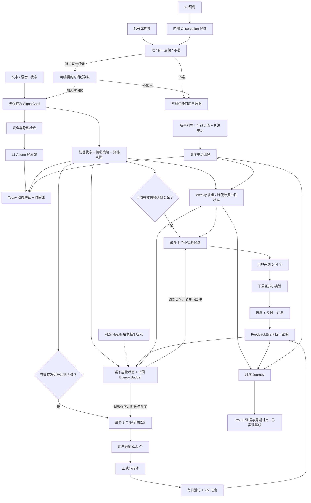

# SignalPath App 最终设计

最后更新：2026-07-13

状态：**Final / 唯一产品设计事实来源**。

本文已经吸收 28 条真机反馈、Energy Budget、AI 分层和购买权益的最终确认。今后的产品决策直接更新本文；旧 PRD、页面草案和 ReleaseQA 记录只能作为历史证据，不能覆盖本文。

本文依据 28 条真机测试反馈，重新整理 SignalPath 的完整体验，包括：

- 产品解决什么问题；
- 信息如何从输入流向输出；
- 每个页面分别负责什么；
- 哪些能力已经实现、部分实现、仍是目标设计，或只为旧数据兼容而保留。

配套技术合同：

- [最终数据流](data_flow.md)
- [AI 编排与职责边界](ai_orchestration.md)
- [购买与权益](purchase_entitlement.md)
- [反馈事件](feedback_event.md)
- [证据链](trace_evidence.md)
- [同步、隐私与删除](sync_privacy_delete.md)
- [主页面 UI 标准](main_tab_ui_standard.md)

冲突优先级为：用户最新明确确认 → 本文 → `data_flow.md` 与专项技术合同 → 当前 QA 证据 → 历史记录。目标设计必须标为 Target／Partial，不能因为写入本文就描述成已经上线。

## 1. 产品定义

SignalPath 帮助用户把零散的生活记录，逐步转化为：

- 可以回看的生活信号；
- 可以自主选择的小行动；
- 可以持续尝试和复盘的小实验；
- 可以长期理解的人生轨迹。

SignalPath 不是任务管理器、诊断工具，也不是自动替用户做决定的生活教练。AI 可以提出解释和建议，但什么内容成为个人事实、什么行动值得尝试，最终由用户决定。

简化后的产品循环：

```text
记录 -> 确认 -> 看见 -> 选择 -> 尝试 -> 复盘 -> 理解
```

用户可见的核心产品粒度：

```text
信号卡 SignalCard -> 小行动 MicroAction -> 小实验 LifeExperiment
```

`Schedule` 和 `Goal` 没有任何当前产品可达流程，不再作为同级对象、页面筛选项、建议输入或时间线类型。生产写入与旧摘要已删除；只保留旧表、迁移、备份／删除、旧数据读取以及历史通知清理所需的兼容边界。

## 2. 状态定义

| 状态 | 含义 |
| --- | --- |
| **已实现（Implemented）** | 已存在于当前 App 或数据链中；测试和真机验证情况另行记录。 |
| **部分实现（Partial）** | 已有可用基础，但尚未满足本文定义的完整产品规范。 |
| **目标设计（Target）** | 已确认的产品方向，但仍需要开发、迁移或专项验证。 |
| **仅兼容保留（Compatibility）** | 只为旧数据、旧客户端、迁移或回滚而保留，不属于当前产品体验。 |
| **平台验证待完成（Platform QA）** | 代码已存在，但仍需要 TestFlight 或真机证明。 |

任何目标设计都不能在发布记录中描述为“已上线”或“已通过”。

## 3. 核心对象

| 对象 | 产品含义 | 是否直接展示给用户 | 创建规则 |
| --- | --- | --- | --- |
| 输入草稿 | 保存前正在输入或识别的文字。 | 临时展示 | 只存在于编辑阶段；跳过即零写入。 |
| 信号卡 `SignalCard` | 用户确认属于自己的生活事实。 | 是 | 直接记录，或从 AI／信号库候选中编辑并明确加入时间线。 |
| 当下能量状态 `CurrentEnergyState` | 当前本地日期内，用户可用精力、消耗和恢复的派生快照。 | 通过 Today／Weekly 的中性描述展示 | 优先读取用户明确记录的状态和反馈；它不是新的用户事实，也不计入信号门槛。 |
| 周能量预算 `WeeklyEnergyBudget` | 当前本地周内的消耗、切换、恢复、边界和缓冲结构。 | 在 Weekly 展示 | 从合格 SignalCard、反馈和可选的抽象外部提示聚合；不能成为健康评分或诊断。 |
| 内部观察假设 `Observation` | AI 的 L2 推理与证据资产。 | 不作为同级记录展示 | AI 可以生成，但它本身永远不会自动成为用户事实。 |
| 小行动候选 `MicroActionCandidate` | 一个可选的小行动建议。 | 在独立候选页展示 | 当天达到至少三条有效信号后才可以生成。 |
| 小行动 `MicroAction` | 用户明确采纳的小行动。 | 是 | 采纳某个候选后创建。 |
| 小实验候选 `ExperimentCandidate` | 一个可供下周尝试的小实验建议。 | 在独立候选页展示 | 当周达到至少三条有效信号后才可以生成。 |
| 小实验 `LifeExperiment` | 用户明确采纳、进入正式周期的小实验。 | 是 | 采纳候选后创建正式实验。 |
| 反馈事件读取视图 `FeedbackEvent` | 统一读取行动和实验进度的视图。 | 通过进度 UI 展示 | 实际写入各自的反馈来源表，不是独立事实表。 |
| 复盘结果 `ReflectionResult` | Daily、Weekly、Journey 或 Pro L3 的版本化 AI 输出。 | 在相应页面展示 | 只能从符合资格且可追溯的来源生成。 |
| 证据链路 `TraceLink` | 连接事实、推理、复盘和实验的证据关系。 | 通过证据入口展示 | 保存派生对象时同步建立。 |

## 4. 从输入到输出的完整工作流



### 4.1 新手引导与关注重点

1. 首次启动从原生启动画面直接进入 Flutter 新手引导第一页，中间不出现白屏。
2. 四个页面依次说明：生活信号、Weekly 与小实验、Journey 与 Pro 深度层、关注重点。
3. 用户点击“开始”后，先在本机保存多选的关注重点。
4. “我的”页面立即读取同一份关注重点数据。
5. 远端多选同步仍是目标设计；旧的单值字段只用于兼容。

最终九个关注重点及其稳定 ID 为：

| ID | 用户文案 | 优先理解的生活范围 |
| --- | --- | --- |
| `emotional_stability` | 情绪安定 | 紧绷、焦虑、失控感与低刺激恢复。 |
| `relationship_connection` | 关系连接 | 被理解、被接纳、靠近与疏离。 |
| `meaning_value` | 价值意义 | 价值感、存在感、被看见与意义感。 |
| `self_boundary` | 自我边界 | 拒绝、保护节奏和表达真实需要。 |
| `growth_plan` | 成长计划 | 目标、卡点、练习与下一步。 |
| `creative_expression` | 创造表达 | 灵感、写作、输出、作品与观点。 |
| `food_sleep` | 饮食睡眠 | 睡眠、饮食、疲劳与身体基础照护。 |
| `living_environment` | 生活环境 | 居住、金钱、健康、秩序与现实支撑。 |
| `interests_hobbies` | 兴趣爱好 | 兴趣、旅行、自然、运动与生命感。 |

关注重点只影响 AI 阅读角度、候选排序和文案，不隐藏其他真实记录，不改变 Eligibility、三信号门槛或事实真伪。本机多选是当前 source of truth；去重后保留用户顺序，第一项只作为旧单值字段的兼容 projection。用户跳过时默认使用“情绪安定、成长计划、饮食睡眠”。在没有明确 SignalPath 登录账户前，本机偏好优先，产品不承诺跨设备恢复。

### 4.2 直接输入

| 输入方式 | 保存行为 | 跳过行为 | 最终结果 |
| --- | --- | --- | --- |
| 文字 | 先保存，再进行 AI 补充或同步。 | 空内容不写入。 | 一条 `SignalCard`。 |
| 语音 | 用户先确认识别文本，再保存。 | 关闭页面，不保存草稿或信号卡。 | 一条 `voice` 类型信号卡。 |
| 状态 | 心情、精力和可选的“补一句”属于同一条记录。 | 关闭页面，零写入。 | 一条 `one_tap` 类型信号卡。 |

AI 失败、额度不足或网络错误，都不能删除用户已经输入的原始内容。

### 4.3 AI 预判与信号库

AI 预判和信号库参考都只是候选，不是用户事实。

```text
候选内容
  -> 准 / 有一点像 / 不准
  -> 准或有一点像：打开可编辑文字
  -> 用户明确选择“加入时间线”或“不加入”
  -> 只有“加入时间线”才创建一条幂等 SignalCard
```

“不准”或“不加入时间线”都是零写入操作：不创建 `SignalCard`，不保存匹配反馈，也不发送匹配反馈埋点。AI 已生成的内部 `Observation` 仍遵循自身生命周期，但不能记录用户没有提交的判断。

### 4.4 能量状态与 Energy Budget

Energy Budget 的目标不是衡量效率，而是持续回答两个问题：用户此刻大概承受得起多大的尝试；本周哪些场景在消耗、恢复或挤压缓冲。它是 SignalCard 主链上的派生状态，不新增“能量记录”这一同级产品对象。

#### 时间窗口

- `CurrentEnergyState` 使用用户本地日期。最新一条明确状态代表“此刻”，同日其他合格信号与反馈只作为背景；跨过本地日界后回到 unknown，不能沿用昨天的负面判断。
- `WeeklyEnergyBudget` 严格使用用户本地周一 00:00 至周日 23:59:59 的合格证据，不得混入全量历史。
- 历史趋势只在 Journey／Pro 有独立时间范围和证据时读取，不能偷偷进入“本周”。
- 状态页在用户尚未选择时必须是 unknown，不能默认“疲惫／精力偏低”；同一天的旧状态继续保留用于展示波动，但“当前状态”由最后一次明确选择决定。

内部行动容量使用 `unknown | very_low | low | medium | high`，并随快照保存时间范围、证据覆盖、来源 hash、置信状态和更新时间。`unknown` 不是“精力不足”。

| 容量 | 小行动默认上限 | 小实验默认方向 |
| --- | --- | --- |
| unknown | 很轻、可逆、以观察为主 | 保持轻量，不因数据缺失加压。 |
| very_low | 1–3 分钟，暂停／恢复／边界／只观察 | 恢复或观察型，不增加新执行负担。 |
| low | 3–5 分钟，减少切换并增加缓冲 | 低频、步骤少、允许中止或缩小。 |
| medium | 5–10 分钟的普通小行动 | 简单、单变量的七日实验。 |
| high | 可包含 10–15 分钟版本，同时保留轻量选项 | 可适度增加深度，但不自动升级或制造完成压力。 |

#### 证据优先级

1. 用户明确提交的状态、能量描述和实际反馈；
2. 用户确认并符合当前分析资格的 SignalCard；
3. 已采纳小行动／小实验的实际反馈；
4. 可选 HealthKit 的 allowlist 抽象恢复提示。

未确认／legacy 内容最多作为轻背景。当前版本的外部提示只允许包含睡眠恢复或活动恢复等 Health 抽象值，不能包含原始健康样本或精确健康时间线。外部提示与用户记录冲突时，以用户明确记录为准；缺少能量证据时保持 unknown，不用外部提示补出结论，也不能只靠外部提示提高建议强度。Calendar 日程密度能力仅作为未来 Target 保留在底层，不进入当前用户入口、Energy Budget、候选上下文或来源哈希。

#### 对候选的影响

- 小行动候选同时读取当日 `CurrentEnergyState` 和当前周 `WeeklyEnergyBudget`；小实验候选读取周趋势及既往实际反馈，不能因单次情绪直接生成一周实验。
- 能量只调整候选的强度、时长、切换成本、缓冲量、排序和解释，不改变事实资格，也不覆盖关注重点。
- 消耗高或恢复不足时，优先非常轻、短时、低切换、可随时停止的恢复／边界／缓冲选项。
- 状态稳定或恢复较好时，可以包含正常强度的深度、创造或连接选项，但仍保持“小行动／小实验”的低成本粒度。
- 状态混合或不确定时，提供多样、低风险的候选并说明证据有限，不作强结论。
- 候选页必须用一句“能量适配说明”解释为何采用该强度；用户仍可拒绝或采纳任意数量。
- 候选组保存生成时的 `energy_snapshot_id/hash` 和推荐强度。状态、合格 SignalCard、行动／实验反馈或抽象提示变化时，未采纳候选立即进入 `stale -> regenerating -> ready` 并原位替换；已采纳对象不自动改写。

#### Weekly 展示

Weekly 的 Energy Budget 依次展示：最耗力来源、恢复线索、需要缓冲的位置、切换负荷、能量 block，以及“这些证据如何影响下周候选强度”。它不显示分数、完成率、健康诊断或纪律评价。低于 Weekly 三信号门槛时只显示中性 `X/3` readiness，不生成完整能量结论。

当前实现状态为 **Implemented baseline**：日／周快照使用用户本地日期边界，复数小行动／小实验候选同时读取当日和本周 Energy Budget、关注重点、实际反馈与可选 Health 抽象提示；上述输入变化会立即使未采纳候选失效并重新生成。仍需在下一次真机版本中回归权限、跨页刷新和候选更新的实际体感。

### 4.5 Today 输出与小行动

Today 顶部用一个紧凑区域合并日期、当日动态解读，以及由真实证据得出的能量、摩擦和恢复状态。

当没有足够证据时：

- 使用中性提示；
- 不显示“精力不足”“恢复不足”等负面判断；
- 不显示固定或装饰性的假数据。

小行动生成门槛按用户本地日期计算去重后的有效信号卡。达到至少三条后，当前基线最多生成三个小行动候选。用户可以不采纳，也可以采纳一个或多个。候选在被采纳之前，不进入时间线，也不产生进度。小行动的七日进度从采纳当天开始。

### 4.6 Weekly 输出与小实验

Weekly 读取用户本地时间周一至周日的当前自然周。少于三条有效信号时，页面保持可进入，但不显示周报告内容，而是明确显示 `X/3` 数据进度和返回 Today 的入口。

三条信号门槛同时控制 Weekly 标准报告、Pro“本周深读”和“下周小实验候选”的生成；它不限制用户进入 Weekly。反馈、内部 Observation、候选和 AI 输出都不能代替一条 SignalCard 增加门槛计数。“本周深读”是 Weekly 的 Pro 深读层，不使用长期综合报告的层级命名。

达到门槛后：

- 最多生成三个下周小实验候选；
- 候选仍关联其来源复盘周，便于证据追溯；
- 用户可以采纳 0..N 个；
- 采纳后创建正式 `LifeExperiment`，并从下一个本地自然周边界开始生效。

候选选择属于 Weekly；“小实验”主页面只负责已采纳正式实验的归档、进度和复盘。

### 4.7 进度与反馈

统一的 `X/7` 规则：

- 按用户本地日历日期计算；
- 同一对象、同一天存在多条反馈时，最后一条有效反馈决定当天格子；
- `occurred` / `happened` 计为完成 1 天；
- `not_occurred` / `not_suitable_today` 计为 0；
- 进度限制在已经确认的七日窗口内；
- 小行动和小实验必须分别计算，不能互相借用进度。

进度用于描述真实尝试，不是评分。缺少一天记录不代表失败，也不会自动终止行动或实验。

### 4.8 Weekly 与 Journey 复盘

Weekly 总结当前周期。Journey 将月度信号卡、可追溯的内部 `Observation` 背景、行动／实验反馈、周复盘和实验汇总连接成一条长周期轨迹。

内部 `Observation` 只能作为派生背景，不能额外增加一条用户事实。

报告最小数据门槛如下：

| 报告 | 统计周期 | 开始显示报告内容的条件 |
| --- | --- | --- |
| Weekly 标准报告 | 用户本地时间当前周一至周日 | 至少 3 条去重后的有效 SignalCard |
| 本周深读（Pro） | 同一个用户本地当前周一至周日 | 同样至少 3 条有效 SignalCard；Pro 只增加深度，不降低证据门槛 |
| Journey 免费报告 | 用户本地当前自然月 | 至少 7 条有效 SignalCard，覆盖至少 3 个本地记录日 |
| Journey Pro L3 | 最近 28 个本地日期 | 至少 14 条有效 SignalCard，覆盖至少 7 个记录日和 2 个周一至周日自然周 |

未达到门槛时，对应页面必须显示精确的信号数、记录日数和必要时的自然周数。Journey 即使未达到综合报告门槛，也继续展示用户自己的时间线、由应用内 SignalCard 本地日期聚合的月度网格、曲线和已有证据；该网格不读取系统 Calendar。门槛只控制综合解释，不锁住事实层。Pro 订阅不能跳过证据门槛；达到证据门槛也不会自动获得 Pro 权益。

免费 Journey 负责：

- 时间线和月度概览；
- 重复出现的模式；
- 月度片段和 SignalCard 本地日期月度网格（不读取系统 Calendar）；
- 生活状态曲线；
- 证据下钻。

Journey Pro L3 的独立 `/memory/pro-l3` 页面、入口、`PremiumGate`、`14/7/2` 门槛、两周事实对比、已有 Journey 综合、原始 SignalCard 证据和基于真实 SignalCard 的追问已经进入已实现基线。当前尚无独立、版本化的 28 日解释性 AI 生成器；没有已有 Journey 综合时，页面只展示可验证统计和来源证据，不伪造模式、方法或调整结论。独立生成器仍是目标设计。

## 5. 信息架构

### 5.1 五个主导航页面

| 页面 | 用户要回答的问题 | 页面负责 | 页面不负责 |
| --- | --- | --- | --- |
| Today | 今天发生了什么？我现在可以温和地尝试什么？ | 快速输入、当日动态解读、AI 预判、已采纳行动／实验进度、今日时间线。 | 下周实验规划、归档分析。 |
| Weekly | 本周出现了什么模式？下周可以尝试什么？ | 周聚合、周复盘、Energy Budget、当前已采纳实验的结果、下周候选入口。 | 正式实验归档、长期人生轨迹。 |
| 小实验 | 我尝试过什么？什么对我有帮助？ | 已采纳实验归档、生命周期、反馈、汇总和证据。 | 未采纳候选的生成。 |
| Journey | 更长周期的人生轨迹正在如何形成？ | 月度轨迹、证据、模式、片段、曲线和温和复盘。 | 日常输入和候选采纳。 |
| 我的 | 哪些偏好、隐私和权益适用于我？ | 个人资料、关注重点、Pro／恢复购买、用量、隐私和高级信号。 | 核心内容创建。 |

### 5.2 次级页面

| 页面／组件 | 入口 | 作用 | 当前状态 |
| --- | --- | --- | --- |
| 新手引导 | 首次安装／重置 | 说明产品并收集关注重点。 | 已实现，当前规范有效。 |
| 手帐时间线 | Today → 全部记录 | 紧凑展示信号卡、小行动和小实验。 | 已实现。 |
| 可编辑时间线确认 | AI 预判／信号库 | 编辑候选并选择是否加入时间线。 | 已实现。 |
| 小行动候选页 | Today 小行动卡片 | 展示最多三个候选、证据、选择和已采纳进度。 | 已实现基线；待真机回归。 |
| 小实验候选页 | Weekly 下周候选卡片 | 展示最多三个候选及采纳状态。 | 已实现基线；待真机回归。 |
| 小实验反馈 | 已采纳实验／进度入口 | 登记是否发生、效果和备注。 | 基础已实现。 |
| 本周深读 | Weekly 深度入口 | 当前自然周的 Pro 证据型深读。 | 已实现；达到本周 3 条有效信号后显示内容，待真机回归。 |
| Journey Pro L3 | Journey 深度入口／`/memory/pro-l3` | 14/7/2 readiness、事实型两周对比、已有 Journey 综合、原始 SignalCard 证据与证据追问。 | 页面基线已实现；独立 28 日解释性生成器仍是目标设计。 |
| 信号库 | Today 快速记录 | 提供固定、隐私安全的信号卡参考。 | 已实现的辅助功能。 |
| 自我复盘 | 我的／Pro 入口 | 独立的结构化复盘。 | 已实现的辅助功能。 |
| 高级信号 | 我的 | 可选的 Health 抽象恢复提示；Calendar 不提供当前用户入口。 | 已实现的辅助功能。 |
| 付费页 | Pro 入口 | 购买、恢复购买和权益说明。 | 手动恢复与启动／前台静默权益刷新基线已实现；原生交易更新和现代服务端对账为 Target，恢复购买仍待平台验证。 |

## 6. 各页面设计

### 6.1 新手引导

- 原生启动页和第一屏之间不能出现空白过渡。
- 共四页，每页使用放大的品牌图标作为背景视觉元素。
- 第 1 页：直接记录与用户确认后的 AI 预判。
- 第 2 页：Weekly 模式 → 候选 → 采纳后的小实验与反馈。
- 第 3 页：Journey 证据回顾，以及清晰分开的 Pro 深度层。
- 第 4 页：九个关注重点、多选、默认值和“开始”按钮。
- 点击“跳过”时使用已记录的默认关注重点，并保证“我的”页面仍能正常展示。

### 6.2 Today

页面顺序：

1. 紧凑的动态顶部区域；
2. 快速记录；
3. 有内容时显示 AI 预判；
4. 最多三个已采纳小行动和三个已采纳的当前小实验的真实进度，其余进入“查看全部”；
5. 紧凑的今日时间线。

Today 不再包含：

- 独立的“预判”快捷按钮；
- 与顶部内容重复的“今日概览”卡片；
- Schedule 同级入口；
- “下周小实验正在形成”的卡片。

### 6.3 Weekly

页面顺序：

1. 紧凑的周标题和一句周解读；
2. 信号分布和行为模式；
3. Energy Budget；
4. 小行动与反馈回顾；
5. 当前已采纳实验的结果汇总；
6. 下周小实验候选入口；
7. 可选的 Pro 每周深度复盘入口。

未达到候选门槛时，应明确说明“达到至少三条有效信号后开始生成小实验建议”，但不能伪造一份完整分析。

### 6.4 小实验

- 主页面只包含已经采纳的正式实验。
- 归档支持：进行中、已调整、已完成、暂停和停止。
- 详情展示：假设、行动、真实进度、反馈、汇总、来源关系和可追溯证据。
- 未采纳的 Weekly 候选不能作为正式实验显示在这里。

### 6.5 Journey

页面顺序：

1. 月度轨迹顶部区域和证据入口；
2. 轨迹概览；
3. 重复出现的模式；
4. 月度片段；
5. SignalCard 本地日期月度网格（不读取系统 Calendar）；
6. 生活状态曲线；
7. 温和复盘；
8. Pro L3 入口；未达 14/7/2 时只显示精确 readiness，达标后显示可验证证据层。

Journey 不使用“完成率”语言，也不能展示没有证据链路支持的结论。

### 6.6 我的

- 个人资料和人生方向摘要。
- 与新手引导共用同一份关注重点数据。
- Pro 状态、用量、购买与恢复购买。
- 隐私、删除、高级信号设置和支持。
- 不承诺用户可见的云端备份／导出产品能力。

## 7. AI 的职责边界

| 层级 | 可以做 | 不可以做 |
| --- | --- | --- |
| L1 Parse（记录辅助） | 在保存后解析标题、标签、情绪词和简短摘要。 | 阻止或替代“先保存”，或把解析标签当成用户事实。 |
| L1 Attune（情绪承接与轻反馈） | 在单条记录范围内承认感受、具体复述，并给一句低压力反馈或最多一个可选问题。 | 跨记录归因、判断人格／疾病／根因、生成正式小行动或把回复当成证据。 |
| L2 推理（Reason） | 基于证据提出内部观察假设或可能模式。 | 把未经用户确认的推理变成用户事实。 |
| L2 规划（Plan） | 在门槛、能量预算和关注重点允许的范围内生成并排序候选。 | 绕过三信号门槛、替用户采纳，或把候选伪装成当前任务。 |
| L3 复盘（Reflect） | 从可追溯来源生成 Weekly／Journey 综合复盘。 | 诊断用户、给人生打分或编造缺失证据。 |

所有候选和重要复盘都应能回答“为什么我会看到这个？”，但不能暴露内部原始载荷或不应展示的私密内容。

### 7.1 Today 时间线 AI 回复

Today 时间线里的 AI 回复属于 **L1 Attune 单轮回应**。输入只能是当前已保存的单条 SignalCard；输出为 1–3 个短句，顺序为：承认当下感受 → 复述具体情境 → 可选的一句轻反馈或一个低压力问题。使用“听起来、可能、如果你愿意”等保留用户主体性的措辞。

回复作为原 SignalCard 的 `ai_reply` 版本快照展示。它不是新的 SignalCard、Observation、事实或报告证据，不计入任何门槛，也不能自动生成／采纳小行动或小实验。没有已保存回复时只显示中性缺省状态，不能在阅读时用关键词临时推断模式。

### 7.2 Pro“和 AI 聊聊”

Pro 对话同样属于 **L1 Attune 短对话**，不是因为付费就自动升级为 L2／L3。Pro 只控制入口、上下文长度和用量。默认输入仅包含用户主动选择的 SignalCard、其可见 L1 回复和本次会话上下文；不得读取隐藏 Observation 来制造“我很懂你”的效果。

对话默认只在本次会话有效，不进入时间线、不成为分析证据、不生成 Observation、候选或 ReflectionResult。若未来允许保存，必须重新打开可编辑的“加入时间线”确认。快捷入口使用“再说一点／帮我说清楚／给一点轻反馈”，不能使用“生成小行动／总结成观察”等会绕过正式对象边界的文案。

### 7.3 L1 Attune 安全边界

L1 Attune 不诊断心理或身体疾病，不判断创伤、人格、依恋类型、真实动机或永久模式，不承诺治疗、保密或持续陪伴。遇到可能存在即时伤害风险的语言时，停止普通轻反馈，进入独立安全回应：确认是否处于立即危险，鼓励联系当地紧急服务、专业支持或可信任的人，并按语言和地区展示经过验证的资源。风险判断本身不能成为用户事实；相关记录可标记 `sensitive / do_not_analyze`，不进入候选、Weekly、Journey 或 Pro 综合。

## 8. Pro 与购买边界

以下能力不应被 Pro 阻断：

- 基础记录；
- 用户自己的时间线；
- AI／信号库候选确认；
- 已采纳行动和实验的基础反馈；
- 基础 Weekly 与 Journey 证据查看。

Pro 可以提供：

- Pro 本周深读；
- Journey Pro L3 的 28 日证据、周期对比与真实 SignalCard 追问；
- 结构化自我复盘与更深入追问；
- 更高 AI 用量。

购买属于独立控制流，不是个人反思数据链中的节点。已确认的顺序如下：

```text
启动／回到前台
  -> 静默读取 Transaction.currentEntitlements
  -> 验证通过后立即保留／激活本地 Pro
  -> 有可用旧 App Receipt 时后台异步对账与重试

目标生命周期
  -> 监听原生 Transaction.updates
  -> 使用 StoreKit 2 签名 JWS／App Store Server API／Notifications V2 对账

用户主动点击“恢复购买”
  -> 显示检查中
  -> 调用 AppStore.sync()
  -> 再读取并验证 currentEntitlements
  -> 找到权益：立即刷新 Pro 权限和用量
  -> 未找到／暂时失败：显示准确状态，不归咎 Apple ID
```

StoreKit 会维持交易与订阅状态，因此正常启动／回前台优先静默读取当前权益，不能每次主动弹出账户同步；`AppStore.sync()` 只在用户明确点击“恢复购买”时调用。手动恢复即使已经有本地 Pro，也必须继续查询 StoreKit，不能因本地缓存而短路。恢复等待原生／插件延迟事务最多 6 秒；网络、同步、未验证结果或超时只显示对账状态，不撤销已验证的本地 Pro。已验证权益会保存所属 StoreKit 环境；空查询只有在当前环境与缓存环境均已知且相同时才能撤销本地 Pro，跨环境或旧缓存环境不明时必须保留访问并显示待对账。

服务端目标使用 StoreKit 2 签名交易 JWS、App Store Server API 和 App Store Server Notifications V2 做续订、退款、撤销和宽限期对账。旧 `verifyReceipt` 接口只接受刷新后的 App Receipt，不能把 StoreKit 2 JWS 伪装成 receipt；该旧接口属于迁移兼容，不是最终方案。未来如果存在明确的 SignalPath 登录账户，购买时用 `appAccountToken` 关联账户并定义账号冲突／转移规则；没有登录账户时以设备可验证的 StoreKit 权益优先解锁，但不承诺内容跨设备恢复。

恢复购买的用户状态统一为：检查中、已找到并解锁、已解锁但后台验证中、当前 StoreKit 环境没有匹配权益、同步暂时不可用。错误文案不能只说“请确认 Apple ID”，而应说明 TestFlight Sandbox、App Store Production 和本地 StoreKit 测试环境相互独立，并提供稍后重试／联系支持入口。

Xcode StoreKit、TestFlight Sandbox 与 App Store Production 相互隔离。只有新的 TestFlight 版本在真机成功恢复有效权益，并同时刷新 UI 与用量后，恢复购买才能通过平台验证。

## 9. 分析资格、隐私与失效规则

以下内容不能进入分析：

- 草稿或同步失败的记录；
- 被用户判定为“不准”的预判；
- 未明确加入时间线的 AI／信号库候选；
- 在相应分析阶段被标记为 `excluded`、`sensitive` 或 `do_not_analyze` 的内容；
- 已删除数据；
- 只为旧数据兼容保留的 Schedule／Goal。

当来源被删除、排除或标记为不准时：

- 相关 Daily、Weekly、Journey 输出需要失效；
- 依赖它的内部推理、未采纳候选和证据链路需要立即标记过期或停用；
- 页面原位显示“正在根据最新记录更新”，短防抖后自动生成并替换候选；
- 如果有效信号数量降到三条以下，未采纳候选应消失；
- 已采纳行动或实验继续保留在用户历史中，但需要提示其来源证据发生了变化。

## 10. 视觉与无障碍标准

五个主页面统一遵循[主页面 UI 标准](main_tab_ui_standard.md)：

- 页面左右间距 18，顶部间距 14；
- 底部预留设备安全区 + 96；
- 顶部主标题（Hero）34–36；
- 区域标题 16–17；
- 正文 13.5–14；
- 使用 SF Pro Text；
- 主卡片圆角 18–20；
- Dynamic Type 放大时卡片可以自然增长；
- 320pt 宽度下不能裁切或溢出。

新手引导使用独立的全屏布局，但保持相同的品牌语言。品牌图标只作为背景视觉，不得取代可读文案或可访问控件。选择、证据、进度和错误状态都不能只依赖颜色表达。

## 11. 兼容边界

为了可逆迁移，以下代码或数据可以暂时保留：

- `captures` 与 `/api/v1/captures` 的原始输入、审计和旧客户端路径；
- Schedule／Goal 旧表、迁移、备份／删除、旧数据只读兼容和启动时的历史通知清理；当前 UI／路由与生产写入／摘要流程已删除；
- 旧 AI 判断结果与快照镜像字段；
- 旧 Weekly `_life_experiment` 回退读取；
- `/weekly/deep` 与 `/api/v1/ai/deep-weekly` 别名；
- 旧客户端或账户删除所需的底层备份／账户接口。

保留兼容能力，不代表可以把这些对象重新加入当前 UI 或产品主链。

## 12. 当前设计与实现之间的差距

本轮已经进入已实现基线、但仍需下一次真机回归的能力包括：当天／当周三信号门槛、两个复数候选页、0..N 多选采纳、同周多个正式实验、Today 的 3+3 投影上限、两种对象各自真实的 `X/7`，以及来源变化后的即时失效与原位更新。

以下目标仍需要代码实现：

1. Journey Pro L3 独立、版本化、可追溯的 28 日解释性 AI 生成器；
2. 远端多选关注重点的数据合同与跨设备回读；
3. 原生 `Transaction.updates` 生命周期，以及服务端 StoreKit 2 JWS／App Store Server API／Notifications V2 对账；
4. 按地区验证并维护危机支持资源，接在已经实现的 L1 即时风险安全分支之后。

统一日／周 `EnergyBudgetSnapshot`、真实反馈与 Health 抽象提示进入复数候选、Today／Pro L1 Attune 边界、以及启动／前台静默权益刷新均已进入实现基线，仍需下一次真机回归。

Journey Pro L3 页面与事实证据层可以标为“已实现基线”；新的解释性综合在独立生成器完成前必须标为“目标设计／待实现”。

另有一个独立发布验证阻塞项：手动恢复购买基线和 UI 已存在，但真机成功恢复仍为 **平台验证开放（Platform QA Open）**。本次截图中的长期年付“很可能属于 Production”只是基于 TestFlight 加速续订规则得到的高概率排查假设，不是已确认结论；必须分别用 TestFlight Sandbox 订阅和正式 App Store 版本验证，不能继续把环境不匹配归因于 Apple ID，也不能在验证前标记为通过。

## 13. 28 条真机反馈覆盖关系

| 真机反馈编号 | 对应设计文档与范围 |
| --- | --- |
| 1–9 | 本文 4.1、6.1：启动过渡、四页内容、品牌图标背景、关注重点保存及“我的”页面联动。 |
| 10–12 | 本文 4.5、6.2：紧凑的动态顶部区域、合并后的当日解读、中性初始状态。 |
| 13–14 | Today 的语音／状态零写入跳过，以及内部 `Observation` 边界。 |
| 15–16 | 自动出现的 AI 预判、准／有一点像／不准、可编辑时间线确认及删除独立预判按钮。 |
| 17–19 | 本文 4.3、5.2：信号库作为信号卡参考，使用相同的时间线确认流程，删除小行动／观察／实验旁路。 |
| 20–22 | 当天／当周三信号门槛、独立复数候选页、多选采纳和各自真实进度。 |
| 23–24 | 紧凑手帐时间线，以及移除 Schedule 同级粒度。 |
| 25 | [购买与权益](purchase_entitlement.md)：恢复购买重新列为平台验证阻塞项。 |
| 26–27 | 下周实验形成移到 Weekly，Today 删除该区块，并使用内容驱动的底部间距。 |
| 28 | [主页面 UI 标准](main_tab_ui_standard.md)：统一五个主页面的字体、区域尺寸、密度、安全区和无障碍要求。 |
