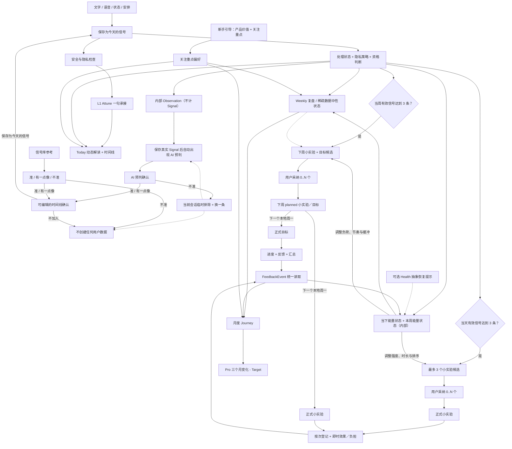

# SignalPath App 最终设计

最后更新：2026-07-22

状态：**Final / 唯一产品设计事实来源**。

本文已经吸收 28 条真机反馈、Energy Budget、AI 分层和购买权益的最终确认。今后的产品决策直接更新本文；旧 PRD、页面草案和 ReleaseQA 记录只能作为历史证据，不能覆盖本文。

本文依据 28 条真机测试反馈，重新整理 SignalPath 的完整体验，包括：

- 产品解决什么问题；
- 信息如何从输入流向输出；
- 每个页面分别负责什么；
- 哪些能力已经实现、部分实现、仍是目标设计，或只为旧数据兼容而保留。

配套技术合同：

- [最终数据流](data_flow.md)
- [AI 编排与职责边界](ai_orchestration.md)
- [购买与权益](purchase_entitlement.md)
- [反馈事件](feedback_event.md)
- [证据链](trace_evidence.md)
- [同步、隐私与删除](sync_privacy_delete.md)
- [主页面 UI 标准](main_tab_ui_standard.md)

冲突优先级为：用户最新明确确认 → 本文 → `data_flow.md` 与专项技术合同 → 当前 QA 证据 → 历史记录。目标设计必须标为 Target／Partial，不能因为写入本文就描述成已经上线。

## 1. 产品定义

SignalPath 帮助用户把零散的生活记录，逐步转化为：

- 可以回看的生活信号；
- 可以马上试一试的“小实验”；
- 可以连续坚持并观察效果的“目标”；
- 可以长期理解的人生轨迹。

SignalPath 不是任务管理器、诊断工具，也不是自动替用户做决定的生活教练。AI 可以提出解释和建议，但什么内容成为个人事实、什么行动值得尝试，最终由用户决定。

简化后的产品循环：

```text
记录 -> 确认 -> 看见 -> 选择 -> 尝试 -> 复盘 -> 理解
```

用户可见的核心产品粒度：

```text
信号卡 SignalCard -> 生活小实验 LifeExperiment
                              |- 小实验（轻行为，旧称“小行动”）
                              `- 目标（多日坚持）
```

术语迁移必须保持单向且不可混用：旧称“小行动”统一改为 **“小实验”**；旧称“小实验”（中长期、多日内容）统一改为 **“目标”**；父级页面与产品能力仍称 **“生活小实验”**。为了兼容现有数据和 API，新称“小实验”继续落在 `MicroActionCandidate / MicroAction / micro_action_feedback`；新称“目标”继续落在 `ExperimentCandidate / LifeExperiment / life_experiment_feedback`。内部类名、表名与历史值不是用户可见术语，不能据此把“目标”重新显示成旧称“小实验”。

用户界面统一使用 **Signal** 描述支持某项解读、尝试或总结的生活记录，例如“关联 Signal”“来源 Signal”。“证据／evidence”只允许作为 `TraceLink`、资格检查、审计和生成链路的内部技术术语，不得出现在 Weekly、Journey、Pro、生活小实验或来源详情的用户可见文案中。

旧的独立 `Schedule` 和 `Goal` 对象没有当前产品可达流程，不再作为同级业务对象、独立页面或反馈类型。Today 的“安排”入口保存的是 `time_use` 类型的结构化 `SignalCard`，仍属于信号层；它不会写入旧 `schedule_signals`，也不读取系统日历。旧表、迁移、备份／删除、旧数据读取以及历史通知清理只作为兼容边界保留。

## 2. 状态定义

| 状态 | 含义 |
| --- | --- |
| **已实现（Implemented）** | 已存在于当前 App 或数据链中；测试和真机验证情况另行记录。 |
| **部分实现（Partial）** | 已有可用基础，但尚未满足本文定义的完整产品规范。 |
| **目标设计（Target）** | 已确认的产品方向，但仍需要开发、迁移或专项验证。 |
| **仅兼容保留（Compatibility）** | 只为旧数据、旧客户端、迁移或回滚而保留，不属于当前产品体验。 |
| **平台验证待完成（Platform QA）** | 代码已存在，但仍需要 TestFlight 或真机证明。 |

任何目标设计都不能在发布记录中描述为“已上线”或“已通过”。

## 3. 核心对象

| 对象 | 产品含义 | 是否直接展示给用户 | 创建规则 |
| --- | --- | --- | --- |
| 输入草稿 | 保存前正在输入或识别的文字。 | 临时展示 | 只存在于编辑阶段；跳过即零写入。 |
| 信号卡 `SignalCard` | 用户确认属于自己的生活事实。 | 是 | 直接记录，或从 AI／信号库候选中编辑并明确“保存为今天的信号”；保存后正文与事实字段永久只读。 |
| 当下能量状态 `CurrentEnergyState` | 当前本地日期内，用户可用精力、消耗和恢复的派生快照。 | 通过 Today／Pro 深度分析的中性描述展示 | 优先读取用户明确记录的状态和反馈；它不是新的用户事实，也不计入信号门槛。 |
| 本周能量状态（内部 `WeeklyEnergyBudget`） | 当前本地周内每条合格 Signal 所处的偏耗力／平稳／有余力／恢复／边界与余地状态，以及可重叠的切换、深度投入线索。 | 仅在 Pro“本周深度分析”以“本周能量状态”展示 | 从合格 SignalCard、反馈和可选的抽象外部提示聚合；主圆环中的每条 Signal 必须且只能进入一个状态，不是预算、分数、健康评分或诊断。 |
| 内部观察假设 `Observation` | AI 的 L2 推理与证据资产。 | 不作为同级记录展示 | AI 可以生成，但它本身永远不会自动成为用户事实。 |
| 小实验候选 `MicroActionCandidate` | 当下即可开始、单次不超过 10 分钟、低成本且可逆的轻行为建议。它回答“现在试一下，有没有帮助”。 | Today 的即时候选页、Weekly 的下周尝试页；明确选择“考虑／观察”后也可在生活小实验主页继续查看 | 当天达到至少三条有效 Signal 后可生成即时候选；当周达到门槛时也可作为下周计划候选。用户可见决定只有“采纳”和“考虑／观察”；内部初始 `undecided` 不是第三个选项。 |
| 小实验 `MicroAction` | 用户明确采纳的短期轻行为；按每次真实尝试记录即时效果与负担，属于生活小实验。 | 是 | Today 即时采纳后从当天开始；Weekly 采纳后先为 `planned`，到下周一激活。 |
| 目标候选 `ExperimentCandidate` | 需要按计划频率持续一段时间，才能观察预先定义变化的中长期项目。 | Weekly 的下周尝试页；明确选择“考虑／观察”后也可在生活小实验主页继续查看 | 当周达到至少三条有效信号后生成，最多三个。候选必须写明计划频率、观察变化、最低观察门槛和允许缩小／中止的边界；周期可超过七天。用户可见决定同样只有“采纳”和“考虑／观察”。 |
| 目标 `LifeExperiment` | 用户明确采纳、进入正式中长期观察周期的生活小实验。 | 是 | 采纳候选后从解析后的下一个本地自然周开始；按自身周期与计划频率运行，不固定为七日目标。 |
| 反馈事件读取视图 `FeedbackEvent` | 统一读取行动和实验进度的视图。 | 通过进度 UI 展示 | 实际写入各自的反馈来源表，不是独立事实表。 |
| 复盘结果 `ReflectionResult` | Daily、Weekly、Journey 或 Pro L3 的版本化 AI 输出。 | 在相应页面展示 | 只能从符合资格且可追溯的来源生成。 |
| 证据链路 `TraceLink` | 连接事实、推理、复盘和实验的内部证据关系。 | 用户只看到“来源 Signal／关联 Signal”，不显示“证据” | 保存派生对象时同步建立。 |

### 3.1 事实不可编辑与规划可修改边界

- 所有已经保存的事实记录都是不可编辑的追加式历史。`SignalCard` 一经保存，Today、手帐、Weekly、Journey、Pro、来源详情和任何次级页面都只能读取，不能修改正文、发生时间、标签或结构化事实字段。
- AI 预判与信号库的“可编辑确认”只编辑**尚未保存的候选草稿**。点击“保存为今天的信号”后，它立即成为不可编辑的 Signal Card；这个确认页不能被当作历史记录编辑器重新打开。
- 小实验与目标已经保存的完成事实、效果／负担评价、可选复盘和生命周期事件同样不可编辑。当前本地日期允许再次登记时，必须追加一条新事件；目标的同日计划完成状态继续采用“同日最后一条有效事件决定当天格子”的读取规则，小实验则按每次真实尝试保留独立事件。旧事件始终保留，过去本地日期不得补写或改写。
- “今天／这次是否完成”与“这个对象是否结束”是两件事。前者只追加当次或当天完成反馈；后者必须经过独立的“完成这个小实验／目标”确认并写入生命周期完成事件，不能借用或补造某一次尝试或某一天的完成格子。完成确认后，既有反馈、效果评价和历史详情保持只读。
- “做过／完成”与“有效”也是两件事。完成事实不自动推导效果；只有用户明确提交的即时效果、负担或周期结果评价，才可进入有效性判断。旧 `helpful`／`adjusted` 等兼容值不能被反推成新的结构化有效性结论。
- 只有仍处于**本周或下周规划期**的小实验／目标内容可以修改。修改的是尚未发生的做法、节奏、边界等计划定义，不是已经发生的 Signal Card 或进度事实；每次修改必须保存计划版本并向未来生效，不能回写此前日期所看到的计划版本、完成格子、反馈或证据。
- 已结束周、已归档周期和所有历史日记内容永久只读。产品内的删除／隐私排除若被允许，是独立的状态转换或账户清理能力，不等于编辑原事实。

## 4. 从输入到输出的完整工作流



### 4.1 新手引导与关注重点

1. 首次启动从原生启动画面直接进入 Flutter 新手引导第一页，中间不出现白屏。
2. 四个页面依次说明：生活信号、每周复盘与生活小实验、旅程与 Pro 深度层、关注重点。
3. 用户点击“开始”后，先在本机保存多选的关注重点。
4. “我的”页面立即读取同一份关注重点数据。
5. 远端多选同步仍是目标设计；旧的单值字段只用于兼容。

最终九个关注重点及其稳定 ID 为：

| ID | 用户文案 | 优先理解的生活范围 |
| --- | --- | --- |
| `emotional_stability` | 情绪安定 | 紧绷、焦虑、失控感与低刺激恢复。 |
| `relationship_connection` | 关系连接 | 被理解、被接纳、靠近与疏离。 |
| `meaning_value` | 价值意义 | 价值感、存在感、被看见与意义感。 |
| `self_boundary` | 自我边界 | 拒绝、保护节奏和表达真实需要。 |
| `growth_plan` | 成长计划 | 目标、卡点、练习与下一步。 |
| `creative_expression` | 创造表达 | 灵感、写作、输出、作品与观点。 |
| `food_sleep` | 饮食睡眠 | 睡眠、饮食、疲劳与身体基础照护。 |
| `living_environment` | 生活环境 | 居住、金钱、健康、秩序与现实支撑。 |
| `interests_hobbies` | 兴趣爱好 | 兴趣、旅行、自然、运动与生命感。 |

关注重点只影响 AI 阅读角度、候选排序和文案，不隐藏其他真实记录，不改变 Eligibility、三信号门槛或事实真伪。本机多选是当前 source of truth；去重后保留用户顺序，第一项只作为旧单值字段的兼容 projection。用户跳过时默认使用“情绪安定、成长计划、饮食睡眠”。在没有明确 SignalPath 登录账户前，本机偏好优先，产品不承诺跨设备恢复。

### 4.2 直接输入

| 输入方式 | 保存行为 | 跳过行为 | 最终结果 |
| --- | --- | --- | --- |
| 文字 | 默认输入栏中的非空文字点击勾选即完成明确提交，不再经过第二个确认页；保存后再进行 AI 补充或同步。 | 空内容不写入。 | 一条 `SignalCard`。 |
| 语音 | 用户先确认识别文本，再点击“保存为今天的信号”。 | 点击“先跳过”、关闭或退出页面都不保存草稿或信号卡。 | 一条 `voice` 类型信号卡。 |
| 状态 | 心情、当前精力和可选的“补一句”属于同一条记录；点击“保存为今天的信号”后才提交。当前精力使用“偏低／还好／很足”三档。 | 点击“先跳过”、关闭或退出都零写入。 | 一条 `one_tap` 类型信号卡。 |
| 安排 | 登记今天已发生或接下来的事项、起止时间、时间去向、可选的结束后精力与备注；点击“保存为今天的信号”后才提交。结束后精力与状态页使用相同的“偏低／还好／很足”三档。 | 点击“先跳过”、关闭或下拉退出都零写入。 | 一条 `time_use` 类型信号卡；结构化时间保存在 `raw_payload_json`。 |

“安排”的时间去向直接复用 4.1 的九个关注领域 ID 与本地化文案，并始终允许用户从九项中选择；“我的”中选定的关注重点只影响 AI 的阅读和候选排序，不能隐藏其他真实的时间去向。新记录在 `raw_payload_json.focus_domain_id` 保存稳定 ID，过渡期同时把同一 ID 投影到 `category`；旧版的 `work / commute / household / relationship / recovery / interest / other` 只读兼容，不再作为新写入选项。

状态页的当前精力与安排的结束后精力共用 `energy_level = 0 | 1 | 2`（偏低／还好／很足）。两处初始值都必须是 unknown，用户未选择时省略 `energy_level`，不能默认写入偏低。旧 `energy_effect = draining | neutral | restoring` 只作为历史派生上下文读取，新记录不再写入该旧字段；其中 `restoring` 在 Weekly 五类投影中归为“恢复”，不能再改写成表示“已经有余力”的 `energy_level = 2`。没有现代 `energy_level` 的旧记录不得预选状态页控件。

AI 失败、额度不足或网络错误，都不能删除用户已经输入的原始内容。

### 4.3 AI 预判与信号库

AI 预判和信号库参考都只是候选，不是用户事实。AI 预判不是独立输入按钮；只有用户先保存了一条真实 Signal Card 后，才可根据当前有效记录自动出现。两类候选在“准／有一点像”后都进入同一个可编辑确认页；只有用户编辑或确认文本并点击“保存为今天的信号”后，才创建 Signal Card 并加入今日／手帐时间线。

```text
AI 预判
  -> 准 / 有一点像 / 不准
  -> 准或有一点像：打开可编辑文字
  -> 用户明确选择“保存为今天的信号”或“不加入”
  -> 只有保存才创建一条幂等 SignalCard
  -> 不准：当前会话内排除该候选并立即换一条；不保存拒绝反馈

信号库参考
  -> 准 / 有一点像：打开同一个可编辑确认页
  -> 用户点击“保存为今天的信号”才创建一条幂等 SignalCard
  -> 不准：零写入
```

“不准”或“不加入时间线”都是零写入操作：不创建 `SignalCard`，不保存匹配反馈，也不发送匹配反馈埋点。AI 预判为了立即换一条，可在当前内存会话中维护一个临时排除 ID 集合；离开页面即丢弃，不进入账户数据、分析证据或 FeedbackEvent。AI 已生成的内部 `Observation` 仍遵循自身生命周期，但不能记录用户没有提交的判断。如果当前会话内已无其他合格预判，页面显示中性的“暂时没有新预判”，不伪造内容。

每次进入 Today 页面形成一个预判会话。该会话中连续点击“不准”最多执行三次“换一条”；第三次替换仍未被用户确认后，不再继续生成第四条替换内容，而是显示中性的“暂时没有新预判”。次数与临时排除集合只存在于当前页面内存，会话结束即清空，不能写入用户事实、反馈、分析或埋点证据。

AI 预判的幂等键必须同时包含用户本地日期和排序后的来源 SignalCard 版本。用户对同一候选重复点击只能得到一条 SignalCard；同一天新增真实来源后生成并确认的新预判必须得到新的幂等键，不能覆盖当天较早已经确认的预判。当前会话内换出的候选被确认时，保存内容、标签和内部 Observation 必须使用用户实际看到的那一版，而不是被替换的旧候选。

信号库目录使用九个关注领域作为唯一标签来源。每张参考卡必须保存且只保存一个稳定的 `focus_domain_id`；筛选、卡片徽标和加入时间线后的 payload 都读取该字段，禁止再根据标题或正文关键词猜测分类。简体中文、繁体中文、英文和日文共享相同的 canonical card ID 与领域映射，每个领域在每种语言下保持 2–3 条常见、隐私安全且内容与标签一致的参考。

### 4.4 能量状态（内部 Energy Budget）

`EnergyBudgetSnapshot`、`WeeklyEnergyBudget` 和 Energy Budget 策略是内部技术名称，可以继续保留。用户界面不使用“预算”，统一显示为简体中文“本周能量状态”、繁体中文“本週能量狀態”、英文 `This week’s energy state`、日文“今週のエネルギー状態”。它的目标不是衡量效率或分配额度，而是持续回答两个问题：用户此刻大概承受得起多大的尝试；本周每条合格 Signal 更接近偏耗力、平稳、有余力、恢复还是边界与余地，以及它还伴随了哪些切换、深度投入线索。它是 SignalCard 主链上的派生上下文，不新增“能量记录”这一同级产品对象，也不能被当作一条事实、预算或评分。

#### 时间窗口

- `CurrentEnergyState` 使用用户本地日期。最新一条用户明确提交的 `one_tap.energy_level` 代表“此刻”，同日其他合格信号与反馈只作为背景；跨过本地日界后回到 unknown，不能沿用昨天的负面判断。
- `WeeklyEnergyBudget` 严格使用用户本地周一 00:00 至周日 23:59:59 的合格证据，不得混入全量历史。
- 历史趋势只在 Journey／Pro 有独立时间范围和证据时读取，不能偷偷进入“本周”。
- 状态页在用户尚未选择时必须是 unknown，不能默认“疲惫／精力偏低”；同一天的旧状态继续保留用于展示波动，但“当前状态”由最后一次明确选择决定。

内部行动容量使用 `unknown | very_low | low | medium | high`，并随快照保存时间范围、证据覆盖、来源 hash、置信状态和更新时间。`unknown` 不是“精力不足”。

| 容量 | 小实验默认上限 | 目标默认方向 |
| --- | --- | --- |
| unknown | 3 分钟以内、可逆、以观察为主 | 保持轻量，不因数据缺失加压。 |
| very_low | 1–2 分钟，暂停／恢复／边界／只观察 | 恢复或观察型，不增加新执行负担。 |
| low | 3–5 分钟，减少切换并增加缓冲 | 低频、步骤少、允许中止或缩小。 |
| medium | 5–10 分钟、单一步骤 | 简单、单变量，按目标自身频率持续观察。 |
| high | 仍不超过 10 分钟，避免变成新任务 | 可适度增加观察深度，但不增加不必要步骤或制造完成压力。 |

小实验的产品边界固定为“当下即可开始、单次不超过 10 分钟、单一步骤、可随时暂停”。内部 Energy Budget 只在 10 分钟以内调整时长、候选排序、解释和切换成本，不能把小实验扩张成需要持续执行或等待长期效果的任务。需要按计划频率持续一段时间、较长单次时间或累积效果才能判断的内容一律进入“目标”；目标可持续数周或更久，不以七日作为产品上限。

#### 证据优先级

1. 用户明确提交的状态、能量描述、时间去向和实际反馈；
2. 用户确认并符合当前分析资格的 SignalCard；
3. 已采纳小实验／目标的实际反馈；
4. 可选 HealthKit 的 allowlist 抽象恢复提示。

未确认／legacy 内容最多作为轻背景。当前版本的外部提示只允许包含睡眠恢复或活动恢复等 Health 抽象值，不能包含原始健康样本或精确健康时间线。外部提示与用户记录冲突时，以用户明确记录为准；缺少明确能量证据时，内部行动容量可以保持 `unknown`，不用外部提示补出结论，也不能只靠外部提示提高建议强度。这里的 `unknown` 只属于内部候选强度判断，不是 Weekly 主圆环的第六类或灰色类别；合格 Signal 仍按下方规则投影到五种状态之一。用户主动登记的 `time_use` 信号可以把九项关注领域之一和可选的结束后精力带入 Energy Budget，但不能只凭时长或领域名称推断耗能。只有 `record_status = completed` 才采集结束后精力并把它作为当日／当周上下文；`planned` 只表示计划，不写入或读取当前能量事实，旧记录中残留的计划精力也要忽略。即使是 completed，它也不能覆盖最新的明确 `one_tap` 当前精力。系统 Calendar 日程密度能力仍只作为未来 Target 保留在底层，不进入当前用户入口、候选上下文或来源哈希。

#### 对候选的影响

- 小实验候选同时读取当日 `CurrentEnergyState` 和当前周 `WeeklyEnergyBudget`，且必须是当下即可开始的轻行为；目标候选读取周趋势及既往实际反馈，必须需要多日坚持才能观察效果，不能因单次情绪直接生成一周目标。
- 候选的 Signal 门槛仍只按当日本地日／当前本地周计算；反馈学习另取生成当日本地日期向前共 28 天（历史重建以历史周期末日为截止日），不能因为跨日反馈扩大 Signal 门槛或数量。
- 反馈必须实质改变候选内容而不只是来源哈希：小实验读取用户明确提交的即时效果与负担；目标读取周期结果与执行负担。正向且负担可接受时保留并延展方向，明确偏费力／太费力时缩短小实验或降低目标频率／单次要求；用户显式跳过时才换方向。单纯 `completed` 或 `not_completed` 只保存完成事实，不能被解释成有效、困难或方向错误；旧 `helpful`／`adjusted` 仅作兼容读取，不能代替新的结构化评价。
- 能量只调整候选的强度、时长、切换成本、缓冲量、排序和解释，不改变事实资格，也不覆盖关注重点。
- 每个目标候选都必须带有同一条保护边界：当天负担过高时允许缩小或暂停，不把暂停解释为失败，也不能因此生成负面状态结论。
- 消耗高或恢复不足时，优先非常轻、短时、低切换、可随时停止的恢复／边界／缓冲选项。
- 状态稳定或恢复较好时，可以包含正常强度的深度、创造或连接选项，但小实验仍要轻量可逆，目标仍要单变量且可中止。
- 状态混合或不确定时，提供多样、低风险的候选并说明证据有限，不作强结论。
- 候选页必须用一句“能量适配说明”解释为何采用该强度；可见决定只提供“采纳”和“考虑／观察”，用户可以对任意数量作出决定，也可以直接离开并保持内部未决定状态。
- 候选组保存生成时的 `energy_snapshot_id/hash` 和推荐强度。状态、合格 SignalCard、小实验／目标反馈或抽象提示变化时，未采纳候选立即进入 `stale -> regenerating -> ready` 并原位替换；已采纳对象不自动改写。

#### Pro 深度分析展示

Pro“本周深度分析”的用户可见标题固定为“本周能量状态”。主圆环只展示五个互斥状态，避免把“已经有余力”和“正在恢复”混为一类：

| 稳定 key | 颜色 | 用户可见名称 | 语义边界 |
| --- | --- | --- | --- |
| `draining` | 橙色 | 偏耗力 | 明确消耗、疲劳、负荷或勉强维持。 |
| `steady` | 蓝色 | 平稳 | 不太耗力，也没有明确表现为轻松、有余力、恢复或主动留出边界。 |
| `ease` | 黄色 | 有余力 | 当下已经有余力、感觉轻松或能从容推进；它描述可用余量，不是恢复过程。 |
| `recovery` | 绿色 | 恢复 | 正在补回精力、休息后回升或执行了明确恢复行为；它描述补充过程，不等同于原本就轻松。 |
| `boundary_buffer` | 紫色 | 边界与余地 | 主动拒绝、暂停、收窄、留白或给自己保留缓冲空间。 |

主圆环没有“未判断”、灰色或其他兜底类别；同一自然周内的每条合格 Signal 必须且只能进入五个状态之一，五类计数之和必须等于该快照纳入的合格 Signal 总数。

单条 Signal 的主状态按以下确定性优先级投影：

1. 用户明确选择的 `energy_level` 优先级最高；`0 / 1 / 2` 分别归为 `draining / steady / ease`。`2` 只表示当下有余力，不得改写为正在恢复。
2. 只有新字段缺失时才兼容读取 legacy `energy_effect`；`draining / neutral / restoring` 分别归为 `draining / steady / recovery`。legacy `restoring` 必须归入绿色恢复，不能再归入黄色有余力。
3. 上述明确字段都缺失时，才读取同一条 Signal 内可追溯的实际语义，并使用固定优先级：**实际边界／缓冲 > 实际恢复 > 偏耗力 > 有余力／轻松**。也就是，明确以拒绝、暂停、收窄或留白为主事实时归 `boundary_buffer`；否则明确记录恢复行为或恢复结果时归 `recovery`；否则有明确负荷／疲劳时归 `draining`；否则有明确轻松／余力时归 `ease`。
4. 没有任何方向线索时归 `steady`。这个最终回退只用于保证 Weekly 图表穷尽完整，不得写成用户已经明确确认“状态平稳”。

每一步一旦命中就停止，不再让低优先级线索覆盖高优先级结果。分类结果、命中的来源字段／语义线索、规则版本和来源 hash 必须随快照保留，使同一来源和同一规则版本可重复得到同一类别。

“切换”“深度投入”保留为可以与五种主状态重叠的辅助描述，移出主圆环，使用独立标签或关联文案展示。同一 Signal 可以同时拥有多个辅助描述，但不能因此进入多个主状态。辅助描述不改变五类主环计数。“边界与余地”已经是第五个互斥主状态，不再同时作为重叠辅助线索重复计数。

主圆环使用同一自然周、同一版本快照中可复现的五类 Signal 计数或相对结构。橙色“偏耗力”、蓝色“平稳”、黄色“有余力”、绿色“恢复”、紫色“边界与余地”五个文字图例必须始终同屏显示；某类计数为 0 时图例仍显示 `0`，圆环本体则只绘制计数大于 0 的色段。每个图例同时提供不同的非颜色标识与 VoiceOver 类别、计数说明，不能只靠颜色区别。圆环可以展示实际计数或相对分布，但不能显示升降幅、完成率、健康评分或类似 `+18%` 的装饰数字。圆环中央使用“偏耗力较多／以平稳为主／有余力较多／恢复较多／边界与余地较多／状态交错”等可追溯的定性总结；不能使用“未判断／形成中”把已纳入的 Signal 变成灰色。

该区不显示健康诊断、纪律评价，也不把 `capacity_band` 直接翻译成能力好坏。低于 Weekly 三信号门槛时，Pro 深度分析中的能量区只显示中性 `X/3` readiness 和“形成中”，不生成完整能量结论。

当前底层日／周快照、两类候选读取，以及统一为“生活小实验 → 小实验／目标”的页面、术语、候选分类和读取投影均已进入 **Implemented baseline**；下一次 TestFlight 仍需验证真实数据、跨日边界和两类进度不会串线。

### 4.5 Today 输出与当日反馈闭环

Today 是“当日 Signal 输入与当日反馈闭环页面”。顶部用一个紧凑区域合并日期、当日动态解读，以及由真实 Signal 得出的能量、摩擦和恢复状态。用户先记录事实，再在今日时间线看到当天事实，最后在页面底部看到由这些事实派生的“今日尝试”。

当没有足够 Signal 时：

- 使用中性提示；
- 不显示“精力不足”“恢复不足”等负面判断；
- 不显示固定或装饰性的假数据。

小实验生成门槛按用户本地日期计算去重后的有效信号卡。达到至少三条后，最多生成三个可以立即开始、单次不超过 10 分钟的轻行为候选。候选确认区只提供“采纳”和“考虑／观察”：采纳 0..N 个会创建正式小实验；考虑／观察只保存候选决定，既不创建正式对象，也不进入时间线或产生进度。内部初始 `undecided` 不作为第三个用户选项。采纳后按每次真实尝试追加即时效果与负担，不把它包装成七日坚持任务。

### 4.6 Weekly 输出、下周尝试与生活小实验

Weekly 读取用户本地时间周一至周日的当前自然周。少于三条有效信号时，页面保持可进入，但不显示周报告内容，而是明确显示 `X/3` 数据进度和返回 Today 的入口。

三条信号门槛同时控制 Weekly 标准报告、Pro“本周深度分析”和下周页面中的 **AI 下周尝试提案**；它不限制用户进入 Weekly，也不限制用户决定是否把一个本周仍在进行的目标延续到下周。反馈、内部 Observation、候选和 AI 输出都不能代替一条 SignalCard 增加门槛计数。“本周深度分析”是 Weekly 的 Pro 深层页面，不使用长期综合报告的层级命名。

Weekly 的主报告始终以**当前本地自然周**为范围。在标题之后先显示一个清晰标注上一完整自然周日期的“**上周回看**”桥接卡：第一句只总结上周可追溯的事实，第二句用“本周可留意……”表达可观察的提醒；它不得把两个周的相关性写成“上周导致本周”。上周资料不足时显示中性状态，不补造总结或模式。

Weekly 达到门槛后不再把“本周 Signal”“本周行为模式”和“本周尝试”作为三个彼此平行、重复解释的卡片，而是组合为一个 **本周复盘报告**。报告固定按以下三层阅读顺序展开：

1. **Signal 事实**：只统计本地自然周内去重后的有效 SignalCard，展示 Signal 总数、记录日数和关注领域分布；这是“这周实际记录了什么”的事实层。
2. **本周行为模式**：从本周多条 Signal 提炼 **1–3 条**有来源支持的行为模式；它不限于重复，也可以是条件反应、行为顺序、取舍或场景差异。每条必须保存来源 Signal、支持日期与支持程度；Signal 分布只能作为缺少正式模式时的中性回退，不能把同一批 Signal 再计成另一组事实或另一个总数。模式可使用**触发点、典型反应、短期结果、长期影响**的自适应分块，但只展示实际有来源的块；字段不足时显示“还在形成”，不得把 `name`、`summary` 或相邻字段改写成不存在的因果链。长期影响只有在跨周数据支持时才能下结论，单周输入必须保持“还在形成”。
3. **尝试结果**：读取本周正式生效的小实验／目标及其有效反馈，展示参与项目、登记天数、周一至周日完成格、事实总结，以及受控的 Signal 与尝试关联；这是“本周实际验证了什么”的反馈层。

三层共享同一个周范围和来源追溯，但指标不得相加或互相冒充：Signal 数只属于事实层，模式层没有独立 Signal 计数，项目数／登记天数只属于尝试层。同一标题、句子或结论只能由一个层级负责，不能在 Signal 事实、行为模式、本周深度分析中逐字或同义反复出现；深层页面只能补充关系、时间跨度或不确定性，不能复制标准报告。整个报告是一个只读组合投影，不创建新的 SignalCard、Observation、反馈或独立持久化事实。用户可见的来源与支持关系统一写为“Signal／关联 Signal／来源 Signal”，不得显示“证据／evidence”。

内部 `WeeklyEnergyBudget` 是报告外的派生上下文，用户只在 Pro“本周深度分析”中看到“本周能量状态”。它描述本周合格 Signal 在偏耗力／平稳／有余力／恢复／边界与余地五种互斥主状态中的分布，并以切换、深度投入作为可重叠辅助描述，参与行为模式解释与下周候选强度排序，但不能成为 Weekly 主报告的第四层、不能新增或改写三层指标，也不能计入三条 Signal 门槛。

#### Pro 本周深度分析

Weekly 回答“本周发生了什么”；Pro 本周深度分析回答“这些层之间怎样同时出现、在哪些时间位置更明显、下周可以深化观察什么”。深度分析读取同一自然周的本周复盘报告、本周能量状态、尝试结果和关联 Signal，但不再展示另一套 Signal 总数卡、完整行为模式列表、完整能量圆环、逐对象七日格或与 Weekly 相同的一句话。

达到门槛后的页面固定按以下顺序展示，并优先使用图表、节点和短标签，避免连续长段文字：

1. **紧凑顶部**：标题“本周深度分析”、本地周一至周日日期和 `N 条 Signal · D 个记录日`；不得显示 `3/4`、模型置信百分比或其他无法解释的装饰进度。
2. **一句结构总结**：最多两行，只说明一个有来源支持的主要关系，不复述 Weekly 的“上周回看”或本周行为模式正文。
3. **核心关系图**：从 Weekly 的 1–3 条行为模式中选择一个主模式，使用 3–5 个节点和 2–4 条连接线，把 Signal 场景、行为模式、能量状态和尝试结果放在同一张图中。连接线只表示在明确日期／次数范围内“同时出现／相关”，不得使用暗示因果的箭头或“导致／底层动机”等诊断式语言。
4. **本周能量状态**：七日叠加图按周一至周日聚合 Signal 数量、橙／蓝／黄／绿／紫五种能量状态和当天是否有尝试反馈；随后给出“下周负荷建议：减量／维持／小幅加量”及可追溯原因。建议只影响下周候选的排序、时长与强度，绝不自动增删、采纳或停止任何计划。不得展示无法从事实重算的 `mood_score`、`friction_score`、主题百分比或走势分数。
5. **下周深化观察提案**：用“为什么值得观察／下周观察什么／怎样看出差异”三个紧凑图文块提出一个可选问题。只有用户明确采纳后，才创建下周一至周日生效的 `DeepObservationPlan`；下周结束后按该计划的 Signal 范围生成“深化观察结果”。未采纳、关闭或离开页面均零写入、无结果、无提醒。该提案不是小实验、目标或正式任务，也不创建 Signal。
6. **分析范围**：替代含义模糊的“温和使用”。确定性显示“这份分析基于本周 N 条 Signal、D 个记录日；它只说明这些记录中反复同时出现的关系，不代表因果或长期结论”。有跨周支持时可以补充覆盖周数，但仍不得写成因果。
7. **Signal 记录提醒建议**：仅在存在明确、可解释的记录时段或间隔时显示，且必须位于分析范围之后。用户接受前不请求通知权限、不创建规则；接受后可编辑本地时间和星期，并写入可关闭的本地提醒规则。提醒触发只打开 Today 输入，不自动创建 Signal、反馈、候选或门槛计数。

深度分析不提供独立“来源 Signal”区块：来源关系作为内部可追溯数据保留。关系图中的节点或明确日期支持可按需进入手帐时间线对应日期；这样既能追溯，也避免在 Pro 页面重复另一套事实浏览。

关系的用户可见支持程度只使用“刚开始形成／本周重复出现／跨周仍出现”，不用百分比：有可追溯来源但尚未跨两个本地日期重复时为“刚开始形成”；同一规范化关系由至少 2 条 Signal、覆盖至少 2 个本地日期支持时为“本周重复出现”；同一关系由至少 2 个本地自然周支持时才为“跨周仍出现”。长期影响只允许在最后一种状态中展示。

#### Weekly 行为插图目录

当前资源合同不是单一的“30 张行为插图”：代码分类中有 **24 个 behavior pattern key** 和 **30 个 review pattern key**，另有 9 个关注领域 key；30 个 review key 中包含完成反馈、难度、打断与下周调整等尝试结果语义，不能整体冒充行为模式目录。最终展示必须按 key 区分两类目录，并继续允许后续目录版本扩展。

- Weekly 的行为模式层最多展示一张主要 behavior pattern 插图；本周深度分析最多在关系图的主要模式节点展示一张插图。两页对同一主要模式使用同一个 `behavior_illustration_key`，不把插图放进 Hero，也不使用 App icon 代替。
- AI／投影只能输出目录内的稳定枚举 key，不能输出资源路径。选择顺序为：有来源 Signal 的主要行为模式、覆盖本地日期更多、支持 Signal 更多、稳定 key 排序；来源 hash 改变时重新选择。不能只靠用户正文的模糊关键词随机匹配。
- review pattern 插图只能用于尝试结果或反馈语义；已经废弃的旧按钮文案只可兼容旧数据，不能重新成为当前用户可见状态。
- 没有合法 key 时使用目录定义的中性“模式形成中”资源，不伪造行为。插图是可失效重算的展示投影，不是 Signal、Observation、反馈或门槛事实。
- 插图承载行为含义时，VoiceOver 读取对应行为名称；不能只读文件名，也不能把有含义的插图标记成纯装饰。

“下周尝试”选择属于 Weekly。页面顶部必须明确显示下一个本地周一至周日的日期，按“小实验”和“目标”两个区域展示待决定内容：

- **下周小实验**：由本周 Signal、行为模式与本周能量状态生成的短期、单次不超过 10 分钟、低成本、可逆轻行为；用户可选择“采纳”或“考虑／观察”。只有采纳才以 `planned` 状态保存，到下一个本地周一激活并进入 Today，不能提前登记尝试或效果；
- **下周目标**：需要按计划频率持续中长期观察的单变量做法；必须带有预期观察变化、计划频率、目标周期、最低观察门槛和允许缩小／中止的边界。周期可超过七天。同样只提供“采纳”和“考虑／观察”，只有采纳才形成下周 `planned` 目标并在下一个本地周一激活；
- **续行目标**：本周仍在进行且尚未建立下周续行对象的目标；用户勾选后创建下周父子对象，保留原目标与原反馈，不复制旧反馈。

所有候选必须关联来源复盘周和来源 Signal。用户可以采纳 0..N 个，也可以将任意候选保留为“考虑／观察”；两个决定都必须幂等，且已经采纳的候选不能降级回考虑状态。下周小实验、下周目标和续行目标都可一次确认。该页不展示或登记本周日期格，不复用 Today／Weekly 的完成反馈功能，也不显示“最多三个候选”之类的上限文案。若本周不足三条有效 Signal，AI 提案区显示门槛状态，但进行中目标的续行选择仍然可用。深度分析只可作为候选排序和说明的**可选参考来源**；它不直接创建候选、不直接采纳，也不能成为使用下周尝试的前置条件。

“生活小实验”主页面不再按状态 Tab 切换，也不把两类对象塞进同一种进度图。它在顶部搜索之后直接展示两张互补图表：小实验使用“按次尝试的散点／短分支图”，目标使用“按计划频率推进的中长期时间轨道”。明确保留为考虑／观察的候选可以进入相应图表的考虑层，但只有已采纳正式对象才拥有真实尝试／完成反馈、效果评价和生命周期完成。每个节点／行都可进入该对象的个别详情。

页面不再提供独立的聚合“小实验详情／归档概况”页面。两类对象的数量、生命周期分布、效果摘要和最近变化直接汇总在生活小实验主页对应图表内；个别对象详情继续保留，用于读取来源 Signal、完整不可变历史和允许的当前写入口。

本周复盘报告中的“尝试结果”层（原独立“本周尝试”）以**周汇总**为主体，不重复 Today 的逐项当日卡片、独立反馈按钮、单项 `X/7` 或详情箭头：

- `参与 N 项`：统计正式周期与本周有交集的已采纳小实验和目标，按对象去重；尚未开始的下周目标不计入本周；
- `登记 D 天`：统计本周内至少有一个有效完成反馈的不同本地日期，同日登记多项仍只计一天；
- 每个参与对象占一行，周一至周日各占一个格子，格子显示 `completed / not_completed / empty`；对象周期外的日期显示不可用状态，不能被解释为未完成；
- 本周格子只表达本自然周的计划完成事实，不复用对象的完整周期指标；小实验的按次结果与目标的完整时间轨道由 Today 和生活小实验页面展示；
- 只有**今天**且仍位于对象正式周期内的格子可以点击，点击后使用与 Today 相同的“已完成／未完成”追加登记流程；当天再次登记追加新事件，并由最后一条有效事件决定格子；过去、未来和周期外格子永久只读；
- 卡片在格子图之后显示 1–2 句中性事实总结，只陈述参与项目数、登记天数、各状态或持续出现的完成事实，不使用完成率、评分、失败或纪律评价；
- 再显示最多两条“Signal 与尝试”关联：把本周同日本地日期内的合格 Signal、Energy Budget 场景和有效完成反馈并列描述，例如“切换较密集的 2 个记录日里，这项有 1 天完成”；必须给出日期／次数范围，只能写“同时出现／相关”，不能写成因果、诊断或人格结论；不足以形成稳定关联时使用中性“还在形成”，不补造内容。

这样 Today 继续回答“今天要不要试、这次／今天做得怎样”，Weekly 回答“本周参与了什么、哪些天有记录、Signal／能量情境与尝试如何同时出现”，生活小实验主页负责跨周期总览与汇总，个别对象详情负责来源 Signal、完整不可变历史和计划版本。

### 4.7 完成、效果与反馈

小实验和目标不再共享一个固定 `X/7` 产品口径：

- **小实验是按次观察的短期行为**。单次不超过 10 分钟，同一天可以真实尝试多次；每次尝试都是独立事件，不按本地日期折叠成一个完成格，也不把七天当作坚持目标。主页以散点／短分支显示每次尝试的即时效果与负担。
- **目标是按计划频率推进的中长期观察**。目标定义自身起止日期、计划频率和最低观察门槛，周期可超过七天；同一目标、同一本地日期存在多条计划完成反馈时，最后一条有效事件决定当天轨道状态。主页按完整计划周期显示时间轨道，不固定截断为七格。
- 两类对象必须按正式对象和类型分别计算，不能互相借用次数、日期或效果结论。

所有完成、效果与负担反馈都采用追加写入而不是编辑。用户只能登记当前本地日期；过去日期和已经结束的周期不提供修改或补录入口。同一天再次登记目标完成状态会新增事件，并由最后一条有效事件决定当天轨道；小实验的多次真实尝试各自保留，不互相覆盖。旧事件始终作为不可变历史保留。

对象生命周期完成与上述尝试／每日完成反馈完全独立。用户必须在生活小实验主页对应对象或个别详情中明确确认“完成这个小实验”或“完成这个目标”，系统才把正式对象转为 `completed` 并保存生命周期完成事件。该事件不新增 Signal、不伪造效果评价、不改变当天、当次或过去任何进度；已完成对象继续保留在主页图表和只读详情中，不再接受未来反馈。

完成事实与有效性评价必须分离：

- 计划完成记录只写入 `completed` 或 `not_completed`；完成只说明“做过”，不能直接解释为有帮助、有效、困难或方向错误；
- 目标当天没有有效完成反馈时，轨道保持 `empty`，但不能解释成“未完成”；
- 小实验在用户明确登记一次真实尝试后，立即询问“这次有帮上忙吗：有帮助／有一点／没感觉”和“做起来费力吗：轻松／还好／偏费力”，并允许补一句；
- 目标继续按计划频率登记“已完成／未完成”。达到自身最低观察门槛、周期结束或用户主动结束时，再询问周期结果“有改善／有一点／没变化／变差／还看不出”和执行负担“轻松／可接受／太费力”，并允许补一句；
- Today、Weekly 的今天格子和生活小实验主页／对象详情复用同一条追加写入链，不能建立第二套反馈表或互相覆盖；
- 小实验的底层历史值 `occurred` / `happened` / `yes` / `done` 只在兼容读取时归一为 `completed`，`not_occurred` / `not_happened` / `no` / `not_suitable_today` / `skipped` 归一为 `not_completed`；
- 目标的底层历史值 `tried` / `helpful` / `adjusted` 只在兼容读取时归一为 `completed`，`not_today` 归一为 `not_completed`；这些旧值都不能继续作为新写入值或用户可见选项。

小实验的有效性以重复出现的即时结果判断：尚无效果反馈显示“待评价”；一次正向反馈只显示“初步有帮助”；至少两次“有帮助／有一点”的正向反馈，且这些尝试的负担总体可接受、没有以“偏费力”为多数时，才显示“值得保留”；有帮助但偏费力或场景结果不一致时显示“需要调整”；至少尝试两次仍没有正向反馈时显示“暂未发现帮助”。结束本轮时，用户再明确选择“保留／调轻再试／结束”，该生命周期决定不能由系统自动代填。

目标的最低观察门槛默认是 **3 个有效观察日**，但必须允许候选／计划按目标定义更高门槛；默认值不是固定周期，也不把所有目标压成三天或七天。未达到门槛或用户选择“还看不出”时显示“还不能判断”；达到门槛且有改善时显示“本轮看起来有效”；有改善但太费力时显示“有帮助，需要调轻”；达到门槛但没变化时显示“暂未看到效果”；结果变差时显示“当前做法可能不适合”；连续两轮出现同方向改善时才可显示“多轮结果较稳定”。所有文案保持保守，只描述本轮观察，不宣称因果或永久有效。

完成记录用于描述真实尝试，效果评价用于描述用户明确感受到的结果；两者都不是评分。缺少一天记录不代表失败，也不会自动终止小实验或目标。

### 4.8 Weekly 与 Journey 复盘

Weekly 以“上周回看 → Signal 事实 → 本周行为模式 → 尝试结果”的顺序总结当前周期；内部 Energy Budget 只作为候选和深度分析的派生上下文，不在 Weekly 主页面单独展示。Journey 将选定自然月的 Signal、每周复盘、小实验真实尝试与整轮总结、目标每日事实／周次总结／整轮总结连接成一条只读的长周期轨迹。它回答“过去几周与几个月里，哪些事实正在连成一条生活路径”，不重复 Today 的当日输入、Weekly 的下周规划或生活小实验的对象管理。

内部 `Observation` 只能作为派生背景，不能额外增加一条用户事实。

Journey 报告的数据源范围是用户使用 App 以来、未删除且符合当前隐私策略的全部数据，包括 Signal、状态／能量派生、每周复盘、小实验尝试与总结、目标每日事实与两类总结、计划版本和内部 Observation。选定自然月／三个月只是页面输出和门槛统计窗口，不是截断生成上下文的全局读取上限。只有对应窗口内去重后的有效 SignalCard 可以增加报告门槛；反馈、总结、计划、内部 Observation 和 AI 文本都只能参与解释，不能增加 Signal 数。

报告最小数据门槛如下：

| 报告 | 统计周期 | 开始显示报告内容的条件 |
| --- | --- | --- |
| Weekly 标准报告 | 用户本地时间当前周一至周日 | 至少 3 条去重后的有效 SignalCard |
| 本周深度分析（Pro） | 同一个用户本地当前周一至周日 | 同样至少 3 条有效 SignalCard；Pro 只增加深度，不降低 Signal 门槛 |
| Journey 免费报告 | 用户选择的本地自然月 | 至少 7 条有效 SignalCard，覆盖至少 3 个本地记录日 |
| Journey Pro 三个月变化 | 用户选择月及其前两个本地自然月 | 三个月中至少两个自然月分别达到 Journey 免费报告的 `7 条有效 SignalCard／3 个记录日` 门槛 |

未达到门槛时，对应页面必须显示精确的 Signal 数、记录日数和必要时的自然周数。Journey 即使未达到综合报告门槛，也继续展示选定月的真实轨迹节点、应用内 Signal 本地日期网格、小实验／目标事实和已有状态记录；该网格不读取系统 Calendar。门槛只控制主题、变化和月度回看等综合解释，不锁住事实层。Pro 订阅不能跳过 Signal 门槛；达到 Signal 门槛也不会自动获得 Pro 权益。

免费 Journey 负责：

- 选定自然月的真实 Signal 数、记录日和领域分布；
- 把选定月的 Signal 按日期连接成可下钻的月度路径；本月轨迹不混入每周行为模式或小实验整轮总结；
- 展示 1–3 个跨周主题及其“新出现／持续出现／正在变化”状态，每项保留支持日期和来源 Signal；
- 分开投影小实验的真实尝试次数与整轮结果、目标的中长期推进与周次／整轮结果；
- 使用真实状态与五类能量状态展示“状态与节奏”，叠加小实验反馈标记，不从主题词或装饰强度伪造情绪／专注曲线；
- 给出简短、可追溯的“本月回看”，并下钻到统一手帐时间线。

Journey Pro 的独立 `/memory/pro-l3` 页面、入口和 `PremiumGate` 继续保留。Pro 读取用户选择月及其前两个本地自然月，展示三个月事实与变化；三个自然月都复用同一月度事实投影，至少两个自然月分别达到免费 `7/3` 门槛后才生成跨月变化综合。小实验与目标轨迹只在免费 Journey 展示，Pro 不重复；Pro 页面也不提供来源 Signal、日期下钻或 AI 对话。

### 4.9 内部能力与 Signal 计数边界

以下能力必须保留，但它们运行或生成结果都不能单独新增 Signal Card，也不能增加三信号门槛计数：

- 隐私与安全检查；
- Signal eligibility；
- 内部 Observation；
- 当日／当周 Energy Budget 派生快照（用户界面显示“能量状态”）；
- 三条 Signal 门槛判断；
- 候选生成、采纳状态与来源变化后重新生成；
- AI 回复快照；
- 反馈、进度和手帐读取投影。

只有用户明确点击“保存为今天的信号”或提交默认文字输入栏，才可创建新的 Signal Card。

## 5. 信息架构

### 5.1 五个主导航页面

| 页面 | 用户要回答的问题 | 页面负责 | 页面不负责 |
| --- | --- | --- | --- |
| Today | 今天发生了什么？我现在可以温和地尝试什么？ | 当日 Signal 输入与当日反馈闭环：快速输入、当日动态解读、AI 预判、今日时间线，以及页底的小实验／目标进度。 | 下周尝试规划、归档分析。 |
| Weekly | 本周出现了什么模式？下周可以尝试什么？ | 先以“上周回看”连接上一完整自然周，再以单一本周复盘报告按 Signal 事实、本周行为模式、尝试结果三层组织；展示参与项目数／登记天数／周一至周日格子、Signal 与尝试关联、下周小实验与目标入口，以及 Pro 深度分析入口。 | 把三层重复显示或混合计数、在主页面展示能量状态、重复 Today 的逐项当日操作、正式生活小实验归档、长期人生轨迹。 |
| 生活小实验 | 哪些短期小实验当下有帮助？哪些中长期目标正在出现变化？ | 顶部统一搜索后，以小实验即时结果图和目标中长期时间轨道同时展示考虑／观察、进行中、已完成；主页直接汇总数量、效果和最近变化，节点／行进入个别对象详情，并承接效果／负担反馈、独立完成确认、来源 Signal 和只读历史。 | 用状态 Tab 切碎全貌、绕过门槛自动采纳、跳转到独立聚合详情，或把两类对象塞进同一种图表。 |
| Journey | 过去几周与几个月的真实 Signal、尝试和目标，正在形成怎样的生活轨迹？ | 以可切换的本地自然月为单位，展示 Signal 月度路径、月度事实、跨周主题、小实验／目标轨迹、状态与节奏和本月回看，并提供 Pro 三个月变化入口。报告生成可读取使用 App 以来的全部合格数据，但选定月的事实与历史上下文必须分开表达。 | 创建或编辑 Signal、登记完成情况、管理小实验／目标、生成或采纳下周候选，以及把内部 Observation 当作一条用户事实。 |
| 我的 | 哪些偏好、隐私和权益适用于我？ | 个人资料、关注重点、Pro／恢复购买、用量、隐私和高级信号。 | 核心内容创建。 |

### 5.2 次级页面

| 页面／组件 | 入口 | 作用 | 当前状态 |
| --- | --- | --- | --- |
| 新手引导 | 首次安装／重置 | 说明产品并收集关注重点。 | 已实现，当前规范有效。 |
| 手帐时间线 | Today → 全部记录；Weekly → 查看本周 Signal | 以“日记本”形式只读浏览使用 App 以来的本地日期：月份／日期选择、上一天／下一天、回到今天、有内容日标记，并按所选日合并 Signal Card、小实验和目标；不提供任何历史编辑入口。Weekly 入口定位到本周最近一个有 Signal 的日期，再由七日日期栏继续翻阅本周。 | **Implemented baseline**；待真机验证跨月、空日期、历史日期与长列表。 |
| 可编辑时间线确认 | AI 预判／信号库 | 使用同一确认页编辑候选，并明确保存为今天的信号或零写入退出。 | **Implemented baseline**；待真机验证编辑、取消、下拉退出与重复保存。 |
| 小实验候选页 | Today 页底的小实验区 | 展示最多三个可以马上开始的候选、来源 Signal 和能量适配说明；用户可见决定只有“采纳”和“考虑／观察”。 | **Implemented baseline**；已统一生活小实验术语与候选决定读取，待真机回归。 |
| 下周尝试选择页 | Weekly 下周候选卡片 | 明确显示下周一至周日；分别展示下周小实验、下周目标与可续行目标。每个候选只提供“采纳”和“考虑／观察”；采纳后先为 `planned`，下周一激活并进入 Today，考虑项不产生进度；不在此页登记本周进度。 | **Target**；现有续行与目标提案基线需扩展为下周小实验和统一计划激活规则。 |
| 生活小实验对象详情 | 主页的小实验节点／目标行 | 小实验展示按次即时效果与负担；目标展示计划频率、完整时间轨道、最低观察门槛和周期结果。两者都展示来源 Signal、计划版本、事实历史与最新总结，并以独立确认完成整个对象；跨轮次完整总结历史仅向 Pro 开放。本周／下周规划内容可向未来版本化修改，过去记录不可改。 | **Implemented baseline**；真实次数、10 分钟数据约束、总结／完成分离和两类详情已实现，待真机验证。 |
| 本周深度分析 | Weekly 深度入口 | 当前自然周，以核心关系图、本周能量状态、七日叠加图、负荷建议和可采纳的下周深化观察提案补充跨层关系与时间位置；分析范围之后可显示 Signal 记录提醒建议。 | 旧版文本型页面已实现；本节规定的结构化图表、深化观察、提醒合同和行为插图合同为 **Target**，完成后仍需真机回归。 |
| Journey 月度轨迹 | Journey 月份／路径／日期节点 | 查看任意历史自然月的完整只读路径，并由日期节点进入 Today 与 Weekly 共用的唯一手帐时间线；不再维护独立旧式 `/memory/journal` 手帐。 | **Implemented baseline**；历史自然月取数、选定月事实／门槛、类型化小实验与目标总结轨迹及截至月末的历史综合上下文已接通，待真机验证跨月切换、空月、日期下钻与长列表。 |
| Journey Pro 三个月变化 | Journey 深度入口／`/memory/pro-l3` | 选择月及其前两个月的 Signal、记录日、领域与五类能量状态变化，以及保守的月度变化总结。 | **Implemented baseline**；待真机验证历史月、稀疏月与长页面。 |
| 信号库 | Today 记录栏 | 按九个明确关注领域提供固定、隐私安全的 Signal Card 参考；每领域每语言 2–3 条，“准／有一点像”后进入可编辑确认。 | **Implemented baseline**；目录、筛选与可编辑确认已对齐，待真机回归。 |
| 自我复盘 | 我的／Pro 入口 | 独立的结构化复盘。 | 已实现的辅助功能。 |
| 高级信号 | 我的 | 可选的 Health 抽象恢复提示；Calendar 不提供当前用户入口。 | 已实现的辅助功能。 |
| 付费页 | Pro 入口 | 购买、恢复购买和权益说明。 | 手动恢复与启动／前台静默权益刷新基线已实现；原生交易更新和现代服务端对账为 Target，恢复购买仍待平台验证。 |

### 5.3 导航与返回

- 五个主导航项属于同级入口，底部 Tab 切换可以直接替换当前主页面，不要求保留逐次 Tab 历史。
- 从任意主页面进入次级页面时必须保留导航栈。次级页面的返回按钮先返回实际上一页，而不是写死到某个主页面；因此同一个次级页面从 Today、Weekly、旅程或“我的”进入时，都回到各自真实来源。
- 只有通过深链、QA 初始路由或状态恢复直接打开次级页面、确实没有上一页时，才使用该功能所属模块的安全入口兜底。
- 弹窗、底部 Sheet 和对话框的关闭只关闭当前浮层；“去今天记录”“保存后回到今天”等有明确文案的完成动作属于产品流程，不伪装成返回按钮。
- Weekly 的“查看本周 Signal”以 `push` 打开手帐时间线并传入本周最近一个有 Signal 的本地日期；若本周没有可用日期，使用不晚于今天的合理日期。它不进入 Journey 的月度片段页，也不新增整周聚合或复制 Signal。

## 6. 各页面设计

### 6.1 新手引导

- 原生启动页和第一屏之间不能出现空白过渡。
- 共四页，每页使用放大的品牌图标作为背景视觉元素。
- 第 1 页：直接记录与用户确认后的 AI 预判。
- 第 2 页：Weekly 模式 → 候选 → 采纳后的小实验与反馈。
- 第 3 页：Journey Signal 回顾，以及清晰分开的 Pro 深度层。
- 第 4 页：九个关注重点、多选、默认值和“开始”按钮。
- 点击“跳过”时使用已记录的默认关注重点，并保证“我的”页面仍能正常展示。

### 6.2 Today

页面顺序：

1. 紧凑的动态顶部区域；
2. “今天过得怎么样？”记录栏，包含文字、语音、状态、安排和信号库；
3. 保存真实 Signal 后且有合格候选时，自动显示 AI 预判；
4. 紧凑的今日时间线，先展示当天已确认事实；
5. 页面最下方的“今日尝试”：最多三个已采纳小实验和三个已采纳目标的真实进度，其余进入“查看全部”。

Today 不再包含：

- 独立的“预判”快捷按钮；
- 与顶部内容重复的“今日概览”卡片；
- 独立 Schedule 对象、列表、提醒或系统日历入口；
- “下周尝试正在形成”的卡片。

#### 6.2.1 手帐时间线（日记本式）

手帐时间线不再只是“今天的放大列表”，而是一本可以按本地日期翻阅的日记本。

顶部导航：

- 当前选中的年、月、日和星期；
- 上一天／下一天，以及“回到今天”；
- 可展开的月视图，有 Signal Card、小实验或目标投影的日期显示中性内容标记；
- 月视图只聚合 App 内数据，不读取系统 Calendar。

日记内容：

1. 以本地发生时间排列当天 Signal Card，包括文字、语音、状态、安排、信号库与 AI 预判确认来源；
2. 分区展示窗口覆盖该日的已采纳小实验和目标，即使当日没有反馈也显示 `empty`；
3. 小实验只展示截至所选日期已经发生的尝试与即时评价；目标只展示截至该日的计划完成轨道与可用周期结果，不把未来反馈泄漏到历史页；
4. 提供“全部／记录／小实验／目标”读取筛选，筛选不改写任何数据；
5. 空日期显示中性空状态，不显示失败、不足或伪造的日记内容。

手帐是永久只读投影：不复制或编辑 Signal Card，不增加门槛计数，不把未采纳候选投影进来，不修改小实验／目标的历史计划版本或反馈，也不在小实验／目标行上开放 Signal Card 专属的 AI 对话。当前实现使用不设条数上限的轻量内容日期索引，并只按当前选中日读取完整 Signal Card、小实验和目标详情；因此历史增长不会让页面先全量加载正文，也不会因“最近 2,000 条”而丢失旧日期。

### 6.3 Weekly

页面顺序：

1. 紧凑的周标题和“上周回看”；
2. 单一“本周复盘报告”，内部依次为 Signal 事实、本周行为模式、尝试结果；
3. 尝试结果层内展示 `参与 N 项 · 登记 D 天`、小实验与目标共用的周一至周日格子图、1–2 句事实总结，以及最多两条“Signal 与尝试”关联；每行保留类型与名称，不显示单项详情箭头或个人 `X/7`；
4. 可选的 Pro 本周深度分析入口；
5. 下周尝试入口（小实验＋目标）。

“尝试结果”层的唯一写入口是仍处于正式周期内的**今天格子**。点击后调用与 Today／生活小实验相同的追加式“已完成／未完成”登记；过去、未来、周期外格子以及所有已保存事件只读。Weekly 不显示 Today 已有的独立当日操作按钮，不从格子跳入对象详情，也不把空格子解释成未完成。

事实总结必须由本周正式对象和有效反馈确定性计算。Signal 关联必须由同日本地日期内的合格 Signal、内部 Energy Budget 场景和有效反馈生成，显示明确次数／日期范围并避免因果表述。用户可见标题和正文统一写“Signal”，不得出现“证据／evidence”；内部 `TraceLink` 和审计字段仍按技术合同保留。

本周行为模式层以 1–3 条模式为主体，并使用“触发点／典型反应／短期结果／长期影响”的自适应分块；各块可缺省且不要求凑齐四项。每条必须保留来源 Signal、支持日期和支持程度；缺少结构化字段时显示“还在形成”，不得从标题或摘要推演因果。长期影响必须有跨周支持。Pro“本周深度分析”删除假百分比和只有标签没有内容的空模式块，只解释标准报告未覆盖的跨层关系、时间位置、支持程度、负荷建议与下周深化观察；已经在 Signal 事实、本周行为模式或尝试结果中出现的同一内容不再重复。

Weekly 主页面顶部沿用 Today 的字号、留白、卡片密度和圆角规则，但不得直接放置 App icon 或通用功能 icon。其专属图样是一个由七个本地日期节点组成的复盘闭环：节点沿连续回环路径连接，表达“Signal 事实 → 行为模式 → 尝试结果 → 回到下一轮记录”，而不是 Today 的 Signal 输入图样。Weekly 所属次级页面，包括“本周深度分析”和“下周尝试”选择页，继承同一复盘闭环图样与顶部比例；可以调整标题和辅助文案，但不能退回 App icon。图样只承担品牌与语义辅助，页面仍必须用可读标题说明当前任务，并提供等价的 VoiceOver 语义。

未达到候选门槛时，应明确说明“达到至少三条有效信号后开始生成下周尝试建议”，但不能伪造一份完整分析。

### 6.4 生活小实验

页面顺序固定为：

1. 以“尝试向外展开”为语义的紧凑顶部图样；
2. 顶部搜索栏，同时搜索小实验、目标和明确保留为“考虑／观察”的两类候选；
3. 一张“小实验即时结果图”；
4. 一张“目标中长期时间轨道”。

主页面不使用“考虑／进行中／已完成”状态 Tab，也不要求用户先选状态才能看到另一部分。两张图同时存在，并分别按照对象定位表达：

- **小实验即时结果图**强调“现在试一下”的短期反馈。每个小实验以可点击节点表示，正式对象下方用独立散点呈现每一次不超过 10 分钟的真实尝试；散点编码“有帮助／有一点／没感觉”，同时显示轻松／还好／偏费力的负担摘要、总尝试次数和当前保守结论。考虑候选使用无结果的候选节点，不伪造次数或效果。
- **目标中长期时间轨道**强调“按计划频率持续观察”。每个目标占一行，行内显示名称、计划频率、起止日期、最低观察门槛和完整周期轨道；日期格只表示计划完成事实，周期结果另以“还不能判断／本轮看起来有效／有帮助，需要调轻／暂未看到效果／当前做法可能不适合／多轮结果较稳定”展示。考虑候选可以显示为空的规划轨道，但只有已采纳并正式生效的目标才显示真实完成与周期评价。
- 两张图都允许标注“考虑／观察、进行中、已完成”，但图形语法与指标不同：小实验按次统计即时效果与负担，目标按计划频率和完整周期统计完成与周期结果；不能把两类对象的次数、日期、效果或完成率相加。

主页直接展示两类对象的汇总情况，不再跳转到独立的聚合“小实验详情／归档概况”。每个小实验节点或目标行仍可进入**个别对象详情**：读取对象定义、来源 Signal、当前计划版本、完整不可变尝试／完成／效果历史；已经发生的计划快照、反馈、复盘和生命周期事件全部只读。所有用户都可看来源 Signal、当前与历史计划版本、事实历史和最近一次总结；跨轮次的完整总结历史属于 Pro 深度层，免费用户显示权益说明但不泄漏被锁定正文。允许的写入口只有三类：小实验追加一次真实尝试及其即时效果／负担；目标追加今天的“已完成／未完成”，并在每周复盘提交周次总结、在生活小实验提交整体总结；独立确认“完成这个小实验／目标”；以及对本周／下周仍在规划期的未发生内容创建向未来生效的新计划版本。完成整个对象不会自动补写一次尝试、今天格子、效果评价或任何过去日期。

个别对象详情必须保持两种不同的时间口径。**小实验详情**先说明“单次不超过 10 分钟”，再按每一次真实尝试列出发生时间、即时效果（有帮助／有一点／没感觉）、负担（轻松／还好／偏费力）和可选补充；同一天多次尝试仍是多条独立记录。详情同时给出本轮尝试次数、效果／负担的保守汇总，以及用户明确提交的本轮总结；不得退回每日打卡、固定 `X/7` 或通用“尝试／有效”统计。保存本轮总结只追加总结事件，不得自动完成对象；完成必须通过独立确认。

**目标详情**展示中长期计划定义、计划频率、完整观察周期、最低有效观察门槛和每日完成事实。每日完成只回答当天是否按计划发生，不能代替效果判断。目标总结必须以 `weekly` 与 `whole_round` 两种类型分别保存：周次总结只能在每周复盘页面提交，回答这个自然周的执行与变化；整体总结只能在生活小实验页面提交，回答整个目标周期的变化与负担。两类总结都不自动结束目标，也不能互相覆盖；目标可以持续数周或更久，不能默认把来源周末或七日当成结束日。手帐月历继续只投影选定日期内的事实，不负责跨周延展目标总结。

小实验详情和目标详情中的历史列表都是永久只读投影，不提供删除、回填或编辑入口。事实尝试／每日完成历史、来源 Signal、当前与历史计划版本和最近一次总结对所有用户可见；只有跨轮次的完整总结历史由 Pro 权益解锁。用户当天再次登记时只能追加新事件；只有本周或下周尚未发生、仍处于规划窗口的做法、频率、时间和缩小／停止边界可以创建向未来生效的新计划版本，过去日期显示的计划和反馈不随之变化。

候选确认区只提供“采纳”和“考虑／观察”。考虑候选仍不是正式生活小实验，不进入 Today、不产生尝试次数、完成轨道或效果反馈；它只在主页对应图表的考虑层与候选详情中继续可见。内部 `undecided` 是尚未作出选择的初始状态，不作为第三个按钮。已经采纳的候选不能降级回考虑状态。

小实验与目标各自按页读取全部正式对象，默认每页 20 条，并分别提供四语言“加载更多”；考虑候选单独按决定状态读取。加载目标下一页不能重置已经显示的小实验、目标、候选或反馈。顶部搜索会继续展开两类剩余页面后再同时过滤名称和正文，避免只搜索最近一页；页面不再提供状态 Tab、状态筛选或独立聚合详情入口。

目标的反馈、生命周期、汇总和来源 Signal 只针对当前已经加载的目标读取。内部通过每个目标保存的 `linked_signal_card_ids` 精确分块查询来源 Signal Card，不以“最近 2,000 条”全表窗口代替追溯关系。暂停、停止和旧 `adjusted` 等状态只作为历史兼容映射进入合适的生命周期位置，不重新成为主页面 Tab 或新的日进度选项。

### 6.5 Journey

#### 6.5.1 定位与边界

Journey 是**只读的月度轨迹与长周期回看页**。它把已经发生的事实和已经保存的总结连接起来，回答“哪些生活片段正在连成一条路径、哪些变化值得继续观察”。

- Today 负责今天的 Signal 输入、AI 承接和当日反馈；
- Weekly 负责单周事实／行为模式／尝试结果，以及下周小实验与目标选择；
- 生活小实验负责每个小实验／目标的计划、尝试、效果、总结与完成；
- 手帐时间线负责按日期完整读取所有事实；
- Journey 只跨日期、跨周连接这些来源，不创建 Signal、不登记进度、不采纳候选、不修改历史。

内部 `Observation` 可以参与生成，但不能以“已确认／生成中／已排除”等状态直接出现在 Journey，也不能成为一条轨迹事实。所有用户可见综合必须能回到真实日期、来源 Signal、每周复盘或生活小实验总结。

#### 6.5.2 免费 Journey 页面排列

1. **轨迹顶部区域**：显示选定月份、页面定位和与品牌图标同质感的路径圆环。视觉沿用“四页同源”规则：Today 的 Signal 星点在 Weekly 被连接，在生活小实验中向外发散，在 Journey 中沿圆环形成路径；不直接放大 App icon。月份切换是全页唯一时间控制，切换后所有卡片读取同一选定自然月。
2. **本月轨迹**：作为页面主体，只按时间顺序连接选定月的 Signal 聚集点和可追溯日期，不显示每周行为模式、小实验整轮总结或目标总结。点击任一日期进入 Today 与 Weekly 共用的唯一手帐时间线；不得进入独立旧手帐页面。
3. **本月事实**：只显示真实可核对的有效 Signal 数、记录日、领域分布、实际尝试过的小实验数和处于观察期的目标数，并附应用内 Signal 日期网格。不得从 AI 摘要数组、fallback 项或内部 Observation 反推事实计数；“查看 Signal”统一进入手帐时间线。
4. **本月主题与变化**：综合 1–3 个跨周主题，分别标为“新出现／持续出现／正在变化”。每项显示支持日期与来源数；“持续／变化”至少需要两个周一至周日自然周的来源，不能把同一天的多条记录说成长期模式，也不能使用因果语言。
5. **小实验与目标轨迹**：小实验按真实尝试次数、即时反馈和整轮结果展示；目标按实际周期、计划频率、中长期进展、周次总结和整轮结果展示。这里只读展示“做过什么、用户感受到什么变化”，不提供反馈、完成、计划修改或采纳入口。完整跨轮次总结历史仍遵守 Pro 权益边界。
6. **状态与节奏**：展示每天的 Signal 数、五类能量状态（偏耗力／平稳／有余力／恢复／边界与余地）以及当天已有的小实验反馈标记。五类必须来自真实状态／能量投影并穷尽新的合格 Signal；旧数据缺少可重算来源时显示明确缺口，不画灰色“未判断”段，也不插值或生成装饰性情绪、专注、社交曲线。
7. **本月回看**：用三个短段落分别说明“本月发生了什么／什么正在变化／还需要继续观察什么”。只做事实回看和保守关联，不给行动建议，不重复上方完整卡片。
8. **Pro 三个月变化入口**：固定放在免费叙事之后。入口显示最近三个自然月中有几个达到月度 `7/3` 门槛；少于两个时显示精确缺口，达到门槛但无权益时进入支付边界，同时满足月度门槛与权益才进入三个月变化页。

未达到免费 `7 Signal／3 记录日` 门槛时，页面顺序简化为“顶部区域 → 合并后的形成进度 → 已有本月轨迹与事实 → Pro 入口”。事实层继续可读，但不显示主题、变化或本月回看；页面必须明确写出“达到 7 条有效 Signal、覆盖 3 个记录日后显示月度综合”，并显示尚差的 Signal 数／记录日数。空数据不画伪路径或伪曲线。

上述免费 Journey 数据链已经进入 **Implemented baseline**：仓库按用户选择的本地自然月重新聚合，选定月的 readiness、Signal 事实和五类状态只计算当月合格 Signal；小实验真实尝试／整轮总结与目标每日有效反馈／周次总结／整轮总结保持不同事件类型进入只读轨迹和统计。综合生成与缓存上下文读取从首次使用到选定月末的全部隐私允许数据，包含内部 Observation 和兼容旧聚合，但这些上下文不得成为轨迹节点或增加 Signal 数；选定月之后的数据不得泄漏进历史月。未达门槛仍返回事实投影，不生成或缓存月度综合。以上仍需下一次真机验证月份边界、时区／午夜、同日多次尝试、同日目标修正、历史上下文失效和辅助功能。

#### 6.5.3 Pro 三个月变化

Pro 深度分析回答“选定月及之前两个自然月里，记录结构和能量状态怎样变化”。页面顺序为：

1. 用户选择月及其前两个本地自然月，以及每个月各自的 `7 Signal／3 记录日` readiness；
2. 三个月变化概览：并列展示每月 Signal 数、记录日、领域分布和五类能量状态构成；
3. 最近月度变化：只比较最近两个自然月的 Signal、记录日、领域主分布与五类能量状态主分布，并以短句说明变化；
4. 未达门槛时的准备度：三个月事实图继续可见，只隐藏变化总结并显示还差几个合格自然月。

Pro 页面只保留三个月事实、变化图表与准备度，不重复小实验／目标轨迹，也不提供分析范围／资料范围、来源 Signal、日期下钻或 AI 对话。它不创建或采纳下周尝试。少于两个自然月达到月度 `7/3` 门槛时只展示三个月事实和精确准备度，不生成跨月变化总结。内部来源版本仍读取首次使用至选定月末的隐私允许数据，使反馈、复盘、小实验／目标总结、计划版本和内部 Observation 能触发报告失效与重算；这些上下文不形成独立 Pro 卡片，也不增加 Signal 门槛。

上述 Pro 三个月事实投影、历史月切换、门槛和保守变化总结已经进入 **Implemented baseline**，仍需真机验证月份切换、自然月末、本地时区、稀疏月份、长页面和 Pro entitlement 边界。

Journey 不使用“完成率”语言，不显示“证据”这一用户文案，也不能展示没有来源 Signal／总结链路支持的结论。

### 6.6 我的

“我的”是个人资料、使用偏好、Pro 权益和数据控制中心，不承载
Today／每周复盘／生活小实验／旅程的报告正文，也不创建 Signal Card。

页面按以下顺序排列：

1. **个人摘要**：头像、称呼和用户自己填写的一句话人生方向。顶部摘要与
   原独立“人生方向”卡合并，避免同一内容出现两次；没有明确账户时只说明
   “保存在本机”，不暗示跨设备同步。
2. **我的关注与方向**：与新手引导共用同一份九领域关注重点数据。关注重点
   只影响 AI 上下文和候选排序，不隐藏记录、不改变事实、不参与任何报告门槛。
3. **Pro 与使用量**：在同一模块展示本机已验证权益、后台对账状态、当期
   用量、购买、恢复购买和订阅管理。恢复购买不放入隐私或普通帮助；删除 App
   数据不等于取消 App Store 订阅。
4. **提醒与辅助数据**：管理用户明确采纳的 Signal 记录提醒，以及可选的
   Health 抽象能量／恢复提示。提醒和 Health 摘要都不能创建 Signal Card；
   Calendar 不提供用户入口，也不请求权限。
5. **数据与隐私**：说明本机优先、账户／备份的实际状态、隐私政策、清除本机
   数据，以及存在明确账户时的账户与全部数据删除。当前不承诺用户可见的云端
   备份或导出能力。
6. **帮助与关于**：支持、使用条款、隐私政策、版本和 build number。隐私与
   支持使用各自明确的入口；恢复购买仍回到 Pro 模块。

“结构化自我复盘”不在“我的”主页面形成第二套内容层；若该 Pro 辅助能力
继续保留，只能从 Pro 权益详情进入。“AI 回应风格”不作为当前用户设置：
L1 Attune 的承接边界在所有入口保持一致，不能因偏好开关改变职责。

本机数据边界为：头像、Health 摘要和提醒规则只留本机；语言跟随系统；
StoreKit 已验证交易是 Pro 权益来源；用量以服务端账本为准；称呼、人生方向和
关注重点在没有明确账户时均为本机优先。所有次级页面使用真实导航栈返回上一页。

## 7. AI 的职责边界

| 层级 | 可以做 | 不可以做 |
| --- | --- | --- |
| L1 Parse（记录辅助） | 在保存后解析标题、标签、情绪词和简短摘要。 | 阻止或替代“先保存”，或把解析标签当成用户事实。 |
| L1 Attune（情绪承接） | 在单条记录范围内承认感受并具体复述；在 Pro 对话中，只当用户明确寻求做法时才给一条低压力轻回应。 | 主动说教或追问、跨记录归因、判断人格／疾病／根因、生成正式生活小实验或把回复当成证据。 |
| L2 推理（Reason） | 基于证据提出内部观察假设或可能模式。 | 把未经用户确认的推理变成用户事实。 |
| L2 规划（Plan） | 在门槛、能量预算和关注重点允许的范围内生成并排序候选。 | 绕过三信号门槛、替用户采纳，或把候选伪装成当前任务。 |
| L3 复盘（Reflect） | 从可追溯来源生成 Weekly／Journey 综合复盘。 | 诊断用户、给人生打分或编造缺失证据。 |

所有候选和重要复盘都应能回答“为什么我会看到这个？”，但不能暴露内部原始载荷或不应展示的私密内容。

### 7.1 Today 时间线 AI 回复

Today 时间线里的 AI 回复属于 **L1 Attune 单轮承接**。输入只能是当前已保存的单条 SignalCard；普通输出是一句简短、自然的承接，把用户当下感受或具体情境接住。它不给建议、不提问、不引导用户做下一步，也不以“我已经看懂你”的语气做过度判断。使用“听起来、这一刻、先把它放在这里”等保留用户主体性的措辞。

旧 capture API 即使返回结构化 `followup`，Today 也不再展示补充问题卡。该字段仅作为旧客户端数据兼容保留，不是当前 Signal 输入类型，也不能构成第二条写入路径。

回复作为原 SignalCard 的 `ai_reply` 版本快照展示。它不是新的 SignalCard、Observation、事实或报告证据，不计入任何门槛，也不能自动生成／采纳小实验或目标。没有已保存回复时只显示中性缺省状态，不能在阅读时用关键词临时推断模式。

升级前已经保存的回复仍保留为原始审计数据；Today、手帐和“和 AI 聊聊”的展示投影必须检查 L1 边界。历史回复只要包含建议、邀请或问句，就不再原样展示，而是使用当前语言下基于该 SignalCard 的中性承接文案回退，禁止为了修 UI 直接改写历史原值。

### 7.2 Pro“和 AI 聊聊”

Pro 对话同样属于 **L1 Attune 短对话**，不是因为付费就自动升级为 L2／L3。Pro 只控制入口、上下文长度和用量。默认输入仅包含用户主动选择的 SignalCard、其可见 L1 回复和本次会话上下文；不得读取隐藏 Observation 来制造“我很懂你”的效果。

对话默认只在本次会话有效，不进入时间线、不成为分析证据、不生成 Observation、候选或 ReflectionResult。若未来允许保存，必须重新打开可编辑的“保存为今天的信号”确认。页面只提供自由输入的聊天消息流，不设置快捷行动、自动总结或推荐问题选项。AI 默认只承接和回应用户当前的话，不主动给建议、不主动追问；只当用户明确问“我该怎么做／可以怎么办”等做法时，才可给一条轻量、可逆、低压力的回应，不得自动创建生活小实验。

### 7.3 L1 Attune 安全边界

L1 Attune 不诊断心理或身体疾病，不判断创伤、人格、依恋类型、真实动机或永久模式，不承诺治疗、保密或持续陪伴。遇到可能存在即时伤害风险的语言时，停止普通承接，进入独立安全回应：确认是否处于立即危险，鼓励联系当地紧急服务、专业支持或可信任的人，并按语言和地区展示经过验证的资源。安全分支是“Today 只回一句、不提问”的明确例外。风险判断本身不能成为用户事实；相关记录可标记 `sensitive / do_not_analyze`，不进入候选、Weekly、Journey 或 Pro 综合。

## 8. Pro 与购买边界

以下能力不应被 Pro 阻断：

- 基础记录；
- 用户自己的时间线；
- AI／信号库候选确认；
- 已采纳小实验和目标的基础反馈；
- 基础 Weekly 与 Journey 来源 Signal 查看。

Pro 可以提供：

- Pro 本周深度分析；
- Journey Pro 三个月变化分析；
- 结构化自我复盘与更深入追问；
- 更高 AI 用量。

付费页介绍 Pro“本周深度分析”时使用正向价值表达：它把本周 Signal、行为模式、能量状态与尝试反馈整理为关系图和深化观察，并会作为下周尝试生成时的参考。付费页不展示“不自动创建／采纳”等内部执行边界；这些边界只保留在功能与数据流规则中。

购买属于独立控制流，不是个人反思数据链中的节点。已确认的顺序如下：

```text
启动／回到前台
  -> 静默读取 Transaction.currentEntitlements
  -> 验证通过后立即保留／激活本地 Pro
  -> 有可用旧 App Receipt 时后台异步对账与重试

目标生命周期
  -> 监听原生 Transaction.updates
  -> 使用 StoreKit 2 签名 JWS／App Store Server API／Notifications V2 对账

用户主动点击“恢复购买”
  -> 显示检查中
  -> 调用 AppStore.sync()
  -> 再读取并验证 currentEntitlements
  -> 找到权益：立即刷新 Pro 权限和用量
  -> 未找到／暂时失败：显示准确状态，不归咎 Apple ID
```

StoreKit 会维持交易与订阅状态，因此正常启动／回前台优先静默读取当前权益，不能每次主动弹出账户同步；`AppStore.sync()` 只在用户明确点击“恢复购买”时调用。手动恢复即使已经有本地 Pro，也必须继续查询 StoreKit，不能因本地缓存而短路。恢复等待原生／插件延迟事务最多 6 秒；网络、同步、未验证结果或超时只显示对账状态，不撤销已验证的本地 Pro。已验证权益会保存所属 StoreKit 环境；空查询只有在当前环境与缓存环境均已知且相同时才能撤销本地 Pro，跨环境或旧缓存环境不明时必须保留访问并显示待对账。

服务端目标使用 StoreKit 2 签名交易 JWS、App Store Server API 和 App Store Server Notifications V2 做续订、退款、撤销和宽限期对账。旧 `verifyReceipt` 接口只接受刷新后的 App Receipt，不能把 StoreKit 2 JWS 伪装成 receipt；该旧接口属于迁移兼容，不是最终方案。未来如果存在明确的 SignalPath 登录账户，购买时用 `appAccountToken` 关联账户并定义账号冲突／转移规则；没有登录账户时以设备可验证的 StoreKit 权益优先解锁，但不承诺内容跨设备恢复。

恢复购买的用户状态统一为：检查中、已找到并解锁、已解锁但后台验证中、当前 StoreKit 环境没有匹配权益、同步暂时不可用。错误文案不能只说“请确认 Apple ID”，而应说明 TestFlight Sandbox、App Store Production 和本地 StoreKit 测试环境相互独立，并提供稍后重试／联系支持入口。

Xcode StoreKit、TestFlight Sandbox 与 App Store Production 相互隔离。只有新的 TestFlight 版本在真机成功恢复有效权益，并同时刷新 UI 与用量后，恢复购买才能通过平台验证。

## 9. 分析资格、隐私与失效规则

以下内容不能进入分析：

- 草稿或同步失败的记录；
- 被用户判定为“不准”的预判；
- 未明确加入时间线的 AI／信号库候选；
- 在相应分析阶段被标记为 `excluded`、`sensitive` 或 `do_not_analyze` 的内容；
- 已删除数据；
- 只为旧数据兼容保留的 Schedule／Goal。

当来源被删除、排除或标记为不准时：

- 相关 Daily、Weekly、Journey 输出需要失效；
- 依赖它的内部推理、未采纳候选和证据链路需要立即标记过期或停用；
- 页面原位显示“正在根据最新记录更新”，短防抖后自动生成并替换候选；
- 如果有效信号数量降到三条以下，未采纳候选应消失；
- 已采纳小实验或目标继续保留在用户历史中，但需要提示“来源 Signal 已变化”。

## 10. 视觉与无障碍标准

五个主页面统一遵循[主页面 UI 标准](main_tab_ui_standard.md)：

- 页面左右间距 18，顶部间距 14；
- 底部预留设备安全区 + 96；
- 顶部主标题（Hero）34–36；
- 区域标题 16–17；
- 正文 13.5–14；
- 使用 SF Pro Text；
- 主卡片圆角 18–20；
- Dynamic Type 放大时卡片可以自然增长；
- 320pt 宽度下不能裁切或溢出。

新手引导使用独立的全屏布局，但保持相同的品牌语言。品牌图标只作为背景视觉，不得取代可读文案或可访问控件。选择、Signal、进度和错误状态都不能只依赖颜色表达。

## 11. 兼容边界

为了可逆迁移，以下代码或数据可以暂时保留：

- `captures` 与 `/api/v1/captures` 的原始输入、审计和旧客户端路径；
- Schedule／Goal 旧表、迁移、备份／删除、旧数据只读兼容和启动时的历史通知清理；旧对象的 UI／路由与生产写入／摘要流程已删除。Today“安排”只写入 `time_use` SignalCard，不复用这些旧对象；
- 旧 AI 判断结果与快照镜像字段；
- 旧 Weekly `_life_experiment` 回退读取；
- `/weekly/deep` 与 `/api/v1/ai/deep-weekly` 别名；
- 旧客户端或账户删除所需的底层备份／账户接口。

保留兼容能力，不代表可以把这些对象重新加入当前 UI 或产品主链。

## 12. 当前设计与实现状态

当天／当周三信号门槛、两类复数候选、0..N 多选采纳、两选项候选决定、Today 3+3 投影上限、独立生命周期完成、来源变化后的即时失效与原位更新，以及 `time_use` 信号读取均已有实现基线，仍需下一次真机回归。小实验按真实次数记录即时效果／负担、单次 1–10 分钟数据约束、目标可变中长期周期／周次与整轮总结、主页双轨汇总、总结与完成分离也已进入实现基线，不再使用固定 `X/7`。

本轮确认项已经同步进入 **Implemented baseline**，下一次 TestFlight 需要逐项回归：

1. 安排页补齐“先跳过”与“保存为今天的信号”，同时保留全部结构化字段；
2. 信号库的“准／有一点像”也经过可编辑确认；
3. AI 预判“不准”后在当前会话内零写入换一条；
4. 将旧称“小行动”与旧称“小实验”统合为“生活小实验”下的新称“小实验／目标”，但保留两条独立存储与反馈链；
5. 手帐时间线增加日期浏览和日记本式 UI；
6. Today 改为“时间线在前、今日尝试在页底”；
7. Today AI 一句话收窄为无建议、无追问的承接，Pro 聊天只在用户明确寻求做法时给一条轻回应；
8. Today／Weekly 候选确认只保留“采纳”和“考虑／观察”，考虑候选不创建正式对象或进度；
9. 生活小实验主页移除状态 Tab 与独立聚合详情，顶部统一搜索后同时展示小实验即时结果图和目标中长期时间轨道；
10. 图表节点／行进入个别对象详情，并将完成事实、效果评价和对象生命周期完成拆成独立追加写入动作。

以下目标仍需要后续代码实现：

1. 远端多选关注重点的数据合同与跨设备回读；
2. 原生 `Transaction.updates` 生命周期，以及服务端 StoreKit 2 JWS／App Store Server API／Notifications V2 对账；
3. 按地区验证并维护危机支持资源，接在已经实现的 L1 即时风险安全分支之后。

Journey 免费月度投影的 `MemoryRepository` 消费已进入 **Implemented baseline**：小实验单次尝试与整轮总结、目标每日有效反馈与周次／整轮总结在统计、轨迹和来源哈希中保持不同类型；历史 Observation 与按选定月末截断的兼容聚合进入综合上下文和缓存失效，但不进入 readiness。该基线仍需 TestFlight 真机回归，不能把自动测试通过等同于月份切换、午夜边界和日期下钻已经人工验收。

统一日／周 `EnergyBudgetSnapshot`、真实反馈与 Health 抽象提示进入复数候选、Today／Pro 共享 L1 Attune 安全边界，以及启动／前台静默权益刷新均已有实现基线。Today 无建议、无追问的一句话承接与 Pro 仅在用户明确请求做法时给一条轻回应，也已进入实现基线，仍需下一次真机回归。

Journey Pro 当前基线只保留选定月及其前两个自然月的三个月事实投影、`7/3` 月门槛和保守变化总结；通用月度 Journey 快照同时服务免费月视图和 Pro 三个月投影。

另有一个独立发布验证阻塞项：手动恢复购买基线和 UI 已存在，但真机成功恢复仍为 **平台验证开放（Platform QA Open）**。本次截图中的长期年付“很可能属于 Production”只是基于 TestFlight 加速续订规则得到的高概率排查假设，不是已确认结论；必须分别用 TestFlight Sandbox 订阅和正式 App Store 版本验证，不能继续把环境不匹配归因于 Apple ID，也不能在验证前标记为通过。

## 13. 28 条真机反馈覆盖关系

| 真机反馈编号 | 对应设计文档与范围 |
| --- | --- |
| 1–9 | 本文 4.1、6.1：启动过渡、四页内容、品牌图标背景、关注重点保存及“我的”页面联动。 |
| 10–12 | 本文 4.5、6.2：紧凑的动态顶部区域、合并后的当日解读、中性初始状态。 |
| 13–14 | Today 的语音／状态零写入跳过，以及内部 `Observation` 边界。 |
| 15–16 | 自动出现的 AI 预判、准／有一点像／不准、可编辑时间线确认及删除独立预判按钮。 |
| 17–19 | 本文 4.3、5.2：信号库作为信号卡参考，使用相同的时间线确认流程，删除小行动／观察／实验旁路。 |
| 20–22 | 当天／当周三信号门槛、独立复数候选页、多选采纳和各自真实进度。 |
| 23–24 | 紧凑手帐时间线，以及移除 Schedule 同级粒度。 |
| 25 | [购买与权益](purchase_entitlement.md)：恢复购买重新列为平台验证阻塞项。 |
| 26–27 | 下周实验形成移到 Weekly，Today 删除该区块，并使用内容驱动的底部间距。 |
| 28 | [主页面 UI 标准](main_tab_ui_standard.md)：统一五个主页面的字体、区域尺寸、密度、安全区和无障碍要求。 |

## 14. 本轮已确认决策

以下口径已经确认，是设计、数据链和代码验收的直接约束：

1. **两类时间尺度**：小实验是单次不超过 10 分钟、按次记录即时效果与负担的短期行为，不使用固定 `X/7`；目标是按计划频率持续观察的中长期项目，可超过七天，最低观察门槛默认 3 个有效观察日但可由目标定义提高。
2. **展示上限**：Today 最多直接展示三个小实验和三个目标；生活小实验主页不限三个，而是在两张专属图表中分页展示全部正式对象，并同时纳入用户明确保留为“考虑／观察”的候选。
3. **事实与计划编辑边界**：手帐和所有来源详情中的 Signal Card、历史进度与历史复盘永久只读，不提供跳转后编辑。只有本周或下周仍在规划期的小实验／目标内容允许版本化修改，并且只能向未来生效。
4. **AI 预判替换上限**：每次 Today 页面会话最多执行三次“不准 → 换一条”；达到上限后显示中性的“暂时没有新预判”，离开页面后重置会话计数。
