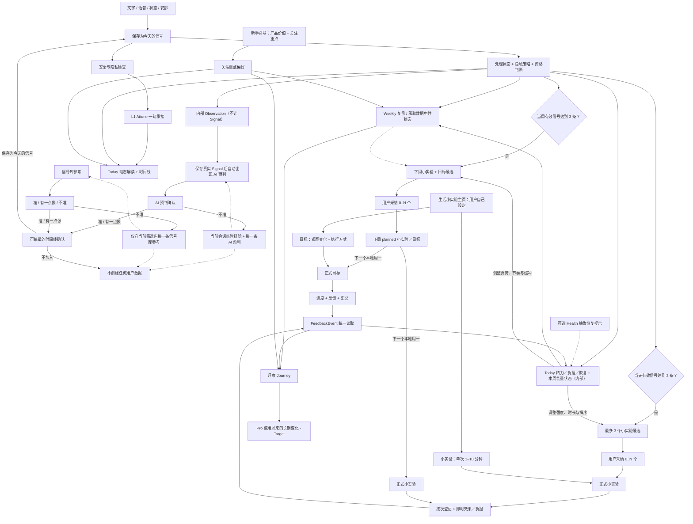

# SignalPath App 最终设计

最后更新：2026-07-29

状态：**Final / 唯一产品设计事实来源**。

本文已经吸收 28 条真机反馈、Energy Budget、AI 分层和购买权益的最终确认。今后的产品决策直接更新本文；旧 PRD、页面草案和 ReleaseQA 记录只能作为历史证据，不能覆盖本文。

本文依据 28 条真机测试反馈，重新整理 SignalPath 的完整体验，包括：

- 产品解决什么问题；
- 信息如何从输入流向输出；
- 每个页面分别负责什么；
- 哪些能力已经实现、部分实现、仍是目标设计，或只为旧数据兼容而保留。

配套技术合同：

- [最终数据流](data_flow.md)
- [AI 编排与职责边界](ai_orchestration.md)
- [购买与权益](purchase_entitlement.md)
- [反馈事件](feedback_event.md)
- [证据链](trace_evidence.md)
- [同步、隐私与删除](sync_privacy_delete.md)
- [主页面 UI 标准](main_tab_ui_standard.md)

冲突优先级为：用户最新明确确认 → 本文 → `data_flow.md` 与专项技术合同 → 当前 QA 证据 → 历史记录。目标设计必须标为 Target／Partial，不能因为写入本文就描述成已经上线。

## 1. 产品定义

SignalPath 帮助用户把零散的生活记录，逐步转化为：

- 可以回看的生活信号；
- 可以马上试一试的“小实验”；
- 可以连续坚持并观察效果的“目标”；
- 可以长期理解的人生轨迹。

SignalPath 不是任务管理器、诊断工具，也不是自动替用户做决定的生活教练。AI 可以提出解释和建议，但什么内容成为个人事实、什么行动值得尝试，最终由用户决定。

简化后的产品循环：

```text
记录 -> 确认 -> 看见 -> 选择 -> 尝试 -> 复盘 -> 理解
```

用户可见的核心产品粒度：

```text
信号卡 SignalCard -> 生活小实验 LifeExperiment
                              |- 小实验（轻行为，旧称“小行动”）
                              `- 目标（多日坚持）
```

术语迁移必须保持单向且不可混用：旧称“小行动”统一改为 **“小实验”**；旧称“小实验”（中长期、多日内容）统一改为 **“目标”**；父级页面与产品能力仍称 **“生活小实验”**。为了兼容现有数据和 API，新称“小实验”继续落在 `MicroActionCandidate / MicroAction / micro_action_feedback`；新称“目标”继续落在 `ExperimentCandidate / LifeExperiment / life_experiment_feedback`。内部类名、表名与历史值不是用户可见术语，不能据此把“目标”重新显示成旧称“小实验”。

小实验与目标并列展示时，小实验的用户可见副标题统一为 **`Quick try / 轻量尝试 / 輕量嘗試 / 軽く試す`**，与目标的 `Longer term / 中长期 / 中長期 / 中長期` 区分；分类副标题不再用“10 分钟以内”定义小实验。单次 `1–10` 分钟仍是创建校验、候选生成与反馈事实的真实产品约束，只在需要说明具体时长的创建、统计或事实反馈场景展示。

用户界面统一使用 **Signal** 描述支持某项解读、尝试或总结的生活记录，例如“关联 Signal”“来源 Signal”。“证据／evidence”只允许作为 `TraceLink`、资格检查、审计和生成链路的内部技术术语，不得出现在 Weekly、Journey、Pro、生活小实验或来源详情的用户可见文案中。

旧的独立 `Schedule` 和 `Goal` 对象没有当前产品可达流程，不再作为同级业务对象、独立页面或反馈类型。Today 的“安排”入口保存的是 `time_use` 类型的结构化 `SignalCard`，仍属于信号层；它不会写入旧 `schedule_signals`，也不读取系统日历。旧表、迁移、备份／删除、旧数据读取以及历史通知清理只作为兼容边界保留。

## 2. 状态定义

| 状态 | 含义 |
| --- | --- |
| **已实现（Implemented）** | 已存在于当前 App 或数据链中；测试和真机验证情况另行记录。 |
| **部分实现（Partial）** | 已有可用基础，但尚未满足本文定义的完整产品规范。 |
| **目标设计（Target）** | 已确认的产品方向，但仍需要开发、迁移或专项验证。 |
| **仅兼容保留（Compatibility）** | 只为旧数据、旧客户端、迁移或回滚而保留，不属于当前产品体验。 |
| **平台验证待完成（Platform QA）** | 代码已存在，但仍需要 TestFlight 或真机证明。 |

任何目标设计都不能在发布记录中描述为“已上线”或“已通过”。

## 3. 核心对象

| 对象 | 产品含义 | 是否直接展示给用户 | 创建规则 |
| --- | --- | --- | --- |
| 输入草稿 | 保存前正在输入或识别的文字。 | 临时展示 | 只存在于编辑阶段；跳过即零写入。 |
| 信号卡 `SignalCard` | 用户确认属于自己的生活事实。 | 是 | 直接记录，或从 AI／信号库候选中编辑并明确“保存为今天的信号”；保存后正文与事实字段永久只读。 |
| 当日状态概览 `CurrentEnergyState` | 当前本地日期内，由真实 Signal 综合得到的精力、负担和恢复派生快照。 | Today 以中性描述展示 | 综合用户明确状态、已发生安排的结束后精力和当天其他合格 Signal；最新明确状态只提高权重，不覆盖其他事实。它不是新的用户事实，也不计入信号门槛。 |
| 本周能量状态（内部 `WeeklyEnergyBudget`） | 当前本地周内每条合格 Signal 所处的偏耗力／平稳／有余力／恢复／边界与余地状态，以及可重叠的切换、深度投入线索。 | 仅在 Pro“本周深度分析”以“本周能量状态”展示 | 从合格 SignalCard、反馈和可选的抽象外部提示聚合；主圆环中的每条 Signal 必须且只能进入一个状态，不是预算、分数、健康评分或诊断。 |
| 内部观察假设 `Observation` | AI 的 L2 推理与证据资产。 | 不作为同级记录展示 | AI 可以生成，但它本身永远不会自动成为用户事实。 |
| 小实验候选 `MicroActionCandidate` | 当下即可开始、单次 1–10 分钟、低成本且可逆的轻行为建议。它回答“现在试一下，有没有帮助”。 | Today 的即时候选页、Weekly 的下周尝试页；明确选择“考虑／观察”后也可在生活小实验主页继续查看 | 当天达到至少三条有效 Signal 后可生成即时候选；当周达到门槛时也可作为下周计划候选。用户可见决定只有“采纳”和“考虑／观察”；内部初始 `undecided` 不是第三个选项。 |
| 小实验 `MicroAction` | 单次 1–10 分钟的短期轻行为；按每次真实尝试记录即时效果与负担，属于生活小实验。 | 是 | 用户可采纳 AI 提议，也可从生活小实验主页自己设定。Today 采纳后从当天开始；Weekly 采纳后先为 `planned`，到下周一激活。 |
| 目标候选 `ExperimentCandidate` | 需要按计划频率持续一段时间，才能观察预先定义变化的中长期项目。 | Weekly 的下周尝试页；明确选择“考虑／观察”后也可在生活小实验主页继续查看 | 当周达到至少三条有效信号后生成，最多三个。候选必须写明计划频率、观察变化、最低观察门槛和允许缩小／中止的边界；周期可超过七天。用户可见决定同样只有“采纳”和“考虑／观察”。 |
| 目标 `LifeExperiment` | 进入正式中长期观察周期的生活小实验。 | 是 | 用户可采纳 AI 提议，也可从生活小实验主页自己设定；创建时必须写明“准备观察什么变化”和“具体怎样执行”，并按自身周期与计划频率运行，不固定为七日目标。 |
| 反馈事件读取视图 `FeedbackEvent` | 统一读取行动和实验进度的视图。 | 通过进度 UI 展示 | 实际写入各自的反馈来源表，不是独立事实表。 |
| 复盘结果 `ReflectionResult` | Daily、Weekly、Journey 或 Pro L3 的版本化 AI 输出。 | 在相应页面展示 | 只能从符合资格且可追溯的来源生成。 |
| 证据链路 `TraceLink` | 连接事实、推理、复盘和实验的内部证据关系。 | 只在适合追溯的报告层以“关联 Signal”等方式展示；小实验／目标详情不展示来源 Signal 或来源原文 | 保存派生对象时同步建立；隐藏详情入口不等于删除内部关联。 |

小实验与目标的用户可见创建方式固定为两种：

- **AI 提议并由用户采纳**：保留候选、来源 Signal 与 trace 的内部关联，供候选生成、失效刷新和后续分析使用；对象详情不显示这些来源 ID 或原文。
- **用户自己设定**：不经过 AI 候选和三条 Signal 门槛。小实验必须满足单次 `1–10` 分钟；目标必须填写观察变化与执行方式，并保留中长期周期和计划频率。

正式创建事务只新增一个内容已经确定的正式对象。AI 提议来源可在对象字段中保留既有 `origin_candidate_id`／关联 ID，用户自己设定则没有候选来源；两种方式都不创建 SignalCard、不写完成／未完成、不补效果／负担，也不增加任何报告门槛。用户可见来源标签只显示“AI 提议”或“自己设定”；无法可靠还原来源的旧对象显示中性的“历史记录”，禁止猜测为 AI 或用户创建。
跨周续行子对象继承同一逻辑项目根对象的创建方式，不新增“续行”“系统生成”等第三种用户可见来源。

### 3.1 事实与对象内容不可编辑边界

- 所有已经保存的事实记录都是不可编辑的追加式历史。`SignalCard` 一经保存，Today、手帐、Weekly、Journey、Pro、来源详情和任何次级页面都只能读取，不能修改正文、发生时间、标签或结构化事实字段。
- AI 预判与信号库的“可编辑确认”只编辑**尚未保存的候选草稿**。点击“保存为今天的信号”后，它立即成为不可编辑的 Signal Card；这个确认页不能被当作历史记录编辑器重新打开。
- 小实验与目标已经保存的完成事实、效果／负担评价、可选复盘和生命周期事件同样不可编辑。当前本地日期允许再次登记时，必须追加一条新事件；目标的同日计划完成状态继续采用“同日最后一条有效事件决定当天格子”的读取规则，小实验则按每次真实尝试保留独立事件。旧事件始终保留，过去本地日期不得补写或改写。
- “今天／这次是否完成”与“下周是否继续”是两件事。前者只可在 Today 或 Weekly 的今天格子追加当次／当天反馈；后者只在 Weekly 的下周尝试页决定。用户选择继续时，系统为下周建立带父子来源的计划投影，并在下周一继续显示为进行中；未选择继续时，本周对象在周日边界自动计为完成。两种结果都不能借用或补造某一次尝试、某一天的完成格子、效果评价或总结；既有反馈、效果评价和历史详情继续保持只读。
- “做过／完成”与“有效”也是两件事。完成事实不自动推导效果；只有用户明确提交的即时效果、负担或周期结果评价，才可进入有效性判断。旧 `helpful`／`adjusted` 等兼容值不能被反推成新的结构化有效性结论。
- 小实验／目标一经创建，名称、做法、节奏、边界、周期和其他内容定义都不再提供改写入口。用户想改变内容时，必须通过“新建小实验／新建目标”创建新的正式对象；旧对象及其反馈历史继续只读保留，不能把新内容伪装成旧对象的后续版本。
- 旧客户端已经写入的计划版本记录只用于迁移、备份恢复和历史兼容读取。当前产品不再创建、展示或编辑计划版本，也不能把旧版本记录重新解释为用户可操作功能。
- 已结束周、已归档周期和所有历史日记内容永久只读。产品内的删除／隐私排除若被允许，是独立的状态转换或账户清理能力，不等于编辑原事实。

## 4. 从输入到输出的完整工作流



### 4.1 新手引导与关注重点

1. 首次启动从原生启动画面直接进入 Flutter 新手引导第一页，中间不出现白屏。
2. 四个页面依次说明以下内容；前三页只解释产品闭环，不写入 Signal、反馈、候选、总结或报告，第 4 页才保存用户选择：
   - **第 1 页｜今天：留下真实 Signal。** 说明“今天”是当日 Signal 输入与反馈闭环：默认文字输入栏，以及语音、状态、安排、信号库。文字／语音／状态／安排经用户明确保存后才成为 Signal Card；信号库参考仍需编辑确认。智能预判不是独立输入按钮，只能在用户先保存真实且合格的 Signal 后出现，确认后才进入时间线。画面以不同颜色、大小和亮度的细腻星点表现尚未连接的生活 Signal，不放大通用图标。
   - **第 2 页｜每周复盘：从 Signal 看见模式，再决定下周尝试。** 按 `Signal 事实 → 行为模式 → 小实验／目标反馈 → 下周小实验 + 目标选择` 展示完整周闭环；明确“小实验”是单次 1–10 分钟的轻尝试，“目标”是需要按计划频率持续观察的中长期项目。画面先把第 1 页的星点连接成可读关系，再让其中一部分连接向外发散为小实验和目标，表达“复盘不是重复记录，而是把事实转成可选择的尝试”。
   - **第 3 页｜旅程：看见当月变化与长期方向。** 免费层展示当前自然月的事实概览、主题变化和温柔回顾；Pro 解锁使用 App 以来的历史月份与长期变化。画面把已连接和发散过的 Signal 沿圆环与发光路径组织成旅程，表现时间累积与方向形成；不使用独立的通用 Journey 图标代替内容。
   - **第 4 页｜选择关注重点。** 保持九个关注重点的多选与“开始”动作，说明它们只改变 AI 的优先阅读角度与候选排序，不隐藏事实或改变报告门槛。
3. 四页使用同一套 Aurora 视觉资产与品牌色，但各页的主图必须表达不同的信息关系：Today 是**星点**，Weekly 是**连线并向生活小实验发散**，Journey 是**沿圆环形成路径**；不得用放大的 App icon、页面图标或无语义装饰替代上述关系。
4. 每页只承担一个主叙事。简体中文版本不得混入 `Today / Weekly / Journey / LifeExperiment / ProL3` 等旧英文界面词；用户可见名称统一为“今天、每周复盘、旅程、生活小实验、深度分析”，`Signal`、`Signal Path` 和 `Pro` 可保留。正文解释另一层／另一页面时另起一行；中英文词组、数字与单位不得在词中间强制断行。
5. 用户点击“开始”后，先在本机保存多选的关注重点。
6. “我的”页面立即读取同一份关注重点数据。
7. 远端多选同步仍是目标设计；旧的单值字段只用于兼容。

最终九个关注重点及其稳定 ID 为：

| ID | 用户文案 | 优先理解的生活范围 |
| --- | --- | --- |
| `emotional_stability` | 情绪安定 | 紧绷、焦虑、失控感与低刺激恢复。 |
| `relationship_connection` | 关系连接 | 被理解、被接纳、靠近与疏离。 |
| `meaning_value` | 价值意义 | 价值感、存在感、被看见与意义感。 |
| `self_boundary` | 自我边界 | 拒绝、保护节奏和表达真实需要。 |
| `growth_plan` | 成长计划 | 目标、卡点、练习与下一步。 |
| `creative_expression` | 创造表达 | 灵感、写作、输出、作品与观点。 |
| `food_sleep` | 饮食睡眠 | 睡眠、饮食、疲劳与身体基础照护。 |
| `living_environment` | 生活环境 | 居住、金钱、健康、秩序与现实支撑。 |
| `interests_hobbies` | 兴趣爱好 | 兴趣、旅行、自然、运动与生命感。 |

关注重点只影响 AI 阅读角度、候选排序和文案，不隐藏其他真实记录，不改变 Eligibility、三信号门槛或事实真伪。本机多选是当前 source of truth；去重后保留用户顺序，第一项只作为旧单值字段的兼容 projection。用户跳过时默认使用“情绪安定、成长计划、饮食睡眠”。在没有明确 SignalPath 登录账户前，本机偏好优先，产品不承诺跨设备恢复。

### 4.2 直接输入

| 输入方式 | 保存行为 | 跳过行为 | 最终结果 |
| --- | --- | --- | --- |
| 文字 | 默认输入栏中的非空文字点击勾选即完成明确提交，不再经过第二个确认页；保存后再进行 AI 补充或同步。 | 空内容不写入。 | 一条 `SignalCard`。 |
| 语音 | 用户先确认识别文本，再点击“保存为今天的信号”。 | 点击“先跳过”、关闭或退出页面都不保存草稿或信号卡。 | 一条 `voice` 类型信号卡。 |
| 状态 | 心情、当前精力和可选的“补一句”属于同一条记录；点击“保存为今天的信号”后才提交。当前精力使用“偏低／还好／很足”三档。 | 点击“先跳过”、关闭或退出都零写入。 | 一条 `one_tap` 类型信号卡。 |
| 安排 | 登记今天已发生或接下来的事项、起止时间、时间去向、可选的结束后精力与备注；点击“保存为今天的信号”后才提交。结束后精力与状态页使用相同的“偏低／还好／很足”三档。 | 点击“先跳过”、关闭或下拉退出都零写入。 | 一条 `time_use` 类型信号卡；结构化时间保存在 `raw_payload_json`。 |

“安排”的时间去向直接复用 4.1 的九个关注领域 ID 与本地化文案，并始终允许用户从九项中选择；“我的”中选定的关注重点只影响 AI 的阅读和候选排序，不能隐藏其他真实的时间去向。新记录在 `raw_payload_json.focus_domain_id` 保存稳定 ID，过渡期同时把同一 ID 投影到 `category`；旧版的 `work / commute / household / relationship / recovery / interest / other` 只读兼容，不再作为新写入选项。

状态页的当前精力与安排的结束后精力共用 `energy_level = 0 | 1 | 2`（偏低／还好／很足）。两处初始值都必须是 unknown，用户未选择时省略 `energy_level`，不能默认写入偏低。旧 `energy_effect = draining | neutral | restoring` 只作为历史派生上下文读取，新记录不再写入该旧字段；其中 `restoring` 在 Weekly 五类投影中归为“恢复”，不能再改写成表示“已经有余力”的 `energy_level = 2`。没有现代 `energy_level` 的旧记录不得预选状态页控件。

AI 失败、额度不足或网络错误，都不能删除用户已经输入的原始内容。

### 4.3 AI 预判与信号库

AI 预判和信号库参考都只是候选，不是用户事实。AI 预判不是独立输入按钮；只有用户先保存了一条真实 Signal Card 后，才可自动出现。每次预判只锚定**最新一条已经保存且合格的真实 Signal**，不能把同日其他 Signal 拼接成关键词集合，也不能用旧记录的主题解释最新记录。候选内容必须能由该锚点 Signal 的原文或结构化字段直接支持；如果找不到相关、保守且可追溯的候选，就不显示 AI 预判。跨多条 Signal 才能成立的重复、条件反应、行为顺序或其他行为模式统一留给每周复盘，不在 Today 强行生成。

AI 预判的可见来源说明、内部 `source_signal_ids`、trace link 和刷新签名必须指向同一个单一锚点；不能出现正文依据旧 Signal、来源文案却引用最新 Signal 的错配。单条 Signal 推断的置信度固定为 `low`，不得因为同日存在更多不相关 Signal 而提高。两类候选在“准／有一点像”后都进入同一个可编辑确认页；只有用户编辑或确认文本并点击“保存为今天的信号”后，才创建 Signal Card 并加入今日／手帐时间线。

```text
AI 预判
  -> 准 / 有一点像 / 不准
  -> 准或有一点像：打开可编辑文字
  -> 用户明确选择“保存为今天的信号”或“不加入”
  -> 只有保存才创建一条幂等 SignalCard
  -> 不准：当前会话内排除该候选并立即换一条；不保存拒绝反馈

信号库参考
  -> 准 / 有一点像：打开同一个可编辑确认页
  -> 用户点击“保存为今天的信号”才创建一条幂等 SignalCard
  -> 不准：当前页面会话内临时排除；仅当当前筛选内存在下一条时换一条
```

“不准”或“不加入时间线”都是零写入操作：不创建 `SignalCard`，不保存匹配反馈，也不发送匹配反馈埋点。AI 预判与信号库都只在当前内存页面会话中维护临时排除 ID 与成功替换次数；离开对应页面即丢弃，不进入账户数据、分析 Signal 或 `FeedbackEvent`。AI 已生成的内部 `Observation` 仍遵循自身生命周期，但不能记录用户没有提交的判断。

每次进入 Today 页面形成一个 AI 预判会话：点击“不准”后排除当前候选，并只从**同一锚点 Signal**能够直接支持的其他候选角度中换一条。每次会话最多成功替换三条，这是上限而不是必须凑满的数量；候选不足时可以提前显示中性的“暂时没有新预判”，不能改用其他 Signal、通用模板或跨记录模式填满次数。达到上限后同样停止替换，不生成第四条。

每次进入信号库页面形成一个独立的信号库会话：点击“不准”后，仅在**当前搜索词与关注领域筛选结果**中寻找下一条未排除参考；找到后原位换出当前卡片并计为一次成功替换，每次会话最多成功替换三条。当前筛选内没有下一条时保持当前内容并给出中性提示，不能跨筛选塞入无关参考，也不能消耗替换次数。改变筛选条件后仍沿用本次页面会话的临时排除与成功替换计数；离开信号库页面才重置。

两类会话的次数与临时排除集合都只存在于当前页面内存，会话结束即清空，不能写入用户事实、反馈、分析或埋点。

AI 预判的幂等键和刷新签名必须同时包含用户本地日期、该单一锚点 SignalCard 的稳定 ID 与内容／结构化字段版本。用户对同一候选重复点击只能得到一条 SignalCard；同一天新增一条更新的真实 Signal 后，锚点和刷新签名随之变化，新生成并确认的预判必须得到新的幂等键，不能覆盖当天较早已经确认的预判。当前会话内换出的候选被确认时，保存内容、标签、来源 ID 和内部 Observation 必须使用用户实际看到的那一版，并仍只关联该锚点，而不是被替换的旧候选或同日其他 Signal。

信号库目录使用九个关注领域作为唯一标签来源。每张参考卡必须保存且只保存一个稳定的 `focus_domain_id`；筛选、卡片徽标和加入时间线后的 payload 都读取该字段，禁止再根据标题或正文关键词猜测分类。简体中文、繁体中文、英文和日文共享相同的 canonical card ID 与领域映射，每个领域在每种语言下保持 2–3 条常见、隐私安全且内容与标签一致的参考。

### 4.4 能量状态（内部 Energy Budget）

`EnergyBudgetSnapshot`、`WeeklyEnergyBudget` 和 Energy Budget 策略是内部技术名称，可以继续保留。用户界面不使用“预算”，统一显示为简体中文“本周能量状态”、繁体中文“本週能量狀態”、英文 `This week’s energy state`、日文“今週のエネルギー状態”。它的目标不是衡量效率或分配额度，而是持续回答两个问题：用户此刻大概承受得起多大的尝试；本周每条合格 Signal 更接近偏耗力、平稳、有余力、恢复还是边界与余地，以及它还伴随了哪些切换、深度投入线索。它是 SignalCard 主链上的派生上下文，不新增“能量记录”这一同级产品对象，也不能被当作一条事实、预算或评分。

#### 时间窗口

- `CurrentEnergyState` 使用用户本地日期，并综合当日所有真实、合格且已经发生的 Signal。最新一条用户明确提交的 `one_tap.energy_level` 是最高权重锚点，但不能覆盖同日其他 Signal；已发生安排的结束后精力次之，其他可追溯 Signal 共同参与。出现足量相反方向时显示“有波动”，不能强行采用最后一条。跨过本地日界后重新计算，不能沿用昨天的负面判断。
- `WeeklyEnergyBudget` 严格使用用户本地周一 00:00 至周日 23:59:59 的合格证据，不得混入全量历史。
- 历史趋势只在 Journey／Pro 有独立时间范围和证据时读取，不能偷偷进入“本周”。
- 状态页在用户尚未选择时必须是 unknown，不能默认“疲惫／精力偏低”；同一天的旧状态继续保留并参与综合，但不能单独决定 Today 的精力结论。

内部行动容量使用 `unknown | very_low | low | medium | high`，并随快照保存时间范围、证据覆盖、来源 hash、置信状态和更新时间。`unknown` 不是“精力不足”。

| 容量 | 小实验默认上限 | 目标默认方向 |
| --- | --- | --- |
| unknown | 3 分钟以内、可逆、以观察为主 | 保持轻量，不因数据缺失加压。 |
| very_low | 1–2 分钟，暂停／恢复／边界／只观察 | 恢复或观察型，不增加新执行负担。 |
| low | 3–5 分钟，减少切换并增加缓冲 | 低频、步骤少、允许中止或缩小。 |
| medium | 5–10 分钟、单一步骤 | 简单、单变量，按目标自身频率持续观察。 |
| high | 仍保持 1–10 分钟，避免变成新任务 | 可适度增加观察深度，但不增加不必要步骤或制造完成压力。 |

小实验的产品边界固定为“当下即可开始、单次 1–10 分钟、单一步骤、可随时暂停”。内部 Energy Budget 只在 1–10 分钟范围内调整时长、候选排序、解释和切换成本，不能把小实验扩张成需要持续执行或等待长期效果的任务。需要按计划频率持续一段时间、较长单次时间或累积效果才能判断的内容一律进入“目标”；目标可持续数周或更久，不以七日作为产品上限。

#### 证据优先级

1. 用户明确提交的状态、能量描述、已发生时间去向和实际反馈；
2. 用户确认并符合当前分析资格的 SignalCard；
3. 已采纳小实验／目标的实际反馈；
4. 可选 HealthKit 的 allowlist 抽象恢复提示。

未确认／legacy 内容最多作为轻背景。当前版本的外部提示只允许包含睡眠恢复或活动恢复等 Health 抽象值，不能包含原始健康样本或精确健康时间线。外部提示与用户记录冲突时，以用户明确记录为准；缺少明确能量证据时，内部行动容量可以保持 `unknown`，不用外部提示补出结论，也不能只靠外部提示提高建议强度。这里的 `unknown` 只属于内部候选强度判断，不是 Weekly 主圆环的第六类或灰色类别；合格 Signal 仍按下方规则投影到五种状态之一。用户主动登记的 `time_use` 信号可以把九项关注领域之一和可选的结束后精力带入 Energy Budget，但不能只凭时长或领域名称推断耗能。只有 `record_status = completed` 才采集结束后精力并把它作为当日／当周上下文；`planned` 只表示计划，不写入或读取当前能量事实，旧记录中残留的计划精力也要忽略。completed time-use 是高权重上下文，但仍与明确状态及其他当日 Signal 一起综合，任何单条记录都不能绝对覆盖整天。系统 Calendar 日程密度能力仍只作为未来 Target 保留在底层，不进入当前用户入口、候选上下文或来源哈希。

#### 对候选的影响

- 小实验候选同时读取当日 `CurrentEnergyState` 和当前周 `WeeklyEnergyBudget`，且必须是当下即可开始的轻行为；目标候选读取周趋势及既往实际反馈，必须需要多日坚持才能观察效果，不能因单次情绪直接生成一周目标。
- 候选的 Signal 门槛仍只按当日本地日／当前本地周计算；反馈学习另取生成当日本地日期向前共 28 天（历史重建以历史周期末日为截止日），不能因为跨日反馈扩大 Signal 门槛或数量。
- 反馈必须实质改变候选内容而不只是来源哈希：小实验读取用户明确提交的即时效果与负担；目标读取周期结果与执行负担。正向且负担可接受时保留并延展方向，明确偏费力／太费力时缩短小实验或降低目标频率／单次要求；用户显式跳过时才换方向。单纯 `completed` 或 `not_completed` 只保存完成事实，不能被解释成有效、困难或方向错误；旧 `helpful`／`adjusted` 仅作兼容读取，不能代替新的结构化评价。
- 能量只调整候选的强度、时长、切换成本、缓冲量、排序和解释，不改变事实资格，也不覆盖关注重点。
- 每个目标候选都必须带有同一条保护边界：当天负担过高时允许缩小或暂停，不把暂停解释为失败，也不能因此生成负面状态结论。
- 消耗高或恢复不足时，优先非常轻、短时、低切换、可随时停止的恢复／边界／缓冲选项。
- 状态稳定或恢复较好时，可以包含正常强度的深度、创造或连接选项，但小实验仍要轻量可逆，目标仍要单变量且可中止。
- 状态混合或不确定时，提供多样、低风险的候选并说明证据有限，不作强结论。
- 候选页必须用一句“能量适配说明”解释为何采用该强度；可见决定只提供“采纳”和“考虑／观察”，用户可以对任意数量作出决定，也可以直接离开并保持内部未决定状态。
- 候选组保存生成时的 `energy_snapshot_id/hash` 和推荐强度。状态、合格 SignalCard、小实验／目标反馈或抽象提示变化时，未采纳候选立即进入 `stale -> regenerating -> ready` 并原位替换；已采纳对象不自动改写。

#### Pro 深度分析展示

Pro“本周深度分析”的用户可见标题固定为“本周能量状态”。主圆环只展示五个互斥状态，避免把“已经有余力”和“正在恢复”混为一类：

| 稳定 key | 颜色 | 用户可见名称 | 语义边界 |
| --- | --- | --- | --- |
| `draining` | 橙色 | 偏耗力 | 明确消耗、疲劳、负荷或勉强维持。 |
| `steady` | 蓝色 | 平稳 | 不太耗力，也没有明确表现为轻松、有余力、恢复或主动留出边界。 |
| `ease` | 黄色 | 有余力 | 当下已经有余力、感觉轻松或能从容推进；它描述可用余量，不是恢复过程。 |
| `recovery` | 绿色 | 恢复 | 正在补回精力、休息后回升或执行了明确恢复行为；它描述补充过程，不等同于原本就轻松。 |
| `boundary_buffer` | 紫色 | 边界与余地 | 主动拒绝、暂停、收窄、留白或给自己保留缓冲空间。 |

主圆环没有“未判断”、灰色或其他兜底类别；同一自然周内的每条合格 Signal 必须且只能进入五个状态之一，五类计数之和必须等于该快照纳入的合格 Signal 总数。

单条 Signal 的主状态按以下确定性优先级投影：

1. 用户明确选择的 `energy_level` 优先级最高；`0 / 1 / 2` 分别归为 `draining / steady / ease`。`2` 只表示当下有余力，不得改写为正在恢复。
2. 只有新字段缺失时才兼容读取 legacy `energy_effect`；`draining / neutral / restoring` 分别归为 `draining / steady / recovery`。legacy `restoring` 必须归入绿色恢复，不能再归入黄色有余力。
3. 上述明确字段都缺失时，才读取同一条 Signal 内可追溯的实际语义，并使用固定优先级：**实际边界／缓冲 > 实际恢复 > 偏耗力 > 有余力／轻松**。也就是，明确以拒绝、暂停、收窄或留白为主事实时归 `boundary_buffer`；否则明确记录恢复行为或恢复结果时归 `recovery`；否则有明确负荷／疲劳时归 `draining`；否则有明确轻松／余力时归 `ease`。
4. 没有任何方向线索时归 `steady`。这个最终回退只用于保证 Weekly 图表穷尽完整，不得写成用户已经明确确认“状态平稳”。

每一步一旦命中就停止，不再让低优先级线索覆盖高优先级结果。分类结果、命中的来源字段／语义线索、规则版本和来源 hash 必须随快照保留，使同一来源和同一规则版本可重复得到同一类别。

“切换”“深度投入”保留为可以与五种主状态重叠的辅助描述，移出主圆环，使用独立标签或关联文案展示。同一 Signal 可以同时拥有多个辅助描述，但不能因此进入多个主状态。辅助描述不改变五类主环计数。“边界与余地”已经是第五个互斥主状态，不再同时作为重叠辅助线索重复计数。

主圆环使用同一自然周、同一版本快照中可复现的五类 Signal 计数或相对结构。橙色“偏耗力”、蓝色“平稳”、黄色“有余力”、绿色“恢复”、紫色“边界与余地”五个文字图例必须始终同屏显示；某类计数为 0 时图例仍显示 `0`，圆环本体则只绘制计数大于 0 的色段。每个图例同时提供不同的非颜色标识与 VoiceOver 类别、计数说明，不能只靠颜色区别。圆环可以展示实际计数或相对分布，但不能显示升降幅、完成率、健康评分或类似 `+18%` 的装饰数字。圆环中央使用“偏耗力较多／以平稳为主／有余力较多／恢复较多／边界与余地较多／状态交错”等可追溯的定性总结；不能使用“未判断／形成中”把已纳入的 Signal 变成灰色。

该区不显示健康诊断、纪律评价，也不把 `capacity_band` 直接翻译成能力好坏。低于 Weekly 三信号门槛时，Pro 深度分析中的能量区只显示中性 `X/3` readiness 和“形成中”，不生成完整能量结论。

当前底层日／周快照、两类候选读取，以及统一为“生活小实验 → 小实验／目标”的页面、术语、候选分类和读取投影均已进入 **Implemented baseline**；下一次 TestFlight 仍需验证真实数据、跨日边界和两类进度不会串线。

### 4.5 Today 输出与当日反馈闭环

Today 是“当日 Signal 输入与当日反馈闭环页面”。顶部用一个紧凑区域合并日期、当日动态解读，以及由真实 Signal 综合得到的**精力、负担、恢复**。用户先记录事实，再在今日时间线看到当天事实，最后在页面底部看到由这些事实派生的“今日尝试”。

- **精力**：综合当天全部真实合格 Signal。最近明确状态权重最高，已发生安排的结束后精力次之，文字、语音和其他 Signal 的五类能量投影共同参与；相反方向同时达到有效覆盖时显示“有波动”。
- **负担**：只读取实际偏耗力结果，或仍为平稳但带有明确摩擦的 Signal；低精力状态本身不等于负担，恢复、有余力和边界 Signal 上的背景 friction 也不能重复制造负担。
- **恢复**：只读取明确恢复过程或恢复结果；“没有记录到恢复”只能显示“尚未出现”，不能写成“恢复不足”或健康评价。
- 单条间接 Signal 不足以给精力或负担下强结论，显示“待观察”。未来／计划中的安排不参与三项判断。
- `qa_showcase` 模拟数据只服务 Weekly、Journey 与 Pro 内部测试，必须从 Today 的数量、摘要、时间线和三项状态中排除。

当没有足够 Signal 时：

- 使用中性提示；
- 不显示“精力不足”“恢复不足”等负面判断；
- 不显示固定或装饰性的假数据。

AI 小实验提议门槛按用户本地日期计算去重后的有效信号卡。达到至少三条后，最多生成三个可以立即开始、单次 1–10 分钟的轻行为候选。候选确认区只提供“采纳”和“考虑／观察”：采纳 0..N 个会创建正式小实验；考虑／观察只保存候选决定，既不创建正式对象，也不进入时间线或产生进度。内部初始 `undecided` 不作为第三个用户选项。用户从生活小实验主页自己设定小实验不受该 AI 门槛限制，但同样必须通过 1–10 分钟数据约束。正式对象按每次**有效完成反馈**累计真实尝试；未完成／未尝试登记不增加尝试次数，也不能被包装成七日坚持任务。

### 4.6 Weekly 输出、下周尝试与生活小实验

Weekly 读取用户本地时间周一至周日的当前自然周。少于三条有效信号时，页面保持可进入，但不显示周报告内容，而是明确显示 `X/3` 数据进度和返回 Today 的入口。

三条信号门槛同时控制 Weekly 标准报告、Pro“本周深度分析”和下周页面中的 **AI 下周尝试提案**；它不限制用户进入 Weekly，也不限制用户决定是否把一个本周仍在进行的目标延续到下周。反馈、内部 Observation、候选和 AI 输出都不能代替一条 SignalCard 增加门槛计数。“本周深度分析”是 Weekly 的 Pro 深层页面，不使用长期综合报告的层级命名。

Weekly 的主报告始终以**当前本地自然周**为范围。在标题之后先显示一个清晰标注上一完整自然周日期的“**上周回看**”桥接卡：第一句只总结上周可追溯的事实，第二句用“本周可留意……”表达可观察的提醒；它不得把两个周的相关性写成“上周导致本周”。上周资料不足时显示中性状态，不补造总结或模式。

Weekly 达到门槛后不再把“本周 Signal”“本周行为模式”和“本周尝试”作为三个彼此平行、重复解释的卡片，而是组合为一个 **本周复盘报告**。报告固定按以下三层阅读顺序展开：

1. **Signal 事实**：只统计本地自然周内去重后的有效 SignalCard，展示 Signal 总数、记录日数和关注领域分布；这是“这周实际记录了什么”的事实层。
2. **本周行为模式**：从本周多条 Signal 提炼 **1–3 条**有来源支持的行为模式；它不限于重复，也可以是条件反应、行为顺序、取舍或场景差异。每条必须保存来源 Signal、支持日期与支持程度；Signal 分布只能作为缺少正式模式时的中性回退，不能把同一批 Signal 再计成另一组事实或另一个总数。模式可使用**触发点、典型反应、短期结果、长期影响**的自适应分块，但只展示实际有来源的块；字段不足时显示“还在形成”，不得把 `name`、`summary` 或相邻字段改写成不存在的因果链。长期影响只有在跨周数据支持时才能下结论，单周输入必须保持“还在形成”。
3. **尝试结果**：读取本周正式生效的小实验／目标及其有效反馈，展示参与项目、登记天数、周一至周日完成格、事实总结，以及受控的 Signal 与尝试关联；这是“本周实际验证了什么”的反馈层。当前本地日期仍在对象有效期内时，每一行同时提供明确的“小实验反馈／目标反馈”登记按钮；它与点击当天格子完全等价，并复用 Today 的同一套反馈弹窗和写入规则。过去与未来日期只读，Weekly 不产生第三套反馈字段或独立事实。

三层的视觉表达也固定遵循事实来源：Signal 事实使用领域环形分布与按数量排序的领域行；行为模式使用完整宽度的模式卡，展示具体模式、来源 Signal、支持日期与匹配的行为插图；小实验／目标先展示真实登记格与次数，再在末尾以独立“本周复盘”面板呈现已登记反馈结论。领域环、进度格和插图都只是同一份真实数据的可视化，不生成额外 Signal、模式、完成事实或效果判断；没有领域数据或反馈时显示中性空态，不补造比例、`X/7` 或有效性结论。

三层共享同一个周范围和来源追溯，但指标不得相加或互相冒充：Signal 数只属于事实层，模式层没有独立 Signal 计数，项目数／登记天数只属于尝试层。同一标题、句子或结论只能由一个层级负责，不能在 Signal 事实、行为模式、本周深度分析中逐字或同义反复出现；深层页面只能补充关系、时间跨度或不确定性，不能复制标准报告。整个报告是一个只读组合投影，不创建新的 SignalCard、Observation、反馈或独立持久化事实。用户可见的来源与支持关系统一写为“Signal／关联 Signal／来源 Signal”，不得显示“证据／evidence”。

内部 `WeeklyEnergyBudget` 是报告外的派生上下文，用户只在 Pro“本周深度分析”中看到“本周能量状态”。它描述本周合格 Signal 在偏耗力／平稳／有余力／恢复／边界与余地五种互斥主状态中的分布，并以切换、深度投入作为可重叠辅助描述，参与行为模式解释与下周候选强度排序，但不能成为 Weekly 主报告的第四层、不能新增或改写三层指标，也不能计入三条 Signal 门槛。

#### Pro 本周深度分析

Weekly 回答“本周发生了什么”；Pro 本周深度分析回答“这些层之间怎样同时出现、在哪些时间位置更明显、下周可以深化观察什么”。深度分析读取同一自然周的本周复盘报告、本周能量状态、尝试结果和关联 Signal，但不再展示另一套 Signal 总数卡、完整行为模式列表、完整能量圆环、逐对象七日格或与 Weekly 相同的一句话。

达到门槛后的页面固定按以下顺序展示，并优先使用图表、节点和短标签，避免连续长段文字：

1. **紧凑顶部**：标题“本周深度分析”、本地周一至周日日期和 `N 条 Signal · D 个记录日`；不得显示 `3/4`、模型置信百分比或其他无法解释的装饰进度。
2. **一句结构总结**：最多两行，只说明一个有来源支持的主要关系，不复述 Weekly 的“上周回看”或本周行为模式正文。
3. **核心关系图**：从 Weekly 的 1–3 条行为模式中选择一个主模式，使用 3–5 个节点和 2–4 条连接线，把 Signal 场景、行为模式、能量状态和尝试结果放在同一张图中。连接线只表示在明确日期／次数范围内“同时出现／相关”，不得使用暗示因果的箭头或“导致／底层动机”等诊断式语言。
4. **本周能量状态**：七日叠加图按周一至周日聚合 Signal 数量、橙／蓝／黄／绿／紫五种能量状态和当天是否有尝试反馈；随后给出“下周负荷建议：减量／维持／小幅加量”及可追溯原因。建议只影响下周候选的排序、时长与强度，绝不自动增删、采纳或停止任何计划。不得展示无法从事实重算的 `mood_score`、`friction_score`、主题百分比或走势分数。
5. **下周深化观察提案**：用“为什么值得观察／下周观察什么／怎样看出差异”三个紧凑图文块提出一个可选问题。只有用户明确采纳后，才创建下周一至周日生效的 `DeepObservationPlan`；下周结束后按该计划的 Signal 范围生成“深化观察结果”。未采纳、关闭或离开页面均零写入、无结果、无提醒。该提案不是小实验、目标或正式任务，也不创建 Signal。
6. **Signal 记录提醒建议**：仅在存在明确、可解释的记录时段或间隔时，接在下周深化观察提案之后显示。用户接受前不请求通知权限、不创建规则；接受后可编辑本地时间和星期，并写入可关闭的本地提醒规则。提醒触发只打开 Today 输入，不自动创建 Signal、反馈、候选或门槛计数。

深度分析不提供独立“来源 Signal”区块：来源关系作为内部可追溯数据保留。关系图中的节点或明确日期支持可按需进入手帐时间线对应日期；这样既能追溯，也避免在 Pro 页面重复另一套事实浏览。

页面不展示“分析范围／温和使用”卡片。非因果、非人格判断和不输出长期结论仍是 AI 生成与校验的内部硬约束，不需要占用用户页面空间。

关系的用户可见支持程度只使用“刚开始形成／本周重复出现／跨周仍出现”，不用百分比：有可追溯来源但尚未跨两个本地日期重复时为“刚开始形成”；同一规范化关系由至少 2 条 Signal、覆盖至少 2 个本地日期支持时为“本周重复出现”；同一关系由至少 2 个本地自然周支持时才为“跨周仍出现”。长期影响只允许在最后一种状态中展示。

#### Weekly 行为插图目录

当前资源合同不是单一的“30 张行为插图”：代码分类中有 **24 个 behavior pattern key** 和 **30 个 review pattern key**，另有 9 个关注领域 key；30 个 review key 中包含完成反馈、难度、打断与下周调整等尝试结果语义，不能整体冒充行为模式目录。最终展示必须按 key 区分两类目录，并继续允许后续目录版本扩展。

- Weekly 的行为模式层最多展示一张主要 behavior pattern 插图；本周深度分析最多在关系图的主要模式节点展示一张插图。两页对同一主要模式使用同一个 `behavior_illustration_key`，不把插图放进 Hero，也不使用 App icon 代替。
- AI／投影只能输出目录内的稳定枚举 key，不能输出资源路径。选择顺序为：有来源 Signal 的主要行为模式、覆盖本地日期更多、支持 Signal 更多、稳定 key 排序；来源 hash 改变时重新选择。不能只靠用户正文的模糊关键词随机匹配。
- review pattern 插图只能用于尝试结果或反馈语义；已经废弃的旧按钮文案只可兼容旧数据，不能重新成为当前用户可见状态。
- 没有合法 key 时使用目录定义的中性“模式形成中”资源，不伪造行为。插图是可失效重算的展示投影，不是 Signal、Observation、反馈或门槛事实。
- 插图承载行为含义时，VoiceOver 读取对应行为名称；不能只读文件名，也不能把有含义的插图标记成纯装饰。

“下周尝试”选择属于 Weekly。页面顶部必须明确显示下一个本地周一至周日的日期，按“小实验”和“目标”两个区域展示待决定内容：

- **下周小实验**：由本周 Signal、行为模式与本周能量状态生成的短期、单次 1–10 分钟、低成本、可逆轻行为；用户可选择“采纳”或“考虑／观察”。只有采纳才以 `planned` 状态保存，到下一个本地周一激活并进入 Today，不能提前登记尝试或效果；
- **下周目标**：需要按计划频率持续中长期观察的单变量做法；必须带有预期观察变化、计划频率、目标周期、最低观察门槛和允许缩小／中止的边界。周期可超过七天。同样只提供“采纳”和“考虑／观察”，只有采纳才形成下周 `planned` 目标并在下一个本地周一激活；
- **续行小实验／目标**：本周仍在进行且尚未建立下周续行对象的小实验或目标；用户勾选后创建下周父子对象，保留本周对象与原反馈，不复制旧反馈。下周对象在下周一进入进行中；没有勾选续行的本周对象在周日边界自动计为完成。

所有候选必须关联来源复盘周和来源 Signal。用户可以采纳 0..N 个，也可以将任意候选保留为“考虑／观察”；两个决定都必须幂等，且已经采纳的候选不能降级回考虑状态。下周小实验、下周目标和两类续行对象都可一次确认。采纳或续行后，正式对象必须立即出现在页面顶部带日期的“下周”计划区，而不是继续混在候选列表里。每个尚未开始、尚无反馈的 `planned` 对象都提供删除键；删除只撤回这项下周计划并让来源候选重新可选，不删除来源 Signal、本周对象、本周记录或任何历史反馈。对象一旦激活或已有反馈，就不能再从这里删除。关闭页面或不勾选续行不立即改写本周事实；跨入下一个本地自然周后，系统将没有下周子对象的本周小实验／目标自动计为完成。该页不展示或登记本周日期格，不复用 Today／Weekly 的完成反馈功能，也不显示“最多三个候选”之类的上限文案。若本周不足三条有效 Signal，AI 提案区显示门槛状态，但进行中小实验／目标的续行选择仍然可用。深度分析只可作为候选排序和说明的**可选参考来源**；它不直接创建候选、不直接采纳，也不能成为使用下周尝试的前置条件。

“生活小实验”主页面不再按状态 Tab 切换，也不把两类对象塞进同一种进度图。页面在统一搜索旁提供“新建小实验／新建目标”入口，再显示“进行中／真实反馈／已有结论”三个可追溯的真实汇总和两张互补图表：小实验使用“按次尝试的散点／短分支图”，目标使用“按计划频率推进的中长期时间轨道”。自己设定的小实验必须输入可执行做法与 `1–10` 分钟时长；自己设定的目标必须填写观察变化、执行方式、计划频率和中长期周期，缺一不得创建。明确保留为考虑／观察的 AI 候选可以进入相应图表的考虑层，但只有已采纳或由用户自己设定的正式对象才拥有反馈、效果评价和生命周期。每个节点／行都可进入该对象的个别详情。

页面不再提供独立的聚合“小实验详情／归档概况”页面。两类对象的数量、生命周期分布、效果摘要和最近变化直接汇总在生活小实验主页对应图表内；除“新建小实验／新建目标”外，主页面和两类对象列表都是只读聚合，不提供“登记一次／登记今天”或生命周期操作。进行中的对象必须以完整整行展示名称、类型、计划／周期、已有真实反馈和最近结论；没有对象的生命周期分组直接省略，不渲染占空间的 `0 个` 空卡或大面积占位。个别对象详情继续保留，用于读取对象定义、创建方式、统一“反馈内容”总览和符合资格的总结；详情不显示来源 Signal、来源原文、来源 ID 或计划版本，对象是否跨周继续只在 Weekly 的下周尝试页决定。

新建表单的最终提交采用单事务、幂等写入：只创建一个正式对象。提交成功时不能顺带创建 SignalCard、完成／未完成事件、即时效果／负担、目标观察结果、总结或门槛计数。AI 候选采纳仍可更新原候选决定并把既有候选／trace ID 作为对象内部关联；自己设定不创建伪候选或伪来源。

本周复盘报告中的“尝试结果”层（原独立“本周尝试”）以**周汇总**为主体，不重复 Today 的逐项当日卡片、独立反馈按钮、单项 `X/7` 或详情箭头：

- `参与 N 项`：统计正式周期与本周有交集的已采纳小实验和目标，按对象去重；尚未开始的下周目标不计入本周；
- `登记 D 天`：统计本周内至少有一个有效完成反馈的不同本地日期，同日登记多项仍只计一天；
- 每个参与对象占一行，周一至周日各占一个格子，格子显示 `completed / not_completed / empty`；对象周期外的日期显示不可用状态，不能被解释为未完成；
- 本周格子只表达本自然周的计划完成事实，不复用对象的完整周期指标；小实验的按次结果与目标的完整时间轨道由 Today 和生活小实验页面展示；
- 只有**今天**且仍位于对象正式周期内的格子可以点击，点击后使用与 Today 相同的“已完成／未完成”追加登记流程；当天再次登记追加新事件，并由最后一条有效事件决定格子；过去、未来和周期外格子永久只读；
- 卡片在格子图之后显示 1–2 句中性事实总结，只陈述参与项目数、登记天数、各状态或持续出现的完成事实，不使用完成率、评分、失败或纪律评价；
- 再显示最多两条“Signal 与尝试”关联：把本周同日本地日期内的合格 Signal、Energy Budget 场景和有效完成反馈并列描述，例如“切换较密集的 2 个记录日里，这项有 1 天完成”；必须给出日期／次数范围，只能写“同时出现／相关”，不能写成因果、诊断或人格结论；不足以形成稳定关联时使用中性“还在形成”，不补造内容。

这样 Today 继续回答“今天要不要试、这次／今天做得怎样”，Weekly 回答“本周参与了什么、哪些天有记录、Signal／能量情境与尝试如何同时出现”，生活小实验主页负责创建入口、跨周期总览与汇总，个别对象详情负责对象定义、创建方式、反馈内容总览和最新结论。来源 Signal 与 trace 只在内部生成／分析链保留，不在对象详情重复展示。

### 4.7 完成、效果与反馈

小实验和目标不再共享一个固定 `X/7` 产品口径：

- **小实验是按次观察的短期行为**。单次必须为 1–10 分钟，同一天可以真实尝试多次；只有有效的 `completed` 反馈（含明确映射为完成的旧别名）计为一次真实尝试，每次真实尝试都是独立事件，不按本地日期折叠成一个完成格，也不把七天当作坚持目标。`not_completed`／未尝试只保留为没有执行的事实，不增加真实尝试次数。主页以散点／短分支显示每次真实尝试的即时效果与负担。
- **目标是按计划频率推进的中长期观察**。目标定义自身起止日期、计划频率和最低观察门槛，周期可超过七天；同一目标、同一本地日期存在多条计划完成反馈时，最后一条有效事件决定当天轨道状态。主页按完整计划周期显示时间轨道，不固定截断为七格。
- 两类对象必须按正式对象和类型分别计算，不能互相借用次数、日期或效果结论。

所有完成、效果与负担反馈都采用追加写入而不是编辑。用户只能登记当前本地日期；过去日期和已经结束的周期不提供修改或补录入口。同一天再次登记目标完成状态会新增事件，并由最后一条有效事件决定当天轨道；小实验的多次真实尝试各自保留，不互相覆盖。旧事件始终作为不可变历史保留。

对象生命周期与上述尝试／每日完成反馈完全独立，且详情页不负责生命周期操作。每个本地自然周结束时，系统只检查是否存在下周续行子对象：用户已在 Weekly 下周尝试页续选时，由下周子对象继续计为进行中；用户未续选时，本周对象在周日边界自动计为完成。这个周边界转换不新增 Signal、不伪造效果评价、不生成反馈或总结，也不改变当天、当次或过去任何进度。完成对象继续保留在主页图表和只读详情中。尚未开始的 `planned` 对象详情完全只读，不能提前写轮次／整体总结。

完成事实与有效性评价必须分离：

- 计划完成记录只写入 `completed` 或 `not_completed`；完成只说明“做过”，不能直接解释为有帮助、有效、困难或方向错误；
- 目标当天没有有效完成反馈时，轨道保持 `empty`，但不能解释成“未完成”；
- 小实验在 Today 显示“已完成／未完成”：选择“已完成”后在原卡片行内询问“这次有帮上忙吗：有帮助／有一点／没感觉”和“做起来费力吗：轻松／还好／偏费力”，并允许补一句，字段完整且反馈有效后才追加保存并把真实尝试次数加一；选择“未完成”直接追加，不生成即时效果或难度，也不增加真实尝试次数；
- 目标继续按计划频率登记“已完成／未完成”。达到自身最低观察门槛或用户主动提交周次／整体总结时，再询问周期结果“有改善／有一点／没变化／变差／还看不出”和执行负担“轻松／可接受／太费力”，并允许补一句；总结与周边界的继续／完成状态互不代替；
- 日常完成、即时效果与负担反馈只可从 Today 或 Weekly 的今天格子进入，并复用同一条追加写入链；生活小实验主页和个别对象详情只读取这些日常事件，不能建立第二套登记入口或互相覆盖；
- 小实验的底层历史值 `occurred` / `happened` / `yes` / `done` 只在兼容读取时归一为 `completed`，`not_occurred` / `not_happened` / `no` / `not_suitable_today` / `skipped` 归一为 `not_completed`；
- 目标的底层历史值 `tried` / `helpful` / `adjusted` 只在兼容读取时归一为 `completed`，`not_today` 归一为 `not_completed`；这些旧值都不能继续作为新写入值或用户可见选项。

小实验的有效性以重复出现的即时结果判断：尚无效果反馈显示“待评价”；一次正向反馈只显示“初步有帮助”；至少两次“有帮助／有一点”的正向反馈，且这些尝试的负担总体可接受、没有以“偏费力”为多数时，才显示“值得保留”；有帮助但偏费力或场景结果不一致时显示“需要调整”；至少尝试两次仍没有正向反馈时显示“暂未发现帮助”。这些有效性结论只来自真实反馈；是否跨周继续由用户在下周尝试页选择，未续行带来的自动完成不能反推为“无效”或“结束”评价。

目标的最低观察门槛默认是 **3 个有效观察日**，但必须允许候选／计划按目标定义更高门槛；默认值不是固定周期，也不把所有目标压成三天或七天。未达到门槛或用户选择“还看不出”时显示“还不能判断”；达到门槛且有改善时显示“本轮看起来有效”；有改善但太费力时显示“有帮助，需要调轻”；达到门槛但没变化时显示“暂未看到效果”；结果变差时显示“当前做法可能不适合”；连续两轮出现同方向改善时才可显示“多轮结果较稳定”。所有文案保持保守，只描述本轮观察，不宣称因果或永久有效。

小实验的有效完成记录用于描述真实尝试，效果评价用于描述用户明确感受到的结果；“未完成／未尝试”只描述没有执行，不能增加尝试次数。两类事实都不是评分。缺少一天记录不代表失败，也不会自动终止小实验或目标。

### 4.8 Weekly 与 Journey 复盘

Weekly 以“上周回看 → Signal 事实 → 本周行为模式 → 尝试结果”的顺序总结当前周期；内部 Energy Budget 只作为候选和深度分析的派生上下文，不在 Weekly 主页面单独展示。Journey 将当前自然月的 Signal、每周复盘、小实验真实尝试与整轮总结、目标每日事实／周次总结／整轮总结连接成一份只读月度回顾。它回答“这个月留下了哪些事实、主题怎样变化”，不重复 Today／手帐的逐条日期轨迹、Weekly 的下周规划或生活小实验的对象管理。历史月份与使用 App 以来的长期变化属于 Pro。

内部 `Observation` 只能作为派生背景，不能额外增加一条用户事实。

Journey 报告的数据源范围是用户使用 App 以来、未删除且符合当前隐私策略的全部数据，包括 Signal、状态／能量派生、每周复盘、小实验反馈与总结、目标完成事实与两类总结，以及内部 Observation。免费页只输出当前自然月；Pro 可读取并切换使用 App 以来的所有自然月，并在全时间轴上形成长期变化投影。只有对应自然月内去重后的有效 SignalCard 可以增加该月综合门槛；反馈、总结、对象定义、内部 Observation 和 AI 文本都只能参与解释，不能增加 Signal 数。旧计划版本只作迁移／备份兼容，不进入当前用户报告的独立数据层。

报告最小数据门槛如下：

| 报告 | 统计周期 | 开始显示报告内容的条件 |
| --- | --- | --- |
| Weekly 标准报告 | 用户本地时间当前周一至周日 | 至少 3 条去重后的有效 SignalCard |
| 本周深度分析（Pro） | 同一个用户本地当前周一至周日 | 同样至少 3 条有效 SignalCard；Pro 只增加深度，不降低 Signal 门槛 |
| Journey 免费报告 | 当前本地自然月 | 至少 7 条有效 SignalCard，覆盖至少 3 个本地记录日 |
| Journey Pro 长期变化 | 使用 App 以来已经结束的全部本地自然月 | 历史事实无额外月数门槛；每个月分别沿用 `7 条有效 SignalCard／3 个记录日` 的综合门槛。只有一个合格月时显示该月结论和“变化仍在形成”，有几个合格月就基于几个合格月保守总结，不固定等待三个月；进行中的当前月在自然月结束前不进入 Pro 时间轴 |

未达到门槛时，对应页面必须显示精确的 Signal 数、记录日数和必要时的自然周数。Journey 即使未达到综合报告门槛，也继续展示当前月的真实轨迹概览、应用内日期网格、小实验／目标反馈标记；该网格不读取系统 Calendar。门槛只控制主题变化和温柔回顾等综合解释，不锁住事实层。Pro 订阅不能跳过单月 Signal 门槛；达到 Signal 门槛也不会自动获得 Pro 权益。

免费 Journey 负责：

- 当前自然月的真实 Signal 数、记录日、领域分布、小实验与目标反馈数，汇总为紧凑的“轨迹概览”；
- 月度视图以柔和路径背景承载真实日期，图例明确区分 Signal、小实验反馈、目标反馈与已保存总结；点击日期仍进入唯一手帐时间线，但不再单列“本月轨迹”；
- 用时间轴折线／带状图展示 1–3 个跨周主题的“新出现／持续出现／正在变化”，并把小实验真实尝试、目标反馈、周次／整轮总结作为对应日期标记融入同一图，不再另列“小实验与目标轨迹”；
- 给出带图标的“温柔回顾”，用三个短段落说明“这个月留下了什么／哪些变化值得留意／什么仍在形成”，不提供行动建议；
- 免费页不展示单独“状态与节奏”或能量变化图。

Journey Pro 的独立 `/memory/pro-l3` 页面、入口和 `PremiumGate` 继续保留。Pro 解锁两层能力：在 Journey 主页面真实切换并重新读取使用 App 以来的历史自然月；在 Pro 页面用统一的全时间轴图分别展示关注领域变化、主题变化，以及融合五类能量状态与生活节奏的“能量与节奏变化”。全时间轴从首次使用到最近一个已经结束的自然月，有几个完整月就显示几个月；进行中的当前月不进入统计、结论或图表。主题 Signal 必须投影到九个关注领域之一，不显示“其他线索”。一个合格月时显示该月总结和“变化仍在形成”，两个及以上合格月才描述方向变化。小实验与目标的真实反馈／总结标记已融入免费月度主题图，Pro 不重复独立轨迹；Pro 页面也不提供来源 Signal、日期下钻或 AI 对话。

### 4.9 内部能力与 Signal 计数边界

以下能力必须保留，但它们运行或生成结果都不能单独新增 Signal Card，也不能增加三信号门槛计数：

- 隐私与安全检查；
- Signal eligibility；
- 内部 Observation；
- 当日／当周 Energy Budget 派生快照（用户界面显示“能量状态”）；
- 三条 Signal 门槛判断；
- 候选生成、采纳状态与来源变化后重新生成；
- AI 回复快照；
- 反馈、进度和手帐读取投影。

只有用户明确点击“保存为今天的信号”或提交默认文字输入栏，才可创建新的 Signal Card。

## 5. 信息架构

### 5.1 五个主导航页面

| 页面 | 用户要回答的问题 | 页面负责 | 页面不负责 |
| --- | --- | --- | --- |
| Today | 今天发生了什么？我现在可以温和地尝试什么？ | 当日 Signal 输入与当日反馈闭环：快速输入、当日动态解读、AI 预判、今日时间线，以及页底的小实验／目标进度。 | 下周尝试规划、归档分析。 |
| Weekly | 本周出现了什么模式？下周可以尝试什么？ | 先以“上周回看”连接上一完整自然周，再以单一本周复盘报告按 Signal 事实、本周行为模式、尝试结果三层组织；展示参与项目数／登记天数／周一至周日格子、Signal 与尝试关联、下周小实验与目标入口，以及 Pro 深度分析入口。 | 把三层重复显示或混合计数、在主页面展示能量状态、重复 Today 的逐项当日操作、正式生活小实验归档、长期人生轨迹。 |
| 生活小实验 | 哪些短期小实验当下有帮助？哪些中长期目标正在出现变化？ | 提供统一搜索和“新建小实验／新建目标”，再展示“进行中／真实反馈／已有结论”三个真实汇总；以小实验即时结果图和目标中长期时间轨道只读聚合考虑／观察、进行中与已完成对象，整行进入个别对象详情。日常反馈只在 Today／Weekly 登记；对象详情读取创建方式、对象定义、统一反馈内容和最新总结，不显示来源 Signal、来源原文或计划版本。用户自己的全部反馈历史免费可见；跨周继续或完成只由 Weekly 的下周选择与周边界规则决定。 | 在主页登记日常反馈、在详情页改写对象内容或改变生命周期、用状态 Tab 切碎全貌、绕过创建校验自动生成反馈、跳转到独立聚合详情，或把两类对象塞进同一种图表。 |
| Journey | 当前月的 Signal、尝试和目标，正在形成怎样的生活轨迹？ | 免费页固定展示当前本地自然月的轨迹概览、带清晰图例的月度视图、融合小实验／目标标记的主题变化图和“温柔回顾”；不再重复手帐式“本月轨迹”。Pro 可真实切换使用 App 以来的历史月份，并在全时间轴上查看关注领域、主题和能量与节奏的长期变化。 | 创建或编辑 Signal、登记完成情况、管理小实验／目标、生成或采纳下周候选，把内部 Observation 当作一条用户事实，或向免费用户开放历史月份。 |
| 我的 | 哪些方向、权益、联动和数据控制适用于我？ | 以统一 Aurora 顶部呈现个人摘要；分开管理用户名与人生方向／关注领域；展示 Pro 会员、本月使用、Health 联动、隐私政策和支持入口。 | Signal、复盘、尝试或旅程内容创建；展示“保存在本机”等实现状态；承载使用条款。 |

### 5.2 次级页面

| 页面／组件 | 入口 | 作用 | 当前状态 |
| --- | --- | --- | --- |
| 新手引导 | 首次安装／重置 | 说明产品并收集关注重点。 | 已实现，当前规范有效。 |
| 手帐时间线 | Today → 全部记录；Weekly → 查看本周 Signal | 以“日记本”形式只读浏览使用 App 以来的本地日期：月份／日期选择、上一天／下一天、回到今天、有内容日标记，并按所选日合并 Signal Card、小实验和目标；不提供任何历史编辑入口。Weekly 入口定位到本周最近一个有 Signal 的日期，再由七日日期栏继续翻阅本周。 | **Implemented baseline**；待真机验证跨月、空日期、历史日期与长列表。 |
| 可编辑时间线确认 | AI 预判／信号库 | 使用同一确认页编辑候选，并明确保存为今天的信号或零写入退出。 | **Implemented baseline**；待真机验证编辑、取消、下拉退出与重复保存。 |
| 小实验候选页 | Today 页底的小实验区 | 展示最多三个可以马上开始的候选、来源 Signal 和能量适配说明；用户可见决定只有“采纳”和“考虑／观察”。 | **Implemented baseline**；已统一生活小实验术语与候选决定读取，待真机回归。 |
| 下周尝试选择页 | Weekly 下周候选卡片 | 明确显示下周一至周日；顶部“下周”区汇总已采纳的下周小实验、下周目标，以及用户选择继续的本周小实验／目标，并允许删除尚未开始且没有反馈的计划；其下分别展示待决定候选。每个候选只提供“采纳”和“考虑／观察”；采纳或续行后先为 `planned`，下周一激活并进入 Today，考虑项不产生进度；未续行的本周对象在周日边界自动完成；不在此页登记本周进度。 | **Implemented baseline**；已接通混合候选、两类续行、顶部已选计划、受保护删除和统一周边界规则，待真机回归。 |
| 生活小实验对象详情 | 主页的小实验节点／目标行 | 两类详情都展示对象定义、“AI 提议／自己设定／历史记录”之一、当前汇总和统一“反馈内容”列表；每条反馈只读显示总评、登记日期和用户填写的内容。目标详情不再设置独立“长期进度”或“每日记录”分区：观察天数、对应日期格和进度说明合并到各周次总结中，整体总结继续作为独立分区。页面不展示计划版本、来源 Signal、来源原文、来源 ID、“每次尝试”或逐日事件列表，也不提供内容改写、日常登记或生命周期操作；用户要改变内容时必须新建对象。用户自己的反馈历史免费可见；已开始对象仍可从规定入口追加符合资格的轮次／整体总结。 | **Target**；需删除旧计划版本／逐事件／独立长期进度投影，统一两类反馈列表并合并目标周次总结后做代码及真机回归。 |
| 本周深度分析 | Weekly 深度入口 | 当前自然周，以核心关系图、本周能量状态、七日叠加图、负荷建议和可采纳的下周深化观察提案补充跨层关系与时间位置；存在可解释时段时可继续显示 Signal 记录提醒建议，不展示“分析范围／温和使用”卡片。 | 旧版文本型页面已实现；本节规定的结构化图表、深化观察、提醒合同和行为插图合同为 **Target**，完成后仍需真机回归。 |
| Journey 月度回顾 | Journey 当前月；Pro 历史月份 | 以轨迹概览、月度日期视图、主题变化图和温柔回顾读取一个真实自然月；日期节点进入 Today 与 Weekly 共用的唯一手帐时间线。免费固定当前月，Pro 的历史月份切换必须触发仓库真实重取，不得只在已载入当前月上做前端筛选；不再维护独立旧式 `/memory/journal` 手帐或重复“本月轨迹”。 | **Redesign Target**；现有历史月仓库基线可复用，需重排页面、收紧免费权限并真机验证跨月、空月、日期下钻与长列表。 |
| Journey Pro 长期变化 | Journey 深度入口／`/memory/pro-l3` | 从首次使用到最近一个已经结束的自然月，以统一全时间轴图展示关注领域变化、主题变化和融合后的能量与节奏变化；进行中的当前月不进入图表。有几个可用完整月就展示几个，不固定三个月；数据不足时保留事实时间轴并显示“变化仍在形成”。主题只使用九个关注领域的稳定 ID，不设“其他线索”。 | **Implemented baseline**；已替换固定三自然月投影并补齐完整月截止与九领域闭集回归，仍需真机验证稀疏月、单月、跨年、长时间轴和权益边界。 |
| 信号库 | Today 记录栏 | 按九个明确关注领域提供固定、隐私安全的 Signal Card 参考；每领域每语言 2–3 条，“准／有一点像”后进入可编辑确认。 | **Implemented baseline**；目录、筛选与可编辑确认已对齐，待真机回归。 |
| 自我复盘 | 我的／Pro 入口 | 独立的结构化复盘。 | 已实现的辅助功能。 |
| 联动 | 我的 | 以只读演示说明可选 Health 摘要会怎样影响 Today 状态、Weekly 负荷／候选排序和生活小实验适配；不显示或上传原始健康数据，Calendar 不提供当前用户入口。 | **Implemented baseline**；需继续真机验证授权、无数据和撤销权限状态。 |
| 付费页 | Pro 入口 | 购买、恢复购买和权益说明。 | 手动恢复与启动／前台静默权益刷新基线已实现；原生交易更新和现代服务端对账为 Target，恢复购买仍待平台验证。 |

### 5.3 导航与返回

- 五个主导航项属于同级入口，底部 Tab 切换可以直接替换当前主页面，不要求保留逐次 Tab 历史。
- 从任意主页面进入次级页面时必须保留导航栈。次级页面的返回按钮先返回实际上一页，而不是写死到某个主页面；因此同一个次级页面从 Today、Weekly、旅程或“我的”进入时，都回到各自真实来源。
- 只有通过深链、QA 初始路由或状态恢复直接打开次级页面、确实没有上一页时，才使用该功能所属模块的安全入口兜底。
- 弹窗、底部 Sheet 和对话框的关闭只关闭当前浮层；“去今天记录”“保存后回到今天”等有明确文案的完成动作属于产品流程，不伪装成返回按钮。
- Weekly 的“查看本周 Signal”以 `push` 打开手帐时间线并传入本周最近一个有 Signal 的本地日期；若本周没有可用日期，使用不晚于今天的合理日期。它不进入 Journey 的月度片段页，也不新增整周聚合或复制 Signal。

## 6. 各页面设计

### 6.1 新手引导

- 原生启动页和第一屏之间不能出现空白过渡。
- 共四页，前三页是只读产品说明，第 4 页才写入关注重点。
- 第 1 页“今天”：用独立星点说明文字／语音／状态／安排／信号库如何经用户确认成为真实 Signal，以及智能预判只在保存真实 Signal 后出现。
- 第 2 页“每周复盘”：把星点连接成 `Signal 事实 → 行为模式 → 尝试反馈`，再向外发散为用户可选择的下周小实验与目标。
- 第 3 页“旅程”：把积累内容沿圆环与路径组织为当月事实、主题变化和温柔回顾，并清楚标明 Pro 才能查看使用 App 以来的历史月份与长期变化。
- 第 4 页“关注重点”：保留九个关注重点、多选、默认值和“开始”按钮。
- 不得用放大的 App icon 或通用页面图标作为四页主视觉；四页依次使用“星点 → 连线／发散 → 圆环路径 → 关注重点选择”的同源 Aurora 视觉语法。
- 点击“跳过”时使用已记录的默认关注重点，并保证“我的”页面仍能正常展示。

### 6.2 Today

页面顺序：

1. 紧凑的动态顶部区域；
2. “今天过得怎么样？”记录栏，包含文字、语音、状态、安排和信号库；
3. 保存真实 Signal 后且有合格候选时，自动显示 AI 预判；
4. 紧凑的今日时间线，先展示当天已确认事实；
5. 页面最下方的“今日尝试”：最多三个已采纳小实验和三个已采纳目标的真实进度，其余进入“查看全部”。

“今日尝试”中的两类对象使用相同的可见入口，但保持不同的进度语义：

- 小实验显示“已完成／未完成”两个入口；只有有效的“已完成”反馈代表一次真实尝试并增加尝试次数，“未完成”只保留为未尝试事实。同一天可以完成并登记多次，不能按日期折叠，也没有固定七日分母。紧凑卡片可显示最近七条登记方格，但主数字固定为真实尝试次数；七个方格只是最近事件窗口，不得写成 `X/7`、连续天数或完成率。
- 选择小实验“已完成”后，当前卡片**行内展开**即时效果、难度和可选补充，字段完整后才追加保存；不打开底部弹层。选择“未完成”则直接追加一条 `not_completed` 事件，不补造效果、难度或备注。
- 目标同样显示“已完成／未完成”，但方格按目标计划中的本地自然日排列；同一目标同一天多次登记时，最后一条有效状态决定该日期的显示，旧事件继续保留。目标的当天完成状态直接保存，不在 Today 追加小实验专属的即时效果／难度表单。
- 两类写入都只允许当前本地日期，永久采用追加式事实链；Today 的行内表单属于页面滚动内容，必须避开底部导航并保持保存按钮可见、可点击。

Today 不再包含：

- 独立的“预判”快捷按钮；
- 与顶部内容重复的“今日概览”卡片；
- 独立 Schedule 对象、列表、提醒或系统日历入口；
- “下周尝试正在形成”的卡片。

#### 6.2.1 手帐时间线（日记本式）

手帐时间线不再只是“今天的放大列表”，而是一本可以按本地日期翻阅的日记本。

顶部导航：

- 当前选中的年、月、日和星期；
- 上一天／下一天，以及“回到今天”；
- 可展开的月视图，有 Signal Card、小实验或目标投影的日期显示中性内容标记；
- 月视图只聚合 App 内数据，不读取系统 Calendar。

日记内容：

1. 以本地发生时间排列当天 Signal Card，包括文字、语音、状态、安排、信号库与 AI 预判确认来源；
2. 分区展示窗口覆盖该日的已采纳小实验和目标，即使当日没有反馈也显示 `empty`；
3. 小实验只展示截至所选日期已经发生的尝试与即时评价；目标只展示截至该日的计划完成轨道与可用周期结果，不把未来反馈泄漏到历史页；
4. 提供“全部／记录／小实验／目标”读取筛选，筛选不改写任何数据；
5. 空日期显示中性空状态，不显示失败、不足或伪造的日记内容。

手帐是永久只读投影：不复制或编辑 Signal Card，不增加门槛计数，不把未采纳候选投影进来，不修改小实验／目标定义或反馈，也不在小实验／目标行上开放 Signal Card 专属的 AI 对话。当前实现使用不设条数上限的轻量内容日期索引，并只按当前选中日读取完整 Signal Card、小实验和目标详情；因此历史增长不会让页面先全量加载正文，也不会因“最近 2,000 条”而丢失旧日期。

### 6.3 Weekly

页面顺序：

1. 紧凑的周标题和“上周回看”；
2. 单一“本周复盘报告”，内部依次为 Signal 事实、本周行为模式、尝试结果；
3. 尝试结果层内展示 `参与 N 项 · 登记 D 天`、小实验与目标共用的周一至周日格子图、每个小实验／目标各自的具体反馈结论，以及最多两条“Signal 与尝试”关联；每行保留类型与名称，不显示单项详情箭头或个人 `X/7`；
4. 可选的 Pro 本周深度分析入口；
5. 下周尝试入口（小实验＋目标）。

“尝试结果”层的唯一写入口是仍处于正式周期内的**今天格子**。点击后调用与 Today 相同的追加式“已完成／未完成”登记；过去、未来、周期外格子以及所有已保存事件只读。Weekly 不显示 Today 已有的独立当日操作按钮，不从格子跳入对象详情，也不把空格子解释成未完成。生活小实验主页与对象详情只读取这里产生的事实，不提供另一套日常登记。

“本周尝试反馈”不能只复述参与项目数、登记天数或完成次数。它必须按本周每个正式对象分别给出一条可读的事实结论，并保留名称、类型与统计口径：

- **小实验**按每一次真实尝试计算，同一天的多次尝试保持为多条独立事件。结论先写本周实际尝试次数和未尝试登记，再仅依据用户明确提交的即时效果（有帮助／有一点／没感觉）与难度（轻松／还好／偏费力）总结主要分布；缺少效果或难度时必须直说“尚未登记效果／难度”，不能根据完成次数补出“有效”。
- **目标**按本地日期计算登记日；同一目标同一天多次登记时，只有最后一条有效完成状态决定当天事实，旧事件仍保留。结论写登记日、完成日／未完成日，并在用户已经提交本周 `weekly` 周次总结时补充其结果与负担；整体 `whole_round` 总结不能替代周次总结，也不能重复计入每日完成。尚未提交周次结果时必须写“还不能判断本周效果”，不能由完成天数推测改善。

对象级结论可以再压缩为 1–2 句本周总体事实，但数字只能作为可追溯的辅助信息，不能代替结论。所有结论都必须由本周完整、日期有界的追加式反馈记录确定性计算；用于挑选装饰插图或代表性图案的 12 条摘要只是展示辅助，不得成为反馈结论的数据上限。任何结论都不能把“做过／完成”写成“有效”，也不能从同时出现的 Signal、效果或负担推断因果、人格或长期影响。

Signal 关联必须由同日本地日期内的合格 Signal、内部 Energy Budget 场景和有效反馈生成，显示明确次数／日期范围并避免因果表述。用户可见标题和正文统一写“Signal”，不得出现“证据／evidence”；内部 `TraceLink` 和审计字段仍按技术合同保留。

本周行为模式层以 1–3 条模式为主体，并使用“触发点／典型反应／短期结果／长期影响”的自适应分块；各块可缺省且不要求凑齐四项。每条必须保留来源 Signal、支持日期和支持程度；缺少结构化字段时显示“还在形成”，不得从标题或摘要推演因果。长期影响必须有跨周支持。Pro“本周深度分析”删除假百分比和只有标签没有内容的空模式块，只解释标准报告未覆盖的跨层关系、时间位置、支持程度、负荷建议与下周深化观察；已经在 Signal 事实、本周行为模式或尝试结果中出现的同一内容不再重复。

Weekly 主页面顶部沿用 Today 的字号、留白、卡片密度和圆角规则，但不得直接放置 App icon 或通用功能 icon。其专属图样是一个由七个本地日期节点组成的复盘闭环：节点沿连续回环路径连接，表达“Signal 事实 → 行为模式 → 尝试结果 → 回到下一轮记录”，而不是 Today 的 Signal 输入图样。Weekly 所属次级页面，包括“本周深度分析”和“下周尝试”选择页，继承同一复盘闭环图样与顶部比例；可以调整标题和辅助文案，但不能退回 App icon。图样只承担品牌与语义辅助，页面仍必须用可读标题说明当前任务，并提供等价的 VoiceOver 语义。

未达到候选门槛时，应明确说明“达到至少三条有效信号后开始生成下周尝试建议”，但不能伪造一份完整分析。

### 6.4 生活小实验

页面顺序固定为：

1. 以“尝试向外展开”为语义的紧凑顶部图样；
2. 顶部搜索栏，同时搜索小实验、目标和明确保留为“考虑／观察”的两类候选；
3. “新建小实验／新建目标”入口；
4. “进行中／真实反馈／已有结论”三个真实汇总；
5. 常驻的“专业版·行动偏好”入口；免费用户可以看见它能回答什么和当前数据准备度，解锁后进入跨项目深度报告；
6. 默认显示“小实验即时结果图”与其只读对象列表；
7. 在同一位置向左滑或点击小实验标题右侧箭头进入“目标中长期时间轨道”；目标页向右滑或点击标题左侧箭头返回小实验。

三个汇总使用确定性口径，不展示装饰性数字：

- **进行中**：已经开始且当前本地周仍有效的正式小实验与目标数量；`planned`、考虑候选和已完成对象不计入。跨周续行后由下周子对象继续计数；
- **真实反馈**：小实验只统计有效 `completed` 反馈（含完成类旧别名）所代表的真实尝试，不统计 `not_completed`／未尝试；再加上目标按“对象＋本地日期”去重后的有效当天反馈数。总结、生命周期事件和内部 Observation 不计入；
- **已有结论**：至少有一条用户明确提交的轮次总结／整体总结的正式对象数量；AI 推测、完成天数和生命周期结束不能自动形成结论。

主页面不使用“考虑／进行中／已完成”状态 Tab，也不要求用户先选生命周期状态。小实验与目标共享同一个横向双页位置，而不再纵向混排：进入页面时固定先看到小实验，向左切到目标，向右返回小实验；两端都提供至少 44pt 的可点击箭头和等价 VoiceOver 说明。切换只改变主页投影，不改变搜索结果、分页、对象状态或详情返回内容。两页分别按照对象定位表达：

- **小实验即时结果图**强调按真实次数读取短期反馈。每个小实验以可点击节点和完整整行表示；正式对象下方只为每一条有效完成反馈绘制一个真实尝试散点，散点编码“有帮助／有一点／没感觉”，同时只读显示轻松／还好／偏费力摘要、真实尝试次数和当前保守结论。未完成／未尝试事件不生成散点、不增加次数；考虑候选使用无结果的候选节点，不伪造次数或效果。
- **目标中长期时间轨道**强调按计划频率读取中长期事实。每个目标占完整一行，显示名称、计划频率、起止日期、最低观察门槛、已有真实反馈和完整周期轨道；日期格只表示已经从 Today／Weekly 保存的计划完成事实，周期结果另以保守结论展示。考虑候选可以显示为空的规划轨道，但只有已采纳并正式生效的目标才显示真实完成与周期评价。
- 两页都可标注“考虑／观察、计划中、进行中、已完成”，但图形语法与指标不同：小实验按次统计即时效果与负担，目标按计划频率和完整周期统计完成与周期结果；不能把两类对象的次数、日期、效果或完成率相加。进行中条目始终整行展示，不能压成只有数字、箭头或单个状态点的摘要；某个生命周期状态没有对象时直接省略该分组，不显示占位卡。

除“新建小实验／新建目标”外，主页和两类列表是**只读聚合**。它们不提供小实验“登记一次”、目标“登记今天”、效果／负担登记或生命周期按钮；日常反馈的唯一入口是 Today 和 Weekly 的今天格子，跨周续行的唯一入口是 Weekly 下周尝试页。主页不再跳转到独立的聚合“小实验详情／归档概况”，但每个小实验节点或目标行仍可进入**个别对象详情**，读取对象定义、创建方式、统一反馈内容和最近一次总结。来源 Signal、trace 和来源原文继续供内部生成、刷新、审计与分析使用，但不进入两类对象详情的用户投影。用户自己提交的反馈与总结历史全部免费可见，不再用 Pro 权益遮挡。

个别对象详情必须保持两种不同的评价口径，但统一采用同一种反馈阅读结构：

- **小实验详情**先说明“单次 1–10 分钟”，再用一个统一概览依次展示：真实登记形成的完成情况图、用户明确效果评价形成的反馈趋势与三档分布、从小实验定义／用户反馈／轮次总结中提取的最多四个关键词，以及只陈述真实次数、评价分布、主要负担和最近轮次总结的事实总结。完成情况图按真实尝试和明确未尝试登记计算，不使用固定七日分母；反馈趋势只读取“有帮助／有一点／没感觉”三档明确评价，没有评价时显示中性空状态，不能用默认值或 AI 推测补齐曲线，也不能包装成评分。概览下方继续显示统一“反馈内容”列表：列表不使用“每次尝试”标题，也不把完成／未完成事件逐条暴露；每条只读反馈显示用户明确提交的总评、登记日期和补充内容。完成但没有效果／负担／内容的底层事件只参与次数和汇总，不伪造成一条空反馈。已开始对象可以追加本轮总结；保存总结只追加总结事件，不改变跨周续行状态。
- **目标详情**展示中长期定义、计划频率、计划观察周期和最低有效观察门槛，但不设置独立“长期进度”或“每日记录”分区，也不逐条展示每日完成事件。每条周次总结把该自然周的观察天数、周一至周日日期格、进度事实说明、用户总评、登记日期和补充内容合并在同一张只读卡片中；日期格来自该周最后有效的同日完成事实，空白只表示未登记，不能解释为失败或无效。周次总结只能在每周复盘页面提交，回答这个自然周的执行与变化。整体总结继续作为独立分区，只能在已开始对象的生活小实验详情提交，回答整个目标周期的变化与负担；它不能替代、覆盖或重复展示周次进度。两类总结都不改变跨周续行状态；目标可以通过每周续行持续数周或更久。
- **统一反馈可见性**：反馈列表按登记时间倒序，完整显示用户自己提交的历史，不因 Pro 权益隐藏。底层原始事件继续追加式保存并可供汇总、迁移和审计读取，但“每次尝试”、逐日完成事件和计划版本不是用户可见分区。
- **周边界续行／完成**：对象详情不负责生命周期操作。用户在 Weekly 的下周尝试页选择继续时，为下周建立带父子来源的计划对象，并在下周继续计为进行中；未选择继续时，本周对象在周日边界自动完成。该转换不写日常反馈、效果、总结或 Signal，也不修改任何过去记录。
- **未开始对象保护**：`planned` 对象详情完全只读，不显示总结、日常反馈或生命周期按钮，也不能提前生成结论。尚未开始且没有反馈的下周计划只可在 Weekly 下周尝试页撤回；若要改变内容，必须撤回后新建对象，不能在原对象上改写。

小实验详情和目标详情中的反馈列表都是永久只读投影，不提供删除、回填或编辑入口。过去的底层尝试／每日完成、总结和生命周期事件不随未来对象变化。旧计划版本只保留为迁移／备份兼容记录，不进入当前详情或任何其他用户功能。内部来源 Signal 与 trace 同样保持关联但不在详情显示；手帐月历继续只投影选定日期内的事实，不负责跨周延展目标总结。

#### 6.4.1 专业版“行动偏好”深度报告

生活小实验主页始终显示“专业版·行动偏好”入口。它不是反馈入口，也不锁住用户自己已经提交的内容：

- 免费用户仍可查看每个小实验／目标的定义、完成事实、明确反馈、关键词、单项总结和全部历史详情；
- 免费入口显示这项能力会整理“什么类型的尝试更有帮助、什么负担更合适、哪些条件更容易开始”，以及距离形成报告还差多少条明确评价、多少个项目和多少个记录日；
- 只有跨多个正式对象的行动偏好综合、条件比较和跨项目趋势属于 Pro。未解锁时点击入口进入支付页；已解锁但数据不足时仍进入准备度页，不伪造偏好结论。

报告把小实验与目标**先分轨汇总，再做谨慎的跨项目综合**：

1. **小实验轨**只读取用户真实尝试后明确提交的即时效果（有帮助／有一点／没感觉）和负担（轻松／还好／偏费力），按项目、主题和记录日聚合；
2. **目标轨**只读取用户明确提交的周次总结与整体总结中的结果和负担；日常完成格子、观察天数和生命周期完成本身不能替代结果评价；
3. **行动偏好综合**可以比较哪些类型更常被评价为有帮助、哪些负担更常被接受，以及不同场景／时长／创建方式下是否存在稳定差异；只能使用达到比较门槛的分组，不得把相关写成因果，也不得判断人格、能力或疾病。

“做过／完成”与“有效”在该报告中继续严格分离。小实验完成次数、目标完成天数、对象自动完成或用户继续采纳，都只作为事实背景；没有明确效果／结果评价时，不进入有效性分母，也不能生成“有效／无效”结论。无效、缺失或只有自由文本但没有明确等级的反馈同样不凑门槛。

报告准备度使用固定的保守门槛：

- 初次综合至少需要 **5 条明确评价，来自至少 2 个正式项目，覆盖至少 3 个用户本地记录日**；
- 条件比较至少需要 **10 条明确评价，来自至少 3 个正式项目，并形成至少两组可比较条件**；
- 未达到初次门槛时只显示真实样本数、已覆盖项目／日期和精确缺口；达到初次门槛但未达到比较门槛时可以显示总体偏好与两条分轨事实，但不显示“某条件更适合你”的比较结论；
- 每个结论都显示实际评价数和项目数，避免把少量反馈包装成稳定规律。

报告页面顺序为“数据准备度 → 当前行动偏好 → 更常被评价为有帮助的类型 → 负担偏好 → 小实验与目标分轨事实 → 阅读边界”。它是只读的跨项目投影，不写新的用户事实，不修改原反馈，不自动创建、采纳、结束或续行任何小实验／目标；它最多作为未来候选排序和用户自我回看的参考。

候选确认区只提供“采纳”和“考虑／观察”。考虑候选仍不是正式生活小实验，不进入 Today、不产生尝试次数、完成轨道或效果反馈；它只在主页对应图表的考虑层与候选详情中继续可见。内部 `undecided` 是尚未作出选择的初始状态，不作为第三个按钮。已经采纳的候选不能降级回考虑状态。

小实验与目标各自按页读取全部正式对象，默认每页 20 条，并分别提供四语言“加载更多”；考虑候选单独按决定状态读取。加载目标下一页不能重置已经显示的小实验、目标、候选或反馈。顶部搜索会继续展开两类剩余页面后再同时过滤名称和正文，避免只搜索最近一页；页面不再提供状态 Tab、状态筛选或独立聚合详情入口。

目标的反馈、生命周期、汇总和来源 Signal 只针对当前已经加载的目标读取。内部通过每个目标保存的 `linked_signal_card_ids` 精确分块查询来源 Signal Card，不以“最近 2,000 条”全表窗口代替追溯关系。暂停、停止和旧 `adjusted` 等状态只作为历史兼容映射进入合适的生命周期位置，不重新成为主页面 Tab 或新的日进度选项。

### 6.5 Journey

#### 6.5.1 定位与边界

Journey 是**只读的当前月回顾与 Pro 长周期变化页**。它把已经发生的事实和已经保存的总结连接起来，回答“这个月留下了什么、哪些主题正在变化”；Pro 再回答“从开始使用 App 到最近一个已经结束的自然月，关注领域、主题和能量节奏怎样移动”。

- Today 负责今天的 Signal 输入、AI 承接和当日反馈；
- Weekly 负责单周事实／行为模式／尝试结果，以及下周小实验与目标选择；
- 生活小实验负责每个小实验／目标的计划、尝试、效果、总结与完成；
- 手帐时间线负责按日期完整读取所有事实；
- Journey 只跨日期、跨周连接这些来源，不创建 Signal、不登记进度、不采纳候选、不修改历史。

内部 `Observation` 可以参与生成，但不能以“已确认／生成中／已排除”等状态直接出现在 Journey，也不能成为一条轨迹事实。所有用户可见综合必须能回到真实日期、来源 Signal、每周复盘或生活小实验总结。

#### 6.5.2 免费 Journey 页面排列

1. **旅程顶部区域**：显示当前月份、页面定位和与品牌图标同质感的路径圆环。视觉沿用“四页同源”规则：Today 的 Signal 星点在 Weekly 被连接，在生活小实验中向外发散，在 Journey 中沿圆环形成路径；不直接放大 App icon。免费用户的月份固定为当前本地自然月，不显示可切换历史月份的控件；点击历史月份诉求进入 Pro 说明。
2. **轨迹概览**：替代旧“本月事实”和“本月轨迹”。用紧凑指标展示真实可核对的 Signal 数、记录日、领域数、小实验反馈数、目标反馈数和已保存总结数；数量为零时保持中性。不得从 AI 摘要数组、fallback 项或内部 Observation 反推事实计数。
3. **月度视图**：以淡化的路径／云层／星点品牌背景承载真实本地日历。图例使用图标和文字清楚区分 `Signal`、小实验反馈、目标反馈与周次／整轮总结；无事件日期不画装饰性数据点。点击有内容日期进入 Today 与 Weekly 共用的唯一手帐时间线，不再另列或重建“本月轨迹”。
4. **本月主题变化**：使用时间轴折线／带状图展示 1–3 个跨周主题，分别标注“新出现／持续出现／正在变化”。横轴为真实日期或周，纵向强度只来自支持来源数量／显式总结权重；缺少日期时断开，不插值。小实验真实尝试、即时反馈、目标完成事实、周次总结和整轮总结以对应日期标记融入同一图，用于说明主题在尝试前后怎样出现；不再单列“小实验与目标轨迹”。“持续／变化”至少需要两个自然周支持，不能把同一天的多条记录写成长周期结论，也不能使用因果语言。
5. **温柔回顾**：以三个有语义图标的短段落说明“这个月留下了什么／哪些变化值得留意／什么仍在形成”。只做事实回顾和保守关联，不给行动建议，不重复上方卡片。旧“本月回看”名称和纯文字长卡片停止使用。
6. **Pro 长期变化入口**：固定放在免费叙事之后。入口正向说明可查看使用 App 以来的全部历史月份、关注领域变化、主题变化和能量与节奏变化；权益未解锁时进入支付边界。

免费页不再显示独立“本月轨迹”“小实验与目标轨迹”“状态与节奏”。未达到免费 `7 Signal／3 记录日` 门槛时，页面顺序为“顶部区域 → 精确形成进度 → 轨迹概览 → 月度视图 → Pro 入口”；事实层继续可读，但不生成主题变化综合或温柔回顾。页面明确写出“达到 7 条有效 Signal、覆盖 3 个记录日后显示月度综合”，并显示尚差的 Signal 数／记录日数。空数据不画伪路径、伪主题线或伪反馈标记。

当前仓库已具备按自然月聚合、月度 readiness、类型化小实验／目标事件和历史上下文截断的 **Implemented baseline**；上述免费权限、页面结构、图例、主题图和温柔回顾是 **Redesign Target**。实现时必须保留：当前月事实只计算当前月事件；综合生成与缓存上下文可读取从首次使用到当前月末的全部隐私允许数据；内部 Observation 和兼容旧聚合不得成为可见节点或增加 Signal 数；当前月之后的数据不得进入当前月投影。完成后仍需真机验证月份边界、时区／午夜、同日多次尝试、同日目标修正、空月、手帐下钻和辅助功能。

#### 6.5.3 Pro 使用以来的长期变化

Pro 深度层回答“从开始使用 App 到最近一个已经结束的自然月，关注领域、主题和能量节奏怎样变化”。页面顺序为：

1. **全时间范围**：从首次使用所在自然月到最近一个已经结束的自然月，显示实际覆盖月份数、Signal 数和记录日；进行中的当前月不参与总数、结论或图表，不再固定“选定月及前两个月”或“三个自然月”。
2. **关注领域变化**：用与免费“本月主题变化”相同的时间轴图表语法，展示九个关注领域在各月的真实分布与主次移动。
3. **主题变化**：用同样图表样式展示跨月主题的新出现、持续与变化；每条 Signal 的主题分类只能使用九个关注领域的稳定 ID，不产生“其他线索”；小实验／目标事实只作为对应月份的图上标记，不重复独立轨迹区。
4. **能量与节奏变化**：把旧“状态与节奏”纳入 Pro，以同一全时间轴融合每月五类能量状态（偏耗力／平稳／有余力／恢复／边界与余地）、Signal 密度和已有反馈标记，不单独再设“状态与节奏”卡片。
5. **已有月份结论**：有几个合格自然月就基于几个合格月保守总结。只有一个合格月时总结该月结构并显示“变化仍在形成”；两个及以上合格月才描述方向性变化。无论几个月，事实时间轴先显示，不伪造凑足三个月。

Pro 同时解锁 Journey 主页面的历史月份选择。切换历史月必须改变 `(periodStart, periodEnd)` 并调用仓库重新聚合该自然月；禁止仅在当前月已加载列表上做 widget 本地筛选。每个历史月仍独立使用 `7 Signal／3 记录日` 综合门槛；未达门槛时显示真实轨迹概览与月度视图，只隐藏该月主题综合和温柔回顾。

Pro 页面不提供分析范围／资料范围、来源 Signal 列表、日期下钻或 AI 对话，也不创建或采纳下周尝试。内部来源版本只读取从首次使用到最近一个已经结束的自然月末的隐私允许 Signal、反馈、复盘、小实验／目标总结和内部 Observation，用于失效与重算；当前月上下文同样不得提前进入 source hash。这些上下文不形成独立 Pro 卡片，也不增加 Signal 门槛。固定三个月投影与文案停止使用，现有 `/memory/pro-l3` 路由与权益门可保留并更换其读模型。

Journey 不使用“完成率”语言，不显示“证据”这一用户文案，也不能展示没有来源 Signal／总结链路支持的结论。

### 6.6 我的

“我的”是个人资料、人生方向、Pro 权益、联动与数据控制中心，不承载
Today／每周复盘／生活小实验／旅程的报告正文，也不创建 Signal Card。
主页面顶部使用与其他四个主 Tab 相同尺寸、圆角、字阶和柔光层次的 Aurora
区域；图案表达个人方向与路径，不使用独立设置页式标题，也不直接放大 App
图标。

页面按以下顺序排列：

1. **个人摘要**：头像、用户名和人生方向摘要。铅笔按钮固定放在用户名旁，
   只打开用户名修改；不能在同一编辑器中修改人生方向或关注领域。
2. **我的人生方向**：展示用户自己填写的人生方向，并在该区域统一管理与
   新手引导共用的九个关注领域。关注领域只影响智能上下文和候选排序，不隐藏
   记录、不改变事实、不参与任何报告门槛。
3. **Pro 会员与本月使用**：同一视觉组先展示权益状态、购买、恢复购买和订阅
   管理，再用本月额度进度与分项用量呈现当期使用；服务端暂时不可用时保留
   最近一次已知值，不伪造为零。恢复购买不放入隐私或普通帮助；删除 App 数据
   不等于取消 App Store 订阅。
4. **提醒与联动**：保留用户明确采纳的 Signal 记录提醒；原“高级信号”统一
   更名为“联动”。联动页以只读示意说明 Health 的抽象精力／恢复提示会怎样
   参与 Today 的精力／负担／恢复、Weekly 的负荷建议与候选排序，以及生活
   小实验／目标的强度适配。它不展示或上传原始健康数据、不直接创建 Signal
   Card；Calendar 不提供用户入口，也不请求权限。
5. **数据与隐私**：主页面不显示“保存在本机”“本机优先”等实现状态徽标。
   “隐私与安全”不再打开 App 内次级说明页，而是直接外链到公开隐私政策
   `https://signalpath-app-preview.itsukikuchiki.chatgpt.site/privacy`。
   清除数据和存在明确账户时的账户／全部数据删除仍是独立、需确认的操作；
   当前不承诺用户可见的云端备份能力。
6. **帮助与关于**：“帮助与支持”直接外链到站点留言板
   `https://signalpath-app-preview.itsukikuchiki.chatgpt.site/#guestbook`；
   保留版本和 build number。我的页面不再显示“使用条款”入口；订阅购买流程
   因平台合规需要展示的许可协议不属于该入口。

“结构化自我复盘”不在“我的”主页面形成第二套内容层；若该 Pro 辅助能力
继续保留，只能从 Pro 权益详情进入。“AI 回应风格”不作为当前用户设置：
L1 Attune 的承接边界在所有入口保持一致，不能因偏好开关改变职责。

内部数据边界仍为：头像、Health 摘要和提醒规则只留设备；语言跟随系统；
StoreKit 已验证交易是 Pro 权益来源；用量以服务端账本为准；用户名、人生方向
和关注领域在没有明确账户时均以设备状态为准。该内部事实不得投影成“保存在
本机”标签或跨设备承诺。所有次级页面使用真实导航栈返回上一页；隐私政策与支持
例外地使用外部网页，不维护对应 App 内次级页面。

## 7. AI 的职责边界

| 层级 | 可以做 | 不可以做 |
| --- | --- | --- |
| L1 Parse（记录辅助） | 在保存后解析标题、标签、情绪词和简短摘要。 | 阻止或替代“先保存”，或把解析标签当成用户事实。 |
| L1 Attune（情绪承接） | 在单条记录范围内承认感受并具体复述；在 Pro 对话中，只当用户明确寻求做法时才给一条低压力轻回应。 | 主动说教或追问、跨记录归因、判断人格／疾病／根因、生成正式生活小实验或把回复当成证据。 |
| L2 推理（Reason） | 基于证据提出内部观察假设或可能模式。 | 把未经用户确认的推理变成用户事实。 |
| L2 规划（Plan） | 在门槛、能量预算和关注重点允许的范围内生成并排序候选。 | 绕过三信号门槛、替用户采纳，或把候选伪装成当前任务。 |
| L3 复盘（Reflect） | 从可追溯来源生成 Weekly／Journey 综合复盘。 | 诊断用户、给人生打分或编造缺失证据。 |

所有候选和重要复盘都应能回答“为什么我会看到这个？”，但不能暴露内部原始载荷或不应展示的私密内容。

### 7.1 Today 时间线 AI 回复

Today 时间线里的 AI 回复属于 **L1 Attune 单轮承接**。输入只能是当前已保存的单条 SignalCard；普通输出是一句简短、自然的承接，把用户当下感受或具体情境接住。它不给建议、不提问、不引导用户做下一步，也不以“我已经看懂你”的语气做过度判断。使用“听起来、这一刻、先把它放在这里”等保留用户主体性的措辞。

旧 capture API 即使返回结构化 `followup`，Today 也不再展示补充问题卡。该字段仅作为旧客户端数据兼容保留，不是当前 Signal 输入类型，也不能构成第二条写入路径。

回复作为原 SignalCard 的 `ai_reply` 版本快照展示。它不是新的 SignalCard、Observation、事实或报告证据，不计入任何门槛，也不能自动生成／采纳小实验或目标。保存成功、来源说明、AI 预判确认和“已加入时间线”等操作状态只属于 `confirmation_note` 或界面状态，绝不能写入或展示为 `ai_reply`。没有已保存回复时，显示当前语言下、仅基于该 SignalCard 的保守 L1 承接；它可以识别这条记录中的当下情绪或处境，但不能临时推断跨记录模式。

升级前已经保存的回复仍保留为原始审计数据；Today、手帐和“和 AI 聊聊”的展示投影必须检查 L1 边界。历史回复只要包含建议、邀请、问句或操作状态，就不再原样展示，而是使用当前语言下基于该 SignalCard 的本地化 L1 承接回退，禁止为了修 UI 直接改写历史原值。

### 7.2 Pro“和 AI 聊聊”

Pro 对话同样属于 **L1 Attune 短对话**，不是因为付费就自动升级为 L2／L3。Pro 只控制入口、上下文长度和用量。每一轮以用户最新消息为首要承接对象，用户主动选择的 SignalCard、其可见 L1 回复和本次会话上下文只作背景；不得读取隐藏 Observation 来制造“我很懂你”的效果。若用户指出回复“太冷、没接住、像机器人”等，AI 必须先简短承认刚才没有接住，再回到用户此刻的感受；不能继续复述来源 Signal、套用模板问题或给建议。

对话默认只在本次会话有效，不进入时间线、不成为分析证据、不生成 Observation、候选或 ReflectionResult。若未来允许保存，必须重新打开可编辑的“保存为今天的信号”确认。页面只提供自由输入的聊天消息流，不设置快捷行动、自动总结或推荐问题选项。AI 默认只承接和回应用户当前的话，不主动给建议、不主动追问；只当用户明确问“我该怎么做／可以怎么办”等做法时，才可给一条轻量、可逆、低压力的回应，不得自动创建生活小实验。

### 7.3 L1 Attune 安全边界

L1 Attune 不诊断心理或身体疾病，不判断创伤、人格、依恋类型、真实动机或永久模式，不承诺治疗、保密或持续陪伴。遇到可能存在即时伤害风险的语言时，停止普通承接，进入独立安全回应：确认是否处于立即危险，鼓励联系当地紧急服务、专业支持或可信任的人，并按语言和地区展示经过验证的资源。安全分支是“Today 只回一句、不提问”的明确例外。风险判断本身不能成为用户事实；相关记录可标记 `sensitive / do_not_analyze`，不进入候选、Weekly、Journey 或 Pro 综合。

## 8. Pro 与购买边界

以下能力不应被 Pro 阻断：

- 基础记录；
- 用户自己的时间线；
- AI／信号库候选确认；
- 已采纳小实验和目标的基础反馈；
- 基础 Weekly 与 Journey 来源 Signal 查看。

Pro 可以提供：

- Pro 本周深度分析；
- 生活小实验的专业版“行动偏好”深度报告；
- Journey 历史月份与使用 App 以来的长期变化分析；
- 结构化自我复盘与更深入追问；
- 更高 AI 用量。

付费页介绍 Pro“本周深度分析”时使用正向价值表达：它把本周 Signal、行为模式、能量状态与尝试反馈整理为关系图和深化观察，并会作为下周尝试生成时的参考。介绍“行动偏好”时说明它会跨多个小实验与目标整理哪些尝试更有帮助、什么负担更合适，以及哪些条件更容易开始；不得暗示完成次数等于有效，也不能承诺因果或稳定人格结论。付费页不展示“不自动创建／采纳”等内部执行边界；这些边界只保留在功能与数据流规则中。

购买属于独立控制流，不是个人反思数据链中的节点。已确认的顺序如下：

```text
启动／回到前台
  -> 静默读取 Transaction.currentEntitlements
  -> 验证通过后立即保留／激活本地 Pro
  -> 有可用旧 App Receipt 时后台异步对账与重试

目标生命周期
  -> 监听原生 Transaction.updates
  -> 使用 StoreKit 2 签名 JWS／App Store Server API／Notifications V2 对账

用户主动点击“恢复购买”
  -> 显示检查中
  -> 调用 AppStore.sync()
  -> 再读取并验证 currentEntitlements
  -> 找到权益：立即刷新 Pro 权限和用量
  -> 未找到／暂时失败：显示准确状态，不归咎 Apple ID
```

StoreKit 会维持交易与订阅状态，因此正常启动／回前台优先静默读取当前权益，不能每次主动弹出账户同步；`AppStore.sync()` 只在用户明确点击“恢复购买”时调用。手动恢复即使已经有本地 Pro，也必须继续查询 StoreKit，不能因本地缓存而短路。恢复等待原生／插件延迟事务最多 6 秒；网络、同步、未验证结果或超时只显示对账状态，不撤销已验证的本地 Pro。已验证权益会保存所属 StoreKit 环境；空查询只有在当前环境与缓存环境均已知且相同时才能撤销本地 Pro，跨环境或旧缓存环境不明时必须保留访问并显示待对账。

服务端目标使用 StoreKit 2 签名交易 JWS、App Store Server API 和 App Store Server Notifications V2 做续订、退款、撤销和宽限期对账。旧 `verifyReceipt` 接口只接受刷新后的 App Receipt，不能把 StoreKit 2 JWS 伪装成 receipt；该旧接口属于迁移兼容，不是最终方案。未来如果存在明确的 SignalPath 登录账户，购买时用 `appAccountToken` 关联账户并定义账号冲突／转移规则；没有登录账户时以设备可验证的 StoreKit 权益优先解锁，但不承诺内容跨设备恢复。

恢复购买的用户状态统一为：检查中、已找到并解锁、已解锁但后台验证中、当前 StoreKit 环境没有匹配权益、同步暂时不可用。错误文案不能只说“请确认 Apple ID”，而应说明 TestFlight Sandbox、App Store Production 和本地 StoreKit 测试环境相互独立，并提供稍后重试／联系支持入口。

Xcode StoreKit、TestFlight Sandbox 与 App Store Production 相互隔离。只有新的 TestFlight 版本在真机成功恢复有效权益，并同时刷新 UI 与用量后，恢复购买才能通过平台验证。

## 9. 分析资格、隐私与失效规则

以下内容不能进入分析：

- 草稿或同步失败的记录；
- 被用户判定为“不准”的预判；
- 未明确加入时间线的 AI／信号库候选；
- 在相应分析阶段被标记为 `excluded`、`sensitive` 或 `do_not_analyze` 的内容；
- 已删除数据；
- 只为旧数据兼容保留的 Schedule／Goal。

当来源被删除、排除或标记为不准时：

- 相关 Daily、Weekly、Journey 输出需要失效；
- 依赖它的内部推理、未采纳候选和证据链路需要立即标记过期或停用；
- 页面原位显示“正在根据最新记录更新”，短防抖后自动生成并替换候选；
- 如果有效信号数量降到三条以下，未采纳候选应消失；
- 已采纳小实验或目标继续保留在用户历史中，但需要提示“来源 Signal 已变化”。

## 10. 视觉与无障碍标准

五个主页面统一遵循[主页面 UI 标准](main_tab_ui_standard.md)：

- 页面左右间距 18，顶部间距 14；
- 底部预留设备安全区 + 96；
- 顶部主标题（Hero）34–36；
- 区域标题 16–17；
- 正文 13.5–14；
- 使用 SF Pro Text；
- 主卡片圆角 18–20；
- Dynamic Type 放大时卡片可以自然增长；
- 320pt 宽度下不能裁切或溢出。

新手引导使用独立的全屏布局，但保持相同的品牌语言。主视觉必须使用星点、连线／发散和圆环路径表达产品数据关系，不得把放大的品牌图标或通用页面图标当成背景主图；小型品牌纹理只能作为不抢叙事的辅助装饰。选择、Signal、进度和错误状态都不能只依赖颜色表达。

## 11. 兼容边界

为了可逆迁移，以下代码或数据可以暂时保留：

- `captures` 与 `/api/v1/captures` 的原始输入、审计和旧客户端路径；
- Schedule／Goal 旧表、迁移、备份／删除、旧数据只读兼容和启动时的历史通知清理；旧对象的 UI／路由与生产写入／摘要流程已删除。Today“安排”只写入 `time_use` SignalCard，不复用这些旧对象；
- 旧 AI 判断结果与快照镜像字段；
- 旧 Weekly `_life_experiment` 回退读取；
- `/weekly/deep` 与 `/api/v1/ai/deep-weekly` 别名；
- 旧客户端或账户删除所需的底层备份／账户接口。

保留兼容能力，不代表可以把这些对象重新加入当前 UI 或产品主链。

## 12. 当前设计与实现状态

当天／当周三信号门槛、两类复数候选、0..N 多选采纳、两选项候选决定、Today 3+3 投影上限、按周续行／自动完成、来源变化后的即时失效与原位更新，以及 `time_use` 信号读取均已有实现基线，仍需下一次真机回归。小实验按真实次数记录即时效果／负担、单次 1–10 分钟数据约束、目标可变中长期周期／周次与整轮总结、主页双轨汇总，以及总结与生命周期状态分离也已进入实现基线，不再使用固定 `X/7`。

本轮确认项已经同步进入 **Implemented baseline**，下一次 TestFlight 需要逐项回归：

1. 安排页补齐“先跳过”与“保存为今天的信号”，同时保留全部结构化字段；
2. 信号库的“准／有一点像”也经过可编辑确认；
3. AI 预判与信号库参考点击“不准”后都在当前页面会话内零写入换一条；AI 预判始终锚定最新一条真实 Signal，只能换入该锚点直接支持的候选，每类会话最多成功替换三条且允许因候选不足提前结束；信号库仅在当前筛选内有下一条时才替换并计数；
4. 将旧称“小行动”与旧称“小实验”统合为“生活小实验”下的新称“小实验／目标”，但保留两条独立存储与反馈链；
5. 手帐时间线增加日期浏览和日记本式 UI；
6. Today 改为“时间线在前、今日尝试在页底”；
7. Today AI 一句话收窄为无建议、无追问的承接，Pro 聊天只在用户明确寻求做法时给一条轻回应；
8. Today／Weekly 候选确认只保留“采纳”和“考虑／观察”，考虑候选不创建正式对象或进度；
9. 生活小实验主页移除状态 Tab 与独立聚合详情，统一搜索后展示“进行中／真实反馈／已有结论”；下方默认显示小实验即时结果图，向左切换到目标中长期时间轨道、向右返回，零数量生命周期分组不占空间；
10. 日常反馈只在 Today／Weekly 登记；图表节点／整行进入个别对象详情，已开始对象可追加符合资格的总结，但详情不负责生命周期操作，也不展示来源 Signal／原文；续行只在 Weekly 下周尝试页决定，续选对象在下周继续计为进行中，未续选对象在周日边界自动完成，未开始对象详情完全只读。

以下目标仍需要后续代码实现：

1. 远端多选关注重点的数据合同与跨设备回读；
2. 原生 `Transaction.updates` 生命周期，以及服务端 StoreKit 2 JWS／App Store Server API／Notifications V2 对账；
3. 按地区验证并维护危机支持资源，接在已经实现的 L1 即时风险安全分支之后；
4. 生活小实验主页的“新建小实验／新建目标”、`AI 提议／自己设定／历史记录` 创建来源、详情来源隐藏，以及只按有效完成反馈统计真实尝试次数。

Journey 自然月投影的 `MemoryRepository` 消费已进入 **Implemented baseline**：小实验单次尝试与整轮总结、目标每日有效反馈与周次／整轮总结在统计、轨迹和来源哈希中保持不同类型；免费当前月与 Pro 实际查看的历史月都按该月末截断兼容聚合和历史 Observation 上下文，并参与缓存失效但不增加 readiness。该基线仍需 TestFlight 真机回归，不能把自动测试通过等同于历史月份真实重取、午夜边界和日期下钻已经人工验收。

统一日／周 `EnergyBudgetSnapshot`、真实反馈与 Health 抽象提示进入复数候选、Today／Pro 共享 L1 Attune 安全边界，以及启动／前台静默权益刷新均已有实现基线。Today 顶部已统一为“精力／负担／恢复”，精力使用当日综合判定而非最近状态覆盖，计划安排和 QA showcase 不参与；Today 无建议、无追问的一句话承接与 Pro 仅在用户明确请求做法时给一条轻回应，也已进入实现基线，仍需下一次真机回归。

Journey 当前自然月聚合与历史月仓库取数仍可作为实现基线；固定“选定月及其前两个自然月”的 Pro 三个月投影已被最终设计废止。下一版要将免费权限收窄为当前月，并让 Pro 的历史月选择真实重取，同时把 `/memory/pro-l3` 改为使用 App 以来的关注领域、主题和能量与节奏全时间轴。

另有一个独立发布验证阻塞项：手动恢复购买基线和 UI 已存在，但真机成功恢复仍为 **平台验证开放（Platform QA Open）**。本次截图中的长期年付“很可能属于 Production”只是基于 TestFlight 加速续订规则得到的高概率排查假设，不是已确认结论；必须分别用 TestFlight Sandbox 订阅和正式 App Store 版本验证，不能继续把环境不匹配归因于 Apple ID，也不能在验证前标记为通过。

## 13. 28 条真机反馈覆盖关系

| 真机反馈编号 | 对应设计文档与范围 |
| --- | --- |
| 1–9 | 本文 4.1、6.1：启动过渡、四页内容、品牌图标背景、关注重点保存及“我的”页面联动。 |
| 10–12 | 本文 4.5、6.2：紧凑的动态顶部区域、合并后的当日解读、中性初始状态。 |
| 13–14 | Today 的语音／状态零写入跳过，以及内部 `Observation` 边界。 |
| 15–16 | 自动出现的 AI 预判、准／有一点像／不准、可编辑时间线确认及删除独立预判按钮。 |
| 17–19 | 本文 4.3、5.2：信号库作为信号卡参考，使用相同的时间线确认流程，删除小行动／观察／实验旁路。 |
| 20–22 | 当天／当周三信号门槛、独立复数候选页、多选采纳和各自真实进度。 |
| 23–24 | 紧凑手帐时间线，以及移除 Schedule 同级粒度。 |
| 25 | [购买与权益](purchase_entitlement.md)：恢复购买重新列为平台验证阻塞项。 |
| 26–27 | 下周实验形成移到 Weekly，Today 删除该区块，并使用内容驱动的底部间距。 |
| 28 | [主页面 UI 标准](main_tab_ui_standard.md)：统一五个主页面的字体、区域尺寸、密度、安全区和无障碍要求。 |

## 14. 本轮已确认决策

以下口径已经确认，是设计、数据链和代码验收的直接约束：

1. **两类时间尺度**：小实验是单次 1–10 分钟、按次记录即时效果与负担的短期行为，不使用固定 `X/7`；目标是按计划频率持续观察的中长期项目，可超过七天，最低观察门槛默认 3 个有效观察日但可由目标定义提高。
2. **展示上限**：Today 最多直接展示三个小实验和三个目标；生活小实验主页不限三个，而是在两张专属图表中分页展示全部正式对象，并同时纳入用户明确保留为“考虑／观察”的候选。
3. **事实与对象内容边界**：手帐和所有来源详情中的 Signal Card、历史进度与历史复盘永久只读，不提供跳转后编辑。小实验／目标一经创建，内容同样不可改写；需要改变做法、节奏、边界、周期或预期结果时，必须新建对象，旧对象及其历史反馈继续只读。旧计划版本记录只用于迁移、备份和历史数据兼容，不是当前用户功能。
4. **候选替换上限**：AI 预判与信号库各自在对应页面会话中最多成功执行三次“不准 → 换一条”；三次是上限，候选不足可以提前结束。AI 预判的所有替换都必须继续锚定同一条最新真实 Signal，不能用同日旧 Signal 或跨记录行为模式补位；信号库只从当前筛选结果换入下一条，没有下一条时保持现状且不消耗次数。达到上限或候选耗尽后停止替换，离开页面后重置临时排除与计数。
