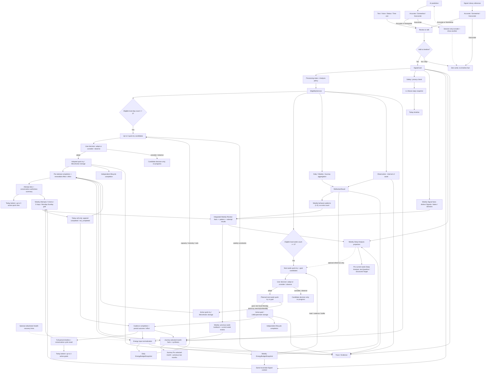

# SignalPath Active Data Flow

Last updated: 2026-07-22

Status: **canonical product and data-flow contract**. When an older document
describes an embedded Weekly experiment, Schedule/Goal as an active input, or
Observation as a user fact, this document wins.

## 1. Product Grain And Core Rules

The user-visible business grains are:

```text
SignalCard -> LifeExperiment
              |- quick_try  (user copy: 小实验)
              `- goal       (user copy: 目标)
```

Terminology migration is one-way: legacy user copy `小行动` maps to current
`小实验`; legacy medium/long-term copy `小实验` maps to current `目标`; the
parent surface remains `生活小实验`. Compatibility class and table names never
override this user-visible discriminator.

- `SignalCard` is a user-approved fact on the timeline.
- A `quick_try` is a user-adopted, immediately actionable, low-cost and
  reversible behavior that takes no more than ten minutes per attempt. It is
  observed per actual attempt through immediate effect and effort feedback,
  not as a seven-day adherence goal. Existing storage continues to use
  `MicroActionCandidate / MicroAction / micro_action_feedback`.
- A `goal` is a user-adopted medium/long-term project whose effect can only be
  observed after following a defined cadence for a defined observation period.
  Its period may exceed seven days. Existing storage continues to use
  `ExperimentCandidate / LifeExperiment / life_experiment_feedback`.
- The two storage families remain separate for compatibility and progress
  correctness, but both are presented under one Life Experiment product
  surface. `MicroAction` is not a separate user-facing product grain.
- `Observation` is an internal L2 reasoning asset. It is not a user fact, does
  not appear on the timeline as its own record, and cannot satisfy a generation
  threshold by itself.
- `EnergyBudgetSnapshot` is an internal daily/weekly sustainability read model.
  It may change candidate intensity and ordering, but it is not a fourth
  user-visible business grain and never satisfies a SignalCard gate.
- Legacy standalone `Schedule` and `Goal` objects have no reachable current
  product flow. Today `Plan` writes a structured `time_use` SignalCard instead;
  it remains at the SignalCard grain and never writes `schedule_signals` or
  reads the system Calendar. Legacy tables, migration, backup/delete,
  old-data readers, and startup notification cleanup remain compatibility-only.
- User-visible source and support language is always `Signal`, for example
  `关联 Signal` and `来源 Signal`. `evidence`, Evidence, and `TraceLink` remain
  internal qualification, generation, audit, and source-graph terms only; no
  Weekly, Journey, Pro, Life Experiment, or source-detail copy may render the
  word Evidence／证据 to the user.

### Immutable fact and editable planning boundary

- A saved `SignalCard` is an immutable user fact. No Today, Diary, Weekly,
  Journey, Pro, evidence, or source-detail surface may edit its canonical text,
  occurrence time, tags, or structured fact payload after save. An allowed
  delete/privacy-exclusion action is a separate state transition or tombstone,
  not a content edit.
- The AI-prediction/Library editor exists only before confirmation. It edits a
  proposal draft; `Save as today's signal` creates a new immutable SignalCard
  and the editor cannot be reopened for that saved record.
- Saved quick-try/goal completion facts, immediate or period outcome reviews,
  burden reviews, and lifecycle events are also
  append-only facts. A current-local-day correction appends another event and
  the last valid goal-completion event remains the effective daily projection;
  the older event is retained. Multiple real quick-try attempts on the same day
  remain separate events. Past local dates and completed periods accept no
  backfill or edit.
- A daily `completed / not_completed` event and an object's lifecycle
  completion are separate writes. Explicitly completing a quick try or goal
  transitions the formal object to `completed` without creating, changing, or
  backfilling a daily progress event. Detail screens keep all prior feedback
  and lifecycle history read-only.
- Completion and effectiveness are separate facts. A completed quick try or
  goal cannot be treated as helpful/effective without a separate explicit
  outcome review. Legacy `helpful`/`adjusted` values are compatibility aliases
  only and cannot synthesize a new structured outcome review.
- Saving a quick-try round review never completes the formal object. Lifecycle
  completion is a separate explicit write and remains available only after at
  least one real attempt or as an explicit stop-without-effect decision.
- Goal reviews carry `review_type = weekly | whole_round`. Weekly review writes
  are owned by Weekly Review and summarize one local Monday-Sunday range;
  whole-round review writes are owned by the Life Experiment surface and
  summarize the complete goal period. Neither review type completes the goal,
  and one type cannot replace or overwrite the other.
- Only quick-try/goal **planning content** that is still in the current-week or
  next-week planning window is editable. Each change creates a prospective
  plan version for not-yet-occurred work; it must not rewrite a prior-date plan
  snapshot, progress event, review, evidence, or completed-period history.

## 2. Canonical End-To-End Flow



### Timeline decision

- The default Today text field is itself the reviewable editor. Tapping its
  check control with non-empty text is the explicit save decision and creates
  one SignalCard; it does not open a second confirmation sheet. Empty text is
  zero-write.
- Submitting a direct text/voice/status/time-use record is the user's explicit
  timeline decision after the content is reviewable. The saved SignalCard is
  immutable; any review/edit control exists only before this submission. A
  time-use record carries
  a title, today's start/end time, completed/planned status, one of the same
  nine canonical Focus Domain ids used by onboarding/Me, optional end-of-block
  `energy_level` for completed entries, and note in `raw_payload_json` with
  `source_type=time_use`.
  New writes use `focus_domain_id` and transitionally mirror the same canonical
  id to `category`; the seven old category values remain read-only compatibility
  inputs and are never offered for new writes.
- Voice, status, and time-use use the same explicit completion language:
  `Save as today's signal`. Each sheet exposes `Skip for now`; skip, close,
  pull-to-dismiss, or back navigation is zero-write. Time-use retains all
  completed/planned, title, time, Focus Domain, optional completed end-energy,
  and note fields despite sharing this confirmation behavior.
- Legacy capture responses may still deserialize a structured `followup` for
  old-client compatibility, but current Today deliberately ignores it and
  renders no follow-up question card. It is not a Signal input type and cannot
  create a second write path.
- AI predictions and Signal Library references must pass the user-rating gate.
  AI prediction is not a standalone input control; it may appear automatically
  only after the user has saved a real SignalCard and the current eligible
  source set can support a proposal.
  For both sources, `Accurate` and `Somewhat` open the same editable
  confirmation sheet. Only the final `Save as today's signal` action creates
  an idempotent SignalCard. Editing changes the proposed new fact only; it does
  not rewrite the source Observation or curated Library card.
- `Inaccurate`, `Do not add`, `Skip`, or dismissing the confirmation sheet is
  zero-write; it must not create feedback or an eligible SignalCard.
- For an inaccurate AI prediction, the current page session excludes that
  candidate id and immediately requests/displays another eligible prediction.
  The exclusion set is memory-only and disappears when the page is left. It is
  not match feedback, analytics evidence, or account data. A Today page session
  performs at most three such replacement operations; after the third rejected
  replacement it shows a neutral no-new-prediction state and does not request a
  fourth replacement. The counter and exclusions reset when the page session
  ends. If eligible content is exhausted earlier, use the same neutral state
  rather than inventing one. An inaccurate Library reference remains zero-write
  without replacement.
- Prediction idempotency is scoped to `local date + sorted source SignalCard
  version`. Reconfirming the same displayed proposal stays idempotent, while a
  proposal generated after the eligible source set changes creates a distinct
  SignalCard and cannot replace an earlier confirmed prediction from the same
  day. When a session-only replacement is accepted, its exact displayed text
  and metadata replace the pending internal proposal before confirmation.

The Today read composition follows dependency order rather than putting a
derived proposal above its facts:

```text
compact daily state
  -> Signal inputs
  -> editable AI prediction decision
  -> Today timeline (confirmed facts)
  -> Today Attempts / 今日尝试 at page bottom (derived adopted quick tries and goals)
```

### Signal Library catalog contract

- Every curated card has exactly one canonical `focus_domain_id` from the same
  nine Focus Domains used by onboarding, Me, and time-use records.
- Filtering, the visible badge, and the saved SignalCard payload use that field
  directly. Title/body keyword inference is prohibited.
- English, Simplified Chinese, Traditional Chinese, and Japanese share the
  same canonical card IDs and domain mapping.
- Every domain has 2–3 common, privacy-safe references in every supported
  language; a card's content must describe only its assigned domain.

### L1 Attune decision

```text
saved SignalCard
  -> safety/privacy check
  -> ordinary content: one short L1 Attune acknowledgement
  -> no advice, invitation, or question
  -> persist versioned ai_reply snapshot on the same SignalCard
  -> Today timeline

selected SignalCard + Pro access
  -> free-form user turn + current-session context
  -> L1 Attune short dialogue
  -> default: acknowledgement / concrete reflection only
  -> explicit request for advice: at most one gentle, reversible response
  -> session-only replies
  -> pure message stream + composer; no quick actions or suggested prompts
  -> no SignalCard / Observation / candidate / ReflectionResult write
```

The timeline reply and Pro short dialogue both remain L1. Pro changes access,
context length, and quota; it does not silently grant L2/L3 authority. The
timeline snapshot only acknowledges/reflects and never advises or asks a
question. The Pro dialogue also does not proactively advise or ask; only an
explicit user request such as "what should I do?" may receive one light,
reversible response. Neither path may infer a recurring pattern, diagnose, or
create a formal quick try/goal. A future "save this dialogue" feature must pass
the normal editable Save-as-today's-signal decision.

Legacy persisted acknowledgements remain immutable audit data. Every timeline,
diary, and chat-opening projection applies the current L1 boundary; a stored
reply containing advice, an invitation, or a question falls back to a neutral
localized acknowledgement instead of being shown verbatim.

Potential immediate-harm language bypasses ordinary Attune output and enters a
separate safety response. The risk classifier is not a user fact; sensitive
content is excluded from planning/reflection according to policy.

## 3. Eligibility Contract

`EligibilityService.evaluate(signal, stage)` is the shared admission rule for
Daily, Weekly, Journey, AI Reason, AI Reflect, action planning, and experiment
planning.

A SignalCard is not eligible when it is:

- a local draft or sync failure;
- inaccurate or explicitly excluded;
- `sensitive` or `do_not_analyze` for an analysis stage;
- an unconfirmed AI prediction or Signal Library reference;
- deleted or linked to inactive evidence.

Period membership uses `occurred_at + user_timezone`, never raw `created_at`.
Counts are distinct eligible SignalCards within the resolved local period.

The following capabilities are required but never create or increment a
SignalCard merely by running: privacy/safety checks, eligibility decisions,
internal Observations, Energy Budget snapshots, the three-signal gate itself,
candidate generation/adoption state, source-change regeneration, AI reply
snapshots, and progress/read-model projections. Only the user's explicit
Save-as-today's-signal decision may add a fact to the count.

## 4. Energy Budget Contract

Energy Budget is a derived planning input, never a fact or threshold row:

```text
eligible SignalCards
+ latest explicit local-day quick status / energy level
+ user-entered structured time-use Focus Domain and optional end-of-block energy level
+ MicroAction and LifeExperiment effective feedback
+ optional allowlisted external abstract hints
  -> normalize with user-confirmed evidence first
  -> daily and weekly EnergyBudgetSnapshot
  -> Today neutral state + Pro Weekly Deep Analysis energy-state projection
  -> candidate intensity, duration, cadence, buffer, rank, and explanation
```

The daily period is the user's current local date. The weekly period is exactly
the current user-local Monday-Sunday week. Both the status page's current
energy and the time-use page's optional end-of-block energy share
`energy_level = 0 | 1 | 2` (`low | okay | full`) and remain `unknown` until the
user chooses; UI defaults must not write tired/low. The latest explicit
same-day `one_tap.energy_level` defines "current" while earlier rows remain as
weekly variation evidence. A completed time-use row may contribute contextual
variation but never overrides that latest one-tap fact. A planned row is intent:
it does not collect or write an end level, and any legacy planned energy value
is ignored rather than treated as current evidence.

`capacity_band` is `unknown | very_low | low | medium | high`. Every snapshot
also stores period, timezone, evidence ids, feedback-event ids, block list,
recommended intensity, the per-Signal derived `energy_state_key`, its matched
source/cue, source hash, policy version, confidence/readiness, and updated time.
External hints cannot raise intensity or override user-confirmed
facts, and raw Health data never enters the snapshot. A `time_use` SignalCard
may contribute its user-selected canonical Focus Domain and optional completed
end-of-block energy level, but duration or domain name alone never implies
drain or recovery. Legacy `energy_effect = draining | neutral | restoring` is
read-compatible only for the derived Weekly classification and maps to
`draining | steady | recovery`; it is not rewritten as the newer three-step
`energy_level`, because `restoring` and `full/ease` now have different meanings.
New writes omit the legacy field.
System Calendar ingestion is a future Target only and remains excluded even if
compatibility code exists.

`EnergyBudgetSnapshot` and Energy Budget remain internal type/policy names. The
The Pro Weekly Deep Analysis user-facing projection is named
`This week’s energy state` / `本周能量状态` / `本週能量狀態` /
`今週のエネルギー状態`; it is derived context, not a budget, score, fact, or
threshold. Its primary ring is an exhaustive, mutually exclusive projection
over the eligible SignalCards in the same local-week snapshot:

```text
for each eligible SignalCard:
  explicit energy_level 0 / 1 / 2
    -> orange draining / blue steady / yellow ease
  else legacy energy_effect draining / neutral / restoring
    -> orange draining / blue steady / green recovery
  else actual boundary-or-buffer cue -> purple boundary_buffer
  else actual recovery cue -> green recovery
  else draining cue -> orange draining
  else ease-or-spare-capacity cue -> yellow ease
  else -> blue steady
```

The legacy effect is read only when the new explicit field is absent. The final
fallback to `steady` is a deterministic product projection for chart coverage,
not a claim that the user explicitly confirmed a neutral state. Therefore every
eligible Signal in the snapshot belongs to exactly one primary state, the five
counts sum to the included eligible-Signal count, and there is no gray,
`unknown`, or unclassified ring segment.

The stable primary keys are `draining`, `steady`, `ease`, `recovery`, and
`boundary_buffer`. `ease` means the user already has spare capacity or feels
light; `recovery` means an actual replenishing action or recovery result. The
two must not be collapsed. When explicit fields are absent and multiple
traceable cues occur at the same evidence rank, the fixed tie-break order is
`boundary_buffer > recovery > draining > ease`; a matched rule stops further
classification. The projection stores the matched source field/cue, rule
version, and source hash so the result is reproducible.

Switching and deep focus remain independently traceable, overlapping secondary
cues. They render outside the ring as labels or relationship copy and never
become additional primary-state segments or alter the five primary counts.
`boundary_buffer` is already a mutually exclusive primary state and is not
counted again as a secondary cue. Every ring color has adjacent text, a non-color
marker, and an equivalent accessibility label. The ring may communicate actual
counts or relative structure. All five legends remain visible in the same
component and show `0` when their category is empty; the ring painter omits
zero-count arcs. VoiceOver announces each category and count. The projection
never shows a health score, completion rate,
decorative delta, or fabricated value such as `+18%`. The center uses a
traceable qualitative summary such as `more draining`, `mostly steady`, `more
ease`, `more recovery`, `more boundary and buffer`, or `mixed states`, never an
unknown/gray bucket.

Candidate groups store `energy_snapshot_id`, `energy_snapshot_hash`, and the
applied intensity. A relevant state, SignalCard, feedback, or allowed hint
change makes unadopted candidates stale and starts the standard in-place
regeneration flow. Adopted objects are not silently rewritten.

Candidate feedback learning is a separate 28-local-day window ending on the
generation local date (or the historical period end for a historical rebuild).
It never changes the local-day/local-week Signal gate. New quick-try learning
reads explicit immediate effect plus effort; new goal learning reads the
explicit period outcome plus execution effort. A positive result with
acceptable effort preserves and extends a low-demand approach; an explicit
high-effort result reduces duration, cadence, or intensity; an explicit skip
changes direction. Bare `completed` and `not_completed` remain completion facts
and imply none of those planning meanings. Legacy `helpful`, `adjusted`,
`too_hard`, and `draining` are compatibility-only inputs and must not be
presented as if the user submitted the new structured review. Regeneration
must change candidate title/reason/action when an actionable feedback meaning
changes, not only its fingerprint.

**Current status: Implemented baseline.** Daily and weekly snapshots use the
user's local date and Monday-Sunday boundaries, preserve an explicit `unknown`
state, consume eligible SignalCards and effective action/experiment feedback,
and allow only abstract Health recovery hints. The shared snapshots, focus
domains, and feedback context feed both plural candidate planners; relevant
changes invalidate and regenerate unadopted candidates. Calendar remains
excluded. Permission, cross-page refresh, and regeneration behavior still need
physical-device regression in the next test build.

## 5. Candidate And Adoption Contracts

### Life Experiment type: `quick_try` (`MicroAction` compatibility storage)

```text
local-day eligible SignalCards >= 3
  -> generate at most 3 MicroActionCandidates
  -> every candidate is immediately actionable, low-cost, reversible,
     one step, and <= 10 minutes per attempt
  -> visible decision is adopt OR consider/observe
  -> adopt: create one MicroAction per adopted candidate
  -> consider/observe: keep the candidate decision; create no formal object
  -> the short observation starts on the adoption local date
  -> each real attempt appends its own attempt event
  -> immediately ask effect: helpful / somewhat / no effect
  -> immediately ask effort: easy / okay / effortful
  -> display attempt dots + total attempts + conservative usefulness summary
```

The immediate Today branch above is separate from the **planned next-week
quick-try** branch. A MicroActionCandidate selected in Weekly inherits the
next-week period and cannot be activated or receive progress until next local
Monday; it still uses the same MicroAction-compatible storage after activation.

### Life Experiment type: `goal` (`LifeExperiment` compatibility storage)

```text
next-week selection page
  -> display the next local Monday-Sunday range
  -> current saved/active goals without a next-week child
     -> user selects which ones to continue
     -> create one idempotent child LifeExperiment per selection
     -> preserve the parent and its feedback; do not copy old feedback
  -> local-week eligible SignalCards >= 3
     -> generate a mixed next-week candidate set: planned quick tries and goals
     -> a planned quick try remains <= 10 minutes, low-cost, and reversible
     -> a goal requires a planned cadence and a medium/long observation period
     -> every goal includes its intended change, cadence, period,
        minimum observation threshold, and shrink/stop boundary
     -> visible decision is adopt OR consider/observe
     -> adopt: create one planned MicroAction or LifeExperiment per adopted candidate
     -> consider/observe: keep the candidate decision; create no formal object
  -> every selected object remains planned until the next resolved local Monday
  -> activation is idempotent and changes the object to active; no progress may be recorded before activation
  -> record completed/not_completed against planned cadence dates
  -> the full period may exceed seven days
  -> when its target-specific minimum threshold is met, the period ends,
     or the user explicitly ends it, ask period outcome + execution effort
  -> display a full-period timeline and conservative cycle result
```

Candidate pages are selection surfaces. Their only visible decisions are
`adopt` and `consider / observe`; `undecided` is the internal initial state,
not a third button. Considering preserves the generated candidate for later
review but creates no MicroAction/LifeExperiment, Today projection, or progress
window. Adoption creates the formal object and is irreversible back to
considering. Weekly links to the unified next-week attempt selection page, not
the archive home page. The next-week page never renders the current-week
feedback grid: it shows only continuable current goals and AI proposals grouped
as quick tries and goals. Continuing a current goal is available even below the
three-Signal gate; only the AI proposal branch is gated. A single confirmation
can persist both branches, and repeated confirmation must resolve to the same
decision and planned next-week objects.
Today renders only active adopted objects at the bottom under Today Attempts
(`今日尝试`), with at most three quick tries and three goals before View All; it
does not display planned or unadopted proposals.

The Life Experiment home is a unified read composition, not a state-tab query:

```text
hero
  -> top search across quick tries + goals + explicitly considering candidates
  -> quick-try immediate-result chart
       one formal quick try per node + one dot per actual attempt
       effect + effort + attempts + conservative usefulness summary
  -> goal medium/long-term timeline
       one candidate/formal goal per row + cadence + full period + cycle result
```

The quick-try chart uses clickable nodes and separate attempt dots because a
quick try is a short behavior whose value is judged immediately. The goal
chart uses clickable rows and a cadence-aware longitudinal track because a goal
is repeated practice over a medium/long period. A considering candidate may
appear in the first lifecycle layer but has no attempt/result dot or
progress-bearing cell. The home composes counts, lifecycle distribution,
outcome summaries, and recent change directly; there is no separate aggregate
`Experiment details` / archive-overview route. Every node/row may still open
its own object detail projection. Historical plan
snapshots, feedback, reviews, and lifecycle events in that detail are read-only;
the only writes are a quick try's new real-attempt/effect/effort event, a
goal's current-day cadence completion or eligible period review, an independent
object-completion confirmation, and prospective versions of current/next-week
planning content. Search expands and filters both storage families; no status
tab, status-filter branch, or separate aggregate-details branch is part of the
page contract.

The two formal-object detail projections must not collapse back into one
generic statistics template:

- A quick-try detail states the `<= 10 minutes per actual attempt` boundary and
  lists every actual attempt as an immutable event with local time/date,
  immediate effect (`helpful | somewhat | no_effect`), effort
  (`easy | okay | effortful`), and optional note. Multiple attempts on the same
  day remain separate rows. It may derive an attempt count and cautious
  effect/effort summary, and it separately displays the user's append-only
  round conclusion. It never renders a fixed daily `X/7` adherence score.
- A goal detail renders the current plan definition, cadence, complete
  medium/long-term observation window, target-specific minimum threshold, and
  immutable daily cadence facts. A daily fact answers only whether the planned
  action happened on that date. Once the threshold is met, an append-only stage
  review may snapshot outcome and burden without closing the goal. At period
  end or explicit user ending, an append-only full-round review may summarize
  the cycle; it remains a separate write from lifecycle completion and cannot
  fabricate missing daily facts. A source-week end is never a default goal end,
  and a goal may continue for weeks or longer.
- Both detail histories are read-only. A current-local-day correction or new
  quick-try attempt appends a new event. Only not-yet-occurred planning content
  in the current/next-week planning window may create a prospective version;
  no plan revision can rewrite a prior-date snapshot, attempt, daily fact,
  stage/round review, or lifecycle event.

Planning definitions and fact history have different write rules. A quick try
or goal whose planning period is still this user-local week or next user-local
week may receive a user-authored plan revision (for example its not-yet-done
behavior, cadence, or shrink/stop boundary). The revision is append-only and
prospective. It must preserve the formal object identity, origin candidate,
source evidence, prior versions, and every already-recorded day. Once the plan
falls outside those two planning windows, its content is permanently read-only.

Completion and effectiveness are distinct projections. A quick try appends one
event for every real attempt, even when multiple attempts occur on the same
local date. That event records occurrence plus explicit immediate effect
(`helpful | somewhat | no_effect`) and effort (`easy | okay | effortful`), with
an optional note. A goal keeps cadence completion by local date: the last valid
`completed | not_completed` event for the same goal and date wins while all
earlier events remain in history; a date without an effective event remains
`empty` and must not be presented as not completed.

New writes target the current user-local date/time only. Another goal choice on
the same date appends a correction event; another quick try on the same date is
a separate actual attempt, not a correction. Historical dates, prior periods,
completed periods, and Diary views expose no edit or backfill action. Today,
Weekly's current-day cell, and Life Experiment home/object detail call these
same append-only repositories rather than creating parallel feedback chains.

Historical MicroAction values `occurred`, `happened`, `yes`, and `done` are
read-only compatibility aliases for an old completion fact; `not_occurred`,
`not_happened`, `no`, `not_suitable_today`, and `skipped` are old noncompletion
aliases. Historical LifeExperiment values `tried`, `helpful`, and `adjusted`
are old completion aliases; `not_today` is an old noncompletion alias. None is
a new-write value or sufficient to synthesize the new effect/effort review.

A quick try is summarized conservatively: no outcome review is `awaiting
review`; one positive (`helpful` or `somewhat`) is `early help`; at least two
positive attempts with acceptable overall effort and effortful not forming the
majority is `worth keeping`; positive but effortful or context-dependent is
`adjust`; at least two attempted reviews with no positive result is `no help
observed yet`. Ending the round separately asks `keep | lighten and retry |
end`; the system never fills this lifecycle decision automatically.

A goal stores its own cadence, planned start/end, and minimum valid observation
days. The default minimum is three, but a target can require more, and its
period can run for weeks or longer. Reaching the threshold may append a stage
review while the goal stays active. When its period ends or the user explicitly
ends it, a separate full-round review may be appended with outcome
(`improved | somewhat | unchanged | worse | unclear`) and effort
(`easy | acceptable | too_effortful`). `unclear` or below-threshold stays `not
enough to tell`; improvement becomes `appears helpful this round`; improvement
with excessive effort becomes `helpful, needs lightening`; unchanged becomes
`no effect observed yet`; worse becomes `current approach may not fit`; only
two consecutive rounds in the same positive direction may become `more stable
across rounds`. These are cautious observations, never causal claims.

Lifecycle completion is a separate explicit confirmation available from the
Life Experiment home object or formal-object detail. It transitions the quick
try or goal to `completed` and closes future writes while preserving every
existing event. It must not insert a synthetic attempt, cadence completion,
effect/effort review, or period result; it cannot change or backfill history.
The completed object remains queryable in the Life Experiment chart and its
detail stays read-only.

### Integrated Weekly Review Read Projection

The standard Weekly report is one composite read projection for the resolved
user-local Monday-Sunday range. Before the current-week report, it may render a
separate, explicitly dated **previous-complete-week lookback** with one factual
summary and one “this week, watch for …” line. The lookback never mixes its
counts with the current week and never claims that last week caused this week.
When the prior completed week lacks sufficient source coverage, it remains a
neutral no-summary state. The current-week report must not render Signal facts,
behavior patterns, and attempt results as three independent reports competing to explain
the same input. Its internal order and ownership boundaries are:

1. `signal_facts`: distinct eligible SignalCards, distinct recording dates,
   and focus-domain distribution. Only this layer owns Signal counts.
2. `behavior_patterns[]`: one to three current Weekly interpreted
   relationships. A pattern can describe repetition, a conditional response,
   sequence, trade-off, or context difference; it may reference supporting
   Signal IDs and local dates but owns no second Signal total. Each pattern
   carries `kind`, `supporting_signal_ids`, `supporting_local_dates`, and a
   qualitative support band. When no formal pattern is available, a neutral
   summary derived from the Signal distribution is a display fallback, not a
   new count or fact. Optional structured fields are `trigger`,
   `typical_reaction`, `short_term_result`, and `long_term_impact`. A field
   renders only when its own traceable value exists; missing fields stay
   `forming`. The projection must not infer a causal field by relabeling a
   generic `name` or `summary`, and `long_term_impact` requires cross-week
   support rather than a single-week guess.
3. `attempt_results`: the Weekly Attempts projection defined below, including
   distinct participating objects, distinct feedback dates, Monday-Sunday
   cells, deterministic factual sentences, and scoped Signal/context
   associations. Its object and date metrics never enter `signal_facts`.

The three layers share the same week key and traceability but cannot add their
metrics together or satisfy one another's readiness. Internal Observations and
ReflectionResults may supply the pattern interpretation; they remain derived
assets and never increase eligibility. The integrated report itself stores no
SignalCard, progress event, Observation, or new business fact. A cached Weekly
snapshot or ReflectionResult may carry the source version/hash needed to
reproduce the projection.

Each statement has one presentation owner. Signal facts, behavior-pattern
fields, the energy-state projection, and Pro Weekly Deep Analysis may link to the
same sources, but they must not repeat the same sentence or synonymous claim.
Weekly says what happened in the local week. Deep Analysis adds only a
cross-layer relationship, its supported time position, an explicit support
band, or a next-week validation direction. It removes fabricated topic
percentages and empty label-only pattern-breakdown tiles instead of filling
them with guessed content.

Internal Weekly Energy Budget remains a sibling read model outside the
integrated report. It provides capacity/context to pattern copy, Signal/attempt
associations, and next-week candidate ranking, but it is not a fourth report
layer, does not change any of the three metric families, and cannot satisfy the
three-Signal gate. Its user-visible `This week’s energy state` projection is
reserved for Pro Weekly Deep Analysis, not the standard Weekly page.

### Weekly Deep Analysis Read Projection

The Pro Weekly Deep Analysis is a derived projection over the same resolved
user-local Monday-Sunday range. The existing text-oriented DeepWeekly response
and route are the **Implemented baseline**. The structured projection below is
the **Target** replacing its repetitive long-form presentation; it does not
claim that the current backend already returns these fields.

Its inputs are the Integrated Weekly Review, eligible SignalCards, the sibling
Weekly Energy State, Weekly Attempt Results, a versioned Weekly reflection, and
the versioned illustration catalog. It answers how those layers co-occur, where
the relationship is visible in the week, and what a next-week test could
distinguish. It must not render a second Signal-count report, a second complete
four-block pattern, a second energy ring, or the per-object Monday-Sunday cells.

The target projection contains:

```text
weekly_deep_analysis
  period_start / period_end / timezone
  signal_count / distinct_recorded_days
  headline                         # one supported relationship, max two UI lines
  relationship_nodes[]             # 3-5 context/pattern/energy/attempt nodes
  relationship_edges[]             # 2-4 co-occurrence links with date/count scope
  daily_overlay[]                  # Mon-Sun Signal count, one of five energy-state keys, any feedback
  support_band                     # forming | repeated_this_week | cross_week_supported
  load_recommendation              # reduce | maintain | cautiously_increase + source scope
  deep_observation_proposal
    why_observe / what_to_observe / how_to_distinguish
  source_signal_ids[]
  behavior_illustration_key
  analysis_scope
  signal_reminder_suggestion?      # local time/days/reason; shown after scope
  source_hash / model_version / prompt_version / catalog_version
```

Relationship lines mean `co-occurred / related` within the stated local-date or
count scope. They are not causal arrows. User-visible charts use reproducible
Signal counts, local dates, the exhaustive orange/blue/yellow/green/purple
energy projection, and effective feedback facts only. Generated `mood_score`, `friction_score`,
theme share, confidence percentage, `3/4`, or any other decorative ratio is not
an allowed chart input.

Support is relationship-specific and qualitative:

- `forming`: traceable current-week support exists, but the normalized
  relationship has not repeated across two local dates;
- `repeated_this_week`: at least two eligible SignalCards across at least two
  local dates support the same normalized relationship;
- `cross_week_supported`: the same normalized relationship has traceable
  support in at least two user-local Monday-Sunday week buckets.

Only `cross_week_supported` may publish a long-term-impact statement. The UI
labels these states `刚开始形成 / 本周重复出现 / 跨周仍出现`; no numeric model
confidence is exposed. The final information card is named
`Analysis scope / 分析范围`, not `Use gently / 温和使用`, and deterministically
states its Signal count, recorded days, supported scope, and non-causal
limitation. A separate optional Signal reminder suggestion may appear **after**
this scope card; it is never merged into the limitation copy.

The legacy `summary / root_tension / hidden_pattern / next_focus / risk_note`
fields remain readable for existing clients and stored responses. For the
target projection, `summary` may seed only the short headline, `next_focus` may
seed a deep-observation proposal, and `risk_note` is replaced by deterministic
`analysis_scope`. `root_tension` and `hidden_pattern` cannot become nodes or
edges unless their own source Signal IDs and relationship scope are present;
the UI does not expose inferred motives or a supposed hidden self.

The projection is read-only. It creates no SignalCard, Observation, feedback,
candidate, or adopted Life Experiment. A candidate planner may consume its
versioned relationship and load recommendation only as an optional reference;
the planner must remain usable without Pro access or a Deep Analysis result.
The paywall positively explains that Pro Deep Analysis becomes a reference when
next-week attempts are generated. A cached result is reusable only while its
source, model, prompt, and illustration-catalog versions match.

### Deep Observation And Signal Reminder Decisions

`deep_observation_proposal` is not a quick try, goal, notification, or user
fact. It offers one question for the next local Monday-Sunday period. It may be
accepted only explicitly:

```text
deep_observation_proposal
  -> accept
  -> create DeepObservationPlan(period, question, signal criteria, source hash)
  -> next local week collects only already-saved qualifying SignalCards
  -> after that week, generate a read-only DeepObservationResult

proposal dismissed / declined / page exited
  -> zero write
  -> no next-week result, notification, candidate, or SignalCard
```

The accepted plan never prompts the user by itself, changes candidate selection,
or creates a new Signal. Its result can only state whether the saved next-week
Signals satisfy its declared observation criteria; sparse input yields a neutral
insufficient-data result.

`signal_reminder_suggestion` is a separate optional proposal rendered after
Analysis Scope only when its time window and reason are reproducible. Accepting
it opens an editable local time/day choice and then requests notification
permission if needed. Confirmation writes a local `SignalReminderRule` with its
timezone, days, enabled state, source analysis version, and next trigger;
decline/dismiss writes nothing. Notifications open Today input and never create
a SignalCard, feedback, candidate, or eligibility count. The user can disable
or edit the rule; timezone changes must reschedule it.

Deep Analysis has no standalone source-Signal section. A relationship node or
its explicit local-date scope may open the Diary Timeline at that date; the
underlying `source_signal_ids` remain traceability data rather than a duplicate
Pro fact browser.

### Weekly Illustration Selection Projection

The repository currently exposes 24 behavior-pattern keys and 30
review-pattern keys, plus 9 focus-area keys; it is not one undifferentiated
30-image behavior database. Review keys describe completion, difficulty,
interruption, or next-week adjustment and cannot be substituted for a behavior
pattern merely because an asset exists.

AI and stored projections exchange a stable catalog key, never an asset path.
The primary Weekly behavior illustration is selected from a traceable behavior
pattern by distinct supporting local dates, then supporting Signal count, then
stable key order. The same `behavior_illustration_key` is reused in the Weekly
behavior-pattern block and the Deep Analysis relationship map for that source
hash. A source-hash change invalidates the selection. Raw user-copy fuzzy
matching is not an authoritative selector. When no valid behavior key exists,
the catalog's neutral `pattern_forming` key is used without inventing a
behavior.

Review illustrations remain scoped to attempt-result/feedback meaning. Both
catalog families are versioned display projections: they do not alter
eligibility, counts, or any user fact.

### Weekly Attempt-Results Layer And Today-Cell Write

The attempt-results layer (formerly the standalone Weekly Attempts／`本周尝试`
card) is a current-user-local Monday-Sunday summary inside the integrated Weekly
report, not a second copy of Today's item cards. Its read set contains each
adopted quick try or goal whose formal active window intersects the current
local week. An object is counted once; a next-week goal that has not started is
excluded.

The projection computes:

- `participating_item_count`: distinct formal objects in the read set;
- `recorded_day_count`: distinct local dates in this week with at least one
  effective progress event across the read set; multiple objects on one date
  still contribute one recorded day;
- one row per object and seven Monday-Sunday cells. Each in-window cell resolves
  the last valid event to `completed | not_completed | empty`; an out-of-window
  cell is `unavailable`, not `not_completed`;
- one or two deterministic factual sentences derived from the object set,
  distinct recorded dates, and normalized cell states. They may state counts or
  repeated facts, but never a rate, score, failure, discipline judgment, or
  generated causal claim;
- at most two Signal/context associations built from eligible SignalCards,
  Energy Budget context, and effective progress on matching local dates. Each
  association includes an explicit date/count scope and uses correlation copy
  such as “同时出现／相关”. Sparse input produces a neutral `还在形成` state
  instead of fabricated interpretation.

The seven cells are a Monday-Sunday Weekly completion display only; Weekly does
not render the quick try's full attempt/effect history, the goal's full
cross-week period, a per-row detail arrow, or a separate Today-style action
strip. Today and the Life Experiment surface own the current feedback entry and
complete object summaries/details.

Only the cell for the current local date is interactive, and only when that
date is inside the object's active window. Tapping it calls the existing source
repository for that object type and appends `completed` or `not_completed`.
Tapping it again appends another event; the last valid same-day event becomes
the cell projection. Past, future, and unavailable cells are read-only and
open no editor. Weekly owns no separate progress table and cannot update or
delete an existing event.

All user-visible labels use `Signal`, `关联 Signal`, or `来源 Signal`. Internal
eligibility, `TraceLink`, source hashes, and evidence graphs remain unchanged
and must never leak the Evidence／证据 term into Weekly copy.

### Diary Timeline Read Projection

The Diary Timeline is a notebook-style, local-date read projection, not another
write path. The implemented baseline provides previous day/next day, Today,
and a month sheet with content markers, and never reads the system Calendar.
It reads an unbounded lightweight set of local content-date keys, while full
SignalCard and adopted-plan payloads are queried only for the selected date.
It therefore does not depend on a recent-history row cap. For that date the
projection merges:

1. SignalCards whose canonical `local_date` is that date;
2. adopted quick tries (`MicroAction` rows) whose active observation interval
   contains that date;
3. adopted goals (`LifeExperiment` rows) whose formal active window contains
   that date.

Each adopted object appears at most once for the selected day, even when no
feedback was recorded that day. A quick-try card summarizes only attempts that
actually occurred by that date; a goal card uses the last valid same-day cadence
completion and only period results available by that date. Later feedback can
never leak into a historical view. Legacy values are normalized only while
reading historical events and cannot synthesize new outcome reviews.
This projection never creates a SignalCard, never increases eligibility counts,
excludes unadopted candidates and legacy Schedule/Goal rows, and does not expose
SignalCard-only AI chat on formal MicroAction/LifeExperiment rows.

The notebook offers read-only `all | signals | quick tries | goals` filters.
Filters do not alter evidence or progress. Empty dates use neutral copy and do
not imply failure or insufficient data. Progress shown on a historical date is
calculated only through that date; later feedback must never leak backward.
The notebook never opens an editor for a saved SignalCard, plan snapshot,
progress event, or review. Current/next-week plan revision, when available,
belongs to the planning surface and still cannot change the Diary's historical
projection.

## 6. Storage Responsibilities

| Layer | Responsibility |
| --- | --- |
| `captures` | Raw input, audit, migration, and old-client compatibility only. |
| `signal_cards` | Canonical user-approved, immutable timeline facts; delete/exclusion state is separate from fact content. |
| `signal_processing_state` | Draft, sync, processing, and inclusion state. |
| `signal_analysis_policy` | Privacy, confirmation, inaccurate, and exclusion policy. |
| SignalCard `ai_reply` snapshot | Versioned L1 Attune timeline acknowledgement attached to its source fact; never a new fact/evidence row. |
| `daily_snapshots`, `weekly_snapshots`, `journey_snapshots` | Period aggregation/cache; not AI source-of-truth text. |
| `EnergyBudgetSnapshot` derived local read model | Reproducible daily/weekly capacity, blocks, evidence coverage, recommended intensity, and source hash. Its Weekly projection also retains exactly one `energy_state_key` plus the matched source/cue and rule version per eligible Signal (`draining / steady / ease / recovery / boundary_buffer`). It is computed locally in the implemented baseline; a dedicated persisted table is not required by the current flow. |
| `reflection_results` | Versioned AI output for L1/L3 reflections. |
| `observations` | Internal, derived L2 reasoning with evidence links. |
| `candidate_groups` | Shared period/source-hash/generation state for action and experiment proposal groups. |
| `micro_action_candidates` | Ranked daily proposals plus explicit `undecided / considering / adopted` decision state before or at adoption. Considering rows remain candidates and own no progress. |
| `micro_actions` | Formal user-adopted quick experiments (current user copy: `小实验`; each actual try is <= 10 minutes), plus the current projection of append-only current/next-week planning versions and an explicit lifecycle status. The ten-minute ceiling is a persisted and repository-validated invariant, not copy only. Completing the object is independent from attempt/outcome feedback. |
| `micro_action_feedback` | Immutable, append-only per-attempt completion, immediate effect, effort, and optional-note events. Multiple real attempts may share one local date. |
| `experiment_candidates` | Generated weekly proposals plus explicit `undecided / considering / adopted` decision state before or at adoption. Considering rows remain candidates and own no progress. |
| `life_experiments` | Formal user-adopted medium/long-term goals plus cadence, planned period, target-specific minimum observation threshold, current prospective planning projection, and lifecycle status. Completing the object is independent from daily completion and period outcome. |
| `deep_observation_plans` / `deep_observation_results` | **Target.** Explicitly accepted next-week observation question and its read-only, post-week result. Declined proposals create neither row. |
| `signal_reminder_rules` | **Target.** User-confirmed local notification rules derived from a Deep Analysis suggestion; notifications open Today and never write a Signal. |
| `life_experiment_lifecycle_events`, `life_experiment_feedback` | Immutable, append-only goal cadence completion, typed `weekly` / `whole_round` outcome-and-effort reviews, note, and lifecycle history. Weekly writes `weekly`; Life Experiment writes `whole_round`. |
| `life_experiment_rollups` | Current status, lineage, cadence progress, minimum-threshold readiness, period outcome, and cautious result summary. |
| Unified Life Experiment read projection | Composes considering candidates and formal objects without merging identities: quick tries become an immediate-result scatter/branch chart; goals become a cadence-aware medium/long-term timeline. Top search spans both kinds, home includes aggregate counts/outcomes directly, every node/row links to an individual detail, and no status-tab or separate aggregate-details query creates a new fact. |
| Integrated Weekly Review read projection | Composes an explicitly dated previous-complete-week lookback, `signal_facts`, one to three non-counting structured behavior patterns, and Weekly Attempts for the current local Monday-Sunday range. Metric families stay separate; internal Weekly Energy Budget is a sibling context model shown only in Pro Deep Analysis. |
| Weekly Attempts read projection | Date-bounded join of adopted quick tries/goals, effective feedback, eligible same-date SignalCards, and Weekly Energy Budget context. It calculates `N items / D days`, seven-day cells, factual copy, and Signal associations without storing a new fact. |
| `trace_links` | Evidence/source graph. |
| `pipeline_runs` | Generation, retry, input hash, and version state. |

Candidate metadata for both candidate types:

```text
candidate_group_id
rank
origin_candidate_id (on adopted object)
source_period_start / source_period_end / timezone
linked_signal_ids
energy_snapshot_id / energy_snapshot_hash / recommended_intensity
status = generated | adopted | dismissed | stale
decision_status = undecided | considering | adopted
```

`decision_status` is the user-decision axis. `undecided` is internal and has no
visible button; the two user-visible choices are Adopt and Consider/Observe.
Candidate generation/invalidation `status` remains a separate compatibility
axis. Legacy `dismissed` may be read for migration but is not restored as a
third decision button. Considering creates no formal object and adoption cannot
be downgraded to considering.

For a candidate adopted from the unified next-week page, its resulting formal
object also stores `plan_status = planned | active`, `planned_week_start`, and
`activation_timezone`. It is `planned` until the resolved next local Monday,
then transitions idempotently to `active`; only active objects can appear in
Today or accept progress events.

All user-facing candidate/formal-object models expose
`life_experiment_kind = quick_try | goal`. During compatibility migration this
field is derived from the source repository when absent: MicroAction storage is
`quick_try`, LifeExperiment storage is `goal`. The discriminator controls copy,
section placement, generation constraints, and feedback prompts; it does not
allow progress from one source family to satisfy the other.

Group generation state is `gated | stale | regenerating | ready | failed`.
Only `ready` candidates may be displayed or adopted.

### Life Experiment chart paging and search

The shared Life Experiment page has two independent formal-object cursors.
Adopted `MicroAction` rows (`quick_try`) and adopted `LifeExperiment` rows
(`goal`) are read in separate 20-row pages, appended by stable id, and never
replace rows already visible in the other chart. Considering candidates are
read separately by `decision_status` and joined only into each chart's
considering layer; they are never reclassified as formal objects. Top search
expands the remaining quick-try and goal pages before filtering both object
families and their considering candidates, so an older item cannot disappear
merely because it is beyond the first page. There is no status-tab or
status-filter query.

For each loaded goal page, the read projection fetches only that page's valid
feedback, typed review/lifecycle events, plan versions, and rollup rows. Source
resolution unions the
page's `linked_signal_card_ids`, queries `signal_cards.id` and
`signal_cards.signal_card_id` in bounded parameter chunks, then maps the exact
rows back to each goal. It never scans an arbitrary recent 2,000-Signal window,
and loading sources does not create a SignalCard or alter eligibility. Source
Signal, current and historical plan versions, immutable fact history, and the
latest review are base access; only full cross-round review history requires
Pro entitlement.

## 7. Observation Boundary

Observation may:

- summarize or hypothesize over eligible SignalCards;
- provide derived context to reflection and candidate generation;
- carry confidence, model/prompt version, and trace links;
- be confirmed, adjusted, dismissed, stale, or superseded.

Observation may not:

- create a timeline record without a separate user decision;
- increment the three-SignalCard gate;
- be treated as independent evidence when its source SignalCards are ineligible;
- directly set `included_in_weekly` or `included_in_journey` on a user fact.

If all source links become inactive, the Observation and dependent outputs are
stale and excluded from new reflections.

## 8. Focus, Pro, And Purchase Control Planes

### Focus domains

- **Implemented locally:** onboarding selection can round-trip to Me.
- **Target:** remotely persist the complete ordered `focus_domain_ids` array so
  reinstall and multi-device restore do not collapse it to one legacy field.
- Focus domains influence prioritization, never eligibility or fact truth.

### Me control-plane projection

Me is a control-plane read/write projection, not an analysis stage. Loading or
changing Me state never creates a SignalCard, feedback event, Observation,
candidate, experiment/goal fact, or reflection result.

```text
user-authored profile -> local profile preferences -> Me header/profile editor
onboarding or Me focus edit -> one canonical ordered focus-domain list
  -> onboarding/Me round-trip + time-use taxonomy + AI/candidate prioritization
  -> never eligibility/readiness/fact truth
verified StoreKit transaction -> local Pro entitlement -> UI gates immediately
  -> asynchronous server reconciliation
server usage ledger -> Me Pro/usage summary
accepted reminder rule -> local reminder store -> OS notifications only
Health read consent -> sanitized local energy/recovery hint
  -> energy/candidate context only -> never automatic SignalCard
delete request -> remote account deletion when an account exists -> local purge
  -> StoreKit subscription and purchase history remain Apple-managed
```

The user-visible ownership boundary is explicit:

| Data | Source of truth | Cross-device contract |
| --- | --- | --- |
| Avatar | Local file | No. |
| Display name, life direction, focus domains | Local first | Only after an explicit account and successful backup; never implied beforehand. |
| Pro entitlement | Verified StoreKit transaction | Restorable only in the matching Apple/StoreKit environment. |
| Usage | Server ledger | Read-only in Me; a network error preserves the last known value rather than inventing zero. |
| Health abstract hint | Local sanitized preference | No; raw Health data is neither displayed nor uploaded. |
| Signal reminder rules | Local preference + OS scheduler | No; they are not reflection data. |
| Language | Operating-system locale | Follows the device. |

The Me primary-page order is profile, focus domains, consolidated Pro/usage,
reminders and optional Health hints, data/privacy, then help/about. Weekly,
Journey, energy status, behavior patterns, and experiment progress stay in
their owning read models. AI response-style switching is not part of the
current user-visible contract. Structured Self Review, if retained, is reached
through Pro benefits rather than becoming a second reflection surface on Me.

### Journey monthly projection

Journey is a read-only, selected-month projection. Its source pool is all
non-deleted, policy-allowed app data from first use through the selected
month's end. The selected month limits the factual output and readiness window,
not the earlier history available for continuity context; later data never
leaks backward into an earlier month's projection. Journey does not own a new fact grain
and does not write SignalCards, attempts, goal completion, reviews, candidates,
or planning versions.

```text
all app history
  -> policy/privacy/eligibility projection by typed source
  -> selected user-local calendar month factual window
  -> eligible SignalCards and local-date/domain facts
  -> quick-experiment actual attempts + round reviews
  -> goal daily cadence facts + weekly reviews + whole-round reviews
  -> finalized Weekly reviews, internal Observations, lifecycle events,
     and plan versions as synthesis context only
  -> typed JourneyMonthFacts
  -> 7 Signal / 3 local-date readiness
       |- below gate: Signal-only factual path, month grid,
                      experiment/goal trajectory, real state rhythm,
                      exact threshold notice
       `- ready: JourneyMonthlySynthesis themes, change states, month lookback
  -> read-only path / Diary-date / Life-Experiment-detail drilldown
```

The typed source event projection must preserve the grain of each event:

| Event kind | Required identity and payload | Journey use |
| --- | --- | --- |
| `signal` | SignalCard id, occurred-at, local date, domain, eligible/privacy state, five-state energy projection | Readiness, fact metrics, calendar, path and theme support. |
| `quick_try_attempt` | object id, event id, occurred-at, effect, effort, optional note | Small-experiment trajectory and immediate feedback marker; same-day attempts remain separate. |
| `quick_try_round_review` | object id, review id, covered period, explicit round conclusion | Small-experiment trajectory summary; it does not enter the Signal-only monthly path. |
| `goal_daily_fact` | goal id, event id, local date, effective completed/not-completed state | Goal cadence support; same-day last valid event is effective while corrections remain in history. |
| `goal_weekly_review` | goal id, review id, Monday-Sunday range, outcome and burden | Goal medium/long-term stage summary. |
| `goal_whole_round_review` | goal id, review id, full observation range, outcome and burden | Goal whole-cycle summary. |
| `weekly_review` | review id, week range, behavior-pattern key and source links | Synthesis context only; it is not a monthly-path node and never increments Signal readiness. |

`JourneyMonthFacts` contains only verifiable facts: selected month bounds,
eligible Signal count, record-date count, domain distribution, local-date grid,
Signal-only path nodes, distinct adopted quick-experiment/goal counts,
quick-experiment/goal trajectories, and state/rhythm points. Counts must come
from formal ids and typed events; an
AI-summary array, fallback row, Observation, feedback text, or generated card
cannot be reverse-counted as a fact.

`JourneyMonthlySynthesis` is a separate versioned output, available only after
7 distinct eligible SignalCards across at least 3 user-local dates in the
selected natural month. It may contain 1-3 cross-week themes, each marked
`new | continuing | changing`, plus a bounded month lookback. A `continuing`
or `changing` claim requires support from at least two Monday-Sunday buckets.
Every claim stores source ids and dates; it may express association or sequence,
never causality. Internal Observations may help rank a theme but do not render
as their own user-visible node or state.

The state/rhythm projection uses only explicit status input and the exhaustive
five-state energy projection (`draining | steady | ease | recovery |
boundary_buffer`), overlaid with eligible Signal counts and existing
quick-experiment feedback markers. It never fabricates mood/focus/social series from a
cluster label, inserts an interpolated line through missing dates, or draws a
decorative curve when no source exists. New eligible Signals must resolve to
one of the five states; an unreconstructable legacy gap remains visibly absent
rather than becoming an `unknown` gray category.

Month selection belongs to the ViewModel/repository contract, not widget-only
filter state. All Journey sections read the same `(periodStart,
periodEnd)` through `MemoryRepository.fetchMemorySummaryResult(month:)`, which
delegates to `LocalJourneyAggregationRepository.fetchMonth(selectedMonth:)`. A month node opens the canonical Diary
projection at `/today/diary?date=YYYY-MM-DD`; Journey must not route to or
reimplement the legacy `/memory/journal` page. A quick-try/goal milestone may
instead open that object's read-only detail. Journey never exposes a history
edit, backfill, feedback, completion, adoption, or candidate action.

The monthly snapshot/cache key is:

```text
(user, period_type=calendar_month, period_start, period_end,
 locale, projection_version, model_prompt_version, period_source_hash,
 history_context_hash)
```

`period_source_hash` includes eligible Signal ids/versions, Weekly review ids/versions,
quick-try attempt and round-review ids, goal daily/weekly/whole-round review ids,
lifecycle ids, and the plan-version ids effective for the selected month.
`history_context_hash` covers the same policy-allowed source families from first
use through the selected month's end. Historical facts remain stable; a changed
earlier source may version later synthesis because it changes continuity
context, while data after the selected month cannot invalidate that report.

**Current status: Implemented baseline; real-device QA pending.** The repository
re-fetches any selected local calendar month, keeps selected-month eligibility,
readiness and factual counts limited to that month's eligible SignalCards, and
returns the factual path plus typed experiment/goal tracks below the `7/3`
gate without generating or caching synthesis. Quick-experiment attempts and
round reviews, effective last-per-goal/date cadence facts, and goal weekly and
whole-round reviews retain distinct identities in period facts, traces and the
source hash. Synthesis context and cache invalidation include policy-allowed
Signal, feedback/review, finalized Weekly, internal Observation and bounded
legacy rollup data from first use through the selected period end; none of
those non-Signal sources increments readiness, and later facts do not leak
backward. The baseline composes period and history-context inputs into the
existing snapshot source hash rather than relying on a widget-only filter.
TestFlight must still verify month switching, empty months, local midnight,
same-day multiple attempts/corrections, canonical Diary drilldown and
accessibility.

### Journey Pro three-month change

- Free Journey's selected-month Signal path, local-date grid,
  quick-experiment/goal trajectory and real state/rhythm projection remain
  available before synthesis readiness. Monthly synthesis requires 7 distinct
  eligible SignalCards across at least 3 local dates in that selected month.
- Pro uses the selected natural month and its two preceding natural months. It
  never constructs a rolling-day window and never compares arbitrary two-week
  buckets.
- Each of the three month buckets reuses `JourneyMonthFacts` and its own `7/3`
  readiness. Cross-month interpretation is ready only when at least two of the
  three months individually meet `7/3`; otherwise Pro shows the three factual
  buckets and an exact missing-month/readiness state.
- Entitlement and month readiness are independent. Feedback, reviews,
  Observations, candidates, plan versions and generated text may shape the
  synthesis but never increase a month's eligible Signal count.
- The implemented `JourneyProReportModel` contains monthly Signal counts,
  record dates, domain mix, five-state energy composition and a short
  conservative latest-month change summary. Its source version also reads
  policy-allowed feedback, reviews, experiment/goal context and internal
  Observations through the selected month end, without exposing them as a
  duplicate Pro section or increasing readiness.
- Quick-experiment and goal trajectories remain in free Journey and are not
  duplicated in Pro. Pro has no analysis-scope section, source-Signal list,
  date drilldown or AI-chat section.
- Generic monthly Journey snapshots remain because they are reused by both
  selected-month and three-month projections; there is no separate Pro window
  table or parallel report source.

### Purchase

Purchase is an independent control plane:

```text
launch / foreground / Pro-surface entry
  -> silently read verified Transaction.currentEntitlements
  -> matching verified Pro immediately updates local cache and feature gates

target lifecycle
  -> native Transaction.updates listener recomputes entitlement
  -> asynchronous signed-JWS server reconciliation / retry

explicit user Restore tap
  -> AppStore.sync()
  -> read verified currentEntitlements again
  -> matching verified Pro immediately updates local cache and gates
  -> no match / sync failure produces an environment-aware result
```

It must not write SignalCards, eligibility, progress, or reflection evidence.
Manual Restore must evaluate verified current entitlements even when local Pro
is already active; it must not short-circuit on the cache. Only a successful
StoreKit query that explicitly reports no matching entitlement, or a verified
refund/revocation state, may revoke the cache. Network/sync/unverified/timeout
failures preserve locally verified Pro. `AppStore.sync()` is explicit-user-only
because it may require App Store authentication; normal lifecycle refreshes are
silent.

The target server verifies signed StoreKit 2 transaction JWS or uses the App
Store Server API, and consumes App Store Server Notifications V2 idempotently.
Legacy backend verification receives a refreshed App Receipt during migration;
a StoreKit 2 JWS must never be disguised as receipt data. `verifyReceipt` is a
compatibility path, not the target source of truth.

The manual controller and silent launch/foreground current-entitlement refresh
are implemented. The native `Transaction.updates` lifecycle and the modern
server path remain Target. Restore Purchase also remains an open Platform
QA/release gate. QA must separately exercise TestFlight Sandbox and App Store
Production: a production subscription is not expected to appear in a
TestFlight sandbox build.

## 9. Implementation Status And Gaps

| Contract | Status on 2026-07-22 |
| --- | --- |
| SignalCard as primary fact; processing/policy split; shared eligibility | Implemented baseline. Compatibility mirrors remain. |
| Observation persisted with trace links | **Implemented baseline; device QA pending.** Observation remains internal and cannot reach the timeline or eligibility count without the separate editable SignalCard confirmation. |
| Today reply and Pro short dialogue as L1 Attune | **Implemented baseline; device QA pending.** Timeline replies use one sentence with no advice/question; Pro gives one light response only after an explicit request for a way forward. |
| AI prediction/Library editable add-to-timeline gate | **Implemented baseline; device QA pending.** Both use the same pre-save editor and zero-write exits; saved SignalCards are never editable. AI Inaccurate replaces the current proposal at most three times per page session without persisting feedback. |
| Three eligible signals per local day -> up to three quick-try candidates | **Implemented baseline; device QA pending.** Storage remains MicroAction-compatible while the user surface is Life Experiment / quick try. |
| Two-choice candidate decision | **Implemented baseline; device QA pending.** Today and Weekly expose only Adopt and Consider/Observe. `undecided` is internal, considering candidates create no formal object or progress, and adoption cannot be downgraded. |
| Three eligible signals per local week -> planned next-week quick-try + goal candidates | **Target.** Replace the goal-only candidate surface with a unified next-week selection page. Both types remain `planned` until the following local Monday; existing goal continuation remains available below the gate. |
| Multi-select adoption and candidate grouping/rank | **Implemented baseline.** Adoption is 0..n and idempotent by origin candidate. |
| Small-experiment immediate outcome and flexible goal-period projections | **Implemented baseline; device QA pending.** Small experiments use real-attempt effect/effort events and a database-enforced 1–10 minute duration; goals use target-defined cadence and medium/long periods (default minimum three valid observation days, but configurable). Saving a round review never completes either object, goal weekly and whole-round reviews are different event types, and legacy aliases remain compatibility-only. |
| Integrated Weekly Review report | **Partial baseline; redesigned Target.** Add an explicitly dated previous-week lookback and replace the single repeated-pattern structure with 1–3 traceable behavior patterns; retain the same Signal-facts -> behavior-patterns -> attempt-results order without duplicate counts. Internal Energy Budget is no longer a Weekly main-page card. |
| Pro Weekly Deep Analysis | **Text-oriented implemented baseline; structured redesign is Target.** The target projection replaces repeated prose, duplicate facts, decorative `3/4`/percentages, and per-object cells with a core relationship map, Pro-only energy-state overlay and load recommendation, accepted deep-observation result chain, deterministic Analysis Scope, post-scope Signal reminder suggestion, and stable behavior-illustration key. It has no independent source-Signal section; relation nodes/dates may drill into Diary. |
| Weekly behavior/review illustration catalog | **Assets and legacy text-hint resolver implemented; stable keyed projection is Target.** The active inventory distinguishes 24 behavior-pattern keys from 30 review-pattern keys and 9 focus keys. Authoritative source-ranked key selection, shared Weekly/Deep use, catalog versioning, and neutral fallback still require implementation and device QA. |
| Weekly Attempts summary and grid write-through | **Implemented; device QA pending.** Weekly uses `N items / D days`, Monday-Sunday cells, 1-2 factual sentences, and scoped Signal/context associations. Only today's in-window cell appends through the existing feedback repository; past/future cells are read-only. |
| Diary Timeline notebook projection | **Implemented baseline; device QA pending.** Selected-day merge, previous/next/Today, marked month sheet, read filters, and notebook UI are active. A lightweight all-date index plus date-scoped detail queries keeps the full local history reachable without loading every row. |
| Weekly Signal drill-down and navigation history | **Implemented baseline; device QA pending.** Weekly pushes the Diary Timeline at the latest in-week local date containing a Signal (or a non-future fallback date), then the existing seven-day/date controls provide read-only browsing. Secondary routes preserve their caller in the navigation stack; Back pops to that actual caller, with a module-safe fallback only for direct/deep-link entry. This projection neither copies SignalCards nor changes Weekly eligibility/counts. |
| Today projection | **Implemented baseline; device QA pending.** The order is compact state -> inputs -> AI prediction -> Today Timeline -> page-bottom Today Attempts (`今日尝试`), with 3+3 and overflow. |
| Unified Life Experiment home | **Implemented baseline; device QA pending.** There are no lifecycle status tabs or separate aggregate-details/archive-overview route. Top search spans both kinds; the home directly summarizes small-experiment real-attempt dots/outcomes and goal cadence timelines/cycle results. Considering candidates, active formal objects, and completed formal objects remain distinct, while individual object histories stay read-only. Source Signal, plan versions, fact history and the latest summary are base access; only full cross-round summary history is Pro. |
| Independent object completion | **Implemented baseline; revised feedback separation pending device QA.** A home-object/detail completion confirmation moves the formal quick try or goal to `completed` without writing or changing any attempt, cadence completion, outcome, or effort event. |
| Immutable facts and versioned plan edits | **Implemented baseline; device QA pending.** SignalCards and saved progress/review/lifecycle events are read-only. Only current-week/next-week planning content may create a prospective version; prior dates and periods never change. SQLite v36 stores append-only plan-content versions, and date-scoped Today/Diary reads resolve the version effective on that date. Appending the version and updating the latest projection commit in one SQLite transaction. |
| Time-use confirmation parity | **Implemented baseline; device QA pending.** All structured fields remain, with Skip for now and Save as today's signal semantics shared with voice/status. |
| Immediate source refresh | **Implemented baseline.** Unadopted groups transition stale -> regenerating -> ready and replace in place after a short debounce. |
| Energy Budget monitoring and Pro energy-state display | **Implemented baseline; five-state exhaustive ring, seven-day overlay, load recommendation, and revised legend are Target pending implementation and device QA.** Daily/weekly snapshots use local date boundaries, explicit state and effective feedback; Health abstractions, focus and feedback enter both plural planners, while Calendar does not. User copy says “This week’s energy state” only in Pro Deep Analysis. Every eligible Signal projects to exactly one of orange `draining`, blue `steady`, yellow `ease`, green `recovery`, or purple `boundary_buffer`; switching/deep-focus remain overlapping descriptors outside the ring, while unknown/gray segments and unreproducible decorative values are forbidden. |
| Deep observation proposal and result | **Target.** Only an explicit acceptance creates a next-week observation plan and later a read-only result; decline/dismiss is zero-write. |
| Signal reminder suggestion and rule | **Target.** Render after Analysis Scope only when grounded; acceptance requires editable scheduling and notification permission, while notifications merely open Today input. |
| Focus multi-select local round-trip | Implemented locally. |
| Focus multi-select remote sync | **Gap / Target.** Add remote array contract and migration. |
| Journey selected-month projection | **Implemented baseline; device QA pending.** Historical month fetch, selected-month eligible-Signal readiness/facts, exhaustive real five-state rhythm, quick-experiment attempts/round reviews, effective goal daily facts, typed goal weekly/whole-round reviews, and full-history-through-period synthesis/hash context are wired. Below the gate, factual period data remains available and synthesis is not generated or cached. TestFlight still needs to verify historical switching, empty months, date drilldown, local-midnight boundaries, same-day corrections and accessibility; the legacy `/memory/journal` is not a valid route. |
| Journey Pro three-month change | **Implemented baseline; device QA pending.** `/memory/pro-l3` reads the selected month plus two preceding natural months, keeps factual charts visible below readiness, and shows conservative change only after at least two months individually meet `7/3`. The page contains no duplicated experiment/goal section, analysis/data-range copy, raw source list, date drilldown or AI follow-up. |
| Legacy Schedule/Goal active-flow removal | **Implemented.** Standalone UI/routes and production writers/summaries remain removed. Today Plan creates a current `time_use` SignalCard, not a legacy Schedule row. |
| Restore purchase | **Manual and silent-refresh baseline implemented; Platform QA open.** Verified StoreKit entitlement unlocks immediately, the verified environment is persisted, cross/unknown-environment empty results preserve local Pro for reconciliation, and `AppStore.sync()` is explicit-only. Native transaction updates, modern signed-JWS/server notifications, and separate Sandbox/Production QA remain. |

## 10. Compatibility Boundary

- Keep `/api/v1/captures`, raw `captures`, snapshot AI mirror fields, SignalCard
  mirror fields, old `_life_experiment` reads, and backup/account endpoints only
  behind documented compatibility and telemetry gates.
- Do not generate new embedded Weekly experiments. Old
  `opportunitySnapshot['_life_experiment']` data is migration input only.
- Schedule/Goal tables, migration, backup/delete, old-data readers, and startup
  notification cleanup may remain for compatibility. Production writers and
  summaries are removed; these legacy objects must not re-enter current
  planning, thresholds, AI, Weekly, or Journey. Current user-entered plans are
  `time_use` SignalCards and follow normal SignalCard eligibility and deletion.
- Physical deletion requires an observation window with fallback counters at
  zero, realistic legacy-data QA, a reversible migration, and rollback plan.

## 11. Invalidation And Trace Rules

```text
SignalCard deletion / privacy-policy / eligibility-state change
  -> reevaluate eligibility
  -> rebuild affected daily/weekly EnergyBudgetSnapshot
  -> dirty affected local-day/local-week/Journey snapshots
  -> stale dependent reflections and observations
  -> immediately invalidate unadopted candidate group
  -> inline regenerating state + short debounce + in-place ready replacement
  -> inactivate invalid trace links
```

```text
Quick-try attempt/round review or goal daily/weekly/whole-round review change
  -> rebuild that object's local-date rollup
  -> rebuild affected EnergyBudgetSnapshot
  -> rebuild overlapping candidate context from the trailing 28-local-day feedback window
  -> apply only explicit helpful / difficulty / skip meaning to candidate content
  -> dirty every overlapping selected-month Journey snapshot
  -> dirty every three-month Pro projection whose month range includes the event
  -> version later month synthesis whose history_context_hash includes the event
  -> keep event types distinct; never date-dedupe an attempt against a review
  -> stale candidate groups whose energy snapshot hash changed
  -> stale dependent reflections
```

A finalized Weekly review or behavior-pattern version change dirties its
overlapping selected-month Journey synthesis and every affected three-month Pro
projection; it never becomes a node in the Signal-only monthly path.
A prospective quick-try/goal plan version only affects events on or after its
effective date; a historical Journey month continues resolving the version
that was effective for each source event. Source deletion or privacy exclusion
inactivates affected TraceLinks and removes the source from future synthesis,
but never rewrites an immutable Signal, attempt, completion fact, or review.

Adopted user objects are never overwritten by regeneration. A stale source sets
`source_changed` on the adopted object/evidence relationship and excludes that
source from new AI claims; regeneration creates/supersedes proposals rather
than mutating an adopted MicroAction or LifeExperiment. A user-authored
current-week/next-week plan revision is a separate, append-only prospective
operation and cannot rewrite facts or historical plan versions.
