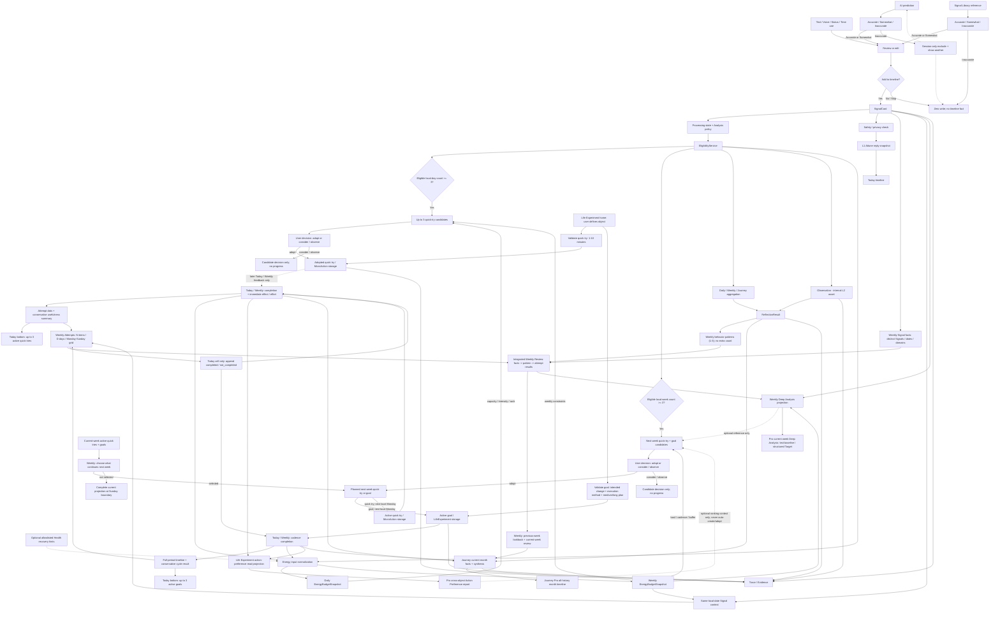

# SignalPath Active Data Flow

Last updated: 2026-07-29

Status: **canonical product and data-flow contract**. When an older document
describes an embedded Weekly experiment, Schedule/Goal as an active input, or
Observation as a user fact, this document wins.

## 1. Product Grain And Core Rules

The user-visible business grains are:

```text
SignalCard -> LifeExperiment
              |- quick_try  (user copy: 小实验)
              `- goal       (user copy: 目标)
```

Terminology migration is one-way: legacy user copy `小行动` maps to current
`小实验`; legacy medium/long-term copy `小实验` maps to current `目标`; the
parent surface remains `生活小实验`. Compatibility class and table names never
override this user-visible discriminator.

- `SignalCard` is a user-approved fact on the timeline.
- A `quick_try` is either adopted from an AI proposal or defined by the user.
  It is an immediately actionable, low-cost and reversible behavior with a
  persisted duration of 1-10 minutes per attempt. It is observed per actual
  completed attempt through immediate effect and effort feedback, not as a
  seven-day adherence goal. Existing storage continues to use
  `MicroActionCandidate / MicroAction / micro_action_feedback`.
- A `goal` is either adopted from an AI proposal or defined by the user. It is
  a medium/long-term project whose effect can only be observed after following
  a defined execution method and cadence for a defined observation period.
  User creation requires both the intended change to observe and the concrete
  execution method. Its period may exceed seven days. Existing storage
  continues to use `ExperimentCandidate / LifeExperiment /
  life_experiment_feedback`.
- The two storage families remain separate for compatibility and progress
  correctness, but both are presented under one Life Experiment product
  surface. `MicroAction` is not a separate user-facing product grain.
- `Observation` is an internal L2 reasoning asset. It is not a user fact, does
  not appear on the timeline as its own record, and cannot satisfy a generation
  threshold by itself.
- `EnergyBudgetSnapshot` is an internal daily/weekly sustainability read model.
  It may change candidate intensity and ordering, but it is not a fourth
  user-visible business grain and never satisfies a SignalCard gate.
- Legacy standalone `Schedule` and `Goal` objects have no reachable current
  product flow. Today `Plan` writes a structured `time_use` SignalCard instead;
  it remains at the SignalCard grain and never writes `schedule_signals` or
  reads the system Calendar. Legacy tables, migration, backup/delete,
  old-data readers, and startup notification cleanup remain compatibility-only.
- User-visible source and support language is always `Signal`, for example
  `关联 Signal` and `来源 Signal`. `evidence`, Evidence, and `TraceLink` remain
  internal qualification, generation, audit, and source-graph terms only; no
  Weekly, Journey, Pro, Life Experiment, or source-detail copy may render the
  word Evidence／证据 to the user. Formal quick-try and goal details render
  neither source-Signal identifiers nor source text; their internal
  candidate/Signal/trace association remains available to generation,
  invalidation, audit, and analysis.

### Formal-object creation contract

The only user-visible creation origins are:

```text
AI proposal accepted by the user -> creation_origin = ai_proposed
user defines it on Life Experiment home -> creation_origin = user_defined
origin cannot be reconstructed for old data -> creation_origin = legacy_history
```

The UI labels them neutrally as `AI 提议`, `自己设定`, and `历史记录`. It must not
guess an old object's origin from linked Signals, text, or a missing candidate
row. A user-defined object bypasses the three-Signal AI proposal gate and does
not create a synthetic candidate.

Formal creation is one idempotent transaction that inserts one immutable-content
formal object. A user-defined quick try is rejected unless its
duration is within 1-10 minutes. A user-defined goal is rejected unless
`intended_change` and `execution_method` are non-empty and its medium/long-term
plan fields are valid. The creation transaction creates no SignalCard,
completion/noncompletion event, effect/effort review, goal result, summary, or
threshold count. AI adoption may update the already-existing candidate
decision and retain its existing origin/trace references; this still cannot
manufacture a Signal or feedback event.

### Immutable fact and editable planning boundary

- A saved `SignalCard` is an immutable user fact. No Today, Diary, Weekly,
  Journey, Pro, evidence, or source-detail surface may edit its canonical text,
  occurrence time, tags, or structured fact payload after save. An allowed
  delete/privacy-exclusion action is a separate state transition or tombstone,
  not a content edit.
- The AI-prediction/Library editor exists only before confirmation. It edits a
  proposal draft; `Save as today's signal` creates a new immutable SignalCard
  and the editor cannot be reopened for that saved record.
- Saved quick-try/goal completion facts, immediate or period outcome reviews,
  burden reviews, and lifecycle events are also
  append-only facts. A current-local-day correction appends another event and
  the last valid goal-completion event remains the effective daily projection;
  the older event is retained. Multiple real quick-try attempts on the same day
  remain separate events. Past local dates and completed periods accept no
  backfill or edit.
- A daily `completed / not_completed` event and weekly continuation are
  separate writes. Daily feedback is appended only from Today or Weekly's
  current-day cell. Weekly's next-week selection may create one linked child
  projection for each formal quick try or goal the user chooses to continue.
  If no next-week child exists, the current-week projection automatically
  becomes completed at its own Sunday boundary. This transition creates or
  changes no daily progress, outcome, effort, conclusion, or Signal.
- Weekly lifecycle completion and effectiveness are separate facts. A
  completed quick try or goal cannot be treated as helpful/effective without a
  separate explicit outcome review. Legacy `helpful`/`adjusted` values are
  compatibility aliases only and cannot synthesize a new structured outcome
  review.
- Saving a quick-try or goal review never decides continuation. Formal-object
  details expose no lifecycle write. A not-started object cannot be reviewed,
  and every prior detail/feedback row remains read-only.
- Goal reviews carry `review_type = weekly | whole_round`. Weekly review writes
  are owned by Weekly Review and summarize one local Monday-Sunday range;
  whole-round review writes are owned by the Life Experiment surface and
  summarize the complete goal period. Neither review type completes the goal,
  and one type cannot replace or overwrite the other.
- A formal quick try or goal is not content-editable after creation, including
  during the current-week or next-week planning window. A changed behavior,
  cadence, boundary, period, or intended outcome must be created as a new
  formal object through `New quick experiment` or `New goal`; the old object
  and all of its feedback remain read-only.
- Plan-content versions written by older clients remain compatibility-only
  storage for migration, backup/restore, and old-data reads. Current clients
  neither append nor expose them as a user feature.

## 2. Canonical End-To-End Flow



### Timeline decision

- The default Today text field is itself the reviewable editor. Tapping its
  check control with non-empty text is the explicit save decision and creates
  one SignalCard; it does not open a second confirmation sheet. Empty text is
  zero-write.
- Submitting a direct text/voice/status/time-use record is the user's explicit
  timeline decision after the content is reviewable. The saved SignalCard is
  immutable; any review/edit control exists only before this submission. A
  time-use record carries
  a title, today's start/end time, completed/planned status, one of the same
  nine canonical Focus Domain ids used by onboarding/Me, optional end-of-block
  `energy_level` for completed entries, and note in `raw_payload_json` with
  `source_type=time_use`.
  New writes use `focus_domain_id` and transitionally mirror the same canonical
  id to `category`; the seven old category values remain read-only compatibility
  inputs and are never offered for new writes.
- Voice, status, and time-use use the same explicit completion language:
  `Save as today's signal`. Each sheet exposes `Skip for now`; skip, close,
  pull-to-dismiss, or back navigation is zero-write. Time-use retains all
  completed/planned, title, time, Focus Domain, optional completed end-energy,
  and note fields despite sharing this confirmation behavior.
- Legacy capture responses may still deserialize a structured `followup` for
  old-client compatibility, but current Today deliberately ignores it and
  renders no follow-up question card. It is not a Signal input type and cannot
  create a second write path.
- AI predictions and Signal Library references must pass the user-rating gate.
  AI prediction is not a standalone input control; it may appear automatically
  only after the user has saved a real SignalCard and the newest saved,
  eligible real SignalCard can directly support a proposal.
  A Today prediction has exactly one anchor: that newest SignalCard. Candidate
  text must be supported by the anchor's original content or structured fields.
  It must not combine older same-day Signals into a keyword haystack, borrow an
  older theme while citing the newest text, or infer a cross-record behavior
  pattern. If the anchor supports no conservative relevant candidate, Today
  renders no prediction. Cross-Signal behavior patterns belong to Weekly.
  The visible source explanation, `source_signal_ids`, trace links, and refresh
  signature all reference that same one anchor. Confidence is `low` for this
  single-Signal inference; unrelated same-day volume cannot raise it.
  For both sources, `Accurate` and `Somewhat` open the same editable
  confirmation sheet. Only the final `Save as today's signal` action creates
  an idempotent SignalCard. Editing changes the proposed new fact only; it does
  not rewrite the source Observation or curated Library card.
- `Inaccurate`, `Do not add`, `Skip`, or dismissing the confirmation sheet is
  zero-write; it must not create feedback or an eligible SignalCard.
- For an inaccurate AI prediction, the current page session excludes that
  candidate id and immediately requests/displays another candidate supported
  by the same anchor SignalCard.
  The exclusion set is memory-only and disappears when the page is left. It is
  not match feedback, analytics evidence, or account data. A Today page session
  performs at most three successful replacement operations; after the third
  replacement it shows a neutral no-new-prediction state and does not request a
  fourth. Three replacements are a ceiling, not a quota: if the anchor's
  relevant candidate pool is exhausted earlier, use the same neutral state
  rather than switching anchors, inventing generic copy, or forcing a
  cross-record pattern.
- For an inaccurate Signal Library reference, the current Library page session
  excludes that canonical reference only in memory and replaces it only when
  another unexcluded card exists under the current search text and Focus Domain
  filter. Only a successful replacement consumes one of the three per-session
  replacements. If the active filter has no next reference, keep the current
  result, show a neutral message, do not cross into another filter, and do not
  consume the counter. Filter changes keep the session exclusions and counter;
  leaving the Library page resets both.
- Both inaccurate flows are zero-write. They create no SignalCard, feedback,
  analytics fact, or account record. Their counters and exclusions exist only
  in the corresponding page session and reset on page exit.
- Prediction idempotency is scoped to `local date + anchor SignalCard stable id
  + anchor content/structured-field version`. Reconfirming the same displayed
  proposal stays idempotent. Saving a newer real Signal changes the anchor and
  refresh signature, so its confirmed proposal creates a distinct SignalCard
  and cannot replace an earlier confirmed prediction from the same day. When a
  session-only replacement is accepted, its exact displayed text, metadata,
  sole source id, and trace link replace the pending internal proposal before
  confirmation.

The Today read composition follows dependency order rather than putting a
derived proposal above its facts:

```text
compact daily state: 精力 / 负担 / 恢复
  -> Signal inputs
  -> editable AI prediction decision
  -> Today timeline (confirmed facts)
  -> Today Attempts / 今日尝试 at page bottom (derived adopted quick tries and goals)
```

### Signal Library catalog contract

- Every curated card has exactly one canonical `focus_domain_id` from the same
  nine Focus Domains used by onboarding, Me, and time-use records.
- Filtering, the visible badge, and the saved SignalCard payload use that field
  directly. Title/body keyword inference is prohibited.
- English, Simplified Chinese, Traditional Chinese, and Japanese share the
  same canonical card IDs and domain mapping.
- Every domain has 2–3 common, privacy-safe references in every supported
  language; a card's content must describe only its assigned domain.

### L1 Attune decision

```text
saved SignalCard
  -> confirmation_note / save status is non-conversational UI metadata only
  -> safety/privacy check
  -> ordinary content: one short L1 Attune acknowledgement
  -> no advice, invitation, or question
  -> persist versioned ai_reply snapshot on the same SignalCard
  -> Today timeline

selected SignalCard + Pro access
  -> latest free-form user turn (primary) + selected Signal/session context (background)
  -> L1 Attune short dialogue
  -> relationship-repair turn: acknowledge the miss, then re-attune
  -> default: acknowledgement / concrete reflection only
  -> explicit request for advice: at most one gentle, reversible response
  -> session-only replies
  -> pure message stream + composer; no quick actions or suggested prompts
  -> no SignalCard / Observation / candidate / ReflectionResult write
```

The timeline reply and Pro short dialogue both remain L1. Pro changes access,
context length, and quota; it does not silently grant L2/L3 authority. The
timeline snapshot only acknowledges/reflects and never advises or asks a
question. The Pro dialogue also does not proactively advise or ask; only an
explicit user request such as "what should I do?" may receive one light,
reversible response. Neither path may infer a recurring pattern, diagnose, or
create a formal quick try/goal. A future "save this dialogue" feature must pass
the normal editable Save-as-today's-signal decision.

`confirmation_note` records save/judgement status only. It is never an
`ai_reply`, SignalCard, evidence item, or chat turn. Legacy persisted
acknowledgements remain immutable audit data. Every timeline, diary, and
chat-opening projection applies the current L1 boundary; a stored reply
containing advice, an invitation, a question, a source explanation, or an
"added to timeline" status falls back to a grounded localized L1
acknowledgement instead of being shown verbatim.

Potential immediate-harm language bypasses ordinary Attune output and enters a
separate safety response. The risk classifier is not a user fact; sensitive
content is excluded from planning/reflection according to policy.

## 3. Eligibility Contract

`EligibilityService.evaluate(signal, stage)` is the shared admission rule for
Daily, Weekly, Journey, AI Reason, AI Reflect, action planning, and experiment
planning.

A SignalCard is not eligible when it is:

- a local draft or sync failure;
- inaccurate or explicitly excluded;
- `sensitive` or `do_not_analyze` for an analysis stage;
- an unconfirmed AI prediction or Signal Library reference;
- deleted or linked to inactive evidence.

Release-QA showcase rows are a Today-only scope exception rather than a global
eligibility rule. A row marked by `raw_payload.qa_showcase`, migration status,
intent tag, or stable `qa_demo_` id is excluded from Today counts, summary,
timeline projection, AI prediction sources, and compact daily state. The same
row remains available to Weekly, Journey, and Pro internal-test projections.

Period membership uses `occurred_at + user_timezone`, never raw `created_at`.
Counts are distinct eligible SignalCards within the resolved local period.

The following capabilities are required but never create or increment a
SignalCard merely by running: privacy/safety checks, eligibility decisions,
internal Observations, Energy Budget snapshots, the three-signal gate itself,
candidate generation/adoption state, source-change regeneration, AI reply
snapshots, and progress/read-model projections. Only the user's explicit
Save-as-today's-signal decision may add a fact to the count.

## 4. Energy Budget Contract

Energy Budget is a derived planning input, never a fact or threshold row:

```text
eligible SignalCards
+ all real eligible local-day SignalCards
+ latest explicit local-day quick status as a high-weight anchor
+ user-entered structured time-use Focus Domain and optional end-of-block energy level
+ MicroAction and LifeExperiment effective feedback
+ optional allowlisted external abstract hints
  -> normalize with user-confirmed evidence first
  -> daily and weekly EnergyBudgetSnapshot
  -> Today 精力 / 负担 / 恢复 + Pro Weekly Deep Analysis energy-state projection
  -> candidate intensity, duration, cadence, buffer, rank, and explanation
```

The daily period is the user's current local date. The weekly period is exactly
the current user-local Monday-Sunday week. Both the status page's current
energy and the time-use page's optional end-of-block energy share
`energy_level = 0 | 1 | 2` (`low | okay | full`) and remain `unknown` until the
user chooses; UI defaults must not write tired/low. Today never treats the
latest explicit row as an absolute override. The newest valid same-day
`one_tap.energy_level` has weight `3`, completed time-use with an explicit end
level has weight `2`, and every other observed eligible Signal has weight `1`;
older one-tap rows remain history at weight `1`. A planned row is intent and
contributes weight `0`; any legacy planned energy value is ignored.

Today uses the same exhaustive five-state classifier as Weekly/Journey/Pro,
then derives three independent user-facing values:

```text
精力:
  draining=-1, steady=0, ease=+1, recovery=+0.5, boundary_buffer=0
  weighted mean <= -0.25 -> 偏低
  weighted mean >=  0.25 -> 有余力
  otherwise -> 平稳
  when positive and negative directional weight are both >=2 and each is
  >=25% of directional weight -> 有波动
  one indirect-only Signal -> 待观察

负担:
  one hit per Signal when the primary state is draining, or when a steady
  Signal has explicit non-neutral friction
  a low one-tap energy row is capacity evidence, not a burden cause
  recovery/ease/boundary background friction is not counted again
  fewer than two load-assessable Signals -> 待观察
  otherwise weighted ratio -> 较轻 / 适中 / 偏重 / 需留意

恢复:
  only canonical recovery is recovery evidence
  no load/recovery-assessable Signal -> 待观察
  assessed but no recovery -> 尚未出现
  one recovery -> 已出现
  at least two and >=1/3 of contextual weight -> 较明显
```

`capacity_band` is `unknown | very_low | low | medium | high`. Every snapshot
also stores period, timezone, evidence ids, feedback-event ids, block list,
recommended intensity, the per-Signal derived `energy_state_key`, its matched
source/cue, source hash, policy version, confidence/readiness, and updated time.
The Today projection uses policy version
`today_overview_v2_composite` and retains included Signal ids plus five-state
counts for deterministic tests and debugging. It is read-only and never
creates another Signal.
External hints cannot raise intensity or override user-confirmed
facts, and raw Health data never enters the snapshot. A `time_use` SignalCard
may contribute its user-selected canonical Focus Domain and optional completed
end-of-block energy level, but duration or domain name alone never implies
drain or recovery. Legacy `energy_effect = draining | neutral | restoring` is
read-compatible only for the derived Weekly classification and maps to
`draining | steady | recovery`; it is not rewritten as the newer three-step
`energy_level`, because `restoring` and `full/ease` now have different meanings.
New writes omit the legacy field.
System Calendar ingestion is a future Target only and remains excluded even if
compatibility code exists.

`EnergyBudgetSnapshot` and Energy Budget remain internal type/policy names. The
The Pro Weekly Deep Analysis user-facing projection is named
`This week’s energy state` / `本周能量状态` / `本週能量狀態` /
`今週のエネルギー状態`; it is derived context, not a budget, score, fact, or
threshold. Its primary ring is an exhaustive, mutually exclusive projection
over the eligible SignalCards in the same local-week snapshot:

```text
for each eligible SignalCard:
  explicit energy_level 0 / 1 / 2
    -> orange draining / blue steady / yellow ease
  else legacy energy_effect draining / neutral / restoring
    -> orange draining / blue steady / green recovery
  else actual boundary-or-buffer cue -> purple boundary_buffer
  else actual recovery cue -> green recovery
  else draining cue -> orange draining
  else ease-or-spare-capacity cue -> yellow ease
  else -> blue steady
```

The legacy effect is read only when the new explicit field is absent. The final
fallback to `steady` is a deterministic product projection for chart coverage,
not a claim that the user explicitly confirmed a neutral state. Therefore every
eligible Signal in the snapshot belongs to exactly one primary state, the five
counts sum to the included eligible-Signal count, and there is no gray,
`unknown`, or unclassified ring segment.

The stable primary keys are `draining`, `steady`, `ease`, `recovery`, and
`boundary_buffer`. `ease` means the user already has spare capacity or feels
light; `recovery` means an actual replenishing action or recovery result. The
two must not be collapsed. When explicit fields are absent and multiple
traceable cues occur at the same evidence rank, the fixed tie-break order is
`boundary_buffer > recovery > draining > ease`; a matched rule stops further
classification. The projection stores the matched source field/cue, rule
version, and source hash so the result is reproducible.

Switching and deep focus remain independently traceable, overlapping secondary
cues. They render outside the ring as labels or relationship copy and never
become additional primary-state segments or alter the five primary counts.
`boundary_buffer` is already a mutually exclusive primary state and is not
counted again as a secondary cue. Every ring color has adjacent text, a non-color
marker, and an equivalent accessibility label. The ring may communicate actual
counts or relative structure. All five legends remain visible in the same
component and show `0` when their category is empty; the ring painter omits
zero-count arcs. VoiceOver announces each category and count. The projection
never shows a health score, completion rate,
decorative delta, or fabricated value such as `+18%`. The center uses a
traceable qualitative summary such as `more draining`, `mostly steady`, `more
ease`, `more recovery`, `more boundary and buffer`, or `mixed states`, never an
unknown/gray bucket.

Candidate groups store `energy_snapshot_id`, `energy_snapshot_hash`, and the
applied intensity. A relevant state, SignalCard, feedback, or allowed hint
change makes unadopted candidates stale and starts the standard in-place
regeneration flow. Adopted objects are not silently rewritten.

Candidate feedback learning is a separate 28-local-day window ending on the
generation local date (or the historical period end for a historical rebuild).
It never changes the local-day/local-week Signal gate. New quick-try learning
reads explicit immediate effect plus effort; new goal learning reads the
explicit period outcome plus execution effort. A positive result with
acceptable effort preserves and extends a low-demand approach; an explicit
high-effort result reduces duration, cadence, or intensity; an explicit skip
changes direction. Bare `completed` and `not_completed` remain completion facts
and imply none of those planning meanings. Legacy `helpful`, `adjusted`,
`too_hard`, and `draining` are compatibility-only inputs and must not be
presented as if the user submitted the new structured review. Regeneration
must change candidate title/reason/action when an actionable feedback meaning
changes, not only its fingerprint.

**Current status: Implemented baseline.** Daily and weekly snapshots use the
user's local date and Monday-Sunday boundaries, preserve an explicit `unknown`
state, consume eligible SignalCards and effective action/experiment feedback,
and allow only abstract Health recovery hints. The shared snapshots, focus
domains, and feedback context feed both plural candidate planners; relevant
changes invalidate and regenerate unadopted candidates. Calendar remains
excluded. Today now shares the canonical five-state classifier and derives
`精力 / 负担 / 恢复` from the whole real local day instead of letting the latest
status overwrite all other facts; planned time-use and QA showcase rows are
excluded. Permission, cross-page refresh, and regeneration behavior still need
physical-device regression in the next test build.

## 5. Candidate And Adoption Contracts

### Life Experiment type: `quick_try` (`MicroAction` compatibility storage)

```text
AI proposal branch: local-day eligible SignalCards >= 3
  -> generate at most 3 MicroActionCandidates
  -> every candidate is immediately actionable, low-cost, reversible,
     one step, and 1-10 minutes per attempt
  -> visible decision is adopt OR consider/observe
  -> adopt: create one MicroAction per adopted candidate
  -> consider/observe: keep the candidate decision; create no formal object
  -> the short observation starts on the adoption local date
  -> each valid completed feedback appends its own real-attempt event
  -> immediately ask effect: helpful / somewhat / no effect
  -> immediately ask effort: easy / okay / effortful
  -> display attempt dots + total attempts + conservative usefulness summary

user-defined branch: Life Experiment home
  -> require an executable behavior and duration_minutes in 1..10
  -> insert one formal MicroAction with immutable content
  -> create no candidate, SignalCard, feedback, attempt, or conclusion
```

The immediate Today branch above is separate from the **planned next-week
quick-try** branch. A MicroActionCandidate selected in Weekly inherits the
next-week period and cannot be activated or receive progress until next local
Monday; it still uses the same MicroAction-compatible storage after activation.

### Life Experiment type: `goal` (`LifeExperiment` compatibility storage)

```text
user-defined branch: Life Experiment home
  -> require intended_change + execution_method
  -> require valid cadence + medium/long observation period
  -> insert one formal LifeExperiment with immutable content
  -> create no candidate, SignalCard, feedback, daily fact, or conclusion

next-week selection page
  -> display the next local Monday-Sunday range
  -> current active quick tries and goals without a next-week child
     -> user selects which ones to continue
     -> create one idempotent same-type child per selection
     -> preserve the parent and its feedback; do not copy old feedback
     -> on next local Monday, the child activates and the logical item remains ongoing
     -> if no child exists, complete the current-week projection at its own Sunday boundary
     -> weekly completion adds no feedback, review, outcome, effort, or Signal
  -> local-week eligible SignalCards >= 3
     -> generate a mixed next-week candidate set: planned quick tries and goals
     -> a planned quick try remains 1-10 minutes, low-cost, and reversible
     -> a goal requires a planned cadence and a medium/long observation period
     -> every goal includes its intended change, cadence, period,
        minimum observation threshold, and shrink/stop boundary
     -> visible decision is adopt OR consider/observe
     -> adopt: create one planned MicroAction or LifeExperiment per adopted candidate
     -> consider/observe: keep the candidate decision; create no formal object
  -> every selected object remains planned until the next resolved local Monday
  -> immediately project every adopted planned object into the dated top
     "next week" plan section, separate from undecided candidates
  -> before activation and before any feedback exists, the user may delete a
     planned object from that section
     -> remove only the not-yet-started future formal object
     -> preserve source SignalCards, current-week parent objects, current-week
        records, and every historical feedback event
     -> reset the source candidate to undecided so it can be selected again
  -> once activated or referenced by feedback, the plan is no longer deletable
  -> activation is idempotent and changes the object to active; no progress may be recorded before activation
  -> record completed/not_completed against planned cadence dates
  -> the full period may exceed seven days
  -> when its target-specific minimum threshold is met, a qualifying review may
     ask period outcome + execution effort without changing continuation
  -> display a full-period timeline and conservative cycle result
```

AI candidate pages are selection surfaces. Their only visible decisions are
`adopt` and `consider / observe`; `undecided` is the internal initial state,
not a third button. Considering preserves the generated candidate for later
review but creates no MicroAction/LifeExperiment, Today projection, or progress
window. Adoption creates the formal object and is irreversible back to
considering. Weekly links to the unified next-week attempt selection page, not
the archive home page. The next-week page never renders the current-week
feedback grid: it shows only continuable current goals and AI proposals grouped
as quick tries and goals. Continuing a current goal is available even below the
three-Signal gate; only the AI proposal branch is gated. A single confirmation
can persist both branches, and repeated confirmation must resolve to the same
decision and planned next-week objects.
User-defined creation is a separate Life Experiment home flow: it bypasses
candidate generation and the AI Signal gate but cannot bypass type-specific
validation. Both AI adoption and user definition write one formal object with
fixed content without creating progress or feedback.
Today renders only active adopted objects at the bottom under Today Attempts
(`今日尝试`), with at most three quick tries and three goals before View All; it
does not display planned or unadopted proposals.

Today exposes the same visible `已完成 / 未完成` pair for both object types,
but the two rows do not share a progress denominator or event resolver:

```text
active quick try
  -> compact row = actual-attempt count from valid completed feedback
  -> squares = most recent 7 append-only attempt events
     (multiple events on the same local date remain separate)
  -> no fixed seven-day denominator and no X/7 meaning
  -> 已完成
       -> expand an inline form inside the Today card
       -> require immediate effect + difficulty; optional note
       -> append one completed attempt event
  -> 未完成
       -> append one not_completed attempt event directly
       -> no fabricated effect, difficulty, or note
       -> do not increment actual-attempt count

active goal
  -> squares = planned local calendar dates in the goal window
  -> 已完成 / 未完成
       -> append the selected daily status directly
  -> last valid event for the same goal + local date wins the displayed square
     while every earlier event remains immutable history
```

The quick-try completed form is inline Today scroll content, not a modal bottom
sheet. Its layout must stay above the app bottom navigation and keep all choices
and the final save action reachable on a compact device. Other surfaces may
reuse a root-level feedback sheet, but they write through the same repositories
and cannot create a parallel Today-only feedback chain.

The Life Experiment home is a unified read composition, not a state-tab query:

```text
hero
  -> top search across quick tries + goals + explicitly considering candidates
  -> create quick try / create goal
  -> three deterministic summaries
       active formal objects
       real feedback facts
       objects with explicit conclusions
  -> default home track: quick-try immediate-result chart
       one formal quick try per full row/node + one dot per actual attempt
       effect + effort + attempts + conservative usefulness summary
  -> swipe left or use the right arrow: goal medium/long-term timeline
       one candidate/formal goal per full row + cadence + full period + cycle result
  -> swipe right or use the left arrow: return to quick tries
```

The two home tracks share one display position and never render as one mixed
vertical list. Switching tracks is a read-only projection change: search,
pagination, object identity, lifecycle state, feedback, and detail navigation
remain type-specific and unchanged. The default track is always quick tries;
both directions expose an accessible 44pt arrow in addition to the swipe.

The summaries are projections, not stored counters. `active` counts formal
objects whose start has arrived and whose current weekly projection is active;
planned objects, considering candidates, and completed objects do not count.
When a linked child activates on Monday, the child represents the same logical
item's continuation without copying any prior feedback.
`real feedback` counts only valid completed quick-try feedback (including
explicitly normalized legacy completion aliases) plus goal daily facts
deduplicated by formal goal and user-local date. Quick-try `not_completed`,
not-attempted, skipped, and noncompletion aliases do not count as actual
attempts or real-feedback facts. Reviews, lifecycle events, AI text, and
internal Observations do not count. `objects with conclusions` counts formal
objects that have at least one explicit user-authored round or whole-round
review; AI inference and completion counts cannot create a conclusion.

The quick-try chart uses clickable nodes and separate attempt dots because a
quick try is a short behavior whose value is judged immediately. The goal
chart uses clickable rows and a cadence-aware longitudinal track because a goal
is repeated practice over a medium/long period. A considering candidate may
appear in the first lifecycle layer but has no attempt/result dot or
progress-bearing cell. The home composes counts, lifecycle distribution,
outcome summaries, and recent change directly; there is no separate aggregate
`Experiment details` / archive-overview route. Except for the two validated
create actions, the home and both object lists are read-only aggregates: they
expose no attempt, today-progress, effect/effort, or lifecycle control. An active object always occupies a complete row
with its name, kind, plan/window, real-feedback summary, and latest conclusion;
a lifecycle group with no object is omitted rather than rendered as a zero
card or large empty-state panel. Every node/row may still open its own object
detail projection. Search expands and filters both storage families; no status
tab, status-filter branch, or separate aggregate-details branch is part of the
page contract.

The two formal-object detail projections must not collapse back into one
generic statistics template:

- A quick-try detail states the `1-10 minutes per actual attempt` boundary,
  shows one neutral creation-origin label, and composes one overview from four
  strictly factual projections: (1) an attempt/not-attempted completion chart
  over explicit registrations with no fixed seven-day denominator; (2) an
  effect trend and three-bucket distribution from explicit
  `helpful / somewhat_helpful / no_effect` ratings only; (3) at most four
  keywords extracted from the immutable definition, user notes, and saved round
  reviews; and (4) a factual summary of real-attempt count, explicit effect
  distribution, dominant recorded effort, and latest round-review note. Missing
  effect ratings render a neutral empty state rather than a default score or
  fabricated trend. The detail does not render an `Each attempt` section or raw
  completed/not-completed rows. Its unified `Feedback content` list includes
  only user-submitted entries that carry an explicit evaluation or content;
  each row displays overall evaluation, registration date and content. An
  underlying completion event without explicit feedback still contributes to
  the completion aggregate but does not become a fabricated empty row. Once
  the formal object has started, the detail may append a round conclusion.
  Saving that conclusion never changes weekly continuation. It never renders a
  fixed daily `X/7` adherence score or a daily-feedback button.
- A goal detail renders the current immutable definition, intended change,
  execution method, cadence, planned observation window, target-specific
  minimum threshold, and one neutral creation-origin label. It renders no
  separate `Long-term progress` or `Daily records` section and exposes no
  per-day event list. Instead, each weekly-summary projection joins the typed
  `weekly` review to that week's effective daily facts and places observed-day
  count, Monday-Sunday date cells, factual progress explanation, overall
  evaluation, registration date, and user content in one read-only card.
  Empty cells mean no saved fact and cannot be interpreted as failure or no
  effect. Once the threshold is met, an append-only stage review in Weekly may
  snapshot outcome and burden without closing the goal.
  Once the formal object has started, its detail may append a full-round review
  summarizing the cycle. This whole-round summary remains a separate section
  and write from weekly summaries and continuation; it cannot replace a weekly
  summary, duplicate weekly progress, or fabricate missing daily facts. A goal
  may continue for weeks or longer through linked weekly projections. It
  exposes no daily progress button.
- Neither detail renders source Signal IDs, source Signal text, or a source
  drill-down. Candidate, linked-Signal, and trace references remain in internal
  storage for generation, refresh, audit, and analysis.
- Both unified feedback histories are read-only apart from eligible review
  submission and are free to the user who authored them; Pro entitlement cannot
  hide that history. The details expose no lifecycle control. Continuation is selected only in
  Weekly's next-week page: a selected item remains logically ongoing through
  its linked next-week child, while the absence of a child completes the
  current projection at its Sunday boundary without creating a review. A
  planned object whose start has not arrived is fully read-only:
  it exposes no feedback or summary action and cannot create
  an early conclusion. Withdrawal of a not-yet-started, feedback-free next-week
  object belongs to the planning selection surface, not the formal-object
  detail.

The goal-detail read composition is therefore:

```text
goal definition
  -> weekly summaries[]
       typed weekly review
       + effective goal daily facts inside that Monday-Sunday range
       -> observed-day count
       -> seven date cells
       -> factual progress explanation
       -> overall evaluation + registration date + user content
  -> whole-round summary
```

The daily facts remain append-only source events, but there is no independent
long-term-progress or daily-records user projection. The whole-round summary
continues to describe the full goal period and must not absorb, replace, or
repeat the weekly summaries.

Formal-object definitions and fact history are both immutable. A changed
behavior, cadence, shrink/stop boundary, period or intended outcome creates a
new quick try or goal with a new object identity. It never rewrites the old
object, its internal source/trace references, or any already-recorded event.
Legacy plan-content version rows remain migration/backup compatibility only.

Completion and effectiveness are distinct projections. In Today, both types
first expose `completed | not_completed`. A quick try appends one immutable
event for every registration, even when multiple registrations occur on the
same local date, but only valid completed feedback counts as a real attempt. A
completed registration must collect explicit immediate effect
(`helpful | somewhat | no_effect`) and difficulty
(`easy | okay | effortful`), with an optional note, in the inline card before
save; a not-completed registration appends directly, carries no fabricated
effect/difficulty values, and does not increment the real-attempt count. A goal
keeps cadence completion by local date: the
last valid `completed | not_completed` event for the same goal and date wins
while all earlier events remain in history; a date without an effective event
remains `empty` and must not be presented as not completed.

New daily-feedback writes target the current user-local date/time only. Another
goal choice on the same date appends a correction event; another valid
completed quick-try feedback on the same date is a separate actual attempt,
not a correction. Historical dates,
prior periods, completed periods, and Diary views expose no edit or backfill
action. Only Today and Weekly's current-day entry call the daily-feedback
repositories. In Weekly, the current-day cell and the explicit per-row feedback
button are two affordances for the same repository call and the same shared
Today feedback sheet; they never create duplicate schemas or facts. Life
Experiment home and object details read those events but cannot append or
correct them. Detail-owned reviews use their separate append-only repositories
and cannot mutate daily feedback or weekly continuation.

Historical MicroAction values `occurred`, `happened`, `yes`, and `done` are
read-only compatibility aliases for an old completion fact; `not_occurred`,
`not_happened`, `no`, `not_suitable_today`, and `skipped` are old noncompletion
aliases. Historical LifeExperiment values `tried`, `helpful`, and `adjusted`
are old completion aliases; `not_today` is an old noncompletion alias. None is
a new-write value or sufficient to synthesize the new effect/effort review.
For a quick try, the first completion-alias set may increment the conservative
real-attempt count after normalization; the noncompletion-alias set never
increments it and never receives an invented effect or effort value.

A quick try is summarized conservatively: no outcome review is `awaiting
review`; one positive (`helpful` or `somewhat`) is `early help`; at least two
positive attempts with acceptable overall effort and effortful not forming the
majority is `worth keeping`; positive but effortful or context-dependent is
`adjust`; at least two attempted reviews with no positive result is `no help
observed yet`. These conclusions do not decide continuation; the user selects
whether to continue the quick try on Weekly's next-week page.

A goal stores its own cadence, planned start/end, and minimum valid observation
days. The default minimum is three, but a target can require more, and its
period can run for weeks or longer through linked weekly projections. Reaching
the threshold may append a stage review while the goal stays active. A separate
full-round review may be appended when its review threshold is met, with outcome
(`improved | somewhat | unchanged | worse | unclear`) and effort
(`easy | acceptable | too_effortful`). `unclear` or below-threshold stays `not
enough to tell`; improvement becomes `appears helpful this round`; improvement
with excessive effort becomes `helpful, needs lightening`; unchanged becomes
`no effect observed yet`; worse becomes `current approach may not fit`; only
two consecutive rounds in the same positive direction may become `more stable
across rounds`. These are cautious observations, never causal claims.

Weekly lifecycle reconciliation is automatic. At a current-week projection's
Sunday boundary, a user-selected linked next-week child means the logical item
continues as ongoing; otherwise the current projection becomes completed.
Reconciliation must not insert a synthetic attempt, cadence completion,
feedback, effect/effort review, conclusion, period result, or Signal, and it
cannot change or backfill history. Completed projections remain queryable in
the Life Experiment chart and their details stay read-only.

### Life Experiment Pro Action-Preference Read Projection

The Life Experiment home always renders one Action Preference entry between
creation and the two object tracks. The entry is visible without entitlement:
Free users can read what the report is intended to answer and their exact data
readiness, while opening the cross-object synthesis requires a verified Pro
entitlement. Entitlement gates only this derived synthesis. The user's own raw
feedback, per-object summaries, charts, keywords, and detail histories remain
Free and must never be hidden or truncated by the gate.

The projection is a read-only aggregation over all loaded formal quick tries
and goals. It first builds two separate typed lanes and only then produces a
cautious cross-object summary:

```text
valid quick-try feedback
  where completed == true
  and immediate_effect in helpful | somewhat_helpful | no_effect
  -> quick-try effect + effort lane

typed goal reviews
  where review_type in weekly | whole_round
  and outcome_result != unclear
  -> goal outcome + burden lane

quick-try lane + goal lane
  -> readiness
  -> overall action preference
  -> helpful themes
  -> acceptable burden profile
  -> optional condition comparison
```

The quick-try lane counts one explicit evaluation for each valid real attempt
that carries an immediate-effect rating. Its effort can be summarized only
when the same event has an explicit `easy | okay | difficult` value. A completed
attempt without an explicit effect remains a completion fact and may still
appear in the free object overview, but it is excluded from action-preference
effectiveness denominators and readiness.

The goal lane counts explicit typed `weekly` and `whole_round` reviews at their
own granularity. Only normalized
`improved | somewhat_improved | no_change | worse` results enter its outcome
distribution; `unclear`, daily completed cells, observed-day counts, automatic
weekly completion, continuation, and lifecycle completion do not constitute an
effectiveness evaluation. An explicit goal burden can be summarized only from
the review that supplied it.

The two lanes never turn completion volume into usefulness. They keep their
own denominators, labels, and factual summaries even after the overall report
is ready. Cross-lane copy may describe which themes were more often explicitly
rated helpful, which burden was more often tolerated, or which conditions
co-occurred with positive feedback. It cannot claim causality, stable
personality, ability, diagnosis, or long-term effect.

Readiness is deterministic:

- initial synthesis requires at least `5` explicit eligible evaluations from
  at least `2` distinct formal objects across at least `3` user-local dates;
- condition comparison requires at least `10` explicit eligible evaluations
  from at least `3` distinct formal objects and at least `2` non-empty,
  comparable groups;
- before initial readiness, the projection exposes only actual sample/object/
  date counts and exact remaining gaps;
- after initial readiness but before comparison readiness, the report may
  expose the overall preference plus separate quick-try and goal facts, but it
  must not emit a condition-superiority statement;
- every conclusion carries the actual evaluation and object denominators used
  to form it.

Invalid feedback, noncompletion, free text without an explicit rating,
internal Observation, AI copy, Signal count, round continuation, and object
completion do not increase either threshold. Multiple explicit events on one
date remain separate evaluations but contribute only one distinct date.

The user-facing report order is readiness, current preference, helpful themes,
burden preference, separate quick-try/goal facts, and interpretation limits.
It may be computed deterministically as a local projection; it does not require
a new fact table or backend write. Changes to any included feedback or review
invalidate the projection input hash and recompute it from the append-only
sources. The result may be optional context for future candidate ranking, but
it never creates, adopts, edits, completes, continues, or removes a quick try
or goal.

### Integrated Weekly Review Read Projection

The standard Weekly report is one composite read projection for the resolved
user-local Monday-Sunday range. Before the current-week report, it may render a
separate, explicitly dated **previous-complete-week lookback** with one factual
summary and one “this week, watch for …” line. The lookback never mixes its
counts with the current week and never claims that last week caused this week.
When the prior completed week lacks sufficient source coverage, it remains a
neutral no-summary state. The current-week report must not render Signal facts,
behavior patterns, and attempt results as three independent reports competing to explain
the same input. Its internal order and ownership boundaries are:

1. `signal_facts`: distinct eligible SignalCards, distinct recording dates,
   and focus-domain distribution. Only this layer owns Signal counts.
2. `behavior_patterns[]`: one to three current Weekly interpreted
   relationships. A pattern can describe repetition, a conditional response,
   sequence, trade-off, or context difference; it may reference supporting
   Signal IDs and local dates but owns no second Signal total. Each pattern
   carries `kind`, `supporting_signal_ids`, `supporting_local_dates`, and a
   qualitative support band. When no formal pattern is available, a neutral
   summary derived from the Signal distribution is a display fallback, not a
   new count or fact. Optional structured fields are `trigger`,
   `typical_reaction`, `short_term_result`, and `long_term_impact`. A field
   renders only when its own traceable value exists; missing fields stay
   `forming`. The projection must not infer a causal field by relabeling a
   generic `name` or `summary`, and `long_term_impact` requires cross-week
   support rather than a single-week guess.
3. `attempt_results`: the Weekly Attempts projection defined below, including
   distinct participating objects, distinct feedback dates, Monday-Sunday
   cells, deterministic factual sentences, and scoped Signal/context
   associations. Its object and date metrics never enter `signal_facts`.

The visual projection is deterministic and read-only. `signal_facts` renders a
domain donut plus ranked domain rows from the exact `_weekly_signal_entries`
set; it shows a neutral unavailable state instead of inventing segments when
domain projection is absent. Each behavior card renders the concrete pattern,
supporting Signal/date trace and the catalog artwork selected for that pattern.
Attempt rows retain their real completion cells and counts; the review artwork
and concrete feedback conclusions render only after the progress rows in a
separate review panel. Artwork selection never changes a count, readiness,
pattern, progress event or effectiveness conclusion.

The three layers share the same week key and traceability but cannot add their
metrics together or satisfy one another's readiness. Internal Observations and
ReflectionResults may supply the pattern interpretation; they remain derived
assets and never increase eligibility. The integrated report itself stores no
SignalCard, progress event, Observation, or new business fact. A cached Weekly
snapshot or ReflectionResult may carry the source version/hash needed to
reproduce the projection.

Each statement has one presentation owner. Signal facts, behavior-pattern
fields, the energy-state projection, and Pro Weekly Deep Analysis may link to the
same sources, but they must not repeat the same sentence or synonymous claim.
Weekly says what happened in the local week. Deep Analysis adds only a
cross-layer relationship, its supported time position, an explicit support
band, or a next-week validation direction. It removes fabricated topic
percentages and empty label-only pattern-breakdown tiles instead of filling
them with guessed content.

Internal Weekly Energy Budget remains a sibling read model outside the
integrated report. It provides capacity/context to pattern copy, Signal/attempt
associations, and next-week candidate ranking, but it is not a fourth report
layer, does not change any of the three metric families, and cannot satisfy the
three-Signal gate. Its user-visible `This week’s energy state` projection is
reserved for Pro Weekly Deep Analysis, not the standard Weekly page.

### Weekly Deep Analysis Read Projection

The Pro Weekly Deep Analysis is a derived projection over the same resolved
user-local Monday-Sunday range. The existing text-oriented DeepWeekly response
and route are the **Implemented baseline**. The structured projection below is
the **Target** replacing its repetitive long-form presentation; it does not
claim that the current backend already returns these fields.

Its inputs are the Integrated Weekly Review, eligible SignalCards, the sibling
Weekly Energy State, Weekly Attempt Results, a versioned Weekly reflection, and
the versioned illustration catalog. It answers how those layers co-occur, where
the relationship is visible in the week, and what a next-week test could
distinguish. It must not render a second Signal-count report, a second complete
four-block pattern, a second energy ring, or the per-object Monday-Sunday cells.

The target projection contains:

```text
weekly_deep_analysis
  period_start / period_end / timezone
  signal_count / distinct_recorded_days
  headline                         # one supported relationship, max two UI lines
  relationship_nodes[]             # 3-5 context/pattern/energy/attempt nodes
  relationship_edges[]             # 2-4 co-occurrence links with date/count scope
  daily_overlay[]                  # Mon-Sun Signal count, one of five energy-state keys, any feedback
  support_band                     # forming | repeated_this_week | cross_week_supported
  load_recommendation              # reduce | maintain | cautiously_increase + source scope
  deep_observation_proposal
    why_observe / what_to_observe / how_to_distinguish
  source_signal_ids[]
  behavior_illustration_key
  analysis_scope                   # internal compatibility/guardrail only; never rendered
  signal_reminder_suggestion?      # local time/days/reason; shown after observation proposal
  source_hash / model_version / prompt_version / catalog_version
```

Relationship lines mean `co-occurred / related` within the stated local-date or
count scope. They are not causal arrows. User-visible charts use reproducible
Signal counts, local dates, the exhaustive orange/blue/yellow/green/purple
energy projection, and effective feedback facts only. Generated `mood_score`, `friction_score`,
theme share, confidence percentage, `3/4`, or any other decorative ratio is not
an allowed chart input.

Support is relationship-specific and qualitative:

- `forming`: traceable current-week support exists, but the normalized
  relationship has not repeated across two local dates;
- `repeated_this_week`: at least two eligible SignalCards across at least two
  local dates support the same normalized relationship;
- `cross_week_supported`: the same normalized relationship has traceable
  support in at least two user-local Monday-Sunday week buckets.

Only `cross_week_supported` may publish a long-term-impact statement. The UI
labels these states `刚开始形成 / 本周重复出现 / 跨周仍出现`; no numeric model
confidence is exposed. There is no user-visible `Analysis scope / 分析范围` or
`Use gently / 温和使用` card. Non-causal, non-personality, and no-long-term-
conclusion limits remain internal generation and validation guardrails. A
separate optional Signal reminder suggestion may appear after the deep
observation proposal when its timing is reproducible.

The legacy `summary / root_tension / hidden_pattern / next_focus / risk_note /
analysis_scope` fields remain readable for existing clients and stored
responses. For the target projection, `summary` may seed only the short
headline and `next_focus` may seed a deep-observation proposal.
`analysis_scope` and `risk_note` are compatibility-only guardrail inputs and
are never rendered as standalone content. `root_tension` and `hidden_pattern`
cannot become nodes or edges unless their own source Signal IDs and
relationship scope are present; the UI does not expose inferred motives or a
supposed hidden self.

The projection is read-only. It creates no SignalCard, Observation, feedback,
candidate, or adopted Life Experiment. A candidate planner may consume its
versioned relationship and load recommendation only as an optional reference;
the planner must remain usable without Pro access or a Deep Analysis result.
The paywall positively explains that Pro Deep Analysis becomes a reference when
next-week attempts are generated. A cached result is reusable only while its
source, model, prompt, and illustration-catalog versions match.

### Deep Observation And Signal Reminder Decisions

`deep_observation_proposal` is not a quick try, goal, notification, or user
fact. It offers one question for the next local Monday-Sunday period. It may be
accepted only explicitly:

```text
deep_observation_proposal
  -> accept
  -> create DeepObservationPlan(period, question, signal criteria, source hash)
  -> next local week collects only already-saved qualifying SignalCards
  -> after that week, generate a read-only DeepObservationResult

proposal dismissed / declined / page exited
  -> zero write
  -> no next-week result, notification, candidate, or SignalCard
```

The accepted plan never prompts the user by itself, changes candidate selection,
or creates a new Signal. Its result can only state whether the saved next-week
Signals satisfy its declared observation criteria; sparse input yields a neutral
insufficient-data result.

`signal_reminder_suggestion` is a separate optional proposal rendered after
the deep-observation proposal only when its time window and reason are
reproducible. Accepting it opens an editable local time/day choice and then
requests notification permission if needed. Confirmation writes a local
`SignalReminderRule` with its timezone, days, enabled state, source analysis
version, and next trigger; decline/dismiss writes nothing. Notifications open
Today input and never create a SignalCard, feedback, candidate, or eligibility
count. The user can disable
or edit the rule; timezone changes must reschedule it.

Deep Analysis has no standalone source-Signal section. A relationship node or
its explicit local-date scope may open the Diary Timeline at that date; the
underlying `source_signal_ids` remain traceability data rather than a duplicate
Pro fact browser.

### Weekly Illustration Selection Projection

The repository currently exposes 24 behavior-pattern keys and 30
review-pattern keys, plus 9 focus-area keys; it is not one undifferentiated
30-image behavior database. Review keys describe completion, difficulty,
interruption, or next-week adjustment and cannot be substituted for a behavior
pattern merely because an asset exists.

AI and stored projections exchange a stable catalog key, never an asset path.
The primary Weekly behavior illustration is selected from a traceable behavior
pattern by distinct supporting local dates, then supporting Signal count, then
stable key order. The same `behavior_illustration_key` is reused in the Weekly
behavior-pattern block and the Deep Analysis relationship map for that source
hash. A source-hash change invalidates the selection. Raw user-copy fuzzy
matching is not an authoritative selector. When no valid behavior key exists,
the catalog's neutral `pattern_forming` key is used without inventing a
behavior.

Review illustrations remain scoped to attempt-result/feedback meaning. Both
catalog families are versioned display projections: they do not alter
eligibility, counts, or any user fact.

### Weekly Attempt-Results Layer And Today-Cell Write

The attempt-results layer (formerly the standalone Weekly Attempts／`本周尝试`
card) is a current-user-local Monday-Sunday summary inside the integrated Weekly
report, not a second copy of Today's item cards. Its read set contains each
adopted quick try or goal whose formal active window intersects the current
local week. An object is counted once; a next-week goal that has not started is
excluded.

The projection computes:

- `participating_item_count`: distinct formal objects in the read set;
- `recorded_day_count`: distinct local dates in this week with at least one
  effective progress event across the read set; multiple objects on one date
  still contribute one recorded day;
- one row per object and seven Monday-Sunday cells. Each in-window cell resolves
  the last valid event to `completed | not_completed | empty`; an out-of-window
  cell is `unavailable`, not `not_completed`;
- `feedback_conclusions[]`: one deterministic, object-scoped factual conclusion
  for every formal quick experiment or goal in the read set. Counts remain
  trace metadata; they cannot replace the conclusion text;
- optionally, one or two deterministic overall factual sentences derived from
  the object conclusions, object set, distinct recorded dates, and normalized
  cell states. They may state repeated facts, but never a rate, score, failure,
  discipline judgment, or generated causal claim;
- at most two Signal/context associations built from eligible SignalCards,
  Energy Budget context, and effective progress on matching local dates. Each
  association includes an explicit date/count scope and uses correlation copy
  such as “同时出现／相关”. Sparse input produces a neutral `还在形成` state
  instead of fabricated interpretation.

`feedback_conclusions[]` uses different rules for the two object types:

| Object | Full read rule | Required factual conclusion |
| --- | --- | --- |
| Quick experiment (user copy: `小实验`) | Read every in-range append-only `micro_action_feedback` event. Each completed real attempt remains distinct even when multiple attempts share one local date. A `not_completed` event is reported separately and never converted into an attempt. Normalize only explicitly submitted immediate effect and difficulty. | State real attempt count and any not-attempted count; then summarize explicit `helpful / somewhat_helpful / no_effect` and `easy / okay / difficult` distributions. If either dimension is absent, say that it has not been recorded. Completion alone never produces an effectiveness conclusion. |
| Goal (user copy: `目标`) | Group in-range daily progress by user-local date and resolve the last valid same-day event for display. Preserve earlier events for audit. Read the latest typed `weekly` review for this week separately from daily progress; a `whole_round` review remains a different event and cannot replace it. | State recorded days and resolved completed／not-completed days. When an explicit weekly review exists, state its normalized result and burden; otherwise say that this week's effect cannot yet be judged. Neither daily completion nor a whole-round review is counted as a weekly effect review. |

The conclusion builder must consume the complete date-bounded feedback event
set for the Weekly read projection. A bounded `take(12)` event list may still
select a representative illustration or keep a compact preview, but it must
never limit, source, or overwrite `feedback_conclusions[]`. The conclusion
projection is a read model only; it does not persist a new user fact or mutate
the append-only source events.

Every conclusion is descriptive and source-bounded. It may say what was
attempted, what the user explicitly reported, and what remains unreported. It
must not equate `completed` with effective, infer causality from co-occurrence,
or make personality, diagnosis, discipline, or long-term-effect claims.

The seven cells are a Monday-Sunday Weekly completion display only; Weekly does
not render the quick try's full attempt/effect history, the goal's full
cross-week period, or a per-row detail arrow. Each eligible row may expose one
explicit feedback button beside its Weekly controls; this is a discoverable
alias of today's cell, not a separate Today-style action strip or data flow.
Today and Weekly own the only current daily-feedback entries; the Life
Experiment surface owns read-only aggregate/object history plus eligible
round/whole-round summaries. Weekly's next-week selection owns continuation;
object details do not own lifecycle transitions.

Only the cell for the current local date is interactive, and only when that
date is inside the object's active window. The row's explicit feedback button
has the same eligibility gate and calls the same action as that cell. Either
entry opens the shared Today feedback sheet and then calls the existing source
repository for that object type to append `completed` or `not_completed`.
Using either entry again appends another event; the last valid same-day event becomes
the cell projection. Past, future, and unavailable cells are read-only and
open no editor. Weekly owns no separate progress table and cannot update or
delete an existing event.

All user-visible labels use `Signal`, `关联 Signal`, or `来源 Signal`. Internal
eligibility, `TraceLink`, source hashes, and evidence graphs remain unchanged
and must never leak the Evidence／证据 term into Weekly copy.

### Diary Timeline Read Projection

The Diary Timeline is a notebook-style, local-date read projection, not another
write path. The implemented baseline provides previous day/next day, Today,
and a month sheet with content markers, and never reads the system Calendar.
It reads an unbounded lightweight set of local content-date keys, while full
SignalCard and adopted-plan payloads are queried only for the selected date.
It therefore does not depend on a recent-history row cap. For that date the
projection merges:

1. SignalCards whose canonical `local_date` is that date;
2. adopted quick tries (`MicroAction` rows) whose active observation interval
   contains that date;
3. adopted goals (`LifeExperiment` rows) whose formal active window contains
   that date.

Each adopted object appears at most once for the selected day, even when no
feedback was recorded that day. A quick-try card summarizes only attempts that
actually occurred by that date; a goal card uses the last valid same-day cadence
completion and only period results available by that date. Later feedback can
never leak into a historical view. Legacy values are normalized only while
reading historical events and cannot synthesize new outcome reviews.
This projection never creates a SignalCard, never increases eligibility counts,
excludes unadopted candidates and legacy Schedule/Goal rows, and does not expose
SignalCard-only AI chat on formal MicroAction/LifeExperiment rows.

The notebook offers read-only `all | signals | quick tries | goals` filters.
Filters do not alter evidence or progress. Empty dates use neutral copy and do
not imply failure or insufficient data. Progress shown on a historical date is
calculated only through that date; later feedback must never leak backward.
The notebook never opens an editor for a saved SignalCard, object definition,
progress event, or review. Changing a quick experiment or goal means creating
a new object; it can never change the Diary's historical projection.

## 6. Storage Responsibilities

| Layer | Responsibility |
| --- | --- |
| `captures` | Raw input, audit, migration, and old-client compatibility only. |
| `signal_cards` | Canonical user-approved, immutable timeline facts; delete/exclusion state is separate from fact content. |
| `signal_processing_state` | Draft, sync, processing, and inclusion state. |
| `signal_analysis_policy` | Privacy, confirmation, inaccurate, and exclusion policy. |
| SignalCard `ai_reply` snapshot | Versioned L1 Attune timeline acknowledgement attached to its source fact; never a new fact/evidence row. |
| `daily_snapshots`, `weekly_snapshots`, `journey_snapshots` | Period aggregation/cache; not AI source-of-truth text. |
| `EnergyBudgetSnapshot` derived local read model | Reproducible daily/weekly capacity, blocks, evidence coverage, recommended intensity, and source hash. Its Weekly projection also retains exactly one `energy_state_key` plus the matched source/cue and rule version per eligible Signal (`draining / steady / ease / recovery / boundary_buffer`). It is computed locally in the implemented baseline; a dedicated persisted table is not required by the current flow. |
| `reflection_results` | Versioned AI output for L1/L3 reflections. |
| `observations` | Internal, derived L2 reasoning with evidence links. |
| `candidate_groups` | Shared period/source-hash/generation state for action and experiment proposal groups. |
| `micro_action_candidates` | Ranked daily proposals plus explicit `undecided / considering / adopted` decision state before or at adoption. Considering rows remain candidates and own no progress. |
| `micro_actions` | Formal quick experiments created by accepted AI proposal or user definition (current user copy: `小实验`; each object enforces 1-10 minutes), plus `creation_origin`, parent-child weekly continuation lineage, and lifecycle status. Content is immutable after creation; a changed definition creates a new object. The duration range is a persisted and repository-validated invariant, not copy only. A missing next-week child completes the current projection at its Sunday boundary without writing feedback or an effectiveness meaning. |
| `micro_action_feedback` | Immutable, append-only registration outcome, immediate effect, effort, and optional-note events. Only valid completed rows count as real attempts; noncompletion rows remain facts but add no attempt. Multiple real attempts may share one local date. |
| `experiment_candidates` | Generated weekly proposals plus explicit `undecided / considering / adopted` decision state before or at adoption. Considering rows remain candidates and own no progress. |
| `life_experiments` | Formal medium/long-term goals created by accepted AI proposal or user definition, plus required intended change and execution method, `creation_origin`, cadence, planned period, target-specific minimum observation threshold, parent-child weekly continuation lineage, and lifecycle status. Content is immutable after creation; a changed definition creates a new object. A missing next-week child completes the current projection at its Sunday boundary without writing feedback or a period outcome. |
| Legacy plan-content version tables | Migration, backup/restore, and old-client compatibility only. Current clients do not append or expose these records, and no report or entitlement treats them as a user feature. |
| `deep_observation_plans` / `deep_observation_results` | **Target.** Explicitly accepted next-week observation question and its read-only, post-week result. Declined proposals create neither row. |
| `signal_reminder_rules` | **Target.** User-confirmed local notification rules derived from a Deep Analysis suggestion; notifications open Today and never write a Signal. |
| `life_experiment_lifecycle_events`, `life_experiment_feedback` | Immutable, append-only goal cadence completion, typed `weekly` / `whole_round` outcome-and-effort reviews, note, and lifecycle history. Weekly writes `weekly`; Life Experiment writes `whole_round`. |
| `life_experiment_rollups` | Current status, lineage, cadence progress, minimum-threshold readiness, period outcome, and cautious result summary. |
| Unified Life Experiment read projection | Composes considering candidates and formal objects without merging identities: search and validated create actions precede deterministic `active / real feedback / objects with conclusions` summaries; quick tries become an immediate-result scatter/branch chart and goals become a cadence-aware medium/long-term timeline. Apart from creation, home and lists are read-only; active objects use full rows, zero-count lifecycle groups are omitted, and every node/row links to an individual detail. A quick-experiment detail composes a real-registration completion chart, an explicit-rating feedback trend/distribution, content-derived keywords, a factual summary and one unified feedback-content list; absent ratings stay empty and never become a generated score or curve. Goal details have no separate long-term-progress or daily-record projection: each weekly-summary card composes its observed-day count, Monday-Sunday date cells and factual progress explanation with the user's overall evaluation, registration date and content; whole-round summary remains separate. Details expose no plan version, per-attempt list, per-day event list, registration/lifecycle control, source Signal ID/text, or source drill-down. All user-authored feedback history is free. |
| Life Experiment Pro Action Preference read projection | Read-only cross-object synthesis over explicit valid quick-try effect/effort feedback and typed goal weekly/whole-round outcome/burden reviews. It keeps the two types separate before cautious aggregation; completion facts never become effectiveness. Initial synthesis requires `5 evaluations / 2 objects / 3 local dates`; condition comparison requires `10 evaluations / 3 objects / at least 2 comparable groups`. The always-visible entry may show readiness to Free users, while Pro gates only the synthesis; the projection writes no fact and never creates or adopts a plan. |
| Integrated Weekly Review read projection | Composes an explicitly dated previous-complete-week lookback, `signal_facts`, one to three non-counting structured behavior patterns, and Weekly Attempts for the current local Monday-Sunday range. Metric families stay separate; internal Weekly Energy Budget is a sibling context model shown only in Pro Deep Analysis. |
| Weekly Attempts read projection | Date-bounded join of adopted quick experiments/goals, the complete in-range append-only feedback set, eligible same-date SignalCards, and Weekly Energy Budget context. It calculates `N items / D days`, seven-day cells, one concrete object-level feedback conclusion per item, optional overall factual copy, and Signal associations without storing a new fact. A 12-event illustration preview can choose artwork only and cannot truncate conclusion input. |
| `trace_links` | Evidence/source graph. |
| `pipeline_runs` | Generation, retry, input hash, and version state. |

Candidate metadata for both candidate types:

```text
candidate_group_id
rank
origin_candidate_id (on adopted object)
source_period_start / source_period_end / timezone
linked_signal_ids
energy_snapshot_id / energy_snapshot_hash / recommended_intensity
status = generated | adopted | dismissed | stale
decision_status = undecided | considering | adopted
```

`decision_status` is the user-decision axis. `undecided` is internal and has no
visible button; the two user-visible choices are Adopt and Consider/Observe.
Candidate generation/invalidation `status` remains a separate compatibility
axis. Legacy `dismissed` may be read for migration but is not restored as a
third decision button. Considering creates no formal object and adoption cannot
be downgraded to considering.

Formal-object creation metadata is:

```text
life_experiment_kind = quick_try | goal
creation_origin = ai_proposed | user_defined | legacy_history
origin_candidate_id = nullable
linked_signal_ids = internal-only[]
```

`ai_proposed` requires a real adopted candidate and preserves its existing
origin and trace references. `user_defined` requires no candidate and may have
no linked Signal. When older data lacks a trustworthy origin, readers use
`legacy_history`; they must not infer `ai_proposed` merely because a linked
Signal exists. A weekly continuation child inherits the logical root object's
creation origin rather than inventing a third user-visible origin. Creating
either kind persists one formal object atomically and creates no Signal or
feedback row. Any legacy plan-version foreign key remains migration/backup
compatibility metadata and is absent from the current user-facing model.

For a candidate adopted from the unified next-week page, its resulting formal
object also stores `plan_status = planned | active`, `planned_week_start`, and
`activation_timezone`. It is `planned` until the resolved next local Monday,
then transitions idempotently to `active`; only active objects can appear in
Today or accept progress events.

All user-facing candidate/formal-object models expose
`life_experiment_kind = quick_try | goal`. During compatibility migration this
field is derived from the source repository when absent: MicroAction storage is
`quick_try`, LifeExperiment storage is `goal`. The discriminator controls copy,
section placement, generation constraints, and feedback prompts; it does not
allow progress from one source family to satisfy the other.

Group generation state is `gated | stale | regenerating | ready | failed`.
Only `ready` candidates may be displayed or adopted.

### Life Experiment chart paging and search

The shared Life Experiment page has two independent formal-object cursors.
Adopted `MicroAction` rows (`quick_try`) and adopted `LifeExperiment` rows
(`goal`) are read in separate 20-row pages, appended by stable id, and never
replace rows already visible in the other chart. Considering candidates are
read separately by `decision_status` and joined only into each chart's
considering layer; they are never reclassified as formal objects. Top search
expands the remaining quick-try and goal pages before filtering both object
families and their considering candidates, so an older item cannot disappear
merely because it is beyond the first page. There is no status-tab or
status-filter query.

For each loaded goal page, the user-facing read projection fetches only that
page's valid feedback, typed review/lifecycle events, rollup rows, and neutral
creation origin. It does not join or render source Signal
text/IDs and offers no source drill-down. Internal generation, invalidation,
audit, and analysis may resolve that page's exact `linked_signal_card_ids` in
bounded parameter chunks; they never scan an arbitrary recent 2,000-Signal
window, create a SignalCard, or alter eligibility. The detail projection exposes
one unified, read-only feedback-content list rather than plan versions, per-attempt
rows, or per-day event rows. Every visible entry contains an overall evaluation,
registration date, and the user's content. All user-authored feedback history is
free access; entitlement never hides it.

## 7. Observation Boundary

Observation may:

- summarize or hypothesize over eligible SignalCards;
- provide derived context to reflection and candidate generation;
- carry confidence, model/prompt version, and trace links;
- be confirmed, adjusted, dismissed, stale, or superseded.

Observation may not:

- create a timeline record without a separate user decision;
- increment the three-SignalCard gate;
- be treated as independent evidence when its source SignalCards are ineligible;
- directly set `included_in_weekly` or `included_in_journey` on a user fact.

If all source links become inactive, the Observation and dependent outputs are
stale and excluded from new reflections.

## 8. Focus, Pro, And Purchase Control Planes

### Onboarding projection

Onboarding is a read-only explanation of the existing product flow followed by
one focus-preference write. The first three pages never create a SignalCard,
prediction, Observation, candidate, formal quick try/goal, feedback event,
weekly result, Journey result, or usage charge.

```text
page 1: Today
  text / voice / status / time-use / Signal Library
  -> explicit user save or edit-confirm
  -> real SignalCard
  -> only then may a relevant AI prediction appear

page 2: Weekly Review
  Signal facts
  -> behavior patterns
  -> quick-try and goal feedback
  -> next-week quick-try + goal selection

page 3: Journey
  current-month facts + theme change + gentle review
  -> Pro gate
  -> all historical months + long-term change

page 4: Focus Domains
  ordered multi-select
  -> explicit Start
  -> local focus preference source of truth
  -> Me round-trip + AI/candidate prioritization only
```

The visual progression mirrors, but does not execute, this data progression:
unconnected Signal points on Today become connected relations on Weekly; selected
relations branch outward toward quick tries and goals; accumulated relations
follow a circular path on Journey. Generic enlarged app/page icons are not a
substitute for these relationships. Skipping pages 1-3 is zero-write. Skipping
or submitting page 4 follows the focus-domain defaults and local persistence
rules below.

### Focus domains

- **Implemented locally:** onboarding selection can round-trip to Me.
- **Target:** remotely persist the complete ordered `focus_domain_ids` array so
  reinstall and multi-device restore do not collapse it to one legacy field.
- Focus domains influence prioritization, never eligibility or fact truth.

### Me control-plane projection

Me is a control-plane read/write projection, not an analysis stage. Loading or
changing Me state never creates a SignalCard, feedback event, Observation,
candidate, experiment/goal fact, or reflection result.

```text
user-authored display name -> local profile preferences -> Me username-only editor
user-authored life direction -> life-direction settings
onboarding or life-direction focus edit -> one canonical ordered focus-domain list
  -> onboarding/Me round-trip + time-use taxonomy + AI/candidate prioritization
  -> never eligibility/readiness/fact truth
verified StoreKit transaction -> local Pro entitlement -> UI gates immediately
  -> asynchronous server reconciliation
server usage ledger -> Me current-month allowance + categorized usage summary
accepted reminder rule -> local reminder store -> OS notifications only
Health read consent -> sanitized local energy/recovery hint
  -> Today composite status + Weekly load/candidate context
  -> Life Experiment/Goal intensity adaptation
  -> never automatic SignalCard
Me Privacy & Security -> external /privacy policy page
Me Help & Support -> external #guestbook form
delete request -> remote account deletion when an account exists -> local purge
  -> StoreKit subscription and purchase history remain Apple-managed
```

The user-visible ownership boundary is explicit:

| Data | Source of truth | Cross-device contract |
| --- | --- | --- |
| Avatar | Local file | No. |
| Display name, life direction, focus domains | Local first | Only after an explicit account and successful backup; never implied beforehand. |
| Pro entitlement | Verified StoreKit transaction | Restorable only in the matching Apple/StoreKit environment. |
| Usage | Server ledger | Read-only in Me; a network error preserves the last known value rather than inventing zero. |
| Health abstract hint | Local sanitized preference | No; raw Health data is neither displayed nor uploaded. |
| Signal reminder rules | Local preference + OS scheduler | No; they are not reflection data. |
| Language | Operating-system locale | Follows the device. |

The Me primary-page order is the shared Aurora hero/profile, Life Direction
(including focus-domain editing), consolidated Pro membership/current-month
usage, reminders and the user-visible `联动` Health explanation, data/privacy,
then help/about. The pencil
beside the user name edits only the display name. Me does not surface a
“stored on this device” status badge, an in-app privacy explainer route, or a
Terms of Use row. Privacy and support leave the app directly for `/privacy`
and `#guestbook`; purchase-flow license text remains a separate platform
compliance concern. Weekly, Journey, energy status, behavior patterns, and
experiment progress stay in their owning read models. AI response-style
switching is not part of the current user-visible contract. Structured Self
Review, if retained, is reached through Pro benefits rather than becoming a
second reflection surface on Me.

### Journey current-month projection

Journey is a read-only monthly projection. Free access is pinned to the current
user-local calendar month. A verified Pro entitlement additionally allows
selection of any calendar month from first use through the current month. The
source pool for synthesis is all non-deleted, policy-allowed app data from first
use through the viewed month's end; the month bounds only the visible facts and
that month's readiness. Later data never leaks backward. Journey owns no new
fact grain and never writes SignalCards, attempts, goal completion, reviews,
candidates, or formal-object definitions.

```text
all app history
  -> policy/privacy/eligibility projection by typed source
  -> current user-local calendar month for Free
     OR explicitly selected historical month for Pro
  -> repository re-fetch with changed periodStart / periodEnd
  -> eligible SignalCards and local-date/domain facts
  -> quick-experiment actual feedback + round reviews
  -> goal daily cadence facts + weekly reviews + whole-round reviews
  -> finalized Weekly reviews, internal Observations, lifecycle events,
     and immutable formal-object definitions as synthesis context only
  -> typed JourneyMonthFacts
  -> 7 Signal / 3 local-date readiness
       |- below gate: trajectory overview + month calendar + exact gap
       `- ready: theme-change chart + Gentle Review
  -> read-only Diary-date drilldown
```

The typed source event projection preserves the grain of each event:

| Event kind | Required identity and payload | Journey use |
| --- | --- | --- |
| `signal` | SignalCard id, occurred-at, local date, domain, eligible/privacy state, five-state energy projection | Readiness, overview metrics, calendar, domain/theme support and Pro energy/rhythm. |
| `quick_try_attempt` | object id, event id, occurred-at, effect, effort, optional note | Small-experiment marker inside the theme-change chart; same-day attempts remain separate. |
| `quick_try_round_review` | object id, review id, covered period, explicit round conclusion | Summary marker inside the theme-change chart; never increments Signal readiness. |
| `goal_daily_fact` | goal id, event id, local date, effective completed/not-completed state | Goal marker inside the theme-change chart; same-day last valid event is effective while corrections remain in history. |
| `goal_weekly_review` | goal id, review id, Monday-Sunday range, outcome and burden | Medium/long-term summary marker inside the theme-change chart. |
| `goal_whole_round_review` | goal id, review id, full observation range, outcome and burden | Whole-cycle summary marker inside the theme-change chart. |
| `weekly_review` | review id, week range, behavior-pattern key and source links | Synthesis context and optional saved-summary calendar marker; never increments Signal readiness. |

`JourneyMonthFacts` contains only verifiable facts: month bounds, eligible
Signal count, record-date count, domain distribution, local-date grid, distinct
quick-experiment and goal feedback counts, and saved-review count. The visible
Free projection composes these into `TrajectoryOverview` and a calendar legend
for `signal | quick_try_feedback | goal_feedback | saved_review`. Counts come
from formal ids and typed events; AI-summary arrays, fallback rows,
Observations, generated cards, and prose are never reverse-counted.

`JourneyMonthlySynthesis` remains a separate versioned output after 7 distinct
eligible SignalCards across at least 3 user-local dates in that month. It
contains 1-3 cross-week themes marked `new | continuing | changing`, chart
points/bands with source dates, and `GentleReview` rows for
`what_remained | change_to_notice | still_forming`. A `continuing` or
`changing` claim requires at least two Monday-Sunday buckets. Quick-experiment
and goal events attach to their real dates as chart markers; they no longer
form a separate Journey trajectory section. Claims may express association or
sequence, never causality.

Free Journey has no separate Signal path, small-experiment/goal trajectory, or
state/rhythm section. Its order is:

```text
current-month header
  -> exact readiness when below 7/3
  -> TrajectoryOverview
  -> branded month calendar + explicit legend
  -> theme-change chart with experiment/goal/review markers (ready only)
  -> GentleReview with semantic icons (ready only)
  -> Pro all-history entry
```

The calendar uses a branded path/cloud/star background only as decoration; all
event dots and legend items must come from real typed events. A missing date is
empty. The theme chart may connect only supported points and must break at
unsupported intervals; it does not interpolate a decorative life-state curve.

Month selection belongs to the ViewModel/repository contract. Free always
requests the current local month. Pro selection changes `(periodStart,
periodEnd)` and calls `MemoryRepository.fetchMemorySummaryResult(month:)`,
delegating to
`LocalJourneyAggregationRepository.fetchMonth(selectedMonth:)`. Widget-only
filtering of an already-loaded current month is invalid. A calendar date opens
the canonical Diary projection at `/today/diary?date=YYYY-MM-DD`; Journey never
routes to or reimplements `/memory/journal`, and exposes no history edit,
backfill, feedback, completion, adoption, or candidate action.

The monthly snapshot/cache key remains:

```text
(user, period_type=calendar_month, period_start, period_end,
 locale, projection_version, model_prompt_version, period_source_hash,
 history_context_hash)
```

`period_source_hash` includes eligible Signal ids/versions, Weekly review
ids/versions, quick-experiment attempt/review ids, goal
daily/weekly/whole-round review ids, lifecycle ids, and immutable formal-object
ids/content hashes used in the viewed month. Legacy plan-version ids are
ignored unless a migration reader needs them to reconstruct an old canonical
definition. `history_context_hash` covers the same policy-allowed source
families from first use through the viewed month's end. Earlier-source changes
may version later synthesis; data after the viewed month cannot invalidate it.

**Current status: repository baseline implemented; redesigned projection
Target.** Historical calendar-month fetch, typed event identity, `7/3`
readiness, period/history hashes and Diary routing can be reused. The next
implementation must pin Free to current month, gate historical selection by
Pro, replace the path/trajectory/state cards with the overview/calendar/theme
chart/Gentle Review order, and prove that each historical selection causes a
new repository fetch. TestFlight must verify current-month rollover, historical
Pro switching, empty months, local midnight, same-day corrections, Diary
drilldown and accessibility.

### Journey Pro all-history change

- Pro reads one ordered list of natural-month facts from the first app-use
  month through the latest completed user-local month. The in-progress current
  month is excluded from facts, context, source hash, conclusions, and charts.
  It does not cap the list at three months or construct a rolling-day window.
- Each month reuses `JourneyMonthFacts` and its own `7/3` readiness. Factual
  timeline points remain visible for sparse months. A month below `7/3` cannot
  supply a synthesized theme or change claim, but feedback, reviews,
  Observations and object definitions may still invalidate later context
  without increasing that month's Signal count.
- `JourneyProAllHistoryModel` uses three synchronized chart projections with
  the same time-axis and visual grammar:
  `focus_domain_change`, `theme_change`, and `energy_rhythm_change`.
- `focus_domain_change` uses real monthly domain distribution.
  `theme_change` classifies every eligible Signal into the same closed set of
  nine canonical Focus Domains; arbitrary scene/intent tokens and an `other`
  bucket are invalid. It overlays typed quick-experiment/goal/review markers
  without duplicating their own section.
  `energy_rhythm_change` merges the old state/rhythm concept with exhaustive
  five-state energy composition, Signal density and explicit feedback markers.
- With one ready month, Pro summarizes that month's structure and labels the
  change state `forming`; with two or more ready months, it may conservatively
  describe directional changes across every ready month available. It never
  waits for or fabricates three months.
- Pro has no analysis-scope section, source-Signal list, date drilldown,
  experiment/goal trajectory section, or AI-chat section. It creates no
  candidate and writes no user fact.
- Generic monthly snapshots are shared by current-month Free, Pro historical
  month selection and the all-history aggregation. There is no fixed
  three-month window table or parallel source of truth.

### Purchase

Purchase is an independent control plane:

```text
launch / foreground / Pro-surface entry
  -> silently read verified Transaction.currentEntitlements
  -> matching verified Pro immediately updates local cache and feature gates

target lifecycle
  -> native Transaction.updates listener recomputes entitlement
  -> asynchronous signed-JWS server reconciliation / retry

explicit user Restore tap
  -> AppStore.sync()
  -> read verified currentEntitlements again
  -> matching verified Pro immediately updates local cache and gates
  -> no match / sync failure produces an environment-aware result
```

It must not write SignalCards, eligibility, progress, or reflection evidence.
Manual Restore must evaluate verified current entitlements even when local Pro
is already active; it must not short-circuit on the cache. Only a successful
StoreKit query that explicitly reports no matching entitlement, or a verified
refund/revocation state, may revoke the cache. Network/sync/unverified/timeout
failures preserve locally verified Pro. `AppStore.sync()` is explicit-user-only
because it may require App Store authentication; normal lifecycle refreshes are
silent.

The target server verifies signed StoreKit 2 transaction JWS or uses the App
Store Server API, and consumes App Store Server Notifications V2 idempotently.
Legacy backend verification receives a refreshed App Receipt during migration;
a StoreKit 2 JWS must never be disguised as receipt data. `verifyReceipt` is a
compatibility path, not the target source of truth.

The manual controller and silent launch/foreground current-entitlement refresh
are implemented. The native `Transaction.updates` lifecycle and the modern
server path remain Target. Restore Purchase also remains an open Platform
QA/release gate. QA must separately exercise TestFlight Sandbox and App Store
Production: a production subscription is not expected to appear in a
TestFlight sandbox build.

## 9. Implementation Status And Gaps

| Contract | Status on 2026-07-22 |
| --- | --- |
| SignalCard as primary fact; processing/policy split; shared eligibility | Implemented baseline. Compatibility mirrors remain. |
| Observation persisted with trace links | **Implemented baseline; device QA pending.** Observation remains internal and cannot reach the timeline or eligibility count without the separate editable SignalCard confirmation. |
| Today reply and Pro short dialogue as L1 Attune | **Implemented baseline; device QA pending.** Timeline replies use one sentence with no advice/question; Pro gives one light response only after an explicit request for a way forward. |
| AI prediction/Library editable add-to-timeline gate | **Implemented baseline; relevance revision pending code verification and device QA.** Both use the same pre-save editor and zero-write exits; saved SignalCards are never editable. A Today prediction must anchor only to the newest real Signal, keep evidence/source IDs/trace/refresh signature on that anchor, stay low-confidence, and disappear when the anchor has no directly supported candidate. AI Inaccurate may replace it at most three times per page session, always from the same anchor and without persisting feedback; exhaustion may end earlier. |
| Three eligible signals per local day -> up to three quick-try candidates | **Implemented baseline; device QA pending.** Storage remains MicroAction-compatible while the user surface is Life Experiment / quick try. |
| Two-choice candidate decision | **Implemented baseline; device QA pending.** Today and Weekly expose only Adopt and Consider/Observe. `undecided` is internal, considering candidates create no formal object or progress, and adoption cannot be downgraded. |
| User-defined quick try / goal | **Target pending code and device QA.** Life Experiment home creates either a validated 1-10 minute quick try or a medium/long goal with required intended change and execution method. The transaction writes only one immutable-content formal object, labels origin as user-defined, and creates no candidate, Signal, feedback, or conclusion. |
| Three eligible signals per local week -> planned next-week quick-try + goal candidates | **Implemented baseline; device QA pending.** The unified page supports planned small experiments, planned goals, and continuation of both active types. Adopted/continued items move into the dated top “next week” plan section. A not-started plan with no feedback can be deleted there without changing source SignalCards or history, and its source candidate becomes selectable again. All retained items remain `planned` until the following local Monday. |
| Multi-select adoption and candidate grouping/rank | **Implemented baseline.** Adoption is 0..n and idempotent by origin candidate. |
| Small-experiment immediate outcome and flexible goal-period projections | **Implemented baseline; device QA pending.** Small experiments use real-attempt effect/effort events and a database-enforced 1–10 minute duration; goals use target-defined cadence and medium/long periods (default minimum three valid observation days, but configurable). Saving a round review never completes either object, goal weekly and whole-round reviews are different event types, and legacy aliases remain compatibility-only. |
| Integrated Weekly Review report | **Partial baseline; redesigned Target.** Add an explicitly dated previous-week lookback and replace the single repeated-pattern structure with 1–3 traceable behavior patterns; retain the same Signal-facts -> behavior-patterns -> attempt-results order without duplicate counts. Internal Energy Budget is no longer a Weekly main-page card. |
| Pro Weekly Deep Analysis | **Text-oriented implemented baseline; structured redesign is Target.** The target projection replaces repeated prose, duplicate facts, decorative `3/4`/percentages, and per-object cells with a core relationship map, Pro-only energy-state overlay and load recommendation, accepted deep-observation result chain, optional grounded Signal reminder suggestion, and stable behavior-illustration key. It has no independent source-Signal section and no user-visible Analysis Scope card; relation nodes/dates may drill into Diary. |
| Weekly behavior/review illustration catalog | **Assets and legacy text-hint resolver implemented; stable keyed projection is Target.** The active inventory distinguishes 24 behavior-pattern keys from 30 review-pattern keys and 9 focus keys. Authoritative source-ranked key selection, shared Weekly/Deep use, catalog versioning, and neutral fallback still require implementation and device QA. |
| Weekly Attempts summary and grid write-through | **Implemented baseline; concrete feedback conclusions pending final code verification and device QA.** Weekly uses `N items / D days`, Monday-Sunday cells, a concrete per-object conclusion from the complete in-range feedback set, optional overall factual copy, and scoped Signal/context associations. Small experiments summarize real attempts plus explicit effect/difficulty; goals summarize last-valid same-day progress plus an explicit weekly result/burden. Completion never implies effectiveness, and a 12-event artwork preview cannot truncate conclusion input. Today's in-window cell and its row's explicit feedback button open the same shared Today sheet and append through the same feedback repository; past/future cells are read-only. |
| Diary Timeline notebook projection | **Implemented baseline; device QA pending.** Selected-day merge, previous/next/Today, marked month sheet, read filters, and notebook UI are active. A lightweight all-date index plus date-scoped detail queries keeps the full local history reachable without loading every row. |
| Weekly Signal drill-down and navigation history | **Implemented baseline; device QA pending.** Weekly pushes the Diary Timeline at the latest in-week local date containing a Signal (or a non-future fallback date), then the existing seven-day/date controls provide read-only browsing. Secondary routes preserve their caller in the navigation stack; Back pops to that actual caller, with a module-safe fallback only for direct/deep-link entry. This projection neither copies SignalCards nor changes Weekly eligibility/counts. |
| Today projection | **Implemented baseline; revised attempt-count QA pending.** The order is compact `精力 / 负担 / 恢复` -> inputs -> AI prediction -> Today Timeline -> page-bottom Today Attempts (`今日尝试`), with 3+3 and overflow. The compact state combines all real same-day Signals, explicit state and completed time-use feedback; no single status row overrides the day, while planned time-use and QA showcase rows are excluded. Small-experiment squares are the most recent seven registration events rather than a fixed `X/7`; only valid completed feedback increases the displayed real-attempt count, while same-day attempts stay separate. `已完成` expands the inline effect+difficulty form and `未完成` appends directly without adding an attempt. Goal squares remain calendar-day facts with last-valid-same-day display resolution and direct status save. |
| Unified Life Experiment home | **Implemented baseline; detail revision pending code and device QA.** There are no lifecycle status tabs or separate aggregate-details/archive-overview route. Search and validated create actions precede deterministic active-object, real-feedback, and object-with-conclusion summaries. Apart from creation, both lists are read-only; active objects use full rows and zero-count lifecycle groups are omitted. Daily feedback exists only in Today/Weekly. Details show neutral creation origin, object definition, aggregate result and a unified free feedback-content list with overall evaluation, registration date and user content; they show no plan versions, per-attempt list, per-day event list, source Signal IDs/text or drill-down. Goal details additionally remove the standalone long-term-progress/daily-record sections: observed days, the seven date cells and progress explanation are composed into each weekly-summary card, while the whole-round summary stays separate. Internal trace remains. |
| Weekly continuation and automatic completion | **Implemented baseline; automated regression passed, device QA pending.** Weekly's next-week page is the only continuation decision surface for active quick experiments and goals. Selected objects create idempotent same-type children and remain logically ongoing next week; unselected projections complete at their Sunday boundary. Details expose no lifecycle control, and reconciliation writes no attempt, cadence completion, feedback, outcome, effort, conclusion, or Signal. |
| Immutable facts and object definitions | **Target revision; code and device QA pending.** SignalCards, formal-object content, and saved progress/review/lifecycle events are read-only. Changing a quick experiment or goal creates a new object rather than a prospective version. SQLite v36 plan-content versions remain migration/backup compatibility only and are not exposed or appended by current clients. |
| Time-use confirmation parity | **Implemented baseline; device QA pending.** All structured fields remain, with Skip for now and Save as today's signal semantics shared with voice/status. |
| Immediate source refresh | **Implemented baseline.** Unadopted groups transition stale -> regenerating -> ready and replace in place after a short debounce. |
| Energy Budget monitoring and Pro energy-state display | **Implemented baseline; five-state exhaustive ring, seven-day overlay, load recommendation, and revised legend are Target pending implementation and device QA.** Daily/weekly snapshots use local date boundaries, explicit state and effective feedback; Health abstractions, focus and feedback enter both plural planners, while Calendar does not. User copy says “This week’s energy state” only in Pro Deep Analysis. Every eligible Signal projects to exactly one of orange `draining`, blue `steady`, yellow `ease`, green `recovery`, or purple `boundary_buffer`; switching/deep-focus remain overlapping descriptors outside the ring, while unknown/gray segments and unreproducible decorative values are forbidden. |
| Deep observation proposal and result | **Target.** Only an explicit acceptance creates a next-week observation plan and later a read-only result; decline/dismiss is zero-write. |
| Signal reminder suggestion and rule | **Target.** Render after the deep-observation proposal only when grounded; acceptance requires editable scheduling and notification permission, while notifications merely open Today input. |
| Focus multi-select local round-trip | Implemented locally. |
| Focus multi-select remote sync | **Gap / Target.** Add remote array contract and migration. |
| Me control plane | **Implemented baseline; device QA pending.** The shared Aurora header exposes a username-only editor; Life Direction owns direction text and focus-domain editing; the Pro module combines entitlement with current-month categorized usage; the user-visible Advanced Signal label is replaced by `联动`, which demonstrates only the downstream effect of sanitized Health hints. User-visible local-save badges and the Me Terms row are removed. Privacy opens the published `/privacy` page and Help opens the site `#guestbook`; the obsolete in-app privacy explainer is not part of the route contract. |
| Journey current-month projection | **Repository baseline implemented; redesigned UI/read projection Target.** Free is pinned to the current local month and shows trajectory overview, branded month calendar with explicit typed-event legend, a theme-change chart with small-experiment/goal/review markers, and Gentle Review. Below `7/3`, overview and calendar remain factual while theme synthesis/review stay hidden. Historical month selection is Pro-only and must trigger a new repository fetch; the legacy `/memory/journal` is not a valid route. |
| Journey Pro all-history change | **Implemented baseline.** `/memory/pro-l3` replaces its selected-plus-two-month model with every completed natural month from first use through the latest completed user-local month; an in-progress month appears only after it ends. It renders synchronized focus-domain, theme, and merged energy/rhythm charts, and theme keys are restricted to the same nine canonical Focus Domains without an `other` bucket. One ready month yields a factual `forming` conclusion; two or more ready months allow conservative direction across all available ready months. There is no fixed three-month wait, duplicated experiment/goal section, analysis/data-range copy, raw source list, date drilldown or AI follow-up. |
| Legacy Schedule/Goal active-flow removal | **Implemented.** Standalone UI/routes and production writers/summaries remain removed. Today Plan creates a current `time_use` SignalCard, not a legacy Schedule row. |
| Restore purchase | **Manual and silent-refresh baseline implemented; Platform QA open.** Verified StoreKit entitlement unlocks immediately, the verified environment is persisted, cross/unknown-environment empty results preserve local Pro for reconciliation, and `AppStore.sync()` is explicit-only. Native transaction updates, modern signed-JWS/server notifications, and separate Sandbox/Production QA remain. |

## 10. Compatibility Boundary

- Keep `/api/v1/captures`, raw `captures`, snapshot AI mirror fields, SignalCard
  mirror fields, old `_life_experiment` reads, and backup/account endpoints only
  behind documented compatibility and telemetry gates.
- Do not generate new embedded Weekly experiments. Old
  `opportunitySnapshot['_life_experiment']` data is migration input only.
- Schedule/Goal tables, migration, backup/delete, old-data readers, and startup
  notification cleanup may remain for compatibility. Production writers and
  summaries are removed; these legacy objects must not re-enter current
  planning, thresholds, AI, Weekly, or Journey. Current user-entered plans are
  `time_use` SignalCards and follow normal SignalCard eligibility and deletion.
- Physical deletion requires an observation window with fallback counters at
  zero, realistic legacy-data QA, a reversible migration, and rollback plan.

## 11. Invalidation And Trace Rules

```text
SignalCard deletion / privacy-policy / eligibility-state change
  -> reevaluate eligibility
  -> rebuild affected daily/weekly EnergyBudgetSnapshot
  -> dirty affected local-day/local-week/Journey snapshots
  -> stale dependent reflections and observations
  -> immediately invalidate unadopted candidate group
  -> inline regenerating state + short debounce + in-place ready replacement
  -> inactivate invalid trace links
```

```text
Quick-try attempt/round review or goal daily/weekly/whole-round review change
  -> rebuild that object's local-date rollup
  -> rebuild affected EnergyBudgetSnapshot
  -> rebuild overlapping candidate context from the trailing 28-local-day feedback window
  -> apply only explicit helpful / difficulty / skip meaning to candidate content
  -> dirty every overlapping calendar-month Journey snapshot
  -> dirty the Pro all-history projection from that month forward
  -> version later month synthesis whose history_context_hash includes the event
  -> keep event types distinct; never date-dedupe an attempt against a review
  -> stale candidate groups whose energy snapshot hash changed
  -> stale dependent reflections
```

A finalized Weekly review or behavior-pattern version change dirties its
overlapping calendar-month Journey synthesis and the Pro all-history projection
from that month forward; it never becomes a Signal fact or increments monthly
readiness.
A new quick-try/goal object never changes events attached to an older object;
historical Journey months continue reading the immutable object definition
attached to each source event. Source deletion or privacy exclusion
inactivates affected TraceLinks and removes the source from future synthesis,
but never rewrites an immutable Signal, attempt, completion fact, or review.

Adopted user objects are never overwritten by regeneration. A stale source sets
`source_changed` on the adopted object/evidence relationship and excludes that
source from new AI claims; regeneration creates/supersedes proposals rather
than mutating an adopted MicroAction or LifeExperiment. User-authored content
changes create a new formal object; they never rewrite an existing object's
definition or feedback. Legacy plan versions remain migration/backup
compatibility records only.
