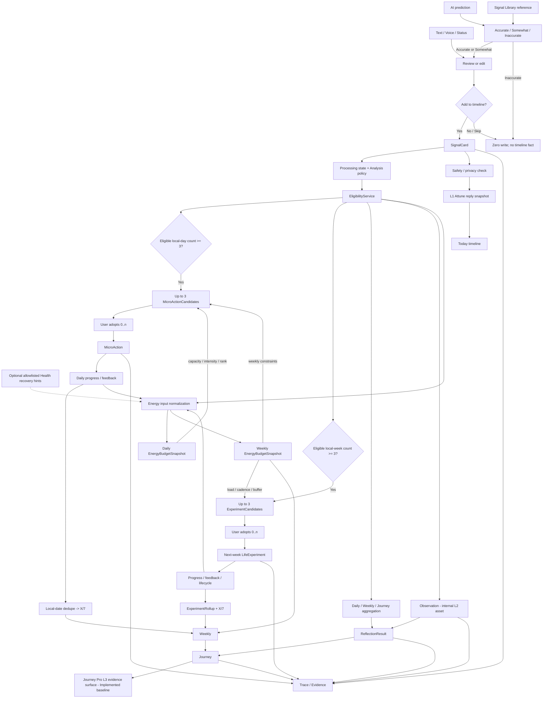

# SignalPath Active Data Flow

Last updated: 2026-07-13

Status: **canonical product and data-flow contract**. When an older document
describes an embedded Weekly experiment, Schedule/Goal as an active input, or
Observation as a user fact, this document wins.

## 1. Product Grain And Core Rules

The only user-visible business grains are:

```text
SignalCard -> MicroAction -> LifeExperiment
```

- `SignalCard` is a user-approved fact on the timeline.
- `MicroAction` is a user-adopted, short action derived from eligible facts.
- `LifeExperiment` is a user-adopted, week-scale experiment.
- `Observation` is an internal L2 reasoning asset. It is not a user fact, does
  not appear on the timeline as its own record, and cannot satisfy a generation
  threshold by itself.
- `EnergyBudgetSnapshot` is an internal daily/weekly sustainability read model.
  It may change candidate intensity and ordering, but it is not a fourth
  user-visible business grain and never satisfies a SignalCard gate.
- `Schedule` and `Goal` have no reachable current product flow. They are not
  active capture types, eligibility inputs, AI evidence, timeline types, or
  feedback sources. Production writers and summaries are removed. Legacy
  tables, migration, backup/delete, old-data readers, and startup notification
  cleanup remain only for compatibility.

## 2. Canonical End-To-End Flow



### Timeline decision

- Submitting a direct text/voice/status record is the user's explicit timeline
  decision after the content is reviewable.
- AI predictions and Signal Library references must pass the user-rating gate.
  `Accurate` and `Somewhat` open an editable confirmation sheet; only the final
  `Add to timeline` action creates a SignalCard.
- `Inaccurate`, `Do not add`, `Skip`, or dismissing the confirmation sheet is
  zero-write; it must not create feedback or an eligible SignalCard.
- Voice and status `Skip` are zero-write actions.

### L1 Attune decision

```text
saved SignalCard
  -> safety/privacy check
  -> ordinary content: L1 Attune acknowledgement
  -> persist versioned ai_reply snapshot on the same SignalCard
  -> Today timeline

selected SignalCard + Pro access
  -> L1 Attune short dialogue + current-session context
  -> session-only replies
  -> no SignalCard / Observation / candidate / ReflectionResult write
```

The timeline reply and Pro short dialogue both remain L1. Pro changes access,
context length, and quota; it does not silently grant L2/L3 authority. L1 may
acknowledge emotion, reflect the concrete event, and offer one low-pressure
question or gentle invitation. It may not infer a recurring pattern, diagnose,
or create a formal MicroAction/LifeExperiment. A future "save this dialogue"
feature must pass the normal editable Add-to-timeline decision.

Potential immediate-harm language bypasses ordinary Attune output and enters a
separate safety response. The risk classifier is not a user fact; sensitive
content is excluded from planning/reflection according to policy.

## 3. Eligibility Contract

`EligibilityService.evaluate(signal, stage)` is the shared admission rule for
Daily, Weekly, Journey, AI Reason, AI Reflect, action planning, and experiment
planning.

A SignalCard is not eligible when it is:

- a local draft or sync failure;
- inaccurate or explicitly excluded;
- `sensitive` or `do_not_analyze` for an analysis stage;
- an unconfirmed AI prediction or Signal Library reference;
- deleted or linked to inactive evidence.

Period membership uses `occurred_at + user_timezone`, never raw `created_at`.
Counts are distinct eligible SignalCards within the resolved local period.

## 4. Energy Budget Contract

Energy Budget is a derived planning input, never a fact or threshold row:

```text
eligible SignalCards
+ latest explicit local-day quick status / energy level
+ MicroAction and LifeExperiment effective feedback
+ optional allowlisted external abstract hints
  -> normalize with user-confirmed evidence first
  -> daily and weekly EnergyBudgetSnapshot
  -> Today neutral state + Weekly Energy Budget
  -> candidate intensity, duration, cadence, buffer, rank, and explanation
```

The daily period is the user's current local date. The weekly period is exactly
the current user-local Monday-Sunday week. An explicit state is `unknown` until
the user chooses it; UI defaults must not write tired/low. The latest explicit
same-day state defines "current" while earlier rows remain as weekly variation
evidence.

`capacity_band` is `unknown | very_low | low | medium | high`. Every snapshot
also stores period, timezone, evidence ids, feedback-event ids, block list,
recommended intensity, source hash, policy version, confidence/readiness, and
updated time. External hints cannot raise intensity or override user-confirmed
facts, and raw Health data never enters the snapshot. Calendar ingestion is a
future Target only and is excluded from the current Energy Budget and planning
context even if compatibility code or old local hints still exist.

Candidate groups store `energy_snapshot_id`, `energy_snapshot_hash`, and the
applied intensity. A relevant state, SignalCard, feedback, or allowed hint
change makes unadopted candidates stale and starts the standard in-place
regeneration flow. Adopted objects are not silently rewritten.

**Current status: Implemented baseline.** Daily and weekly snapshots use the
user's local date and Monday-Sunday boundaries, preserve an explicit `unknown`
state, consume eligible SignalCards and effective action/experiment feedback,
and allow only abstract Health recovery hints. The shared snapshots, focus
domains, and feedback context feed both plural candidate planners; relevant
changes invalidate and regenerate unadopted candidates. Calendar remains
excluded. Permission, cross-page refresh, and regeneration behavior still need
physical-device regression in the next test build.

## 5. Candidate And Adoption Contracts

### MicroAction

```text
local-day eligible SignalCards >= 3
  -> generate at most 3 MicroActionCandidates
  -> user adopts zero, one, or multiple
  -> create one MicroAction per adopted candidate
  -> record progress by local date
  -> display X/7 from distinct effective progress dates
```

### LifeExperiment

```text
local-week eligible SignalCards >= 3
  -> generate at most 3 ExperimentCandidates
  -> user adopts zero, one, or multiple
  -> create one LifeExperiment per adopted candidate
  -> default start is the next resolved local week
  -> record progress, feedback, and lifecycle events
  -> roll up distinct effective dates and display X/7
```

Candidate pages are selection surfaces; the Life Experiment archive is a
formal-object surface. Weekly links to the candidate selection page, not the
archive home page. Today displays adopted active objects and their real
progress; it does not display unadopted proposals.

For same-day progress, the last valid event for the same object and local date
wins. Completion/occurred counts as 1; skipped/not-suitable does not increment
the numerator. A MicroAction window begins on its adoption local date; a
LifeExperiment uses its formal active-period start. The UI clamps the display
to `0...7`.

## 6. Storage Responsibilities

| Layer | Responsibility |
| --- | --- |
| `captures` | Raw input, audit, migration, and old-client compatibility only. |
| `signal_cards` | Canonical user-approved timeline facts. |
| `signal_processing_state` | Draft, sync, processing, and inclusion state. |
| `signal_analysis_policy` | Privacy, confirmation, inaccurate, and exclusion policy. |
| SignalCard `ai_reply` snapshot | Versioned L1 Attune timeline acknowledgement attached to its source fact; never a new fact/evidence row. |
| `daily_snapshots`, `weekly_snapshots`, `journey_snapshots` | Period aggregation/cache; not AI source-of-truth text. |
| `EnergyBudgetSnapshot` derived local read model | Reproducible daily/weekly capacity, blocks, evidence coverage, recommended intensity, and source hash. It is computed locally in the implemented baseline; a dedicated persisted table is not required by the current flow. |
| `reflection_results` | Versioned AI output for L1/L3 reflections. |
| `observations` | Internal, derived L2 reasoning with evidence links. |
| `candidate_groups` | Shared period/source-hash/generation state for action and experiment proposal groups. |
| `micro_action_candidates` | Ranked daily proposals before adoption. |
| `micro_actions` | Formal user-adopted short actions. |
| `micro_action_feedback` | Progress events used for distinct-local-day rollup. |
| `experiment_candidates` | Generated weekly proposals before adoption. |
| `life_experiments` | Formal user-adopted experiments. |
| `life_experiment_lifecycle_events`, `life_experiment_feedback` | Experiment event history. |
| `life_experiment_rollups` | Current status, lineage, feedback, and progress summary. |
| `trace_links` | Evidence/source graph. |
| `pipeline_runs` | Generation, retry, input hash, and version state. |

Candidate metadata for both candidate types:

```text
candidate_group_id
rank
origin_candidate_id (on adopted object)
source_period_start / source_period_end / timezone
linked_signal_ids
energy_snapshot_id / energy_snapshot_hash / recommended_intensity
status = generated | adopted | dismissed | stale
```

Group generation state is `gated | stale | regenerating | ready | failed`.
Only `ready` candidates may be displayed or adopted.

## 7. Observation Boundary

Observation may:

- summarize or hypothesize over eligible SignalCards;
- provide derived context to reflection and candidate generation;
- carry confidence, model/prompt version, and trace links;
- be confirmed, adjusted, dismissed, stale, or superseded.

Observation may not:

- create a timeline record without a separate user decision;
- increment the three-SignalCard gate;
- be treated as independent evidence when its source SignalCards are ineligible;
- directly set `included_in_weekly` or `included_in_journey` on a user fact.

If all source links become inactive, the Observation and dependent outputs are
stale and excluded from new reflections.

## 8. Focus, Pro, And Purchase Control Planes

### Focus domains

- **Implemented locally:** onboarding selection can round-trip to Me.
- **Target:** remotely persist the complete ordered `focus_domain_ids` array so
  reinstall and multi-device restore do not collapse it to one legacy field.
- Focus domains influence prioritization, never eligibility or fact truth.

### Journey Pro L3

- Standard Weekly and Pro This Week Deep Read both require 3 distinct eligible
  SignalCards in the current user-local Monday-Sunday week.
- Free Journey's timeline, SignalCard local-date monthly grid, curve, and
  evidence fact layer remain available before report readiness. This grid is
  built only from in-app SignalCards and does not read the system Calendar.
  Monthly synthesis requires 7 distinct eligible
  SignalCards across at least 3 local dates in the current calendar month.
- Journey Pro L3 publication requires 14 distinct eligible SignalCards across
  7 local dates and 2 Monday-Sunday week buckets in the latest 28 local dates.
- Entitlement and evidence readiness are independent gates. Feedback,
  Observations, candidates, and generated text never inflate SignalCard counts.
- **Implemented baseline:** `/memory/pro-l3` is separately discoverable,
  `PremiumGate`-protected, and reads a bounded local `JourneyProReportModel`.
  Once `14/7/2` is ready it shows verifiable 28-day counts, previous/current
  local-week facts, any existing Journey summary, eligible raw SignalCards, and
  a follow-up route keyed by a real SignalCard ID.
- **Target boundary:** no independent versioned 28-day interpretive generator
  exists yet. Without an existing Journey summary the page displays statistics
  and source evidence only; it must not present placeholder interpretation as a
  generated L3 conclusion.

### Purchase

Purchase is an independent control plane:

```text
launch / foreground / Pro-surface entry
  -> silently read verified Transaction.currentEntitlements
  -> matching verified Pro immediately updates local cache and feature gates

target lifecycle
  -> native Transaction.updates listener recomputes entitlement
  -> asynchronous signed-JWS server reconciliation / retry

explicit user Restore tap
  -> AppStore.sync()
  -> read verified currentEntitlements again
  -> matching verified Pro immediately updates local cache and gates
  -> no match / sync failure produces an environment-aware result
```

It must not write SignalCards, eligibility, progress, or reflection evidence.
Manual Restore must evaluate verified current entitlements even when local Pro
is already active; it must not short-circuit on the cache. Only a successful
StoreKit query that explicitly reports no matching entitlement, or a verified
refund/revocation state, may revoke the cache. Network/sync/unverified/timeout
failures preserve locally verified Pro. `AppStore.sync()` is explicit-user-only
because it may require App Store authentication; normal lifecycle refreshes are
silent.

The target server verifies signed StoreKit 2 transaction JWS or uses the App
Store Server API, and consumes App Store Server Notifications V2 idempotently.
Legacy backend verification receives a refreshed App Receipt during migration;
a StoreKit 2 JWS must never be disguised as receipt data. `verifyReceipt` is a
compatibility path, not the target source of truth.

The manual controller and silent launch/foreground current-entitlement refresh
are implemented. The native `Transaction.updates` lifecycle and the modern
server path remain Target. Restore Purchase also remains an open Platform
QA/release gate. QA must separately exercise TestFlight Sandbox and App Store
Production: a production subscription is not expected to appear in a
TestFlight sandbox build.

## 9. Implementation Status And Gaps

| Contract | Status on 2026-07-13 |
| --- | --- |
| SignalCard as primary fact; processing/policy split; shared eligibility | Implemented baseline. Compatibility mirrors remain. |
| Observation persisted with trace links | Implemented infrastructure, but current UI/data paths must be audited so Observation never bypasses the timeline decision or eligibility boundary. |
| Today reply and Pro short dialogue as L1 Attune | **Implemented baseline.** Both paths use L1 Attune, stay within the selected SignalCard/session, and include the immediate-risk safety branch. Region-specific verified crisis resources remain Target. |
| AI prediction/Library editable add-to-timeline gate | Implemented baseline; inaccurate and Do not add are zero-write. Retain compatibility/device regression. |
| Three eligible signals per local day -> up to three MicroAction candidates | **Implemented baseline.** Grouped/ranked read model and dedicated selection page exist; device QA pending. |
| Three eligible signals per local week -> up to three Experiment candidates | **Implemented baseline.** Grouped/ranked planning and dedicated selection page exist; device QA pending. |
| Multi-select adoption and candidate grouping/rank | **Implemented baseline.** Adoption is 0..n and idempotent by origin candidate. |
| Real MicroAction and LifeExperiment `X/7` | **Implemented baseline.** The last valid feedback per object/local date wins; object types never borrow progress. |
| Today projection | **Implemented baseline.** Shows at most three actions and three experiments; overflow uses View all. |
| Immediate source refresh | **Implemented baseline.** Unadopted groups transition stale -> regenerating -> ready and replace in place after a short debounce. |
| Energy Budget monitoring and Weekly display | **Implemented baseline.** Daily/weekly snapshots use local date boundaries, explicit state and effective feedback; Health abstractions, focus and feedback enter both plural planners, while Calendar does not. |
| Focus multi-select local round-trip | Implemented locally. |
| Focus multi-select remote sync | **Gap / Target.** Add remote array contract and migration. |
| Journey Pro L3 page and evidence entry | **Implemented baseline.** `/memory/pro-l3`, PremiumGate, `14/7/2`, factual comparison, existing summary, raw evidence, and SignalCard follow-up exist. Independent versioned 28-day AI interpretation remains Target. |
| Schedule/Goal active-flow removal | **Implemented.** Current UI/routes and production writers/summaries are removed. Legacy tables, migration, backup/delete, old-data readers, and startup notification cleanup remain only for compatibility. |
| Restore purchase | **Manual and silent-refresh baseline implemented; Platform QA open.** Verified StoreKit entitlement unlocks immediately, the verified environment is persisted, cross/unknown-environment empty results preserve local Pro for reconciliation, and `AppStore.sync()` is explicit-only. Native transaction updates, modern signed-JWS/server notifications, and separate Sandbox/Production QA remain. |

## 10. Compatibility Boundary

- Keep `/api/v1/captures`, raw `captures`, snapshot AI mirror fields, SignalCard
  mirror fields, old `_life_experiment` reads, and backup/account endpoints only
  behind documented compatibility and telemetry gates.
- Do not generate new embedded Weekly experiments. Old
  `opportunitySnapshot['_life_experiment']` data is migration input only.
- Schedule/Goal tables, migration, backup/delete, old-data readers, and startup
  notification cleanup may remain for compatibility. Production writers and
  summaries are removed; these objects must not re-enter current planning,
  thresholds, AI, Weekly, or Journey.
- Physical deletion requires an observation window with fallback counters at
  zero, realistic legacy-data QA, a reversible migration, and rollback plan.

## 11. Invalidation And Trace Rules

```text
SignalCard fact/policy/confirmation change
  -> reevaluate eligibility
  -> rebuild affected daily/weekly EnergyBudgetSnapshot
  -> dirty affected local-day/local-week/Journey snapshots
  -> stale dependent reflections and observations
  -> immediately invalidate unadopted candidate group
  -> inline regenerating state + short debounce + in-place ready replacement
  -> inactivate invalid trace links
```

```text
MicroAction or LifeExperiment feedback change
  -> rebuild that object's local-date rollup
  -> rebuild affected EnergyBudgetSnapshot
  -> dirty overlapping Weekly/Journey aggregations
  -> stale candidate groups whose energy snapshot hash changed
  -> stale dependent reflections
```

Adopted user objects are never overwritten by regeneration. A stale source sets
`source_changed` on the adopted object/evidence relationship and excludes that
source from new AI claims; regeneration creates/supersedes proposals rather
than mutating an adopted MicroAction or LifeExperiment.
