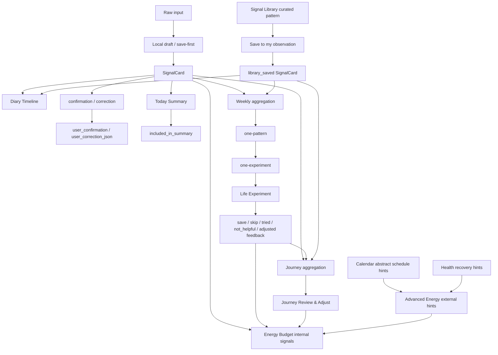

# Phase 3 Closeout 1 Full Implementation Closeout / Release QA Plan

Date: 2026-05-30

Status: Engineering closeout prepared.

Scope: unify the V3A-V3G Phase 3 implementation state and prepare Release QA. This round adds no feature, no UI redesign, and no real EventKit / HealthKit integration.

## 1. Phase 3 Total Status

| Stage | Area | Engineering status | Source of truth | Remaining blocker |
| --- | --- | --- | --- | --- |
| V3A | SignalCard backend foundation | Engineering closed | `Phase3_V3A1_Acceptance_Evidence.md` | Release QA manual UI evidence not applicable to backend foundation |
| V3B | Today SignalCard / Timeline / Summary | Engineering closed | `Phase3_V3B4_Today_Closeout_Release_QA.md` | manual Today UI screenshot / recording still deferred |
| V3C | Weekly / Life Experiment | Engineering closed | `Phase3_V3C4_Weekly_Closeout_Journey_Entry.md` | manual Weekly / Life Experiment UI evidence still deferred |
| V3D | Journey / Review & Adjust | Engineering closed | `Phase3_V3D3_Journey_Closeout_Phase3_Main_Chain.md` | manual Journey UI evidence still deferred |
| V3E | Energy Budget | Engineering closed | `Phase3_V3E3_Energy_Budget_Closeout_Signal_Library_Entry.md` | manual Energy Budget UI evidence still deferred |
| V3F | Signal Library | Engineering closed | `Phase3_V3F3_Signal_Library_Closeout_Phase3_Boundary.md` | manual Library UI evidence still deferred |
| V3G | Advanced Energy Budget boundary / hints | Engineering closed | `Phase3_V3G5_Advanced_Energy_Budget_Closeout_Phase3_Prep.md` | no real EventKit / HealthKit integration; manual UI evidence still deferred |

Engineering state:

- V3A-V3G main implementation is closed from a code-path and automated-test perspective.
- Release QA is not complete.
- manual UI acceptance is still blocked by Xcode/CoreSimulator/SPM evidence capture.

## 2. Phase 3 Main Chain



Main chain rules:

- user input is saved before AI/parser/backend work can fail.
- SignalCard is the primary fact source.
- original raw user note remains visible in Diary Timeline.
- confirmation / correction is a trust signal, not a task score.
- Today Summary, Weekly, Journey, Energy Budget, and Signal Library preserve evidence boundaries.
- Advanced Energy external hints are advisory context only.

## 3. Release QA Blocker List

Open blocker:

- Xcode/CoreSimulator/SPM prevents reliable manual UI screenshots or recordings.
- previous simulator evidence capture was blocked by `xcodebuild -resolvePackageDependencies`.
- `CoreSimulatorService connection became invalid`.
- `simdiskimaged crashed or is not responding`.

Release QA evidence still required:

- Today UI evidence.
- Weekly UI evidence.
- Journey UI evidence.
- Energy Budget UI evidence.
- Signal Library UI evidence.
- purchase / restore purchase UI evidence.

Rule:

- do not mark manual UI acceptance complete until real simulator, real device, or CI screenshots / recordings exist.
- automated tests are engineering evidence, not manual Release QA evidence.

## 4. Pre-Release Test Commands

Frontend:

```bash
cd /Users/yangyang/ai_opportunity_radar/frontend_flutter
flutter analyze
flutter test
git diff --check
```

Backend:

```bash
cd /Users/yangyang/ai_opportunity_radar/backend
pytest
```

iOS build / archive pre-checks when packaging:

```bash
cd /Users/yangyang/ai_opportunity_radar/frontend_flutter
flutter pub get
cd ios
pod install
cd ..
flutter build ios --release
```

Before an App Store / TestFlight build:

- confirm bundle identifier and version/build number.
- confirm signing team and provisioning.
- confirm In-App Purchases load in TestFlight or sandbox.
- confirm Privacy Policy and EULA links are reachable.
- confirm no Release QA blocker is being marked complete without screenshots / recording.

## 5. Manual Acceptance Scenarios

After the simulator / real-device evidence blocker is fixed, capture screenshots or recordings for:

| Area | Scenario | Expected evidence |
| --- | --- | --- |
| Today | add a new record online | SignalCard appears immediately with raw text and saved AI reply |
| Today | backend unreachable / offline local draft | draft remains visible and saved on device |
| Today | retry sync | draft changes from local / retry state to synced when possible |
| Today | Diary Timeline | older and legacy records appear by local date |
| Today | Today Summary | summary is an observation layer and raw note remains primary |
| Today | confirmation / correction | accurate / inaccurate / edited / supplemented writes visibly |
| Weekly | one-pattern | Weekly shows one main pattern, not a long judgement report |
| Weekly | one-experiment | one low-cost experiment is suggested |
| Life Experiment | save / skip / feedback | skipped / not helpful / adjusted are neutral feedback, not failure |
| Journey | Review & Adjust | Journey shows long-term reflection and experiment feedback without judgement wording |
| Energy Budget | internal-signal block | shows costly source, recovery clue, buffer, adjustment, experiment connection |
| Energy Budget | advanced hints if test data available | external hints appear only as advisory schedule / recovery context |
| Signal Library | curated pattern list | Library displays official abstract patterns only |
| Signal Library | save to observation | save creates private `library_saved` SignalCard |
| Today | library_saved Timeline display | saved Library observation appears as Library-origin observation, not raw diary |
| Purchases | Pro purchase / restore | product buttons work, EULA / privacy links reachable, restore path works |

Release QA blocker remains open until these are captured.

## 6. Privacy Red Lines

| Boundary | Rule |
| --- | --- |
| raw user text | `raw_text` must not enter Signal Library or public/shared pattern generation |
| Signal Library | Library must not display user stories or user-identifiable situations |
| library_saved | `library_saved` must not be presented as the user's raw diary text |
| library_saved evidence | unconfirmed `library_saved` stays Timeline-only / light observation until user confirms or supplements |
| Calendar raw data | raw event title, location, attendees, organizer, notes, description must not flow downstream |
| Calendar busy data | `isBusy` can only support aggregate density; no event-level busy evidence or exact time-slot evidence |
| Health raw data | raw sleep samples, heart rate, workout details, route, precise health timeline must not flow downstream |
| external hints | Calendar / Health hints cannot override user-confirmed SignalCards or user feedback |
| `abstractExternalHints` | only sanitized abstract labels or aggregate hint values; no raw fields, samples, timeline data, or identifiable context |
| inclusion flags | `included_in_summary`, `included_in_weekly`, `included_in_journey` mean "used by that layer"; they do not mean confirmed |
| evidence level | legacy, unconfirmed, library_saved, confirmed, inaccurate, excluded, sync failed must remain distinct |
| diagnostics / scoring | no health diagnosis, no productivity score, no discipline judgement |

## 7. Evidence-Level Boundary

| Evidence type | Treatment |
| --- | --- |
| user-confirmed SignalCard | strongest personal evidence |
| edited / supplemented SignalCard | strong personal evidence with user correction |
| native unconfirmed SignalCard | light observation only |
| legacy_context | historical background only |
| library_saved unconfirmed | private observation seed; not high-confidence evidence |
| library_saved confirmed | personal observation, still distinct from raw diary |
| Life Experiment feedback | Review & Adjust evidence, not habit score |
| Calendar / Health abstract hints | advisory context only |
| inaccurate | excluded from analysis |
| do_not_analyze / excluded / sensitive | excluded from analysis |
| local draft / sync failed | saved locally, but not analysis evidence until eligible |

## 8. Current Non-Goals Before Release QA

Not implemented in Phase 3 main implementation:

- real EventKit permission prompt.
- real EventKit read path.
- real HealthKit permission prompt.
- real HealthKit read path.
- schedule dashboard.
- health dashboard.
- health diagnosis.
- recovery / productivity score display.
- community Signal Library.
- recommendation feed.
- public interaction counts.
- automatic sharing.
- backend sync for local Life Experiments and some inclusion flags.
- release-ready manual UI evidence.

## 9. Latest Engineering Baseline

Latest recorded Phase 3 frontend baseline from V3G-4:

- `flutter analyze`: no issues found.
- `flutter test`: `108 passed`.
- `git diff --check`: clean.

For this closeout document round:

- no feature code changed.
- no UI changed.
- no backend changed.
- `git diff --check` should remain clean.

Phase 3 can move into Release QA only with the blocker explicitly preserved.
