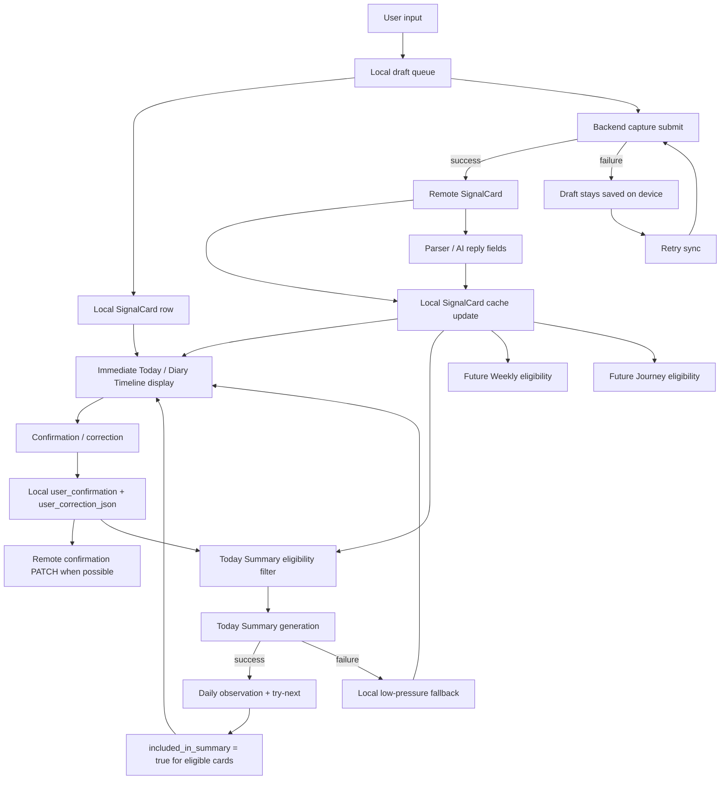

# Phase 3 V3B-4 Today Closeout / Release QA Checklist

Date: 2026-05-29

Status: Closeout created.

## 1. V3B Acceptance Summary

| Stage | Status | Evidence |
| --- | --- | --- |
| V3B-1 Today reads SignalCard + Diary Timeline loop | Engineering accepted | `Phase3_V3B1_Acceptance_Evidence.md` |
| V3B-1A Flutter/iOS toolchain repair | Toolchain partial fix archived | `Phase3_V3B1A_Toolchain_Diagnostics.md` |
| V3B-2 Today low-pressure copy / Timeline readability | Engineering accepted | `Phase3_V3B2_Today_Low_Pressure_UX.md` |
| V3B-3 Today Summary / SignalCard inclusion | Engineering accepted | `Phase3_V3B3_Today_Summary_Inclusion.md` |

Engineering-accepted scope:

- Today uses SignalCard as the main data source.
- New user input is saved locally before backend work.
- Local draft / retry queue exists.
- Diary Timeline reads all cached / migrated SignalCards by `local_date`.
- SignalCard confirmation and correction write locally first.
- Today state copy avoids blame, pressure, and technical language.
- Today Summary reads eligible SignalCards and does not overwrite raw notes.
- Summary failure does not block or erase saved SignalCards.
- `included_in_summary` is set for eligible cards used by Today Summary.

## 2. Release QA Blockers

Manual UI evidence is still not complete.

Open Release QA blocker:

- `flutter run -t tool/v3b_evidence_app.dart` hangs/fails at `xcodebuild -resolvePackageDependencies`.
- `CoreSimulatorService connection became invalid`.
- `simdiskimaged crashed or is not responding`.
- Current simulator screenshot only shows the Apple boot logo.
- This is not valid Today UI evidence.

Release rule:

- Do not mark manual simulator/device UI verification complete until a real simulator, real device, or CI run produces Today screenshots or recording.

## 3. Weekly / Journey Follow-Up Entry Points

V3B has prepared the fields but does not complete Weekly / Journey inclusion ownership.

Follow-up for Weekly:

- Read SignalCards instead of old captures/raw memories as the primary source.
- Apply Weekly eligibility rules separately from Today Summary.
- Set or sync `included_in_weekly` only when Weekly actually uses a card.
- Avoid treating `legacy`, `sync_failed`, or `inaccurate` as high-confidence Weekly material.

Follow-up for Journey:

- Read long-range SignalCards as the primary source.
- Keep `legacy` visible as history, but distinguish it from confirmed long-term patterns.
- Set or sync `included_in_journey` only when Journey actually uses a card.
- Preserve `user_confirmation` and `user_correction_json` as trust signals.

Backend follow-up:

- Decide whether local inclusion changes should PATCH to backend.
- Add backend endpoints if `included_in_summary`, `included_in_weekly`, or `included_in_journey` need server-side ownership.

## 4. V3B-3 Summary Copy Table

| Copy | English | Japanese | Simplified Chinese | Traditional Chinese |
| --- | --- | --- | --- | --- |
| Today Summary title | Today, you can look at it this way | 今日はまずこう見てみる | 今天可以先这样看 | 今天可以先這樣看 |
| Summary fallback: local draft / sync pending | Your original note is saved. It is okay to organize it after sync finishes. | 元の記録は保存されています。同期が終わってから整理しても大丈夫です。 | 原文已经保存，等同步完成后再整理也来得及。 | 原文已經保存，等同步完成後再整理也來得及。 |
| Summary fallback: legacy only | Old records are back in the timeline. No need to re-judge them right away. | 古い記録はタイムラインに戻っています。すぐ判断し直さなくても大丈夫です。 | 旧记录已经放回时间线，这里先不急着重新判断它。 | 舊記錄已經放回時間線，這裡先不急著重新判斷它。 |
| Summary fallback: deferred | The note is saved. You can let the signal settle before organizing it. | 記録は保存されています。線がもう少し見えてから整理しても大丈夫です。 | 记录已经留下，等线索更稳一点再整理。 | 記錄已經留下，等線索更穩一點再整理。 |
| Summary unavailable | AI has not organized this yet. Your original note is already saved. | AI はまだ整理していませんが、元の記録は保存されています。 | AI 还没整理这条，但你的原文已经保存。 | AI 還沒整理這條，但你的原文已經保存。 |
| Not used in today's reflection | Not used today | 今日は未使用 | 未进入今日观察 | 未進入今日觀察 |
| Used in today's reflection | Used today | 今日の観察に使用 | 已进入今日观察 | 已進入今日觀察 |

Copy rules:

- Do not say “you should”.
- Do not use completion/failure framing.
- Keep the raw note as the primary artifact.
- Treat Summary as an optional observation layer.

## 5. Inclusion Field Rules

| Field | Default | Updated in V3B | Update timing | Notes |
| --- | --- | --- | --- | --- |
| `included_in_summary` | `false` | yes, local cache | after Today Summary successfully chooses eligible SignalCards | eligible unconfirmed cards may be included as light observations; this does not confirm them |
| `included_in_weekly` | `false` | no ownership in V3B | future Weekly generation | display if backend/cache provides it; do not invent it in Today |
| `included_in_journey` | `false` | no ownership in V3B | future Journey pattern generation | display if backend/cache provides it; do not invent it in Today |

V3B Summary eligibility:

- eligible:
  - native / synced SignalCards
  - `user_confirmation == unconfirmed`, as light observation only
  - `accurate`, `edited`, `supplemented`
- excluded:
  - `is_legacy`
  - `is_local_draft`
  - `sync_failed`
  - `user_confirmation == inaccurate`

Local-only sync decision:

- V3B currently updates `included_in_summary` locally.
- Backend already exposes inclusion fields if present.
- Server-side synchronization of inclusion changes is a follow-up decision for Weekly/Journey/shared analytics consistency.

## 6. Today V3B Data Chain



## 7. Current Verification Baseline

Most recent V3B verification:

```bash
cd /Users/yangyang/ai_opportunity_radar/frontend_flutter
flutter analyze
flutter test
```

Result:

- `flutter analyze`: no issues found.
- `flutter test`: `46 passed`.

Manual UI evidence:

- deferred to Release QA because of the Xcode/CoreSimulator/SPM blocker.
