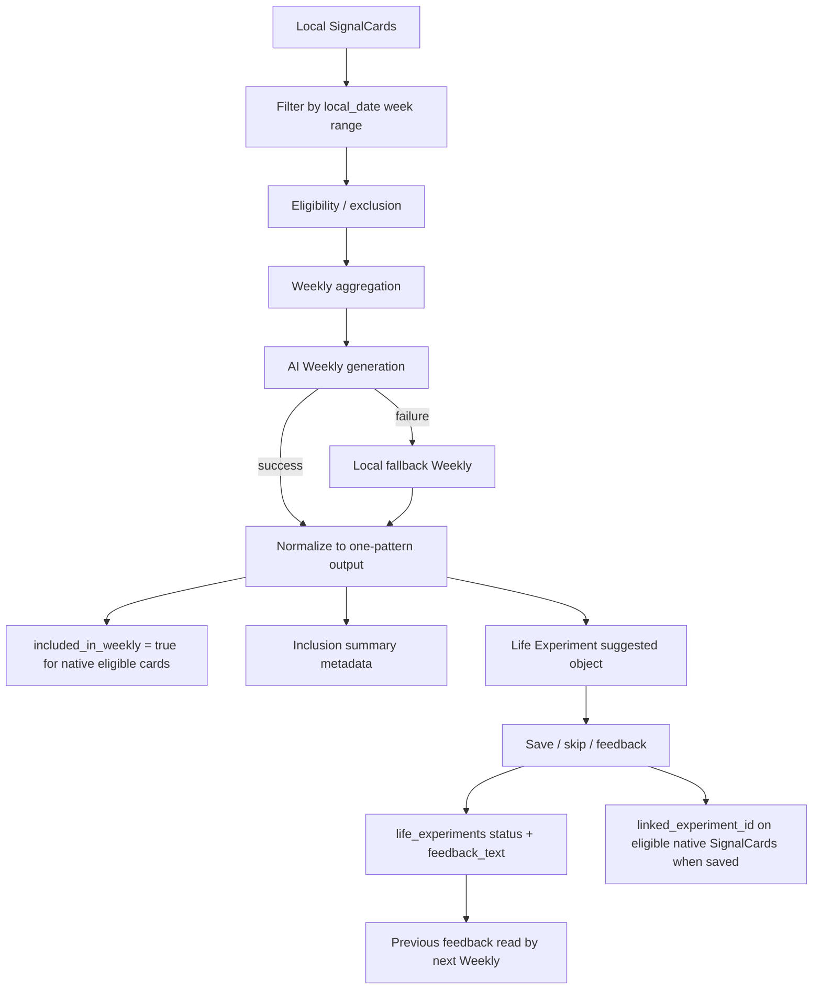

# Phase 3 V3C-4 Weekly Closeout / Journey Entry

Date: 2026-05-29

Status: Closeout created.

## 1. V3C Acceptance Summary

| Stage | Status | Evidence |
| --- | --- | --- |
| V3C-1 Weekly SignalCard inclusion | Engineering accepted | `Phase3_V3C1_Weekly_SignalCard_Inclusion.md` |
| V3C-2 Weekly low-pressure output | Engineering accepted | `Phase3_V3C2_Weekly_Low_Pressure_Output.md` |
| V3C-3 Weekly to Life Experiment minimal loop | Engineering accepted | `Phase3_V3C3_Weekly_Life_Experiment_Minimal_Loop.md` |

Engineering-accepted scope:

- Weekly reads SignalCards as its primary data source.
- Weekly uses `SignalCard.local_date` for week range and chart buckets.
- Weekly excludes draft, sync failed, inaccurate, and privacy-excluded cards from analysis.
- Legacy cards can be low-confidence Weekly context but are not treated as confirmed evidence.
- Weekly output narrows to one light observation, one consuming pattern, one small experiment, and one recovery signal.
- Weekly creates or reuses one local Life Experiment per week.
- Users can save, skip, or leave low-pressure feedback for the experiment.
- Experiment feedback is preserved for later Review & Adjust.

Remaining blockers:

- Backend sync / cross-device continuity for Life Experiments is not implemented.
- Local inclusion flags are not yet PATCHed back to backend.
- Manual UI evidence remains blocked by the Release QA tooling issue listed below.

## 2. Weekly Current Data Chain



Weekly analysis eligibility:

- eligible:
  - native synced SignalCards
  - `user_confirmation == unconfirmed`, as light observation only
  - `accurate`, `edited`, `supplemented`
- low-confidence reference:
  - `is_legacy == true`
- excluded:
  - `user_confirmation == inaccurate`
  - `is_local_draft == true`
  - `sync_failed == true`
  - `privacy_level == do_not_analyze`
  - `privacy_level == excluded`
  - `privacy_level == sensitive`

## 3. Life Experiment Lifecycle

| Status | Meaning | Product tone |
| --- | --- | --- |
| `suggested` | Weekly created a small experiment suggestion | optional, not a task |
| `saved` | user saved it for later trying | kept as a design to try |
| `skipped` | user chose not now | normal choice, not missed |
| `tried` | user said it helped a little | useful signal |
| `not_helpful` | user said it did not help this time | valid feedback about the design |
| `adjusted` | user said it needs adjustment | input for next iteration |

Feedback:

- `feedback_text` stores the user-facing feedback label.
- `skipped`, `not_helpful`, and `adjusted` must be preserved.
- Feedback describes whether the life design fits, not user discipline.
- Next Weekly can read previous feedback through `LocalLifeExperimentRepository.getPreviousForWeek()`.
- Missing feedback must not block Weekly generation.

## 4. Local-First / Backend Sync Boundary

Currently local-only:

- `life_experiments`
- `life_experiments.status`
- `life_experiments.feedback_text`
- `life_experiments.linked_signal_card_ids_json`
- local `signal_cards.linked_experiment_id`
- local `included_in_weekly` changes
- Weekly `opportunitySnapshot._life_experiment`
- Weekly `opportunitySnapshot._weekly_inclusion`

Already backed by backend schema or backend-capable fields:

- backend `signal_cards.included_in_weekly`
- backend `signal_cards.linked_experiment_id`
- backend `signal_cards.privacy_level`
- backend `signal_cards.user_confirmation`
- backend `signal_cards.user_correction_json`

Future sync needs:

- create backend Life Experiment table/API or equivalent endpoint
- sync local experiment status and feedback
- decide whether server owns experiment ids or accepts local ids
- PATCH `linked_experiment_id` for linked SignalCards
- PATCH `included_in_weekly` when Weekly uses a card
- keep cross-device continuity for saved/skipped/tried/not_helpful/adjusted state

Current rule:

- V3C is local-first. Do not claim cross-device Life Experiment continuity until backend sync exists.

## 5. Journey Entry Points

Journey V3D-1 can read:

- `LocalCaptureRepository.listSignalCards(limit: ...)`
- `SignalCard.local_date`
- `SignalCard.energy_load`
- `SignalCard.friction`
- `SignalCard.positive_signal`
- `SignalCard.scene`
- `SignalCard.user_confirmation`
- `SignalCard.user_correction_json`
- `SignalCard.included_in_weekly`
- `SignalCard.linked_experiment_id`
- `LocalLifeExperimentRepository` history
- `life_experiments.status`
- `life_experiments.feedback_text`
- `life_experiments.source_week_start`
- `life_experiments.linked_signal_card_ids_json`
- cached Weekly output if Journey needs weekly bridge context

Journey inclusion guidance:

- native confirmed cards can support stronger long-term patterns.
- unconfirmed cards can support weak signals only.
- legacy cards can appear as historical context, but not as high-confidence current pattern proof.
- inaccurate cards should not enter Journey analysis.
- local draft and sync failed cards should stay visible in Timeline but not power Journey analysis yet.
- privacy-excluded cards must not enter Journey analysis.
- experiment feedback should be treated as Review & Adjust evidence, including `skipped`, `not_helpful`, and `adjusted`.

Journey first implementation target:

- V3D-1 should switch Journey to SignalCard as the primary data source.
- V3D-1 should read local Life Experiment history as context only.
- V3D-1 should not require backend experiment sync to begin.

## 6. Release QA Blocker

Manual UI evidence is still not complete.

Open Release QA blocker:

- `flutter run -t tool/v3b_evidence_app.dart` hangs/fails at `xcodebuild -resolvePackageDependencies`.
- `CoreSimulatorService connection became invalid`.
- `simdiskimaged crashed or is not responding`.
- Current simulator screenshot only shows the Apple boot logo.
- This is not valid Today / Weekly UI evidence.

Release rule:

- Do not mark manual simulator/device UI verification complete until a real simulator, real device, or CI run produces valid screenshots or recording.

## 7. Current Verification Baseline

Most recent V3C verification:

```bash
cd /Users/yangyang/ai_opportunity_radar/frontend_flutter
flutter analyze
flutter test
git diff --check
```

Result:

- `flutter analyze`: no issues found.
- `flutter test`: `57 passed`.
- `git diff --check`: clean.

Backend note:

- V3C did not change backend execution paths.
- Backend sync for Life Experiments remains a future task.

