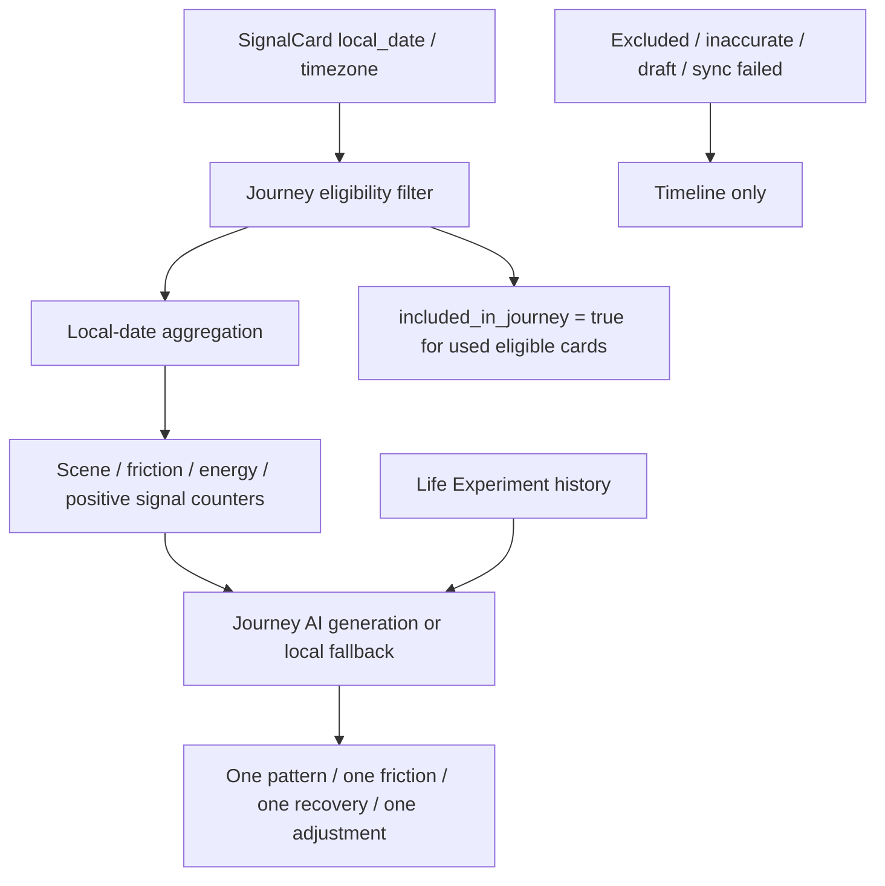

# Phase 3 V3D-1 Journey SignalCard / Experiment Foundation

Status: Engineering implementation in progress / V3D-1 foundation.

Scope: switch Journey's primary facts to SignalCard, connect local Life Experiment history, and define long-term inclusion rules. This does not include a large Journey visual redesign.

## 1. Current Data Source Check

Before V3D-1, Journey was owned by `MemoryRepository.fetchMemorySummaryResult()`.

Old primary path:

- `MemoryRepository.fetchMemorySummaryResult()`
- `LocalCaptureRepository.listRecentSignals(limit: 2000)`
- `captures`
- `created_at.toLocal()` based grouping
- `LocalJourneySnapshotRepository`
- `AiRepository.generateJourneySummary(...)`

Problems:

- Journey still depended on legacy `captures` as the primary fact source.
- date grouping was derived from `created_at`, not SignalCard `local_date`.
- parser fields such as `scene`, `friction`, `energy_load`, and `positive_signal` were not first-class Journey aggregation inputs.
- Life Experiment feedback was not part of Journey's Review & Adjust memory.

V3D-1 replacement path:

- `MemoryRepository.fetchMemorySummaryResult()`
- `LocalCaptureRepository.listSignalCards(limit: 2000)`
- `signal_cards`
- Journey eligibility filter
- `signal.localDateKey()` / `signal.timezone`
- SignalCard parser fields
- `LocalLifeExperimentRepository.listRecent(localUserId: ...)`
- `LocalJourneySnapshotRepository`
- `AiRepository.generateJourneySummary(...)`

## 2. Journey SignalCard Aggregation

Journey now aggregates eligible SignalCards by `local_date`, not UTC day or raw `created_at`.

Fields sent into Journey generation:

- `signal_card_id`
- `source_type`
- `content`
- `created_at`
- `local_date`
- `timezone`
- `acknowledgement`
- `observation`
- `try_next`
- `emotion`
- `intensity`
- `scene`
- `friction`
- `energy_load`
- `positive_signal`
- `scene_tags`
- `intent_tags`
- `user_confirmation`
- `is_legacy`
- `journey_confidence`

Aggregated counters:

- top tokens
- top scenes
- top frictions
- top energy loads
- top positive signals
- active days
- total local-date span
- entry count

Range support:

- Current foundation uses the app-start-to-now local SignalCard history by default.
- recent 30-day / monthly slices can be layered on top by filtering `local_date` before `_buildJourneyStats`.
- Monthly Life Map can reuse the same SignalCard aggregation instead of reintroducing a separate Monthly primary source.

## 3. Journey Inclusion / Exclusion Rules

Eligible:

- synced SignalCards
- `accurate`, `edited`, `supplemented`, or `unconfirmed`
- `legacy` cards only as low-confidence background
- `privacy_level = private` or other non-excluded personal analysis values

Excluded:

- `user_confirmation = inaccurate`
- `is_local_draft = true`
- `sync_failed = true`
- `privacy_level = do_not_analyze`
- `privacy_level = excluded`
- `privacy_level = sensitive`

Legacy rule:

- legacy records can appear in Journey context.
- they are marked with `journey_confidence = legacy_context`.
- they must not be presented as confirmed user-validated insight.

Unconfirmed rule:

- unconfirmed cards can be light observation material.
- they must not be upgraded into confirmed insight.

Inclusion marking:

- default: `included_in_journey = false` on SignalCard creation and migration.
- update timing: after Journey builds a snapshot input set, eligible used SignalCards are marked `included_in_journey = true`.
- meaning: `included_in_journey = true` only means "this card has been used by Journey at least once".
- it does not mean confirmed, high-confidence, correct, or user-validated evidence.
- ownership: current implementation is local-first Flutter ownership through `LocalCaptureRepository.updateSignalCardInclusion(...)`.
- backend sync: backend already has the field shape through SignalCard, but V3D-1 does not sync Journey inclusion back to backend yet. Cross-device inclusion continuity remains future work.
- legacy: can be marked `included_in_journey = true` only when used as low-confidence background, with `journey_confidence = legacy_context`.
- unconfirmed: can be marked `included_in_journey = true` only as light observation material. It must not be presented as confirmed.
- inaccurate: must stay `included_in_journey = false`.
- excluded / do_not_analyze / sensitive: must stay `included_in_journey = false`.
- sync failed / local draft: must stay `included_in_journey = false` until synced and eligible.

Evidence level must stay separate from inclusion marking:

- native confirmed cards are stronger evidence.
- native unconfirmed cards remain light observation evidence.
- legacy cards remain `legacy_context`.
- experiment feedback is Review & Adjust evidence, not direct proof of a life pattern.

## 4. Life Experiment History

Journey now reads local Life Experiment history:

- `saved`
- `tried`
- `skipped`
- `not_helpful`
- `adjusted`

Rules:

- skipped and not_helpful are preserved as Review & Adjust evidence.
- feedback is not treated as success or failure.
- missing feedback does not block Journey generation.
- the latest experiment is surfaced as a light "recent experiment adjustment" item.
- experiment history is included in the Journey snapshot source hash, so changed feedback invalidates the cache.

Current boundary:

- Life Experiment history is local-first / local-only.
- cross-device experiment sync remains future work.

## 5. Journey Initial Output Structure

Journey output is intentionally short:

- one long-term repeated pattern
- one main friction source
- one recovery signal
- one experiment adjustment record

Tone rules:

- no judgment report.
- no failure language.
- no task-management pressure.
- phrase as long-term light review: "先这样看", "继续观察", "这次帮助不明显也会被保留".

## 6. Data Chain

## 7. Tests

Covered by `frontend_flutter/test/core/api/repositories/memory_repository_test.dart`:

- first-day gate behavior
- Journey displays when SignalCard exists
- Journey fallback when generation fails
- SignalCard `local_date` / `timezone` aggregation
- legacy and unconfirmed inclusion
- inaccurate exclusion
- sync failed exclusion
- privacy excluded exclusion
- `included_in_journey` marking
- Life Experiment feedback read
- `not_helpful` feedback preserved without failure wording
- Journey generation failure does not remove SignalCard raw input

Commands:

- `flutter test test/core/api/repositories/memory_repository_test.dart`
- `flutter analyze`
- `flutter test`

Backend pytest is not required for V3D-1 because this round is Flutter local-first Journey foundation only.

## 8. Remaining Boundaries

Release QA blocker remains unchanged:

- Xcode / CoreSimulator / SPM issue prevents reliable simulator screenshot or recording evidence.
- this blocker is not a Journey business-code blocker, but manual UI evidence is still not complete.

Future Journey work:

- Journey visual structure
- Journey monthly range selector
- Monthly Life Map merged into Journey
- experiment history list UI
- backend sync for experiment history and `included_in_journey`
- long-term life chain visualization
