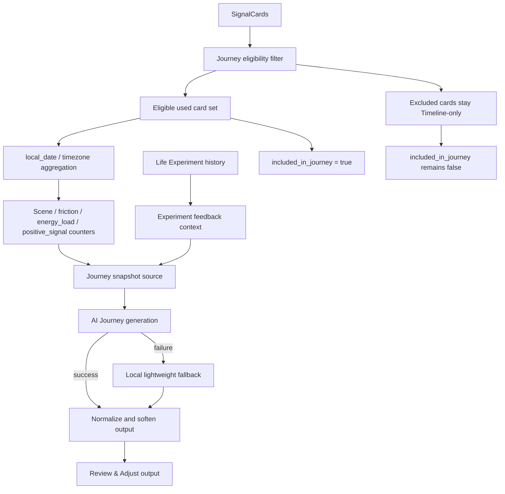
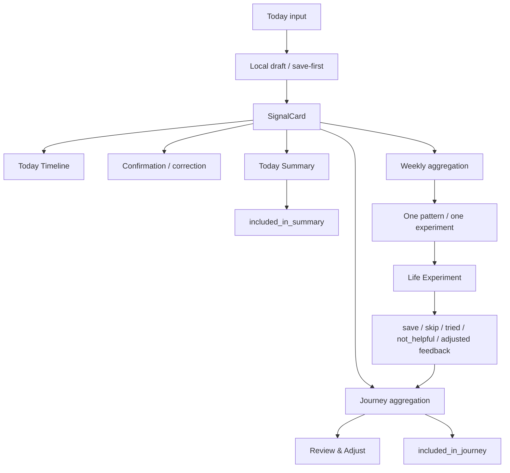

# Phase 3 V3D-3 Journey Closeout / Phase 3 Main Chain

Date: 2026-05-29

Status: Closeout created.

Scope: archive the Journey V3D engineering state and summarize the current Phase 3 main chain. This round adds no large product feature and no large Journey visual redesign.

## 1. V3D Acceptance Summary

| Stage | Status | Evidence |
| --- | --- | --- |
| V3D-1 Journey SignalCard + Experiment History Foundation | Engineering accepted | `Phase3_V3D1_Journey_SignalCard_Experiment_Foundation.md` |
| V3D-2 Journey Review & Adjust Output | Engineering accepted | `Phase3_V3D2_Journey_Review_Adjust_Output.md` |

Engineering-accepted scope:

- Journey reads SignalCards as the primary fact source.
- Journey no longer uses old `captures` / raw memory summary as the primary source of truth.
- Journey aggregates by `SignalCard.local_date` / timezone, not UTC buckets.
- Journey excludes inaccurate, sync failed, local draft, and privacy-excluded cards.
- Legacy SignalCards can be used only as low-confidence background.
- Unconfirmed SignalCards can be used only as light observation material.
- Journey reads local Life Experiment history.
- `skipped`, `not_helpful`, and `adjusted` feedback are preserved as Review & Adjust evidence.
- Journey output now starts with a light Review & Adjust section.
- Journey AI/fallback output is softened so it does not read like a judgement report.

Remaining blockers:

- Backend sync / cross-device continuity for Journey inclusion and Life Experiment history is not implemented.
- Manual UI screenshot / recording evidence remains blocked by the Release QA tooling issue listed below.

## 2. Journey Current Data Chain



Current Journey output:

- one recently repeated life pattern
- one main friction source
- one recovery clue
- one Life Experiment feedback clue
- one gentle next adjustment direction

## 3. Journey Evidence Levels

`included_in_journey = true` only means:

- the card was used by Journey at least once.

It does not mean:

- confirmed
- high-confidence
- correct
- user-validated
- safe for shared analysis

Evidence levels:

| Evidence level | Can enter Journey? | Meaning | Notes |
| --- | --- | --- | --- |
| native confirmed | yes | user has marked accurate / edited / supplemented | strongest personal Journey evidence |
| native unconfirmed | yes | saved and synced, not corrected yet | light observation only; do not present as confirmed |
| legacy_context | yes | migrated old record | historical background only; keep low confidence |
| experiment feedback | yes | user's response to a Life Experiment | Review & Adjust evidence, not direct proof of a life pattern |
| inaccurate | no | user said the interpretation is not right | must not enter Journey analysis |
| excluded / do_not_analyze / sensitive | no | user/privacy rule excludes analysis | must remain Timeline-only |
| sync failed / local draft | no | not yet synced or failed sync | saved locally, but not Journey evidence yet |

## 4. Phase 3 Main Chain Summary



Today:

- captures raw input into SignalCard.
- saves locally before AI/parser/backend work.
- keeps Diary Timeline as the primary user-visible record.
- writes `user_confirmation` and `user_correction_json`.
- Today Summary reads eligible SignalCards.
- Summary failure does not affect raw input.

Weekly:

- reads SignalCards as the primary source.
- aggregates by `local_date`.
- narrows output to one main pattern and one small experiment.
- creates local Life Experiment suggestions.
- marks eligible used cards with `included_in_weekly`.

Journey:

- reads long-range SignalCards as the primary source.
- reads Life Experiment feedback as Review & Adjust context.
- outputs a light long-term reflection.
- marks eligible used cards with `included_in_journey`.

Life Experiment:

- starts from Weekly one-experiment.
- supports `suggested`, `saved`, `skipped`, `tried`, `not_helpful`, and `adjusted`.
- preserves feedback for future Weekly / Journey.
- is not a habit tracker and not an evaluation of user discipline.

## 5. Local-First / Backend Sync Boundary

| Field / object | Current owner | Current sync status | Future decision |
| --- | --- | --- | --- |
| `included_in_summary` | Flutter local Today Summary | local-first; backend field exists but no guaranteed PATCH ownership | decide whether Today Summary should PATCH server |
| `included_in_weekly` | Flutter local Weekly | local-first; backend field exists but no guaranteed PATCH ownership | decide whether Weekly should PATCH server |
| `included_in_journey` | Flutter local Journey | local-first; backend field exists but no guaranteed PATCH ownership | decide whether Journey should PATCH server |
| `life_experiments` | Flutter local repository | local-only | create backend API/table or equivalent sync channel |
| `linked_experiment_id` | Flutter local Weekly save/link | local-first; backend field exists | decide whether experiment linking should PATCH server |
| `experiment feedback` | Flutter local repository | local-only | sync status/feedback for cross-device continuity |

Current rule:

- Phase 3 V3A-V3D proves local-first data integrity and page-chain behavior.
- Do not claim cross-device continuity for Life Experiments, inclusion flags, or Journey evidence levels until backend sync is implemented and tested.

## 6. Release QA Blocker

Manual UI evidence is still not complete.

Open Release QA blocker:

- `flutter run -t tool/v3b_evidence_app.dart` hangs/fails at `xcodebuild -resolvePackageDependencies`.
- `CoreSimulatorService connection became invalid`.
- `simdiskimaged crashed or is not responding`.
- Current simulator screenshot only shows the Apple boot logo.
- This is not valid Today / Weekly / Journey UI evidence.

Release rule:

- Do not mark manual simulator/device UI verification complete until a real simulator, real device, or CI run produces valid screenshots or recording.

## 7. Current Verification Baseline

Most recent V3D verification:

```bash
cd /Users/yangyang/ai_opportunity_radar/frontend_flutter
flutter analyze
flutter test
git diff --check
```

Result:

- `flutter analyze`: no issues found.
- `flutter test`: `63 passed`.
- `git diff --check`: clean.

Backend note:

- V3D-1 / V3D-2 / V3D-3 do not change backend execution paths.
- Backend pytest is not required for this closeout round.

## 8. Next Entry Points

Energy Budget:

- can read SignalCard `energy_load`, `friction`, `positive_signal`, one-tap state, and Life Experiment feedback.
- should keep the same low-pressure Review & Adjust tone.

Signal Library:

- must not use raw user text.
- can only use abstracted patterns and explicit privacy rules.
- should preserve the evidence-level distinction from Journey.

Release QA:

- must resolve Xcode/CoreSimulator/SPM evidence capture.
- should produce real simulator/device screenshots or recordings for Today, Weekly, Journey, and purchase flow.
