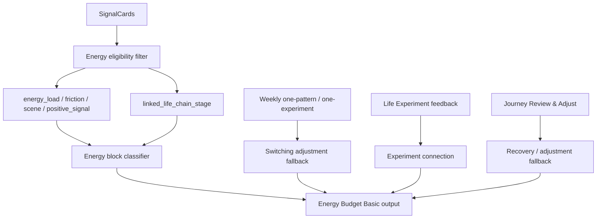

# Phase 3 V3E-1 Energy Budget Basic From Internal Signals

Date: 2026-05-29

Status: Engineering implementation in progress / V3E-1.

Scope: build the first Energy Budget foundation from internal signals only. This round does not connect Calendar, HealthKit, or large visual redesign.

Boundary note:

- V3E-1 is an internal-signal foundation.
- it is not the complete user-facing Energy Budget page.
- Calendar / HealthKit / schedule density remain deferred.
- Weekly / Journey context may support fallback and wording, but SignalCard remains the primary evidence source.

## 1. Data Sources

Energy Budget Basic reads:

- `SignalCard.energy_load`
- `SignalCard.friction`
- `SignalCard.positive_signal`
- `SignalCard.scene`
- `SignalCard.linked_life_chain_stage`
- Weekly one-pattern / one-experiment when passed in by caller
- Life Experiment feedback from local `life_experiments`
- Journey Review & Adjust output when passed in by caller

Current implementation entry:

- `EnergyBudgetRepository.fetchBasicEnergyBudget(...)`
- `LocalCaptureRepository.listSignalCards(...)`
- `LocalLifeExperimentRepository.listRecent(...)`

Data remains local-first.

## 2. Energy Block Types

The first internal-signal block taxonomy:

| Block | Meaning | Initial signals |
| --- | --- | --- |
| `high_drain` | high-drain block | `energy_load = draining/drain`, pressure, overload, meeting friction |
| `high_switching` | high-switching block | context switch, interrupt, message, meeting, `attention_switching` |
| `deep` | deep block | focus/deep/creative scenes, `deep_work` |
| `recovery` | recovery block | restoring/recovery energy load, positive signal, `recovery` |
| `boundary` | boundary block | boundary, relationship, message, responsibility, `boundary` |
| `buffer` | buffer block | schedule overload, switching, meeting, `buffer` |

These are not Calendar blocks yet. They are inferred internal Energy Load Blocks from user-entered signals.

## 3. Inclusion / Exclusion

Eligible:

- native synced SignalCards
- `accurate`, `edited`, `supplemented`
- `unconfirmed`, as light observation only
- legacy, as low-confidence background

Excluded:

- `user_confirmation = inaccurate`
- `is_local_draft = true`
- `sync_failed = true`
- `privacy_level = do_not_analyze`
- `privacy_level = excluded`
- `privacy_level = sensitive`

Evidence levels:

- native confirmed cards can provide stronger energy evidence.
- native unconfirmed cards remain light observation.
- legacy cards remain `legacy_context`.
- Life Experiment feedback is Review & Adjust evidence, not a discipline score.

## 4. Output Structure

Energy Budget Basic returns:

- `mostDrainingSource`: this period's most energy-consuming source
- `recoveryClue`: one recovery clue
- `bufferLocation`: one place that may need buffer
- `switchingAdjustment`: one small adjustment to reduce switching load
- `experimentConnection`: one suggestion connected to Life Experiment feedback
- `blocks`: typed `EnergyBlockModel` list

User-facing tone:

- do not say "energy management failed".
- do not say "you should be more disciplined".
- do not say "your schedule is bad".
- use "这个安排可能有点耗力".
- use "可以先给这里留一点余地".

## 5. Data Chain

## 6. Current Code Paths

- model: `frontend_flutter/lib/core/models/energy_budget_models.dart`
- repository: `frontend_flutter/lib/core/api/repositories/energy_budget_repository.dart`
- DI: `frontend_flutter/lib/core/di/app_dependencies.dart`
- SignalCard local schema: `frontend_flutter/lib/core/local/local_database.dart`
- SignalCard mapping: `frontend_flutter/lib/core/local/local_capture_repository.dart`

Schema note:

- local `signal_cards.linked_life_chain_stage` was added for internal Energy Budget classification.
- it stores a JSON string list.

## 7. Tests

Covered by `frontend_flutter/test/core/api/repositories/energy_budget_repository_test.dart`:

- Energy Budget reads SignalCards.
- `energy_load` / `friction` aggregate into block types.
- legacy / unconfirmed can enter with evidence distinction.
- inaccurate does not enter.
- excluded / sensitive / sync failed do not enter.
- Life Experiment feedback connects to Energy Budget without failure wording.
- insufficient data fallback can use Weekly / Journey context.

Commands:

- `flutter test test/core/api/repositories/energy_budget_repository_test.dart`
- `flutter analyze`
- `flutter test`

Backend pytest is not required for V3E-1 because this is Flutter local-first Energy Budget foundation only.

## 8. Remaining Boundaries

Not included in V3E-1:

- Calendar integration
- HealthKit integration
- Energy Budget charts
- large Weekly / Journey visual redesign
- backend sync for energy block inference

Release QA blocker remains:

- Xcode / CoreSimulator / SPM issue prevents reliable simulator screenshot or recording evidence.
- do not mark manual UI evidence complete before valid simulator/device/CI screenshots or recording exist.
