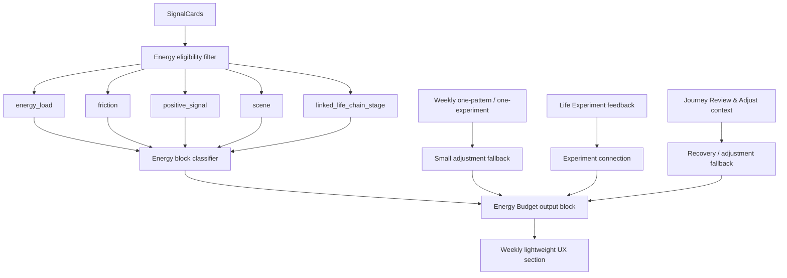

# Phase 3 V3E-3 Energy Budget Closeout / Signal Library Entry

Date: 2026-05-29

Status: Closeout created.

Scope: archive the V3E Energy Budget stage and define the V3F Signal Library entry boundary. This round adds no new large feature and no large visual redesign.

## 1. V3E Acceptance Summary

| Stage | Status | Evidence |
| --- | --- | --- |
| V3E-1 Energy Budget internal-signal foundation | Engineering accepted | `Phase3_V3E1_Energy_Budget_Basic_Internal_Signals.md` |
| V3E-2 Energy Budget low-pressure UX / copy | Engineering accepted | `Phase3_V3E2_Energy_Budget_Low_Pressure_UX.md` |

Engineering-accepted scope:

- Energy Budget can be generated from internal signals without Calendar or HealthKit.
- SignalCard remains the primary evidence source.
- Energy Budget reads `energy_load`, `friction`, `positive_signal`, `scene`, and `linked_life_chain_stage`.
- Weekly one-pattern, Life Experiment feedback, and Journey Review & Adjust can support fallback and wording.
- Energy Budget block appears in Weekly as a lightweight observation section.
- Energy Budget copy avoids score, diagnosis, discipline, or failure framing.
- Energy Budget tests cover inclusion / exclusion, Life Experiment feedback, fallback, and low-pressure UX.

Remaining blockers:

- no standalone Energy Budget dashboard yet.
- no Calendar / HealthKit / schedule-density integration yet.
- no backend sync for Energy Budget inference yet.
- manual UI screenshot / recording evidence remains blocked by Release QA tooling.

## 2. Current Energy Budget Data Chain



Current Energy Budget output:

- most costly source
- recovery clue
- buffer point
- small switching adjustment
- Life Experiment connection
- typed Energy Load Blocks

## 3. Product Boundaries

Current V3E is:

- internal-signal Energy Budget foundation.
- a lightweight Weekly observation block.
- local-first.
- low-pressure and non-diagnostic.

Current V3E is not:

- a complete standalone Energy Budget dashboard.
- a Calendar integration.
- a HealthKit integration.
- schedule-density analysis.
- time-management scoring.
- productivity or discipline evaluation.

Failure boundary:

- Energy Budget loading / aggregation failure must not block Weekly.
- Energy Budget is an added observation layer, not a prerequisite for Weekly.
- Energy Budget failure must not affect Today, Journey, SignalCard, or Life Experiment.

Evidence boundary:

- SignalCard is the primary evidence source.
- Weekly / Journey context is optional support and fallback.

## 4. Evidence Rules

Eligible:

- native confirmed SignalCards: stronger personal evidence.
- native unconfirmed SignalCards: light observation only.
- legacy SignalCards: low-confidence background only.
- Life Experiment feedback: Review & Adjust evidence, not proof of a pattern.

Excluded:

- `user_confirmation = inaccurate`
- local draft
- sync failed
- `privacy_level = do_not_analyze`
- `privacy_level = excluded`
- `privacy_level = sensitive`

Energy Budget must not convert inclusion into certainty:

- using a card in Energy Budget does not mean the card is confirmed.
- legacy and unconfirmed evidence levels must remain visible in implementation and documentation.

## 5. V3F Signal Library Entry Definition

Signal Library purpose:

- show shared, abstracted life signals.
- help users recognize common patterns without exposing private stories.
- support low-cost actions: "I also have this" and "save to my observation".

Privacy boundary:

- Signal Library can only use abstracted patterns.
- Signal Library must not use or expose user `raw_text`.
- Signal Library must not display user-specific stories.
- Signal Library must not allow other users to infer identity, location, workplace, family relationship, medical status, finances, or concrete events.
- Initial version should be official/curated, not open community posting.

Allowed content shape:

- abstract pattern title.
- short pattern summary.
- broad scenes like work / recovery / relationships / attention / body.
- optional low-cost Life Experiment template.
- share card based on abstract pattern only.

Disallowed content shape:

- raw user note.
- direct quote from user.
- specific company, school, location, family role, or named relationship.
- timestamped event narrative.
- rare combination of details that could identify a person.

User actions:

- `I also have this`: private by default.
- `save to my observation`: private by default.
- sharing: share only the abstract library pattern, never the user's personal note.

Save-to-observation rule:

- saving a Signal Library item creates a personal SignalCard with `source_type = library_saved`.
- it should not copy another user's raw text.
- it should store the abstract pattern as the user's private observation seed.
- user can later confirm, edit, supplement, or exclude it like any SignalCard.

V3F first implementation target:

- define curated Signal Library data structure.
- render abstract signal cards.
- support "I also have this" privately.
- support saving an abstract pattern to personal SignalCard as `library_saved`.
- do not implement open community submission.

## 6. Release QA Blocker

Manual UI evidence is still not complete.

Open Release QA blocker:

- `flutter run -t tool/v3b_evidence_app.dart` hangs/fails at `xcodebuild -resolvePackageDependencies`.
- `CoreSimulatorService connection became invalid`.
- `simdiskimaged crashed or is not responding`.
- Current simulator screenshot only shows the Apple boot logo.
- This is not valid Today / Weekly / Journey / Energy Budget UI evidence.

Release rule:

- Do not mark manual simulator/device UI verification complete until a real simulator, real device, or CI run produces valid screenshots or recording.

## 7. Verification Baseline

Most recent V3E verification:

```bash
cd /Users/yangyang/ai_opportunity_radar/frontend_flutter
flutter analyze
flutter test
git diff --check
```

Result:

- `flutter analyze`: no issues found.
- `flutter test`: `69 passed`.
- `git diff --check`: clean.

Backend note:

- V3E does not change backend execution paths.
- Backend pytest is not required for this closeout round.
