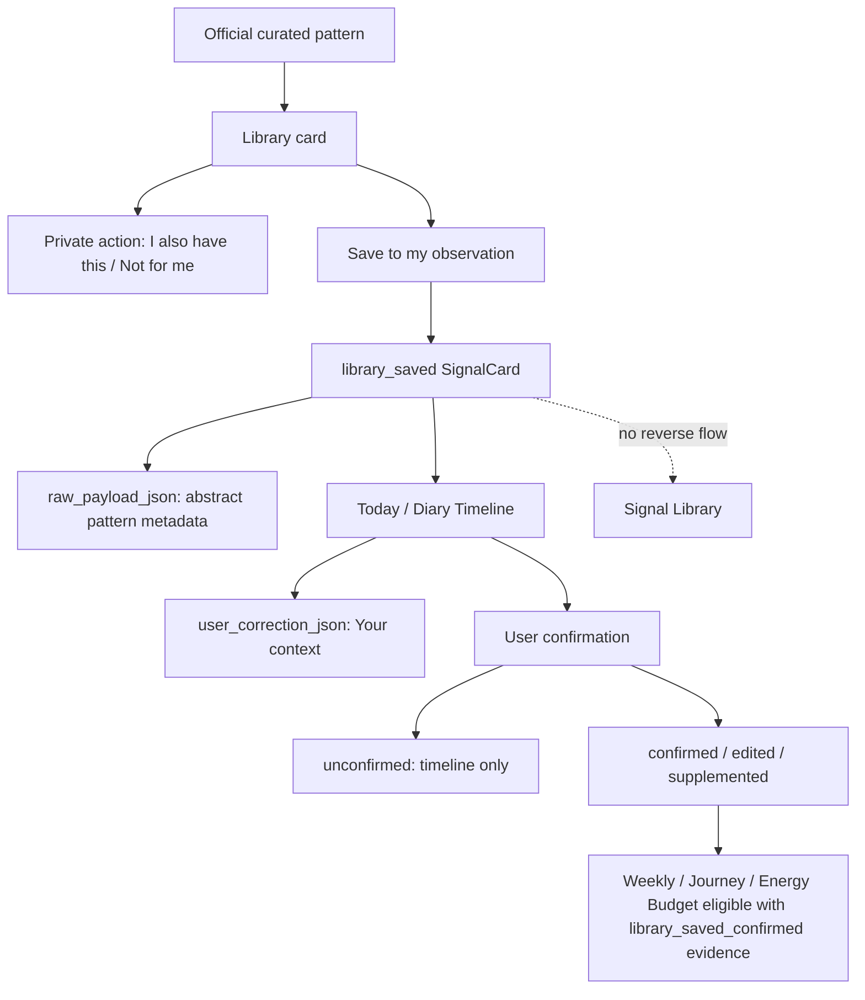

# Phase 3 V3F-3: Signal Library Closeout + Phase 3 Implementation Boundary

Status: Engineering closeout.

## V3F Status

| Stage | Scope | Status | Remaining blocker |
| --- | --- | --- | --- |
| V3F-1 | Signal Library Privacy-Safe Foundation | Engineering accepted | Release QA manual UI evidence still deferred |
| V3F-1A | Privacy Evidence / Tests | Engineering accepted | Release QA manual UI evidence still deferred |
| V3F-2 | Library Saved SignalCard Integration | Engineering accepted | Release QA manual UI evidence still deferred |

V3F is closed as an official curated / abstracted Signal Library stage. It is not a community feature, recommendation feed, or user story sharing system.

## Signal Library Data Chain

## Evidence Levels

| Evidence level | Meaning | Analysis treatment |
| --- | --- | --- |
| original diary SignalCard | User wrote or spoke the original note | Can enter analysis if otherwise eligible |
| confirmed original SignalCard | User marked original card accurate / edited / supplemented | Stronger personal evidence |
| library_saved unconfirmed | User saved an abstract Library pattern but has not confirmed it | Timeline only; not used as high-confidence analysis |
| library_saved_confirmed | User confirmed, edited, or supplemented a saved Library pattern | Eligible as personal observation, but distinct from native diary evidence |
| legacy_context | Migrated historical record | Low-confidence background only |
| excluded / inaccurate / sync failed | User rejected, privacy-excluded, or not safely synced | Excluded from analysis |

`included_in_summary`, `included_in_weekly`, and `included_in_journey` mean "used by that layer." They do not mean confirmed, high confidence, or shared.

## Privacy Red Lines

- Do not use user `raw_text` to generate Library cards.
- Do not display user stories in Library.
- Do not display identifiable people, places, companies, family relationships, or specific events.
- Do not generate public interaction counts or public popularity metadata.
- Do not generate Library cards from personal SignalCards.
- Do not send user supplements back into shared Library content.
- Do not treat `library_saved` as the user's own raw diary text.

## Explicit Non-Goals

- No community.
- No "everyone also has this" social proof.
- No recommendation feed.
- No automatic sharing.
- No anonymous user story display.
- No public saves, likes, counts, or ranking.
- No reverse generation from personal observations into shared patterns.

## Phase 3 Boundary After V3F

Current completed engineering chain:

- Today: SignalCard capture, local draft safety, confirmation, correction, Diary Timeline, Today Summary inclusion.
- Weekly: SignalCard aggregation, one pattern, one experiment, Weekly inclusion.
- Journey: SignalCard long-term reflection, Experiment history, Review & Adjust.
- Energy Budget: internal-signal foundation and low-pressure Weekly block.
- Signal Library: official abstract pattern library, private actions, private `library_saved` SignalCard integration.

The next stage can continue into V3G or Release QA, but must preserve the privacy red lines above.

## Release QA Blocker

The Release QA blocker remains open:

- Xcode/CoreSimulator/SPM manual screenshots or recordings are still deferred.
- Engineering tests do not count as manual UI evidence.
- V3F must not be marked as manually UI-verified until screenshot or recording evidence is captured.
