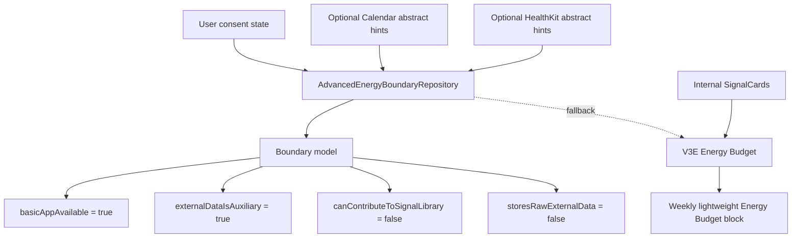

# Phase 3 V3G-1 Calendar / HealthKit Consent Boundary

Date: 2026-05-30

Status: Engineering implemented.

Scope: define the Advanced Energy Budget consent, privacy, storage, fallback, and test boundary for future Calendar / HealthKit enhancements. This round does not request real Calendar or HealthKit permissions, does not read external data, and does not add a schedule dashboard.

## 1. Consent Boundary

Calendar and HealthKit are later advanced enhancements. They are not required for the base app.

Rules:

- authorization is optional.
- the app remains usable when permission is not requested.
- the app remains usable when the user denies access.
- the app remains usable when the user revokes access.
- the user can choose later without losing Today, Weekly, Journey, Signal Library, or internal Energy Budget behavior.
- permission denial must not lower the quality of the basic Today / Weekly / Journey experience.

Implementation boundary:

- `AdvancedEnergyConsentState` records Calendar and HealthKit permission states.
- `AdvancedEnergyBoundaryRepository.evaluate()` always keeps `basicAppAvailable = true`.
- `appCanRunWithoutExternalConsent` is always true for this boundary layer.

## 2. Data Scope

Calendar may only contribute abstract schedule hints:

- schedule density
- meeting density
- switching / transition pressure

Calendar must not read or expose by default:

- event title
- event notes
- location
- attendees
- organizer
- contact details

HealthKit may only contribute abstract recovery hints:

- sleep trend
- steps trend
- workout trend
- recovery trend

HealthKit must not read or expose by default:

- raw samples
- precise health records
- routes
- heart-rate samples
- unnecessary sensitive detail

Raw external details may only be considered in a future explicit user-selected flow. They are not part of V3G-1.

## 3. Privacy / Storage Rules

Default storage posture:

- local-first.
- no raw Calendar data uploaded.
- no raw HealthKit data uploaded.
- no external raw data used for public or shared analysis.
- no external raw data enters Signal Library.
- no external raw data generates public / abstract Library patterns.
- no raw external data is mixed with `SignalCard.raw_text` into an identifiable story.

Allowed downstream shape:

- `schedule_density_hint`
- `meeting_density_hint`
- `switching_hint`
- `sleep_trend_hint`
- `steps_trend_hint`
- `workout_trend_hint`
- `recovery_trend_hint`

Disallowed downstream shape:

- event titles
- event notes
- locations
- names
- contacts
- family relationships
- workplaces
- medical raw details
- route data
- rare combinations that could identify a person or event

## 4. Energy Budget Use Rules

SignalCard remains the primary evidence source.

External data can only be auxiliary:

- external hints are advisory context only.
- it can add a soft schedule / recovery hint.
- Calendar / HealthKit hints cannot override user-confirmed SignalCards or direct user feedback.
- it cannot override user confirmation.
- it cannot turn unconfirmed evidence into confirmed evidence.
- it cannot force a diagnosis, score, or productivity judgement.
- it cannot become a prerequisite for Weekly, Journey, or Energy Budget.

Energy Budget output must remain low pressure:

- "this period may have been a little costly"
- "you could leave a little more room here"
- "this adjustment can just be something to try"

Avoid:

- "you slept too badly"
- "your schedule failed"
- "you should be more disciplined"
- medical diagnosis
- performance scoring

## 5. Fallback Matrix

| State | Energy Budget behavior | App behavior |
| --- | --- | --- |
| Permission not requested | Use V3E internal SignalCard Energy Budget | Today / Weekly / Journey unaffected |
| Permission denied | Use V3E internal SignalCard Energy Budget | User can keep access off |
| Permission revoked | Use V3E internal SignalCard Energy Budget | User can choose again later |
| External data unavailable | Use V3E internal SignalCard Energy Budget | No blocking error |
| External data insufficient | Show light explanation; do not pretend depth | Weekly / Journey remain available |
| External hints available | Use abstract hints as auxiliary context | SignalCard remains primary evidence |

Fallback copy:

- Calendar and Health access are optional. Energy Budget works from internal SignalCard observations first.
- You can keep Calendar and Health access off. Energy Budget still works from your own SignalCard observations.
- External signals are unavailable right now. Energy Budget can still use your internal SignalCard observations.

## 6. Current Data Chain



No current code path requests platform permissions or reads platform data.

## 7. Test Evidence

V3G-1 adds:

- `advanced_energy_boundary_repository_test.dart`
- an Energy Budget regression test for denied / not-requested Calendar and HealthKit consent.

Covered rules:

- permission not requested keeps basic app and internal Energy Budget.
- consent denied falls back without reducing Today / Weekly / Journey.
- external data unavailable falls back to SignalCard evidence.
- authorized external data is represented as abstract auxiliary metadata only.
- raw Calendar and HealthKit fields are not allowed downstream.
- external raw data cannot contribute to Signal Library.
- internal-signal Energy Budget still runs without Calendar / HealthKit authorization.

Expected verification:

```bash
cd /Users/yangyang/ai_opportunity_radar/frontend_flutter
dart format lib/core/models/advanced_energy_boundary_models.dart lib/core/api/repositories/advanced_energy_boundary_repository.dart test/core/api/repositories/advanced_energy_boundary_repository_test.dart test/core/api/repositories/energy_budget_repository_test.dart
flutter test test/core/api/repositories/advanced_energy_boundary_repository_test.dart
flutter test test/core/api/repositories/energy_budget_repository_test.dart
flutter analyze
flutter test
git diff --check
```

Backend pytest is not required for V3G-1 because this round does not change backend code or platform integrations.

## 8. Explicit Non-Goals

V3G-1 does not include:

- Calendar permission prompt.
- HealthKit permission prompt.
- EventKit integration.
- HealthKit integration.
- schedule dashboard.
- raw event display.
- raw health detail display.
- cross-device sync for external hints.
- Signal Library generation from external data.

## 9. Release QA Blocker

The Release QA blocker remains open:

- Xcode/CoreSimulator/SPM manual screenshots or recordings are still deferred.
- Engineering tests do not count as manual UI evidence.
- V3G-1 must not be marked as manually UI-verified until screenshot or recording evidence is captured.

Release rule:

- Do not mark manual simulator/device UI verification complete until a real simulator, real device, or CI run produces valid screenshots or recording.
