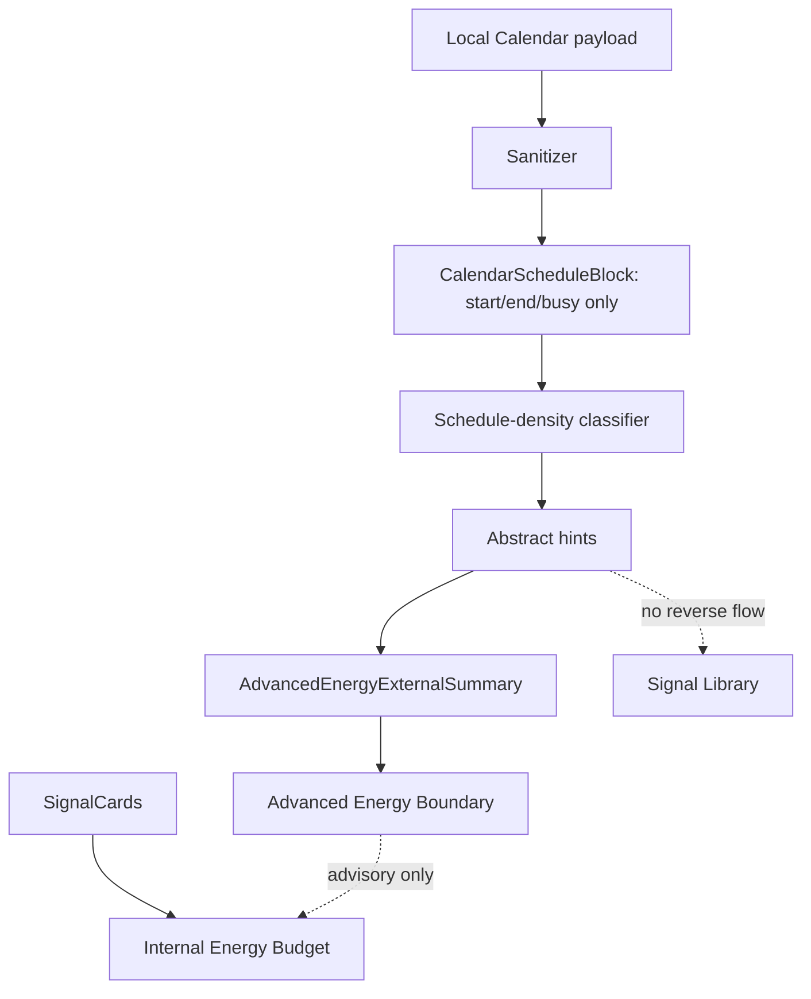

# Phase 3 V3G-2 Calendar Schedule-Density Local Prototype

Date: 2026-05-30

Status: Engineering implemented.

Scope: create a local-only Calendar schedule-density prototype for Advanced Energy Budget. This round does not build a full schedule dashboard, does not upload Calendar raw data, and does not display event titles, locations, attendees, notes, or descriptions.

## 1. Calendar Data Boundary

Allowed local inputs:

- event start time
- event end time
- busy / free flag

`isBusy` rule:

- `isBusy` can only be used for aggregate density calculation.
- do not display event-level busy evidence.
- do not output specific time-slot schedule evidence.

Disallowed downstream data:

- event title
- location
- attendees
- organizer
- notes
- description
- contact details
- any identifiable event story

The prototype sanitizer only converts local event payloads into `CalendarScheduleBlock(startAt, endAt, isBusy)`. Raw Calendar fields are ignored and are not included in output metadata.

## 2. Abstract Hint Types

V3G-2 can generate only these abstract hints:

- `meeting_density_hint`
- `schedule_density_hint`
- `back_to_back_blocks_hint`
- `switching_hint`
- `missing_buffer_hint`
- `long_deep_block_hint`
- `recovery_gap_hint`

Product-language equivalents:

- meeting density
- schedule density
- back-to-back blocks
- switching load
- missing buffer
- long deep block
- recovery gap

## 3. Permission / Fallback

| Calendar state | Behavior |
| --- | --- |
| permission not requested | Use internal SignalCard Energy Budget |
| denied / revoked | Use internal SignalCard Energy Budget |
| unavailable | Use internal SignalCard Energy Budget |
| authorized but no data | Use internal SignalCard Energy Budget |
| authorized but read failed | Use internal SignalCard Energy Budget |
| authorized with usable local blocks | Generate abstract schedule-density hints |

Calendar failure must not affect:

- Today capture
- Today Summary
- Weekly
- Journey
- SignalCard storage
- Life Experiment feedback
- internal Energy Budget

## 4. Energy Budget Use Rules

Calendar hints are advisory context only.

SignalCard remains the primary evidence source:

- Calendar hints cannot override user-confirmed SignalCards.
- Calendar hints cannot override user feedback.
- Calendar hints cannot confirm an unconfirmed SignalCard.
- Calendar hints cannot turn a pattern into a diagnosis.
- Calendar hints cannot enter Signal Library.
- Calendar hints cannot generate public / abstract patterns.
- `isBusy` can only shape aggregate density hints; it cannot become visible event-level evidence.

## 5. Low-Pressure Copy

Allowed direction:

- "this period may be fairly full"
- "this period may be somewhat dense"
- "several transitions may make this period feel a little dense"
- "there may be a spot where a small buffer would help"

Avoid:

- "your schedule failed"
- "you are too busy, so your state is bad"
- "you should be more disciplined"
- diagnosis or score language

## 6. Current Data Chain



No current code path requests EventKit permission or reads platform Calendar directly.

## 7. Test Evidence

V3G-2 adds:

- `calendar_schedule_density_repository_test.dart`

Covered rules:

- permission denied fallback.
- permission not requested fallback.
- Calendar unavailable fallback.
- authorized but no Calendar data fallback.
- authorized schedule-density abstract hint generation.
- raw title / location / attendees / notes / description do not flow downstream.
- Calendar hints cannot enter Signal Library.
- Calendar hints cannot override user-confirmed SignalCards.
- Calendar read failure does not block the internal Energy Budget boundary.

Expected verification:

```bash
cd /Users/yangyang/ai_opportunity_radar/frontend_flutter
dart format lib/core/models/advanced_energy_boundary_models.dart lib/core/models/calendar_schedule_density_models.dart lib/core/api/repositories/advanced_energy_boundary_repository.dart lib/core/api/repositories/calendar_schedule_density_repository.dart test/core/api/repositories/advanced_energy_boundary_repository_test.dart test/core/api/repositories/calendar_schedule_density_repository_test.dart
flutter test test/core/api/repositories/calendar_schedule_density_repository_test.dart
flutter test test/core/api/repositories/advanced_energy_boundary_repository_test.dart
flutter analyze
flutter test
git diff --check
```

Backend pytest is not required because V3G-2 is local-first Flutter boundary/prototype work only.

## 8. Explicit Non-Goals

V3G-2 does not include:

- EventKit permission prompt.
- real Calendar data read.
- Calendar dashboard.
- raw event display.
- raw event upload.
- event-title analysis.
- attendee / location / note analysis.
- Signal Library generation from Calendar hints.
- HealthKit integration.

## 9. Release QA Blocker

The Release QA blocker remains open:

- Xcode/CoreSimulator/SPM manual screenshots or recordings are still deferred.
- Engineering tests do not count as manual UI evidence.
- V3G-2 must not be marked as manually UI-verified until screenshot or recording evidence is captured.
