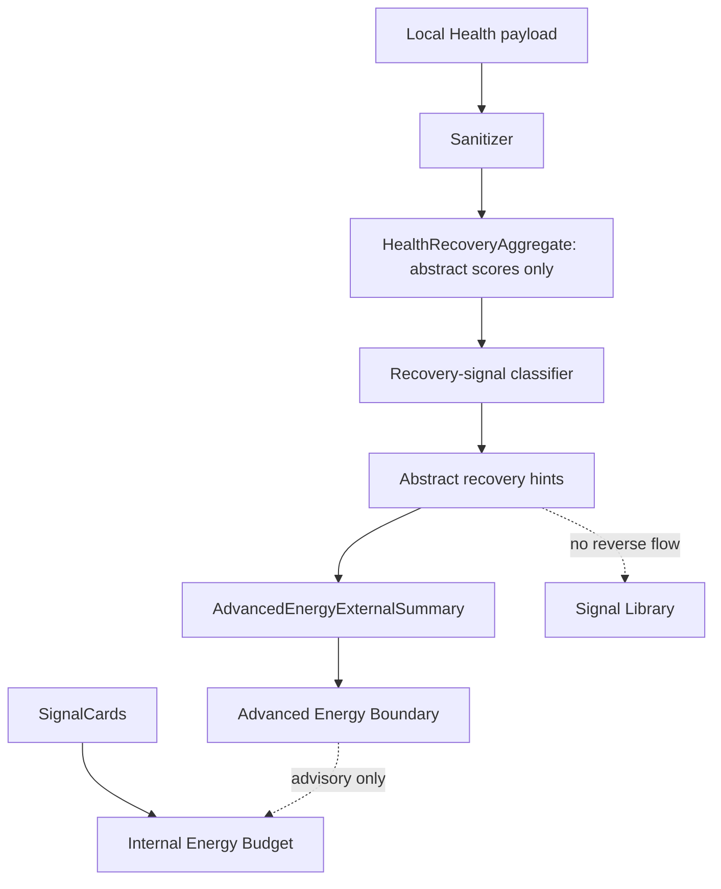

# Phase 3 V3G-3 HealthKit Recovery-Signal Local Prototype

Date: 2026-05-30

Status: Engineering implemented.

Scope: create a local-only HealthKit recovery-signal prototype for Advanced Energy Budget. This round does not build a health dashboard, does not perform medical diagnosis, does not request HealthKit permission, and does not display raw health samples.

## 1. HealthKit Data Boundary

Allowed local inputs are already-abstracted recovery aggregates:

- sleep recovery score
- movement recovery score
- workout load score
- recovery score
- days covered

Recovery score rule:

- recovery score can exist as an internal aggregate value.
- do not show recovery score directly to users as a score, diagnosis, or health evaluation.
- user-facing wording must say recovery signal / 恢复信号, not score.

Disallowed downstream data:

- raw sleep samples
- raw heart rate
- raw workout details
- workout route
- precise health timeline
- medical record detail
- any personally identifiable health story

The prototype sanitizer converts local payloads into `HealthRecoveryAggregate`. Raw HealthKit sample fields are ignored and are not included in output metadata.

## 2. Abstract Hint Types

V3G-3 can generate only these abstract hints:

- `sleep_recovery_hint`
- `movement_recovery_hint`
- `workout_load_hint`
- `recovery_gap_hint`
- `low_recovery_hint`
- `stable_recovery_hint`

## 3. Permission / Fallback

| HealthKit state | Behavior |
| --- | --- |
| permission not requested | Use internal SignalCard Energy Budget |
| denied / revoked | Use internal SignalCard Energy Budget |
| unavailable | Use internal SignalCard Energy Budget |
| authorized but no data | Use internal SignalCard Energy Budget |
| authorized but read failed | Use internal SignalCard Energy Budget |
| authorized with usable aggregate | Generate abstract recovery hints |

HealthKit failure must not affect:

- Today capture
- Today Summary
- Weekly
- Journey
- SignalCard storage
- Life Experiment feedback
- internal Energy Budget

## 4. Energy Budget Use Rules

HealthKit hints are advisory context only.

SignalCard remains the primary evidence source:

- HealthKit hints cannot override user-confirmed SignalCards.
- HealthKit hints cannot override user feedback.
- HealthKit hints cannot confirm an unconfirmed SignalCard.
- HealthKit hints cannot turn a pattern into a diagnosis.
- HealthKit hints cannot become a health score in the product.
- internal recovery scores must be translated into recovery-signal language before any user-facing output.
- HealthKit hints cannot enter Signal Library.
- HealthKit hints cannot generate public / abstract patterns.

## 5. Low-Pressure Copy

Allowed direction:

- "recovery signals may be a little weak"
- "this period may be a good place to leave some recovery space"
- "movement may be offering some recovery support"
- "workout load may ask for a little more recovery room"

Avoid:

- "your sleep is bad"
- "your body state is poor"
- "you need to exercise"
- diagnosis or score language

## 6. Current Data Chain



No current code path requests HealthKit permission or reads platform health data directly.

## 7. Test Evidence

V3G-3 adds:

- `health_recovery_signal_repository_test.dart`

Covered rules:

- permission denied fallback.
- permission not requested fallback.
- HealthKit unavailable fallback.
- authorized but no health data fallback.
- authorized recovery hint generation.
- raw sleep sample / raw heart rate / raw workout detail / precise health timeline do not flow downstream.
- HealthKit hints cannot enter Signal Library.
- HealthKit hints cannot override user-confirmed SignalCards.
- HealthKit read failure does not block the internal Energy Budget boundary.

Expected verification:

```bash
cd /Users/yangyang/ai_opportunity_radar/frontend_flutter
dart format lib/core/models/advanced_energy_boundary_models.dart lib/core/models/health_recovery_signal_models.dart lib/core/api/repositories/advanced_energy_boundary_repository.dart lib/core/api/repositories/health_recovery_signal_repository.dart test/core/api/repositories/advanced_energy_boundary_repository_test.dart test/core/api/repositories/health_recovery_signal_repository_test.dart
flutter test test/core/api/repositories/health_recovery_signal_repository_test.dart
flutter test test/core/api/repositories/advanced_energy_boundary_repository_test.dart
flutter analyze
flutter test
git diff --check
```

Backend pytest is not required because V3G-3 is local-first Flutter boundary/prototype work only.

## 8. Explicit Non-Goals

V3G-3 does not include:

- HealthKit permission prompt.
- real HealthKit data read.
- health dashboard.
- raw sample display.
- raw sample upload.
- sleep diagnosis.
- body state scoring.
- workout prescription.
- Signal Library generation from HealthKit hints.
- Calendar integration changes.

## 9. Release QA Blocker

The Release QA blocker remains open:

- Xcode/CoreSimulator/SPM manual screenshots or recordings are still deferred.
- Engineering tests do not count as manual UI evidence.
- V3G-3 must not be marked as manually UI-verified until screenshot or recording evidence is captured.
