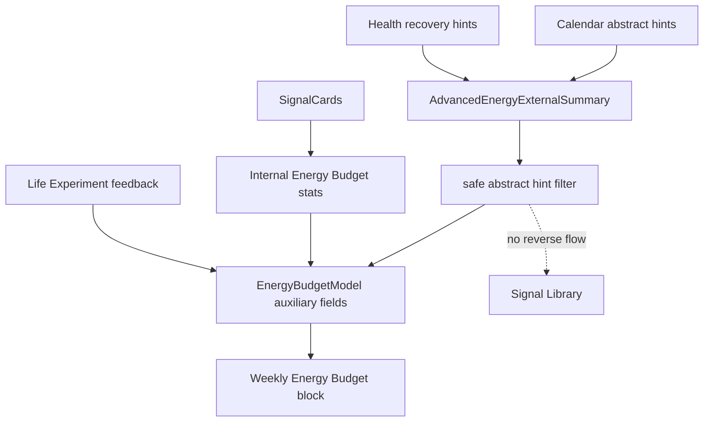

# Phase 3 V3G-4 Advanced Energy Budget Abstract Hint Integration

Date: 2026-05-30

Status: Engineering implemented.

Scope: integrate V3G-2 Calendar abstract hints and V3G-3 Health recovery hints into Energy Budget as auxiliary context. This round does not connect real EventKit / HealthKit permissions, does not build a schedule dashboard, and does not build a health dashboard.

## 1. Input Integration

Primary evidence:

- `SignalCard.energy_load`
- `SignalCard.friction`
- `SignalCard.scene`
- `SignalCard.positive_signal`
- user confirmation / correction

Auxiliary context:

- Calendar schedule-density hints
- Health recovery hints
- Life Experiment feedback as Review & Adjust context

External hints are advisory context only. They cannot override user-confirmed SignalCards or direct user feedback.

## 2. Priority / Conflict Rule

Priority order:

1. user-confirmed SignalCards and user feedback
2. internal SignalCard evidence
3. Life Experiment feedback
4. Calendar / HealthKit abstract hints

Conflict rule:

- if external hints conflict with user-confirmed records, user-confirmed records win.
- output must acknowledge that external hints do not necessarily represent the user's real feeling.
- do not automatically conclude cause, diagnosis, schedule failure, health issue, or low discipline.

## 3. Output Structure

Advanced Energy Budget now supports:

- one most costly source
- one schedule density / switching-load hint
- one recovery signal hint
- one buffer location
- one low-cost adjustment
- one Life Experiment connection

Calendar and Health hints are stored as `abstractExternalHints`; only allowlisted abstract keys may appear there.

`abstractExternalHints` rule:

- can only contain sanitized abstract labels or aggregate hint values.
- cannot contain raw Calendar event fields.
- cannot contain raw HealthKit samples.
- cannot contain precise timeline data.
- cannot contain user-identifiable context.

## 4. Privacy Boundary

Disallowed:

- raw Calendar data
- event-level busy evidence
- specific time-slot schedule evidence
- event title
- location
- attendees
- notes / description
- raw HealthKit samples
- raw heart rate
- raw workout details
- precise health timeline
- Signal Library generation
- public / abstract pattern generation from external hints
- raw external data upload
- user-identifiable context inside `abstractExternalHints`

Allowed:

- `schedule_density_hint`
- `meeting_density_hint`
- `back_to_back_blocks_hint`
- `switching_hint`
- `missing_buffer_hint`
- `long_deep_block_hint`
- `sleep_recovery_hint`
- `movement_recovery_hint`
- `workout_load_hint`
- `recovery_gap_hint`
- `low_recovery_hint`
- `stable_recovery_hint`

## 5. Low-Pressure Copy

Allowed direction:

- "这段时间可能比较密"
- "恢复信号可能偏弱"
- "可以先给这里留一点余地"
- "不一定代表你的真实感受"
- "以你确认过的 SignalCard 和反馈为准"

Avoid:

- "你安排失败"
- "你的身体状态不好"
- "你恢复分数低"
- diagnosis
- score language
- discipline pressure

## 6. Fallback

| External state | Behavior |
| --- | --- |
| Calendar hint missing | Energy Budget still runs from internal SignalCards |
| Health hint missing | Energy Budget still runs from internal SignalCards |
| Both missing | Return to V3E internal-signal Energy Budget |
| External read failed | Today / Weekly / Journey / SignalCard remain unaffected |
| Internal evidence insufficient | Do not pretend external hints are primary evidence |

## 7. Current Data Chain



## 8. Test Evidence

V3G-4 adds Energy Budget tests for:

- Calendar + Health hints entering Energy Budget as auxiliary fields.
- external hints missing fallback.
- conflict rule.
- raw external data not entering output or metadata.
- hints not entering Signal Library-shaped data.
- user-confirmed SignalCard priority.

Expected verification:

```bash
cd /Users/yangyang/ai_opportunity_radar/frontend_flutter
dart format lib/core/models/energy_budget_models.dart lib/core/api/repositories/energy_budget_repository.dart test/core/api/repositories/energy_budget_repository_test.dart
flutter test test/core/api/repositories/energy_budget_repository_test.dart
flutter analyze
flutter test
git diff --check
```

Backend pytest is not required because V3G-4 is Flutter local-first Energy Budget integration only.

## 9. Explicit Non-Goals

V3G-4 does not include:

- EventKit permission prompt.
- HealthKit permission prompt.
- real external data read.
- schedule dashboard.
- health dashboard.
- diagnosis.
- score display.
- raw data upload.
- Signal Library generation from external hints.

## 10. Release QA Blocker

The Release QA blocker remains open:

- Xcode/CoreSimulator/SPM manual screenshots or recordings are still deferred.
- Engineering tests do not count as manual UI evidence.
- V3G-4 must not be marked as manually UI-verified until screenshot or recording evidence is captured.
