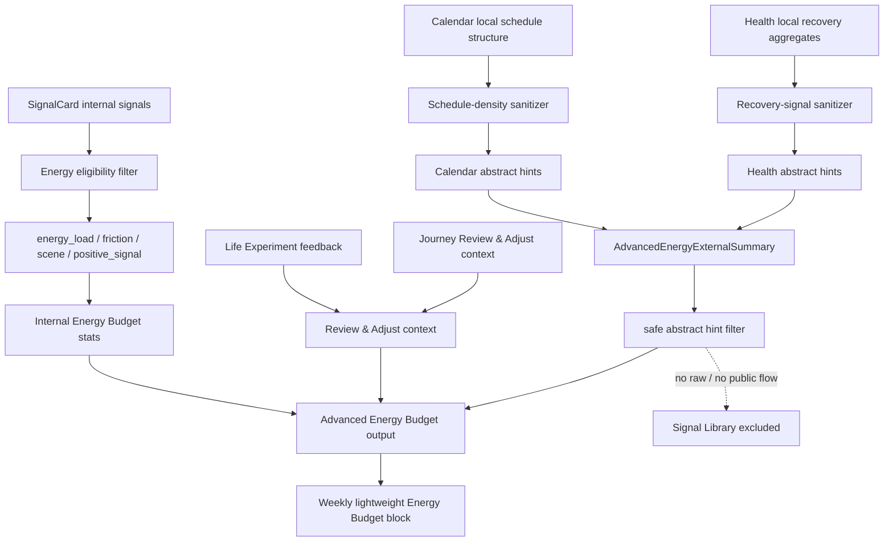

# Phase 3 V3G-5 Advanced Energy Budget Closeout / Phase 3 Implementation Closeout Prep

Date: 2026-05-30

Status: Engineering closeout.

Scope: archive the V3G Advanced Energy Budget stage and prepare Phase 3 implementation closeout. This round adds no new product feature, no EventKit / HealthKit permission integration, and no dashboard.

## 1. V3G Acceptance Summary

| Stage | Scope | Status | Remaining blocker |
| --- | --- | --- | --- |
| V3G-1 | Calendar / HealthKit consent boundary | Engineering accepted | Release QA manual UI evidence still deferred |
| V3G-2 | Calendar schedule-density local prototype | Engineering accepted | Release QA manual UI evidence still deferred |
| V3G-3 | HealthKit recovery-signal local prototype | Engineering accepted | Release QA manual UI evidence still deferred |
| V3G-4 | Advanced Energy Budget abstract hint integration | Engineering accepted | Release QA manual UI evidence still deferred |

V3G is closed as a privacy-safe Advanced Energy Budget foundation:

- Calendar and HealthKit are optional advanced context sources.
- lack of external authorization never blocks Today, Weekly, Journey, SignalCard, Life Experiment, Signal Library, or internal Energy Budget.
- Calendar prototype only produces abstract schedule-density hints.
- HealthKit prototype only produces abstract recovery-signal hints.
- Advanced Energy Budget accepts external abstract hints only as auxiliary context.
- SignalCard remains the primary evidence source.
- external hints never override user-confirmed SignalCards or direct user feedback.

## 2. Advanced Energy Budget Data Chain



Advanced Energy Budget output supports:

- one most costly source.
- one schedule density / switching-load hint.
- one recovery signal hint.
- one buffer location.
- one low-cost adjustment.
- one Life Experiment connection.
- one conflict note when external hints may not match the user's confirmed experience.

## 3. Evidence Priority

Evidence priority order:

| Priority | Evidence source | Treatment |
| --- | --- | --- |
| 1 | user-confirmed SignalCard / user feedback | strongest personal evidence; wins conflicts |
| 2 | native SignalCard internal signals | primary Energy Budget evidence |
| 3 | Life Experiment feedback | Review & Adjust context, not discipline scoring |
| 4 | Journey / Weekly context | supporting context and fallback |
| 5 | Calendar / Health abstract hints | advisory context only |

Conflict rule:

- external hints never override user-confirmed evidence.
- if Calendar / Health hints conflict with the user's confirmed record, output should say the hint does not necessarily represent the user's real feeling.
- external hints cannot confirm an unconfirmed SignalCard.
- external hints cannot convert a light observation into high-confidence evidence.
- external hints cannot become a diagnosis, score, or productivity judgement.

## 4. Privacy Boundary

V3G privacy red lines:

- do not pass downstream raw Calendar data.
- do not display event title, location, attendees, organizer, notes, or description.
- do not display event-level busy evidence.
- do not output specific time-slot schedule evidence.
- do not pass downstream raw HealthKit samples.
- do not display raw sleep, heart rate, workout details, workout route, or precise health timeline.
- do not upload raw external data.
- do not enter Signal Library.
- do not generate public / abstract patterns from external hints.
- do not mix external raw data with user `raw_text` into identifiable stories.

`abstractExternalHints` boundary:

- may contain only sanitized abstract labels or aggregate hint values.
- must not contain raw Calendar event fields.
- must not contain raw HealthKit samples.
- must not contain precise timeline data.
- must not contain user-identifiable context.

Allowed external hint keys:

- `schedule_density_hint`
- `meeting_density_hint`
- `back_to_back_blocks_hint`
- `switching_hint`
- `missing_buffer_hint`
- `long_deep_block_hint`
- `sleep_recovery_hint`
- `movement_recovery_hint`
- `workout_load_hint`
- `recovery_gap_hint`
- `low_recovery_hint`
- `stable_recovery_hint`

## 5. Current Non-Goals

V3G intentionally does not include:

- real EventKit permission prompt.
- real EventKit read path.
- real HealthKit permission prompt.
- real HealthKit read path.
- schedule dashboard.
- health dashboard.
- diagnosis.
- score display.
- productivity / discipline evaluation.
- backend sync for external hints.
- raw external data upload.
- release-ready manual UI evidence.

## 6. Phase 3 Implementation Closeout Prep

Current Phase 3 implementation chain:

| Stage | Area | Engineering state | Notes |
| --- | --- | --- | --- |
| V3A | SignalCard backend foundation, migration, usage / quota groundwork | Engineering closed | Backend pytest covered save-first and failure paths |
| V3B | Today SignalCard source, Diary Timeline, local draft queue, Summary inclusion | Engineering closed | Manual UI evidence deferred to Release QA |
| V3C | Weekly SignalCard aggregation, low-pressure one-pattern, Life Experiment loop | Engineering closed | Life Experiment remains local-first |
| V3D | Journey SignalCard aggregation, Experiment history, Review & Adjust | Engineering closed | Cross-device Journey / experiment sync remains future work |
| V3E | Energy Budget from internal signals, low-pressure Weekly block | Engineering closed | Calendar / HealthKit intentionally deferred |
| V3F | Official curated Signal Library, private `library_saved` SignalCard integration | Engineering closed | No community / recommendation / user-story sharing |
| V3G | Advanced Energy Budget consent, Calendar / Health abstract hints, auxiliary integration | Engineering closed | No real platform permission integration yet |

Main chain now established:

- Today saves user input into SignalCard first.
- SignalCard remains the primary fact source.
- Today Summary, Weekly, Journey, Energy Budget, and Signal Library all preserve evidence boundaries.
- Weekly creates a small Life Experiment loop.
- Journey reads Experiment feedback for Review & Adjust.
- Signal Library remains official / curated / abstract only.
- Advanced Energy Budget can accept sanitized external abstract hints without exposing raw external data.

## 7. Release QA Blocker

Release QA blocker remains open:

- Xcode/CoreSimulator/SPM manual screenshots or recordings are still deferred.
- `flutter run -t tool/v3b_evidence_app.dart` previously blocked at `xcodebuild -resolvePackageDependencies`.
- `CoreSimulatorService connection became invalid`.
- `simdiskimaged crashed or is not responding`.
- Engineering tests do not count as manual UI evidence.

Before release / TestFlight / App Review resubmission, Release QA must produce real simulator, device, or CI evidence for:

- Today capture / Timeline / local draft retry.
- Weekly one-pattern / one-experiment / Energy Budget block.
- Journey Review & Adjust.
- Signal Library save-to-observation privacy flow.
- Pro purchase flow and restore purchase.
- Calendar / Health permission screens only after real integrations are implemented.

Do not mark Phase 3 release QA complete until this evidence exists.

## 8. Pre-Release Test Commands

Frontend baseline:

```bash
cd /Users/yangyang/ai_opportunity_radar/frontend_flutter
flutter analyze
flutter test
git diff --check
```

Phase 3 targeted frontend checks:

```bash
cd /Users/yangyang/ai_opportunity_radar/frontend_flutter
flutter test test/core/api/repositories/today_repository_test.dart
flutter test test/core/api/repositories/weekly_repository_test.dart
flutter test test/core/api/repositories/memory_repository_test.dart
flutter test test/core/api/repositories/energy_budget_repository_test.dart
flutter test test/core/api/repositories/signal_library_repository_test.dart
flutter test test/core/api/repositories/calendar_schedule_density_repository_test.dart
flutter test test/core/api/repositories/health_recovery_signal_repository_test.dart
flutter test test/features/pages/today/today_v3b_manual_evidence_test.dart
flutter test test/features/pages/weekly/weekly_page_widget_test.dart
flutter test test/features/pages/signal_library/signal_library_page_widget_test.dart
```

Backend baseline:

```bash
cd /Users/yangyang/ai_opportunity_radar/backend
pytest
```

Release QA evidence still requires a working simulator, real device, or CI capture flow. Passing automated tests alone is not release QA completion.

## 9. Latest Engineering Verification

Most recent V3G verification:

```bash
cd /Users/yangyang/ai_opportunity_radar/frontend_flutter
flutter analyze
flutter test
git diff --check
```

Result:

- `flutter analyze`: no issues found.
- `flutter test`: `108 passed`.
- `git diff --check`: clean.

Backend note:

- V3G-1 through V3G-5 do not change backend execution paths.
- Backend pytest is listed for pre-release baseline, but was not required for this V3G closeout round.
